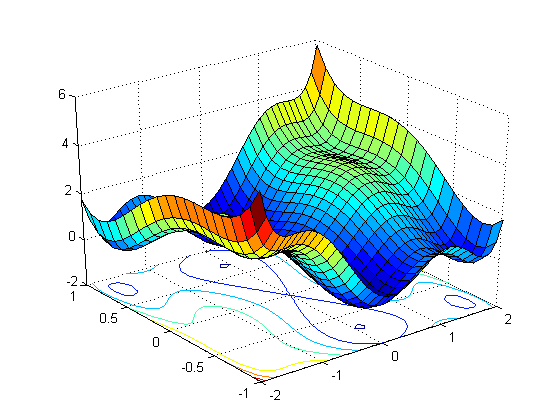

## Table of Contents

## What is a loss surface in machine learning?

A loss surface in machine learning is like a map that shows how good or bad a model is at making predictions. Imagine you're trying to find the lowest point in a hilly area. The hills and valleys represent different levels of error or "loss" that your model might have. The goal is to adjust the model's settings, called parameters, to find the lowest point on this map, where the loss is the smallest. This lowest point means your model is making the best predictions it can.

The shape of the loss surface can be very complicated, with many hills and valleys. Sometimes, it can be hard to find the lowest point because there might be many small valleys that aren't the absolute lowest. The way we search for the lowest point is by using algorithms like gradient descent. These algorithms help us move down the hills and into the valleys by following the steepest path down. If we do this well, we can improve our model's performance and make it better at predicting things.

## How does the loss surface relate to the optimization process in machine learning?

The loss surface is like a landscape where the height at any point represents how bad the model's predictions are. In machine learning, we want to find the lowest point on this landscape because that's where the model makes the best predictions. The process of finding this lowest point is called optimization. Imagine you're hiking and trying to get to the bottom of a valley. You would look around and take steps in the direction that goes downhill. In machine learning, we use algorithms like gradient descent to do this. These algorithms help us move the model's settings, called parameters, in a way that reduces the loss and gets us closer to the best possible predictions.

The optimization process involves adjusting the model's parameters to navigate the loss surface. If we think of the loss surface as a function $$L(\theta)$$, where $$\theta$$ represents the model's parameters, our goal is to minimize this function. We do this by calculating the gradient of the loss function, which tells us the direction to move to reduce the loss. The gradient descent algorithm uses this information to update the parameters iteratively. Each update moves us a bit closer to the lowest point on the loss surface. If the loss surface is simple, with one clear lowest point, this process can be straightforward. But if the surface is complicated, with many hills and valleys, finding the true lowest point can be challenging, and we might end up in a spot that's not the absolute best but is still pretty good.

## What are the common types of loss functions used in machine learning?

Loss functions in [machine learning](/wiki/machine-learning) help us figure out how wrong our model's predictions are. One common type is the Mean Squared Error (MSE), which is used a lot for regression problems where we predict a number. MSE calculates the average of the squared differences between the predicted values and the actual values. The formula for MSE is $$ \text{MSE} = \frac{1}{n} \sum_{i=1}^{n} (y_i - \hat{y}_i)^2 $$, where $$ y_i $$ is the actual value, $$ \hat{y}_i $$ is the predicted value, and $$ n $$ is the number of observations. Another popular loss function for regression is the Mean Absolute Error (MAE), which is similar to MSE but uses the absolute difference instead of squaring it, making it less sensitive to outliers. The formula for MAE is $$ \text{MAE} = \frac{1}{n} \sum_{i=1}^{n} |y_i - \hat{y}_i| $$.

For classification problems, where we want to predict which category something belongs to, we often use the Cross-Entropy Loss, also known as Log Loss. This loss function measures the performance of a classification model whose output is a probability value between 0 and 1. The formula for binary cross-entropy loss is $$ \text{CE} = -\frac{1}{n} \sum_{i=1}^{n} [y_i \log(\hat{y}_i) + (1 - y_i) \log(1 - \hat{y}_i)] $$, where $$ y_i $$ is the true label (0 or 1), and $$ \hat{y}_i $$ is the predicted probability. For multi-class classification, we use Categorical Cross-Entropy, which is a bit more complex but follows a similar idea. These loss functions help the model learn by telling it how far off its predictions are from the actual outcomes, guiding it to improve over time.

## How can the shape of a loss surface affect the performance of a machine learning model?

The shape of a loss surface can have a big impact on how well a machine learning model performs. Imagine the loss surface as a landscape with hills and valleys. If the surface is simple and smooth, with one clear lowest point, it's easier for optimization algorithms like gradient descent to find that point quickly. This means the model can learn faster and make better predictions. But if the loss surface is bumpy and has lots of small valleys, it can be hard for the algorithm to find the true lowest point. The model might get stuck in a small valley that isn't the absolute best, leading to predictions that could be better. This is called getting stuck in a local minimum.

The complexity of the loss surface also affects how well the model can generalize to new data. A very bumpy loss surface might mean the model is too sensitive to small changes in the data, which can make it overfit. Overfitting happens when a model learns the training data too well, including its noise and errors, and then doesn't work well on new data. On the other hand, a smoother loss surface might help the model learn more general patterns, leading to better performance on new data. Understanding the shape of the loss surface helps us choose the right optimization strategies and model architectures to improve our machine learning models.

## What is the difference between a convex and non-convex loss surface?

A convex loss surface is like a big, smooth bowl. If you place a ball at any point on the surface, it will roll down to the bottom, which is the lowest point. In machine learning, this means that any optimization algorithm, like gradient descent, will find the best solution no matter where it starts. The math behind this is that for a function $$ f(x) $$ to be convex, it must satisfy $$ f(\lambda x + (1-\lambda)y) \leq \lambda f(x) + (1-\lambda)f(y) $$ for any $$ x $$ and $$ y $$ in its domain and any $$ \lambda $$ between 0 and 1. This property makes convex loss surfaces easier to work with because they guarantee a single global minimum.

A non-convex loss surface, on the other hand, is more like a rugged mountain range with many peaks and valleys. If you place a ball on this surface, it might roll into a valley that isn't the lowest point on the entire surface. This means that optimization algorithms can get stuck in these valleys, called local minima, and might not find the best solution. The challenge with non-convex surfaces is that they can have multiple local minima, and the optimization process depends a lot on where it starts. This makes training machine learning models on non-convex loss surfaces trickier, as the model's performance can vary based on the initial conditions and the path taken during optimization.

## How do local minima and global minima on the loss surface impact model training?

Local minima and global minima on the loss surface can really affect how well a machine learning model learns. A global minimum is the very lowest point on the whole loss surface, and it's where the model makes the best predictions. If the optimization algorithm can find this global minimum, the model will perform the best it can. But a local minimum is like a smaller valley that isn't the lowest point overall. If the algorithm gets stuck in a local minimum, the model's predictions won't be as good as they could be. This can happen a lot on non-convex loss surfaces, which have many ups and downs.

Finding the global minimum is easier on a convex loss surface because there's only one lowest point, and any path down the surface will lead there. But on a non-convex surface, with lots of local minima, the starting point and the way the algorithm moves can make a big difference. Sometimes, the algorithm might need to try different starting points or use special techniques to escape local minima and keep searching for the global minimum. This makes training the model trickier but is important for getting the best results.

## What techniques are used to visualize loss surfaces in high-dimensional spaces?

Visualizing loss surfaces in high-dimensional spaces can be challenging because we can't see more than three dimensions easily. One way to do it is by using dimensionality reduction techniques like PCA (Principal Component Analysis) or t-SNE (t-Distributed Stochastic Neighbor Embedding). These methods take the high-dimensional data and squish it down to two or three dimensions that we can see. For example, if you have a loss function $$ L(\theta) $$ where $$ \theta $$ is a high-dimensional vector, you can use PCA to find the two most important directions and plot the loss along those directions.

Another technique is to create a 2D or 3D plot by fixing all but two or three of the dimensions. This means you pick two or three parameters to change and keep the others constant. Then, you can make a contour plot or a 3D surface plot to show how the loss changes as you adjust those parameters. This can give you a good idea of what the loss surface looks like around a certain point, even if it's not the whole picture. Both methods help us understand the shape of the loss surface and see where the hills and valleys are, which can guide us in choosing the right optimization strategies.

## How does the choice of optimization algorithm influence navigation on the loss surface?

The choice of optimization algorithm can really change how a model moves across the loss surface. Imagine you're trying to find the lowest point on a hilly landscape. Some algorithms, like gradient descent, move step by step down the steepest slope. This can be good if the surface is smooth, but if there are many small valleys, the algorithm might get stuck in a spot that's not the absolute lowest. Other algorithms, like stochastic gradient descent (SGD), add a bit of randomness to each step, which can help the model escape small valleys and keep searching for the true lowest point. The way these algorithms move can make a big difference in how quickly and effectively the model learns.

Different optimization algorithms also have different ways of adjusting the size of their steps. For example, algorithms like Adam and RMSprop change their step size based on how the loss surface looks, which can help them navigate tricky parts of the surface more smoothly. These adaptive methods can be especially helpful on loss surfaces that are bumpy and have lots of ups and downs. By choosing the right optimization algorithm, you can help your model find the best path to the lowest point on the loss surface, leading to better predictions and performance.

## What role do hyperparameters play in shaping the loss surface?

Hyperparameters are like the settings you can change to make a machine learning model work better. They don't get learned by the model like other parameters do, but they still affect how the model learns. When you change hyperparameters, you change how the model moves across the loss surface. For example, the learning rate, which is a hyperparameter, decides how big the steps are that the model takes when it's trying to find the lowest point on the loss surface. If the learning rate is too big, the model might jump over the lowest point and miss it. If it's too small, the model might take too long to get there.

Different hyperparameters can make the loss surface look different to the model. For instance, the regularization strength, another hyperparameter, can make the loss surface smoother or bumpier. Regularization adds a penalty to the loss function to stop the model from overfitting, and this penalty changes the shape of the loss surface. If you use a lot of regularization, the loss surface might become smoother, making it easier for the model to find the lowest point. But if you use too little, the surface might stay bumpy, and the model might get stuck in a spot that's not the best. So, choosing the right hyperparameters is important for helping the model find the best path down the loss surface.

## How can one identify and mitigate the effects of saddle points on the loss surface?

Saddle points on a loss surface are like flat areas that can trick the model into thinking it's at the lowest point. They're called saddle points because they look like a saddle you'd sit on a horse - they go up in some directions and down in others. When a model's optimization algorithm, like gradient descent, reaches a saddle point, it might stop moving because the gradient, which tells the algorithm which way to go, is close to zero. This can make the model's learning slow down or stop, even though the model hasn't reached the best spot yet. To spot a saddle point, you can look at how the loss changes over time during training. If the loss stops going down but isn't at its lowest, you might be stuck at a saddle point.

To help the model escape from saddle points, you can use different optimization techniques. One way is to use algorithms like stochastic gradient descent (SGD) with added noise or [momentum](/wiki/momentum). The noise or momentum can give the model a little push to get it moving again, helping it to climb out of the flat area and keep searching for the lowest point. Another approach is to use more advanced optimizers like Adam or RMSprop, which adapt the learning rate and can help the model navigate tricky parts of the loss surface. By choosing the right optimization strategy, you can make sure your model keeps learning and finds the best predictions possible.

## What advanced methods exist for exploring and understanding complex loss surfaces?

Exploring and understanding complex loss surfaces can be tricky because they have many dimensions and lots of ups and downs. One advanced method is to use dimensionality reduction techniques like PCA (Principal Component Analysis) or t-SNE (t-Distributed Stochastic Neighbor Embedding). These techniques help by taking the high-dimensional loss surface and squishing it down to two or three dimensions that we can see. For example, if your loss function is $$ L(\theta) $$ and $$ \theta $$ is a high-dimensional vector, PCA can find the two most important directions and plot the loss along those directions. This gives you a simpler picture of the loss surface that can help you understand where the hills and valleys are.

Another method is to use random projections or random sampling to explore the loss surface. This means you take random paths across the surface and see how the loss changes. By doing this many times, you can build up a picture of what the whole surface might look like. Some researchers also use Hessian-based methods to understand the curvature of the loss surface. The Hessian matrix tells you how the loss changes as you move in different directions. By analyzing the Hessian, you can find out where the surface is flat, like at saddle points, or where it's very steep. These advanced methods help you see the big picture of the loss surface and figure out the best way to optimize your model.

## How do recent research findings on loss surfaces influence the development of new machine learning algorithms?

Recent research on loss surfaces has shown that they can be really complicated, with many hills, valleys, and flat spots. This understanding has led to the development of new machine learning algorithms that are better at finding the best path down these complex surfaces. For example, researchers have found that adding a bit of randomness or noise to the optimization process can help models escape from flat spots, called saddle points, and keep searching for the lowest point. This has led to the creation of algorithms like stochastic gradient descent (SGD) with momentum or adaptive methods like Adam, which change their step size based on how the loss surface looks. These new algorithms help models learn faster and make better predictions by navigating the loss surface more effectively.

Understanding the shape of the loss surface has also influenced how we choose and tune hyperparameters. For instance, the learning rate, which decides how big the steps are that the model takes, can make a big difference in how the model moves across the loss surface. If the learning rate is too big, the model might jump over the lowest point and miss it. If it's too small, the model might take too long to get there. Recent research has led to the development of techniques that automatically adjust the learning rate, like learning rate schedules or adaptive optimizers. These methods help the model find the best path down the loss surface by changing the step size as needed. By using these new insights and algorithms, machine learning models can perform better and learn more effectively.