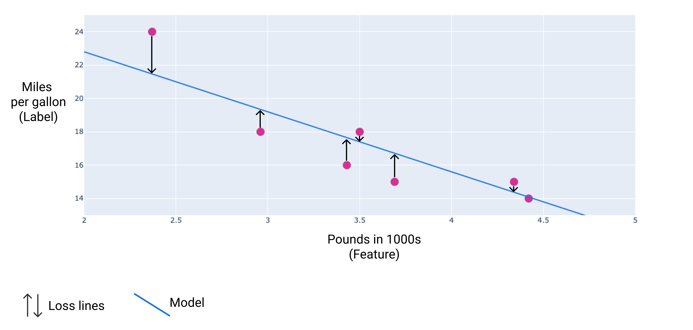

## Table of Contents

## What is loss in the context of machine learning?

In machine learning, loss is a way to measure how well a model is doing its job. Imagine you're trying to teach a computer to guess the price of a house based on its size. The loss would be how far off the computer's guess is from the actual price. The goal is to make this difference as small as possible. We use different kinds of loss functions depending on what we're trying to do. For example, if we're predicting a number, we might use something called Mean Squared Error (MSE), which is the average of the squares of the errors.

The loss function is really important because it helps the model learn. When we train a model, we show it lots of examples and adjust its guesses to make the loss smaller. This process is called optimization. By minimizing the loss, the model gets better at making accurate predictions. For instance, if we're using MSE, the formula looks like this: $$ \text{MSE} = \frac{1}{n} \sum_{i=1}^{n} (y_i - \hat{y}_i)^2 $$, where $y_i$ is the actual value, $\hat{y}_i$ is the predicted value, and $n$ is the number of examples. The model keeps tweaking its internal settings until it can't make the loss any smaller.

## Why is loss important in training machine learning models?

Loss is super important in training machine learning models because it tells us how good or bad our model is doing. Think of it like a score in a game. If your score is high, you're doing well, but if it's low, you need to improve. In machine learning, a lower loss means the model's predictions are closer to the actual answers. By keeping track of the loss, we can see if our model is getting better as it learns from more data.

The loss function guides the model in figuring out how to adjust its guesses to be more accurate. This process is called optimization. When we train a model, we use the loss to tweak its settings bit by bit, making the loss smaller each time. For example, if we're using Mean Squared Error (MSE) as our loss function, the formula is $$ \text{MSE} = \frac{1}{n} \sum_{i=1}^{n} (y_i - \hat{y}_i)^2 $$. Here, $y_i$ is the actual value, $\hat{y}_i$ is the predicted value, and $n$ is the number of examples. The model keeps working to make this number as small as possible, which means its predictions are getting better and better.

## What are the different types of loss functions used in machine learning?

In [machine learning](/wiki/machine-learning), there are different types of loss functions that we use depending on what we're trying to do. One common type is Mean Squared Error (MSE), which we use when we're predicting numbers. It measures the average of the squared differences between the predicted and actual values. The formula for MSE is $$ \text{MSE} = \frac{1}{n} \sum_{i=1}^{n} (y_i - \hat{y}_i)^2 $$, where $y_i$ is the actual value, $\hat{y}_i$ is the predicted value, and $n$ is the number of examples. Another type is Mean Absolute Error (MAE), which is similar but uses the absolute difference instead of squaring it. Its formula is $$ \text{MAE} = \frac{1}{n} \sum_{i=1}^{n} |y_i - \hat{y}_i| $$. MAE is less sensitive to outliers than MSE.

For classification problems, where we're trying to put things into different categories, we often use the Cross-Entropy Loss, also known as Log Loss. It measures how well the model's predictions match the actual categories. The formula for binary cross-entropy is $$ \text{Binary Cross-Entropy} = -\frac{1}{n} \sum_{i=1}^{n} [y_i \log(\hat{y}_i) + (1 - y_i) \log(1 - \hat{y}_i)] $$. For multi-class problems, we use Categorical Cross-Entropy, which is similar but works with multiple categories. There's also the Hinge Loss, which is used in Support Vector Machines for classification, and it tries to maximize the margin between classes. Its formula is $$ \text{Hinge Loss} = \max(0, 1 - y_i \cdot \hat{y}_i) $$. Each of these loss functions helps the model learn in a different way, depending on the problem we're trying to solve.

## How does the choice of loss function affect model performance?

The choice of loss function can really change how well a machine learning model works. Think of the loss function as a guide that tells the model how to get better. If you pick the right loss function for your problem, the model can learn faster and make better predictions. For example, if you're trying to predict numbers, using Mean Squared Error (MSE) might work well because it makes big mistakes count more than small ones. The formula for MSE is $$ \text{MSE} = \frac{1}{n} \sum_{i=1}^{n} (y_i - \hat{y}_i)^2 $$. But if your data has a lot of outliers, using Mean Absolute Error (MAE) might be better because it doesn't punish big mistakes as much. The formula for MAE is $$ \text{MAE} = \frac{1}{n} \sum_{i=1}^{n} |y_i - \hat{y}_i| $$.

When you're working on a classification problem, where you want to put things into different groups, the choice of loss function is also important. Cross-Entropy Loss, or Log Loss, is often used because it measures how well the model's guesses match the real categories. For binary classification, the formula is $$ \text{Binary Cross-Entropy} = -\frac{1}{n} \sum_{i=1}^{n} [y_i \log(\hat{y}_i) + (1 - y_i) \log(1 - \hat{y}_i)] $$. If you have many categories, you might use Categorical Cross-Entropy. Choosing the wrong loss function can make the model learn the wrong things or take a long time to get good at its job. So, it's really important to pick the right loss function based on what you're trying to do with your model.

## Can you explain the concept of mean squared error (MSE) as a loss function?

Mean Squared Error (MSE) is a way to measure how well a machine learning model is doing its job. It's used when the model is trying to predict numbers, like guessing the price of a house based on its size. MSE looks at the difference between what the model predicts and what the actual answer is. It then squares these differences and takes the average of all these squared numbers. This makes big mistakes count a lot more than small ones. The formula for MSE is $$ \text{MSE} = \frac{1}{n} \sum_{i=1}^{n} (y_i - \hat{y}_i)^2 $$. Here, $y_i$ is the actual value, $\hat{y}_i$ is the predicted value, and $n$ is the number of examples.

Using MSE helps the model learn by showing it where it's making the biggest mistakes. When we train a model, we show it lots of examples and use MSE to figure out how to make the model's guesses better. By making the MSE smaller, the model gets better at predicting the right numbers. For example, if the model is guessing house prices, a smaller MSE means the model's guesses are getting closer to the actual prices. This process of making the MSE smaller is called optimization, and it's how the model improves over time.

## What is cross-entropy loss and when is it typically used?

Cross-entropy loss is a way to measure how well a machine learning model is doing when it's trying to put things into different groups, like sorting pictures into categories of dogs and cats. It's like a score that tells us how close the model's guesses are to the actual answers. The lower the cross-entropy loss, the better the model is at guessing the right group. For example, if the model is sure a picture is of a dog but it's actually a cat, the cross-entropy loss will be high. We use cross-entropy loss because it helps the model learn by focusing on the most confusing examples.

For problems where there are just two groups, like yes or no, we use something called binary cross-entropy loss. The formula for this is $$ \text{Binary Cross-Entropy} = -\frac{1}{n} \sum_{i=1}^{n} [y_i \log(\hat{y}_i) + (1 - y_i) \log(1 - \hat{y}_i)] $$. Here, $y_i$ is the actual answer (0 or 1), $\hat{y}_i$ is what the model thinks, and $n$ is the number of examples. If there are more than two groups, like sorting fruits into apples, bananas, and oranges, we use categorical cross-entropy loss. Both types of cross-entropy loss help the model get better at sorting things into the right groups by making the loss smaller over time.

## How do you calculate loss during the training of a neural network?

When you're training a [neural network](/wiki/neural-network), calculating the loss is like checking how well the network is doing its job. Imagine you're teaching the network to guess the price of a house. You show it many examples of houses and their prices. After the network makes its guesses, you compare these guesses to the real prices. The difference between the guesses and the actual prices is what we call the loss. We use a special formula to figure out this loss, like Mean Squared Error (MSE), which is $$ \text{MSE} = \frac{1}{n} \sum_{i=1}^{n} (y_i - \hat{y}_i)^2 $$. Here, $y_i$ is the real price, $\hat{y}_i$ is the network's guess, and $n$ is the number of houses you showed it. The goal is to make this number as small as possible.

To make the loss smaller, the neural network adjusts its internal settings. This process is called backpropagation. During backpropagation, the network looks at the loss and figures out how to change its guesses to make the loss go down. It does this over and over again, showing it more and more examples. Each time it sees new examples, it recalculates the loss and tweaks its settings a bit more. This way, the network gets better at making accurate guesses. By the end of training, the loss should be much smaller than when you started, showing that the network has learned to predict the right prices more accurately.

## What is the role of loss in gradient descent optimization?

Loss plays a big role in gradient descent optimization. Think of gradient descent as a way to help a machine learning model get better at its job. The model makes guesses, and the loss tells us how far off those guesses are from the right answers. The goal of gradient descent is to make the loss smaller by changing the model's settings little by little. Imagine you're trying to find the lowest point in a valley. The loss is like the height of the ground, and gradient descent helps you take steps downhill to find the lowest spot.

In gradient descent, we use the loss to figure out which way to move. The math behind this is called the gradient, which shows the direction of the steepest slope. By following the negative of the gradient, we can make the loss smaller. The formula for updating the model's settings (called weights) in gradient descent is $$ w = w - \eta \cdot \nabla L(w) $$. Here, $w$ is the weight, $\eta$ is the learning rate, and $\nabla L(w)$ is the gradient of the loss with respect to the weight. As the model keeps adjusting its weights to reduce the loss, it gets better and better at making accurate predictions.

## How can overfitting be detected using loss?

Overfitting happens when a machine learning model learns too much from the training data and starts to do poorly on new, unseen data. You can spot overfitting by looking at two types of loss: training loss and validation loss. Training loss is how well the model does on the data it's learning from. Validation loss is how well it does on a different set of data that it hasn't seen during training. If the model is overfitting, you'll see the training loss get smaller and smaller, but the validation loss will start to get bigger. This means the model is getting really good at the training data but not good at new data.

To check for overfitting, you can plot these two losses over time. If the training loss keeps going down but the validation loss starts to go up, that's a sign of overfitting. For example, if you're using Mean Squared Error (MSE) as your loss function, the formula is $$ \text{MSE} = \frac{1}{n} \sum_{i=1}^{n} (y_i - \hat{y}_i)^2 $$. You'd watch how this number changes for both your training data and your validation data. If the gap between these two numbers gets bigger, it's a good idea to stop training or try different ways to make your model simpler, like using fewer layers or adding regularization.

## What are some advanced loss functions used in specific applications like object detection?

In object detection, one common advanced loss function is the Intersection over Union (IoU) loss. IoU measures how well the predicted bounding box around an object matches the actual bounding box. The formula for IoU is $$ \text{IoU} = \frac{\text{Area of Overlap}}{\text{Area of Union}} $$. The IoU loss is usually defined as 1 minus the IoU, so a smaller loss means a better match between the predicted and actual boxes. This loss function is important because it helps the model learn to draw boxes that are the right size and in the right place around objects in an image.

Another advanced loss function used in object detection is the Focal Loss. Focal Loss is designed to address the problem of class imbalance, where there are many more background pixels than object pixels. It puts more focus on hard-to-classify examples by down-weighting the loss for well-classified examples. The formula for Focal Loss is $$ \text{Focal Loss} = -\alpha_t (1 - p_t)^\gamma \log(p_t) $$, where $\alpha_t$ is a balancing parameter, $p_t$ is the model's estimated probability for the correct class, and $\gamma$ is a focusing parameter. By using Focal Loss, the model can learn to better detect objects that are difficult to see or are rare in the dataset.

## How do you handle imbalanced datasets with respect to loss functions?

When you have an imbalanced dataset, where some classes have a lot more examples than others, the regular loss functions might not work well. The model might focus too much on the bigger classes and ignore the smaller ones. To fix this, you can use special loss functions like the Focal Loss. Focal Loss helps by making the model pay more attention to the hard-to-classify examples. The formula for Focal Loss is $$ \text{Focal Loss} = -\alpha_t (1 - p_t)^\gamma \log(p_t) $$. Here, $\alpha_t$ is a balancing parameter, $p_t$ is the model's estimated probability for the correct class, and $\gamma$ is a focusing parameter. By using Focal Loss, the model can learn to better predict the less common classes.

Another way to handle imbalanced datasets is to use class weights in your loss function. This means you give more importance to the examples from the smaller classes. For example, if you're using the Cross-Entropy Loss, you can adjust it with class weights to make the model care more about getting the rare classes right. The formula for weighted Cross-Entropy Loss is $$ \text{Weighted Cross-Entropy} = -\frac{1}{n} \sum_{i=1}^{n} w_i [y_i \log(\hat{y}_i) + (1 - y_i) \log(1 - \hat{y}_i)] $$, where $w_i$ is the weight for each class. By using these methods, you can help your model learn better from imbalanced data and make more accurate predictions for all classes.

## What are the current research trends in loss functions for deep learning?

In [deep learning](/wiki/deep-learning), researchers are always trying to find new and better ways to use loss functions. One big trend is making loss functions that can handle more complicated problems. For example, in object detection, they're using things like the Focal Loss, which helps the model focus on hard-to-detect objects. The formula for Focal Loss is $$ \text{Focal Loss} = -\alpha_t (1 - p_t)^\gamma \log(p_t) $$. This loss function is good at dealing with imbalanced datasets, where some things are much rarer than others. Another trend is using loss functions that can learn from multiple tasks at the same time, like predicting what's in an image and where it is.

Another area of research is about making loss functions that are more stable and easier to work with. Some new loss functions, like the Huber Loss, try to mix the best parts of different losses. The Huber Loss is a mix of Mean Squared Error (MSE) and Mean Absolute Error (MAE), and it's less affected by big mistakes. The formula for Huber Loss is $$ \text{Huber Loss} = \begin{cases} \frac{1}{2}(y_i - \hat{y}_i)^2 & \text{if } |y_i - \hat{y}_i| \leq \delta \\ \delta(|y_i - \hat{y}_i| - \frac{1}{2}\delta) & \text{otherwise} \end{cases} $$. Researchers are also looking into loss functions that can change over time, adapting to how the model is learning. This way, the loss function can help the model learn faster and better.

## References & Further Reading

[1]: Goodfellow, I., Bengio, Y., & Courville, A. (2016). ["Deep Learning"](https://link.springer.com/article/10.1007/s10710-017-9314-z). MIT Press.

[2]: Murphy, K. P. (2012). ["Machine Learning: A Probabilistic Perspective"](https://www.cs.ubc.ca/~murphyk/MLbook/pml-toc-1may12.pdf). MIT Press.

[3]: Hastie, T., Tibshirani, R., & Friedman, J. (2009). ["The Elements of Statistical Learning: Data Mining, Inference, and Prediction"](https://link.springer.com/book/10.1007/978-0-387-84858-7). Springer.

[4]: Bishop, C. M. (2006). ["Pattern Recognition and Machine Learning"](https://www.cs.uoi.gr/~arly/courses/ml/tmp/Bishop_book.pdf). Springer.

[5]: ["A Gentle Introduction to Cross-Entropy for Machine Learning"](https://machinelearningmastery.com/cross-entropy-for-machine-learning/) by Jason Brownlee, Machine Learning Mastery.