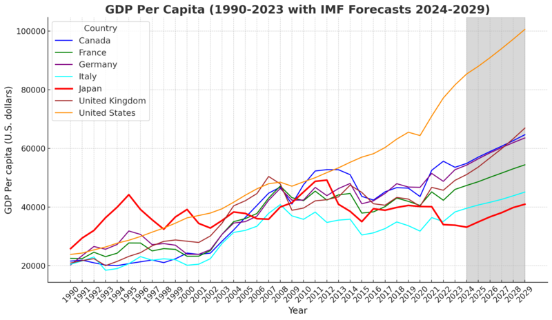

## Table of Contents

## What is the 'Lost Decade' in Japan?

The 'Lost Decade' refers to a period of economic stagnation in Japan that started in the early 1990s and lasted until the early 2000s. Before this time, Japan's economy was growing very fast. But then, the prices of assets like land and stocks fell sharply, causing big problems for banks and companies. This led to a long period where the economy did not grow much.

During the Lost Decade, Japan tried many things to fix the economy, but nothing seemed to work well. Interest rates were lowered to almost zero, but this did not help much. Many people lost their jobs, and young people found it hard to get good jobs. The effects of the Lost Decade lasted long after the 2000s, and Japan's economy has been slow to recover ever since.

## When did the Lost Decade in Japan begin and end?

The Lost Decade in Japan started in the early 1990s. It began when the prices of things like land and stocks dropped a lot. This made it hard for banks and businesses to do well. Japan's economy, which had been growing quickly before, suddenly stopped growing much.

The Lost Decade is usually said to have ended in the early 2000s. But even after that, Japan's economy did not get back to how it was before. The problems from the Lost Decade kept affecting Japan for a long time after the 2000s.

## What were the main economic indicators affected during Japan's Lost Decade?

During Japan's Lost Decade, many important economic indicators were affected. The main one was the GDP growth rate, which slowed down a lot. Before the 1990s, Japan's economy was growing fast, but during the Lost Decade, it barely grew at all. Another big indicator was the stock market. The Nikkei 225, which is Japan's main stock index, fell sharply and stayed low for many years. This made people lose a lot of money and feel less confident about the economy.

Also, the prices of land and other assets dropped a lot. This was a big problem because many banks had loaned money based on these high prices. When the prices fell, the banks got into trouble because people couldn't pay back their loans. Unemployment also went up during this time. Many people lost their jobs, and it was hard for young people to find good work. All these indicators showed that Japan's economy was in big trouble during the Lost Decade.

## What were the immediate causes of the economic bubble in Japan during the late 1980s?

The economic bubble in Japan during the late 1980s was caused by a few things. One big reason was the low interest rates set by the Bank of Japan. They did this to make the yen stronger against the US dollar after the Plaza Accord in 1985. Low interest rates made it easier for people and businesses to borrow money. They used this money to buy land and stocks, which made their prices go up a lot.

Another reason was that people and businesses thought that prices would keep going up. This made them want to buy even more, which pushed prices up even higher. It was like a big game of follow-the-leader. Banks also lent a lot of money because they thought the high prices of land and stocks would last forever. But when people realized that prices were too high, they stopped buying, and the bubble burst.

## How did the bursting of the asset price bubble contribute to the Lost Decade?

The bursting of the asset price bubble was a big reason for Japan's Lost Decade. When the bubble burst, the prices of land and stocks fell a lot. This was a problem because many people and businesses had borrowed money to buy these assets when the prices were high. When the prices went down, they couldn't pay back their loans. This caused big problems for banks, which had lent out a lot of money. Many banks got into trouble, and some even went bankrupt. This made it hard for businesses to get loans, which slowed down the whole economy.

The trouble in the banks and businesses led to a lot of other problems. Many companies had to close down or lay off workers, which made unemployment go up. People felt less sure about the future, so they spent less money. This made the economy grow even slower. The government and the Bank of Japan tried to fix things by lowering interest rates to almost zero, but it didn't help much. The effects of the burst bubble lasted for a long time, and that's why the 1990s and early 2000s are called the Lost Decade in Japan.

## What role did government policies play in the onset and prolongation of the Lost Decade?

Government policies played a big role in both causing the Lost Decade and making it last longer. In the late 1980s, the government and the Bank of Japan kept interest rates very low to make the yen stronger against the US dollar. This made it easy for people and businesses to borrow money, which helped create the big bubble in land and stock prices. When the bubble burst, the government didn't act quickly enough to fix the problems in the banks. They waited too long to help banks that were in trouble, which made the economic problems worse.

After the bubble burst, the government tried many things to help the economy, but they didn't work well. They lowered interest rates to almost zero, but this didn't make people spend more money or businesses borrow more. The government also spent a lot of money on big projects to create jobs, but this didn't help much either. These policies didn't fix the main problems, like the trouble in the banks and the lack of confidence in the economy. As a result, the Lost Decade lasted for a long time, and Japan's economy took many years to start recovering.

## How did the banking crisis in Japan during the 1990s exacerbate the economic downturn?

The banking crisis in Japan during the 1990s made the economic downturn worse. When the asset price bubble burst, the prices of land and stocks fell a lot. Many people and businesses couldn't pay back their loans because the value of what they owned went down. This caused big problems for banks, which had lent out a lot of money. Some banks got into trouble and even went bankrupt. This made it hard for other businesses to get loans, which slowed down the whole economy.

The government didn't act quickly to help the banks. They waited too long to fix the problems, which made the economic downturn last longer. The banks were afraid to lend money because they were worried about more losses. This made it hard for businesses to grow and for people to buy things. As a result, the economy didn't grow much, and Japan went through what is called the Lost Decade.

## What were the social impacts of the Lost Decade on Japanese society?

The Lost Decade had big effects on Japanese society. Many people lost their jobs, and it was hard for young people to find good work. This made a lot of people feel worried and unsure about the future. Families had less money to spend, so they had to be careful with what they bought. Some people even had to move back in with their parents because they couldn't afford to live on their own. This time was tough for a lot of people, and it changed how they thought about their lives and their futures.

The problems from the Lost Decade also affected how people saw their society. Many young people felt that they couldn't get ahead, no matter how hard they worked. This led to a lot of frustration and a feeling that the old ways of doing things didn't work anymore. People started to question the idea that hard work would always lead to success. This change in thinking had a big impact on Japanese society and how people lived their lives. Even after the Lost Decade, these feelings and changes stayed with people for a long time.

## How did the Lost Decade affect Japan's position in the global economy?

The Lost Decade made Japan's place in the world economy weaker. Before the 1990s, Japan was seen as a big economic power. It had a strong economy that was growing fast. But when the Lost Decade started, Japan's economy stopped growing much. Other countries, like the United States and China, started to grow faster. This made Japan's share of the world economy smaller. People around the world began to see Japan as less of a leader in the global economy.

The problems from the Lost Decade also made it harder for Japan to be a big player in world trade. Japan's businesses had trouble competing with companies from other countries. This was because Japan's economy was not doing well, and it was hard for businesses to get the money they needed to grow. As a result, Japan's exports did not grow as much as they used to. This made Japan less important in the global market. Even after the Lost Decade, it took Japan a long time to get back its strong position in the world economy.

## What were the key differences between the economic policies implemented during the Lost Decade and those proposed by economists?

During the Lost Decade, the Japanese government tried different ways to fix the economy. They lowered interest rates to almost zero to make it easier for people and businesses to borrow money. They also spent a lot of money on big projects to create jobs and help the economy grow. But these policies didn't work well. The government was slow to help the banks that were in trouble, which made the economic problems last longer. They focused more on short-term fixes instead of dealing with the main issues like the bad loans in the banks.

Economists had different ideas about how to fix Japan's economy. They thought the government should act quickly to help the banks by getting rid of bad loans and making the banks stronger. They also suggested that the government should spend money in smarter ways, like helping new businesses and encouraging people to spend more. Economists believed that the government needed to make big changes to the economy and not just use short-term fixes. These ideas were different from what the government actually did, and many economists thought that following their advice could have made the Lost Decade shorter and less painful.

## How have economic theories been used to explain the causes and consequences of Japan's Lost Decade?

Economic theories have been used to explain the causes of Japan's Lost Decade in several ways. One theory is about the asset price bubble. Economists say that the bubble was caused by low interest rates and people thinking that prices would keep going up. When the bubble burst, it caused big problems for banks and businesses because they had borrowed a lot of money. Another theory is about how the government and the Bank of Japan didn't act quickly enough to fix the problems. They waited too long to help the banks, which made the economic problems worse. Economists also talk about how the economy got stuck in a bad cycle where people didn't spend money, businesses didn't grow, and the economy didn't get better.

The consequences of the Lost Decade have also been explained using economic theories. One big idea is about the slow growth of the economy. Economists say that Japan got stuck in a "[liquidity](/wiki/liquidity-risk-premium) trap," where lowering interest rates to almost zero didn't make people spend more money or businesses borrow more. This made the economy grow very slowly. Another theory is about how the problems in the banks made it hard for businesses to get loans, which slowed down the whole economy. Economists also talk about how the Lost Decade changed how people thought about their futures. Many young people felt that they couldn't get ahead, no matter how hard they worked. This led to a lot of frustration and a feeling that the old ways of doing things didn't work anymore.

## What lessons can other economies learn from Japan's experience during the Lost Decade?

Other economies can learn a lot from Japan's experience during the Lost Decade. One big lesson is to act quickly when there are problems in the banks. Japan waited too long to help its banks, which made the economic problems last longer. If other countries have a similar problem, they should fix it fast. Another lesson is to be careful with very low interest rates. Japan kept interest rates very low, which helped create a big bubble in land and stock prices. Other economies should think about the risks of low interest rates and make sure they don't cause bubbles.

Also, it's important for governments to spend money in smart ways. Japan spent a lot of money on big projects to create jobs, but this didn't help much. Other countries should focus on helping new businesses and encouraging people to spend more. This can help the economy grow better. Finally, economies should try to avoid getting stuck in a bad cycle where people don't spend money and businesses don't grow. Japan got stuck in this cycle during the Lost Decade, and it made the economy grow very slowly. By learning these lessons, other economies can avoid similar problems and keep their economies strong.

## References & Further Reading

[1]: Koo, Richard C. (2009). ["The Holy Grail of Macroeconomics: Lessons from Japan's Great Recession."](https://onlinelibrary.wiley.com/doi/book/10.1002/9781119199618) Wiley.

[2]: Posen, Adam S. (1998). ["Restoring Japan's Economic Growth."](https://archive.org/details/restoringjapanse0000pose) Peterson Institute for International Economics.

[3]: Ahearne, A. G., Gagnon, J. E., Haltmaier, J., & Kamin, S. B. (2002). ["Preventing Deflation: Lessons from Japan's Experience in the 1990s."](https://papers.ssrn.com/sol3/papers.cfm?abstract_id=318700) International Finance Discussion Papers, No. 729, Board of Governors of the Federal Reserve System.

[4]: Werner, Richard A. (2005). ["New Paradigm in Macroeconomics: Solving the Riddle of Japanese Macroeconomic Performance."](https://archive.org/details/newparadigminmac0000wern) Palgrave Macmillan.

[5]: Lam, W. Raphael. (2011). ["Bank of Japan's Monetary Easing Measures: Are They Powerful and Comprehensive?"](https://www.imf.org/external/pubs/ft/wp/2011/wp11264.pdf) IMF Working Papers, WP/11/264. International Monetary Fund.