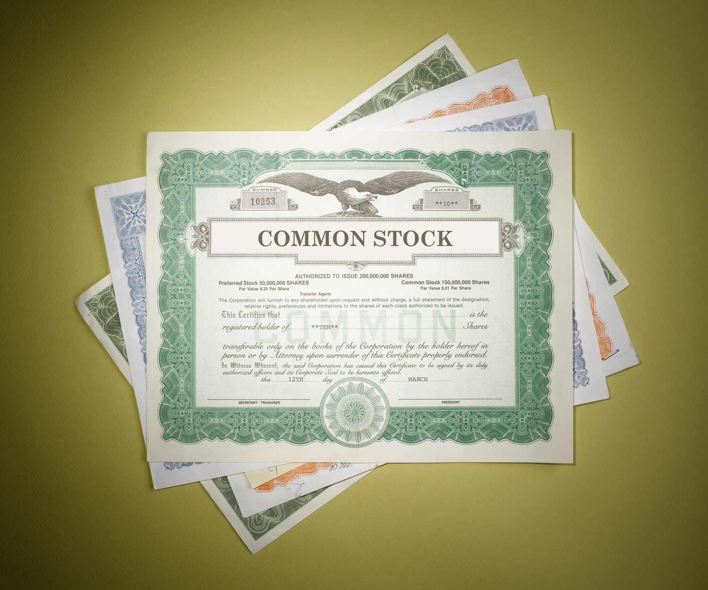

## Table of Contents

## What is a share certificate?

A share certificate is a document that shows you own a part of a company. When you buy shares in a company, you get a certificate that says how many shares you own. It's like a receipt that proves your ownership. Companies used to give out paper certificates, but now most are electronic, stored in a computer system.

Having a share certificate is important because it shows you have a right to part of the company's profits, called dividends. It also means you can vote on big decisions the company makes. If you want to sell your shares, the certificate helps prove to buyers that you really own them. Even though they are mostly electronic now, share certificates are still a key part of owning a piece of a company.

## What does it mean if a share certificate is lost?

If you lose your share certificate, it can be a problem because it's the proof that you own shares in a company. Without it, it might be hard to show that you really own those shares. But don't worry too much, because there are ways to fix this. You can contact the company or the transfer agent, which is the company that keeps track of who owns the shares. They can help you get a new certificate or update their records to show you still own the shares.

The process to replace a lost share certificate usually involves filling out some forms and maybe paying a small fee. You'll need to explain that your certificate is lost and provide details about your shares. Sometimes, you might need to promise that you'll return the old certificate if you find it later. Once everything is sorted out, you'll get a new certificate or an electronic record of your ownership. It's important to keep your new certificate safe so you don't lose it again.

## How can one prove stock ownership without a share certificate?

If you don't have a share certificate, you can still prove you own stocks by contacting the company or the transfer agent. These are the people who keep track of who owns the shares. They can check their records to see if your name is listed as a shareholder. If it is, they can give you a statement or a letter that shows you own the stocks. This is like getting a new certificate, but in a different form.

Another way to prove stock ownership is by looking at your brokerage account. If you bought the stocks through a broker, they will have records of your purchases. You can ask them for a statement that shows your stock holdings. This statement works as proof that you own the stocks, even without a certificate. Keeping good records of your own, like receipts or transaction confirmations, can also help prove your ownership if you ever need to.

## What steps should be taken immediately after losing a share certificate?

If you lose your share certificate, the first thing you should do is stay calm and act quickly. Contact the company you own shares in or their transfer agent right away. These are the people who keep track of who owns the shares. Tell them that you lost your certificate and give them all the details about your shares, like how many you own and when you bought them. They can help you by checking their records to see if you really own those shares.

After you talk to the company or transfer agent, you might need to fill out some forms to get a new certificate or a statement that shows you own the shares. There could be a small fee for this, so be ready to pay it. While you wait for the new certificate or statement, keep an eye out for your old one. If you find it, let the company know right away. In the meantime, make sure to keep good records of your own, like any receipts or transaction confirmations, to help prove your ownership if needed.

## What are the potential risks of losing a share certificate?

Losing a share certificate can be a big problem because it's the proof that you own shares in a company. Without it, you might have trouble showing that the shares really belong to you. Someone else could find your lost certificate and try to claim the shares as their own, which could lead to a lot of trouble and even legal fights. This is why it's important to tell the company or the transfer agent as soon as you know your certificate is lost.

The good news is that companies keep records of who owns shares, so even without the certificate, you can still prove your ownership. But the process of getting a new certificate or a statement to show you own the shares can take some time and might cost a little money. It's also a good idea to keep your own records of your shares, like receipts or transaction confirmations, to help prove your ownership if something goes wrong.

## How does one replace a lost share certificate?

If you lose your share certificate, you need to act fast. The first thing to do is contact the company you own shares in or their transfer agent. These are the people who keep track of who owns the shares. Tell them your certificate is lost and give them all the details about your shares, like how many you own and when you bought them. They'll check their records to see if you really own those shares.

After you talk to the company or transfer agent, they'll ask you to fill out some forms to get a new certificate or a statement that shows you own the shares. There might be a small fee for this, so be ready to pay it. While you wait for the new certificate or statement, keep looking for your old one. If you find it, let the company know right away. In the meantime, it's a good idea to keep your own records of your shares, like receipts or transaction confirmations, to help prove your ownership if needed.

## What documentation is required to replace a lost share certificate?

To replace a lost share certificate, you need to contact the company or their transfer agent and tell them about the lost certificate. They will ask you to fill out some forms. These forms usually ask for your name, address, and details about the shares you own, like how many shares and when you bought them. You might need to provide proof of your identity, like a copy of your driver's license or passport. Sometimes, you will need to sign a form saying you will return the old certificate if you find it later.

There might also be a small fee to replace the certificate. The company or transfer agent will check their records to make sure you really own the shares. Once everything is sorted out, they will give you a new certificate or a statement that shows you own the shares. It's a good idea to keep your own records of your shares, like receipts or transaction confirmations, to help prove your ownership if needed.

## What are the costs associated with replacing a lost share certificate?

When you lose a share certificate, you might have to pay a fee to get a new one. This fee can be different depending on the company and how many shares you own. It's usually not a lot of money, but you should be ready to pay it. The company or their transfer agent will tell you how much it costs when you ask for a new certificate.

Besides the fee, there might be other small costs. For example, you might need to pay for mailing the new certificate to you or for any forms you need to fill out. These costs are usually not very high, but they can add up. It's a good idea to ask about all the costs upfront so you know what to expect.

## How long does it typically take to replace a lost share certificate?

When you lose a share certificate, it usually takes a few weeks to get a new one. First, you need to tell the company or their transfer agent that your certificate is lost. They will ask you to fill out some forms and might need to check their records to make sure you really own the shares. This part can take a little time, maybe a week or two, depending on how busy they are.

Once everything is checked and you've paid any fees, the company will send you a new certificate or a statement that shows you own the shares. This can take another week or so, especially if they need to mail it to you. So, all together, it might take about two to four weeks to replace a lost share certificate. It's a good idea to keep an eye out for your old one while you wait, just in case you find it.

## What are the legal implications of losing a share certificate?

Losing a share certificate can cause some legal problems. The main issue is that someone else could find your lost certificate and try to claim the shares as their own. This could lead to a legal fight where you would need to prove that the shares really belong to you. To avoid this, it's important to tell the company or their transfer agent right away that your certificate is lost. They can put a "stop transfer" on the shares, which means no one else can sell or transfer them without checking with you first.

Even though losing a share certificate can be a hassle, the good news is that companies keep records of who owns shares. So, even without the certificate, you can still prove your ownership. You'll need to fill out some forms and maybe pay a small fee to get a new certificate or a statement that shows you own the shares. Keeping your own records, like receipts or transaction confirmations, can also help you prove your ownership if there's a legal problem.

## How can technology help prevent the loss of share certificates?

Technology can help a lot in stopping share certificates from getting lost. Now, most share certificates are not pieces of paper anymore. They are kept as electronic records in a computer system. This means you don't have to worry about losing a paper certificate because everything is stored safely online. You can see your shares anytime on a website or an app, and it's much harder for someone to take them.

Using technology also makes it easier to keep track of your shares. You can get alerts or notifications on your phone or computer if anything changes with your shares. This way, you always know what's going on. Plus, if you need to prove you own shares, you can just show the electronic record, which is much quicker and safer than dealing with a paper certificate.

## What are the best practices for managing and safeguarding share certificates?

The best way to manage and keep your share certificates safe is to use technology. Most companies now keep share certificates as electronic records instead of paper. This means you can see your shares on a website or an app anytime you want. It's much harder to lose an electronic record than a piece of paper. You can also set up alerts on your phone or computer to let you know if anything changes with your shares. This helps you keep track of them easily and safely.

If you still have paper share certificates, keep them in a safe place. A good idea is to use a safe deposit box at a bank or a fireproof safe at home. Make sure to tell someone you trust where the certificates are kept, just in case something happens to you. Also, keep good records of your own, like receipts or transaction confirmations. These can help prove you own the shares if you ever lose the certificate or need to show it to someone.

## References & Further Reading

[1]: Harris, L. (2003). ["Trading and Exchanges: Market Microstructure for Practitioners."](https://academic.oup.com/book/52292) Oxford University Press.

[2]: Aldridge, I. (2013). ["High-Frequency Trading: A Practical Guide to Algorithmic Strategies and Trading Systems."](https://www.wiley.com/en-us/High+Frequency+Trading%3A+A+Practical+Guide+to+Algorithmic+Strategies+and+Trading+Systems%2C+2nd+Edition-p-9781118343500) Wiley.

[3]: Fabozzi, F. J., Focardi, S. M., & Kolm, P. N. (2010). ["Quantitative Equity Investing: Techniques and Strategies."](https://www.semanticscholar.org/paper/Quantitative-Equity-Investing%3A-Techniques-and-Fabozzi-Focardi/1c49a2a53919f7e65cb96f16691b8ff726fd3cd7) Wiley.

[4]: Madhavan, A. (2002). ["Market microstructure: A survey."](https://www.semanticscholar.org/paper/Market-Microstructure%3A-A-Survey-Madhavan/92c3866089c0bc821190ae15f69bcbe6e546cf38) Journal of Financial Markets, 3(3), 205-258.

[5]: Shleifer, A., & Vishny, R. W. (1997). ["The Limits of Arbitrage."](https://onlinelibrary.wiley.com/doi/full/10.1111/j.1540-6261.1997.tb03807.x) The Journal of Finance, 52(1), 35-55.