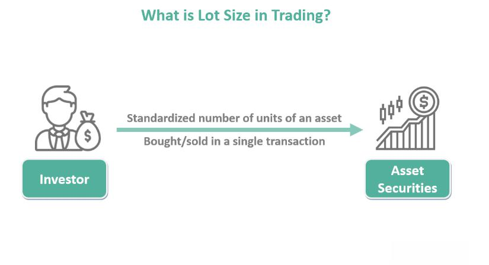

## Table of Contents

## What is lot size in trading?

Lot size in trading refers to the specific quantity of a financial instrument that a trader buys or sells in a single transaction. It is a standardized unit that helps traders manage their investments and understand the scale of their trades. For example, in forex trading, a standard lot size is typically 100,000 units of the base currency, while in stock trading, a lot might represent a certain number of shares.

Understanding lot sizes is important because it affects the potential profit or loss from a trade. Different markets and brokers might have different lot sizes, so it's crucial for traders to know these details before they start trading. By choosing the right lot size, traders can better control their risk and align their trading strategy with their financial goals.

## Why is lot size important in trading?

Lot size is important in trading because it helps traders decide how much of a financial product they want to buy or sell. This decision affects how much money they could make or lose. If a trader picks a big lot size, they could win or lose more money. If they pick a small lot size, the wins and losses will be smaller. This is why understanding lot size is key to managing risk and planning trades carefully.

Also, lot sizes are set by the market or the trading platform. This means traders need to know these sizes to trade correctly. For example, in [forex](/wiki/forex-system), a standard lot is 100,000 units, but there are also smaller lots like mini and micro lots. Knowing these helps traders match their trading strategy with their budget and goals. By choosing the right lot size, traders can keep their trading in line with what they can afford and what they aim to achieve.

## How does lot size affect trading outcomes?

Lot size directly affects how much money you can make or lose in trading. If you choose a big lot size, your potential profits or losses will be larger. This is because a bigger lot size means you're trading more of the financial product. For example, if you trade a standard lot in forex, which is 100,000 units, a small change in price can lead to a big change in your account balance. On the other hand, if you choose a small lot size, like a micro lot, your profits and losses will be smaller because you're trading less.

Choosing the right lot size is important for managing risk. If you're new to trading or have a small account, using smaller lot sizes can help you avoid big losses. This way, you can learn and grow your skills without risking too much money. Experienced traders might use bigger lot sizes to try to make more money, but they need to be careful because the risk is higher. By understanding lot sizes, traders can better plan their trades and match their strategies with their financial goals and risk tolerance.

## What are the different types of lot sizes in forex trading?

In forex trading, there are three main types of lot sizes that traders use: standard lots, mini lots, and micro lots. A standard lot is the biggest size and equals 100,000 units of the base currency. If you trade a standard lot, a small change in the currency price can lead to a big change in your account balance. A mini lot is smaller and equals 10,000 units of the base currency. This size is good for traders who want to take less risk because the profit or loss will be smaller than with a standard lot.

A micro lot is the smallest size and equals 1,000 units of the base currency. It's perfect for beginners or traders with small accounts because it lets them trade without risking too much money. Choosing the right lot size is important because it helps you manage how much you could win or lose. By [picking](/wiki/asset-class-picking) the lot size that fits your trading plan and how much risk you're okay with, you can trade more safely and reach your financial goals.

## How do you calculate lot size in trading?

To calculate lot size in trading, you need to know how much money you want to risk on a trade. Start by deciding what percentage of your account you're willing to risk. For example, if you have $10,000 and you want to risk 1% on a trade, that's $100. Then, you need to know how many pips you're willing to lose before you stop the trade. If you're okay with losing 50 pips, you can figure out your lot size by dividing your risk amount by the value of those pips. In forex, each pip for a standard lot is worth $10. So, if you're risking $100 and each pip is worth $10, you can trade 1 standard lot.

But, if you want to use a smaller lot size, you adjust your calculations. For a mini lot, each pip is worth $1, so you could trade 10 mini lots to risk $100 over 50 pips. For a micro lot, each pip is worth $0.10, so you could trade 100 micro lots. It's important to match your lot size to your risk and account size. By choosing the right lot size, you can control how much you might win or lose and keep your trading safe.

## What is the relationship between lot size and risk management?

Lot size is a big part of risk management in trading. It decides how much money you could win or lose on a trade. If you pick a big lot size, you could make or lose more money. If you pick a small lot size, the amount you could win or lose is smaller. This means that by choosing the right lot size, you can control how much risk you take. For example, if you have a small account, using smaller lot sizes can help you avoid big losses and keep your trading safe.

Understanding the link between lot size and risk helps you plan your trades better. You can decide how much of your account you're okay with risking on each trade. If you want to risk 1% of your account, you can figure out the right lot size to match that risk. This way, you can trade without worrying about losing too much money all at once. By managing your lot sizes carefully, you can keep your trading in line with your financial goals and stay in control of your risk.

## How does lot size impact leverage in trading?

Lot size and leverage are closely connected in trading. Leverage lets you trade bigger amounts of money than what you actually have in your account. When you choose a lot size, it decides how much leverage you're using. If you pick a big lot size, you're using more leverage. This means you can make or lose more money because you're controlling a bigger amount with less of your own money. For example, if you trade a standard lot in forex with a small account, you're using a lot of leverage, which can make your profits or losses bigger.

Using the right lot size helps you manage how much leverage you're taking on. If you're new to trading or have a small account, picking a smaller lot size can help you use less leverage. This makes your trading safer because you're not risking as much money. By choosing a lot size that matches your account size and how much risk you're okay with, you can keep your trading under control. This way, you can use leverage to try to make more money without putting too much at risk.

## What are the common mistakes traders make with lot sizes?

One common mistake traders make with lot sizes is choosing a size that's too big for their account. When they do this, they use too much leverage, which can lead to big losses. For example, if a trader with a small account tries to trade a standard lot in forex, a small move in the wrong direction could wipe out their account. It's important for traders to pick a lot size that matches how much money they have and how much risk they're okay with.

Another mistake is not understanding how lot size affects risk. Some traders don't realize that a bigger lot size means bigger potential wins and losses. They might pick a lot size without thinking about how it could impact their trades. This can make their trading more risky than they planned. By learning about lot sizes and how they work, traders can make better choices and manage their risk more carefully.

## How can lot size be adjusted based on account size and trading strategy?

Adjusting lot size based on your account size is important for keeping your trading safe. If you have a small account, you should use smaller lot sizes like mini or micro lots. This way, you don't risk too much money on each trade. For example, if your account is $1,000, trading a standard lot in forex would be too risky because it could lead to big losses. Instead, you might trade micro lots to keep your risk low. By matching your lot size to your account size, you can trade without worrying about losing too much money all at once.

Your trading strategy also plays a big role in deciding your lot size. If you're a beginner or want to be careful, you might choose smaller lot sizes to learn and grow without big risks. If you're an experienced trader looking to make bigger profits, you might go for bigger lot sizes, but you need to be ready for bigger losses too. For example, if your strategy is to make small, steady gains, smaller lot sizes can help you achieve that. But if you're aiming for big wins, you might use larger lot sizes. By thinking about your strategy and how much risk you're okay with, you can pick the right lot size to help you reach your trading goals.

## What are the psychological impacts of choosing different lot sizes?

Choosing different lot sizes can affect how you feel about your trading. If you pick a big lot size, you might feel more stressed because you're risking more money. This can make you worry a lot about losing your money, and it might make you second-guess your trading decisions. On the other hand, if you choose a small lot size, you might feel more relaxed because you're not risking as much. This can help you focus better on your trading strategy without feeling too much pressure.

The lot size you choose can also impact your confidence. If you're new to trading and you start with small lot sizes, you might feel more confident as you learn and see small wins. This can help you build up your skills without feeling overwhelmed. But if you jump into big lot sizes too soon, it might shake your confidence if you face big losses. By picking lot sizes that match your comfort level and experience, you can keep your emotions in check and trade more effectively.

## How do professional traders optimize lot sizes for different market conditions?

Professional traders adjust their lot sizes based on how the market is behaving. If the market is moving a lot and seems risky, they might use smaller lot sizes to protect their money. This way, they can still trade without losing too much if the market goes against them. On the other hand, if the market is calm and moving slowly, they might use bigger lot sizes to try to make more money. They look at things like how much the market is moving, what's happening in the news, and what other traders are doing to decide on the right lot size.

By changing their lot sizes, professional traders can match their trading to what's happening in the market. They might use smaller lots when they're not sure about the market and bigger lots when they feel more confident. This helps them control how much risk they're taking and keep their trading safe. They also think about their overall trading plan and how much money they have in their account when deciding on lot sizes. This way, they can stay flexible and make smart choices no matter what the market is doing.

## What advanced techniques can be used to dynamically adjust lot sizes during a trading session?

Professional traders use advanced techniques to change their lot sizes while they're trading. One way is to use something called "[volatility](/wiki/volatility-trading-strategies)-based position sizing." This means they look at how much the market is moving up and down. If the market is moving a lot, they might use smaller lot sizes to be safer. If the market is calm, they might use bigger lot sizes to try to make more money. They can use tools like the Average True Range (ATR) to measure this movement and decide on their lot sizes.

Another technique is "equity curve trading." Traders look at how well their account is doing over time. If their account is growing, they might increase their lot sizes to make more money. But if their account is shrinking, they might use smaller lot sizes to protect what they have left. This way, they can adjust their trading based on how successful they've been lately. By using these methods, traders can keep their lot sizes in line with what's happening in the market and their account, making their trading more flexible and smart.

## References & Further Reading

[1]: ["Advances in Financial Machine Learning"](https://www.amazon.com/Advances-Financial-Machine-Learning-Marcos/dp/1119482089) by Marcos Lopez de Prado

[2]: ["Quantitative Trading: How to Build Your Own Algorithmic Trading Business"](https://books.google.com/books/about/Quantitative_Trading.html?id=j70yEAAAQBAJ) by Ernest P. Chan

[3]: ["Machine Learning for Algorithmic Trading"](https://github.com/PacktPublishing/Machine-Learning-for-Algorithmic-Trading-Second-Edition) by Stefan Jansen

[4]: Laruelle, S., & Lehalle, C.-A. (2018). ["Market Microstructure in Practice"](https://www.semanticscholar.org/paper/Market-Microstructure-in-Practice-Lehalle-Laruelle/2df52569ee044db799cc9ae865de4689847d6f83)

[5]: Aldridge, I. (2013). ["High-Frequency Trading: A Practical Guide to Algorithmic Strategies and Trading Systems"](https://www.wiley.com/en-us/High+Frequency+Trading%3A+A+Practical+Guide+to+Algorithmic+Strategies+and+Trading+Systems-p-9780470579770)