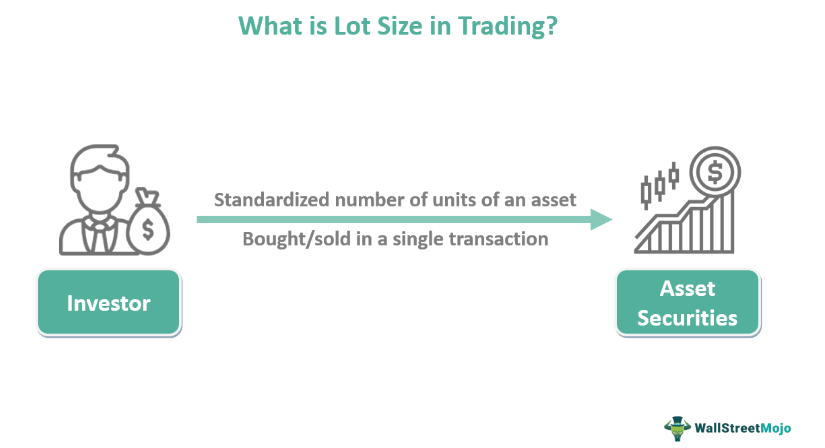

Trading in finance is a complex and diverse practice encompassing various methods such as lot trading, stock and bond trading, and algorithmic trading. This article aims to explore several types of financial trading by focusing on essential concepts, strategies, and real-world examples. By examining lot trading in stocks and bonds, showcasing examples of financial trading, and clarifying the intricacies of algorithmic trading, we aim to provide a comprehensive understanding of these trading methodologies.

For investors—whether beginners or veterans—gaining insight into these trading forms is crucial for improving financial strategies and making informed decisions. From understanding the significance of lot sizes in stock and bond trading to exploring automated trading systems driven by algorithms, each method offers unique advantages and challenges tailored to specific market conditions and investment goals. By dissecting the landscape of financial trading, this article serves as a guide to navigating the various paths available for maximizing portfolio potential and achieving financial objectives.



## Table of Contents

## Understanding Lot Trading in Stocks and Bonds

Lot trading is an integral aspect of securities trading, referring to the buying and selling of financial instruments in fixed units called "lots." This concept simplifies the trading process by standardizing the transaction sizes, making it easier for traders to manage their positions and execute orders efficiently.

In stock trading, the standard transaction unit is known as a "round lot," which typically comprises 100 shares of a given stock. This convention aids in the liquidity and marketability of stocks, ensuring a uniform trading structure across exchanges. However, transactions involving fewer than 100 shares are classified as "odd lots." These can arise from fractional share trading or investor-specific strategies. Odd lots are generally perceived as less liquid, and they may incur higher transaction costs due to the complexities involved in trading smaller quantities.

The bond market presents a different landscape, where lot sizes can vary significantly based on the nature of the bonds and the preferences of institutional investors. Bonds are often traded in minimum increments that can range from $1,000 to $1 million, reflecting their larger face values and the predominant participation of institutional players. These institutions typically prefer larger lot sizes to meet liquidity and portfolio diversification requirements. 

Understanding the concept of lot sizes is crucial for traders and investors, as it directly impacts their ability to align trades with investment goals and strategies. Different lot sizes can have varying implications for transaction costs, liquidity, and pricing. For instance, larger round lots in stocks facilitate smoother execution and better pricing compared to odd lots, which may face spreads and price disadvantages due to their smaller size.

Variations within lot sizes, such as round lots, odd lots, and mixed lots, play a significant role in trading dynamics. A mixed lot consists of a combination of round and odd lots, allowing for more customized trading. These variations can influence both the strategy a trader might employ and the overall market behavior. For example, a trader dealing with high-[volume](/wiki/volume-trading-strategy) trades may prefer round lots to benefit from tighter bid-ask spreads and enhanced [liquidity](/wiki/liquidity-risk-premium).

In conclusion, mastering the nuances of lot trading in both stocks and bonds is fundamental for efficient trading execution and strategic positioning in financial markets. By comprehending the implications of different lot sizes, traders can optimize their trades, manage transaction costs, and better align their portfolios with investment objectives.

## Stock and Bond Trading: Financial Trading Examples

Stock trading entails the buying and selling of company shares, capitalizing on the fluctuations in their prices. Successful stock trading often depends on strategies such as value investing and growth investing. Value investing focuses on identifying undervalued stocks that are traded for less than their intrinsic value, a concept popularized by renowned investors like Warren Buffett. Growth investing, on the other hand, targets companies expected to grow at an above-average rate compared to others, focusing on stocks with the potential for substantial future earnings.

Bond trading involves the trade of debt securities, offering a different risk-return profile than stocks. Bonds tend to provide predictable income through interest payments and have priority over stocks when a company is liquidated, thereby presenting a typically lower-risk investment option. A common strategy within bond trading is bond laddering, which involves purchasing bonds with different maturity dates to minimize [interest rate](/wiki/interest-rate-trading-strategies) risk and ensure a steady income stream. This approach provides flexibility as bonds mature at staggered intervals, allowing reinvestment or fund utilization as needed.

Economic indicators, such as inflation rates, GDP growth, and interest rates, significantly influence stock and bond trading decisions. For instance, during periods of economic growth, stocks might outperform as company profits increase, whereas bonds could perform better during economic downturns when investors seek safer assets. Similarly, market trends, such as bull or bear markets, impact trading strategies. In a bull market, characterized by rising prices, traders might pursue aggressive stock purchases, while in a bear market, characterized by falling prices, investors might pivot towards bonds or defensive stocks to preserve capital.

Real-world examples demonstrate effective stock and bond trading strategies. The technology stock boom is a prime example of growth investing's rewards, with companies like Amazon and Apple experiencing significant stock price increases over the past decades. Conversely, during economic downturns, bonds typically gain traction due to their relative safety; U.S. Treasury bonds, for example, are often sought after during such periods for their security and reliability in providing steady returns.

Understanding these trading strategies and recognizing how economic indicators and market trends affect trading scenarios equips investors with crucial insights for effective stock and bond trading, ultimately guiding them in making informed and prudent investment decisions.

## Exploring Algorithmic Trading

Algorithmic trading employs sophisticated computer programs to automate and execute trades based on predefined criteria without the need for human intervention. This method is highly dependent on algorithms, which are sets of rules or instructions programmed to evaluate and act on multiple market conditions.

### Key Strategies in Algorithmic Trading

One prominent strategy in [algorithmic trading](/wiki/algorithmic-trading) is **trend-following**, where algorithms capitalize on bullish or bearish patterns by employing technical indicators like moving averages. These indicators help discern price direction and generate buy or sell signals. For instance, a simple moving average crossover strategy could be coded in Python as follows:

```python
def moving_average(prices, window_size):
    return sum(prices[-window_size:]) / window_size

def should_trade(short_ma, long_ma):
    return short_ma > long_ma

# Example usage:
short_term = moving_average(prices, 10)
long_term = moving_average(prices, 50)
if should_trade(short_term, long_term):
    print("Consider Buying")
```

Another key strategy is **[arbitrage](/wiki/arbitrage)**, which seeks to exploit price discrepancies of the same asset across different markets to guarantee a risk-free profit. For instance, an algorithm might purchase a stock in one market where the price is lower and simultaneously sell it in another market where the price is higher.

### Market Liquidity and Emotional Influence

Algorithmic trading can enhance market liquidity by increasing the volume and speed of trading activities. By removing human emotions such as fear and greed, algorithms enable more precise and disciplined trading, which contributes to market stability and efficiency.

### Technical Requirements

To develop effective algorithmic trading systems, strong proficiency in programming languages such as Python, C++, or Java is essential. Skills in data analysis, an understanding of market microstructure, and familiarity with [machine learning](/wiki/machine-learning) techniques can significantly enhance the sophistication of trading algorithms. Traders often use specialized trading platforms and APIs to backtest and deploy their algorithms.

### Examples in Modern Financial Markets

In modern markets, algorithmic trading is responsible for a substantial portion of overall trading volume. High-frequency trading ([HFT](/wiki/high-frequency-trading-strategies)) is a well-known application, where trades are executed in fractions of a second to exploit minute market inefficiencies. Another example is **[statistical arbitrage](/wiki/statistical-arbitrage)**, which relies on quantitative models to identify and execute trades based on statistical relationships between different financial instruments.

Ultimately, algorithmic trading represents a convergence of financial expertise and technological prowess, shaping the dynamics and efficiency of contemporary financial markets.

## Strategies and Techniques in Algorithmic Trading

Algorithmic trading strategies offer a diverse array of techniques for automated trading, each catering to different market dynamics. These strategies can leverage market trends, arbitrage opportunities, or technical analysis, allowing for tailored approaches to trading.

Trend-following strategies are some of the most recognized in algorithmic trading. These rely on mathematical indicators such as moving averages to inform decisions on when to buy or sell assets. By analyzing price movements over time, these strategies aim to capitalize on persistent trends, assuming that asset prices tend to move along established paths. For example, a simple moving average (SMA) strategy might involve buying an asset when its 50-day moving average crosses above its 200-day moving average, known as a "golden cross".

Arbitrage strategies focus on capitalizing on price discrepancies of the same asset across different markets. The core objective is to execute simultaneous buy and sell orders in separate markets to ensure a risk-free profit. For instance, if a stock is priced lower on one exchange compared to another, an arbitrage algorithm would buy the stock on the cheaper exchange and sell it on the pricier one, often within milliseconds, to lock in profit before the prices converge.

More advanced algorithmic techniques include mean reversion, Volume Weighted Average Price (VWAP), and Time Weighted Average Price (TWAP). Mean reversion strategies are predicated on the statistical assumption that the price of an asset will revert to its historical average. Traders using this strategy might sell assets when prices are above their historical averages and buy when they are below.

VWAP and TWAP strategies are particularly useful for executing large orders without causing significant market impact. VWAP aims to execute orders at prices that match the volume-weighted average price of the assets throughout the day. It is calculated using:

$$
VWAP = \frac{\sum_{i} (P_i \times Q_i)}{\sum_{i} Q_i}
$$

where $P_i$ is the price of the asset at each transaction and $Q_i$ is the traded quantity. TWAP, on the other hand, spreads trade execution evenly throughout a specified time, targeting the average price over that time frame.

The effectiveness of these algorithmic trading strategies heavily depends on rigorous [backtesting](/wiki/backtesting) and real-time monitoring. Backtesting involves testing the algorithm on historical data to assess performance and refine models. Real-time monitoring ensures that algorithms respond appropriately to current market conditions and are adjusted for unexpected market events. Python offers robust libraries like Backtrader for backtesting purposes and Pandas for real-time data analysis, making it a preferred language for developing and testing trading algorithms.

By employing these strategies with diligence and periodic adjustments, traders can refine their approaches and enhance profitability while minimizing risks associated with emotional or impulsive trading decisions.

## Conclusion

In the ever-evolving world of finance, mastering various trading disciplines like lot trading, stock and bond trading, and algorithmic trading can provide significant advantages. Each of these trading methods is characterized by unique strategies, risks, and rewards, making them suitable for different types of investors and market conditions. Lot trading allows for structured purchases, whether it involves buying stocks in round, odd, or mixed lots, whereas stock and bond trading cater to those looking to capitalize on market fluctuations and manage investment risks. Algorithmic trading stands out for its reliance on technology to execute trades at speeds and efficiencies that are impossible for human traders.

Understanding these diverse methods allows traders to make informed decisions and optimize their portfolios. For instance, [picking](/wiki/asset-class-picking) the correct lot size can minimize transaction costs and maximize returns, while understanding the timing and strategy in stock and bond trades can safeguard against market [volatility](/wiki/volatility-trading-strategies). Algorithmic trading can further enhance market engagement by automating complex trade orders, thus reducing emotional influences and improving precision.

However, the advantages extend beyond just executing trades. By familiarizing themselves with these trading disciplines, investors enhance their ability to adapt to shifting market landscapes, thereby maintaining a competitive edge. This ongoing learning process helps investors to not only achieve their financial goals but also to mitigate risks associated with unforeseen economic shifts.

In conclusion, continual exploration and understanding of these trading mechanisms bolster an investor's ability to succeed in financial markets. As financial environments continue to become more complex and dynamic, the knowledge and strategic application of various trading methods remain keys to unlocking success. Traders and investors are encouraged to advance their learning and remain engaged with market developments to optimize their financial outcomes.

## References & Further Reading

[1]: Bergstra, J., Bardenet, R., Bengio, Y., & Kégl, B. (2011). ["Algorithms for Hyper-Parameter Optimization."](https://papers.nips.cc/paper/4443-algorithms-for-hyper-parameter-optimization) Advances in Neural Information Processing Systems 24.

[2]: ["Advances in Financial Machine Learning"](https://www.amazon.com/Advances-Financial-Machine-Learning-Marcos/dp/1119482089) by Marcos Lopez de Prado

[3]: ["Evidence-Based Technical Analysis: Applying the Scientific Method and Statistical Inference to Trading Signals"](https://www.amazon.com/Evidence-Based-Technical-Analysis-Scientific-Statistical/dp/0470008741) by David Aronson

[4]: ["Machine Learning for Algorithmic Trading"](https://github.com/stefan-jansen/machine-learning-for-trading) by Stefan Jansen

[5]: ["Quantitative Trading: How to Build Your Own Algorithmic Trading Business"](https://www.amazon.com/Quantitative-Trading-Build-Algorithmic-Business/dp/1119800064) by Ernest P. Chan