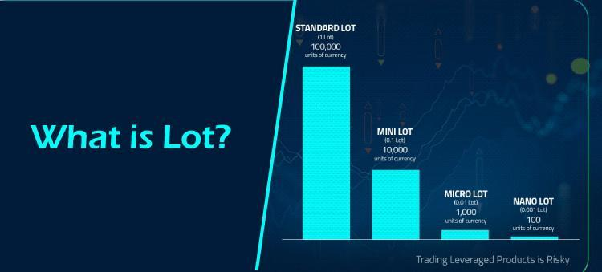

## Table of Contents

## What is a lot in stock and bond trading?

In stock and bond trading, a "lot" refers to a specific number of shares or bonds that are traded together as a single unit. For stocks, a standard lot is usually 100 shares. This means that if someone wants to buy or sell a stock, they often do it in multiples of 100 shares. For bonds, a lot can vary but is often set at a face value of $1,000 or $5,000. The concept of lots helps to standardize trading and makes it easier for traders to buy and sell large quantities quickly.

However, not everyone can afford to buy 100 shares at once. That's why there are also "odd lots," which are smaller than the standard lot size. An odd lot in stocks might be any number of shares less than 100. Trading in odd lots can sometimes be more expensive because they don't fit the standard trading size. On the other hand, "round lots" are multiples of the standard lot size, like 200 or 300 shares, and are easier and often cheaper to trade. Understanding lots is important for anyone looking to invest in stocks or bonds.

## How does the size of a lot affect trading?

The size of a lot can affect trading in a few important ways. First, trading in standard lots, like 100 shares for stocks, can be easier and often cheaper. This is because most trading systems and brokers are set up to handle these standard sizes smoothly. If you trade in a standard lot, you might get better prices and pay less in fees. But if you want to buy or sell a smaller amount, like 50 shares, this is called an odd lot. Trading odd lots can be harder and might cost more because they don't fit the usual trading size.

Second, the lot size can also affect how quickly you can buy or sell. If you're trading a standard lot, it's usually easier to find someone to trade with because many people are looking to buy or sell in these sizes. But if you're trading an odd lot, it might take longer to find a match, which could mean waiting longer to complete your trade. So, understanding lot sizes can help you make smarter choices about when and how to trade, making your trading experience smoother and possibly more cost-effective.

## What is the difference between a standard lot, a mini lot, and a micro lot?

In trading, a standard lot, a mini lot, and a micro lot are different sizes of trades that you can make. A standard lot is the biggest of the three and is usually 100,000 units of the currency you're trading. For example, if you're trading the US dollar, a standard lot would be $100,000. This size is common in [forex](/wiki/forex-system) trading and can also apply to stocks, where a standard lot is 100 shares.

A mini lot is smaller than a standard lot and is usually 10,000 units of the currency. So, if you're trading the US dollar, a mini lot would be $10,000. This size is good for people who want to trade but don't want to risk as much money as they would with a standard lot. A micro lot is even smaller, usually 1,000 units of the currency. For the US dollar, that would be $1,000. Micro lots are great for beginners or for people who want to trade with very small amounts of money. Each of these lot sizes can affect how much you might gain or lose in a trade, so it's important to choose the right size for your trading goals and risk level.

## How do lots impact the cost of trading?

The size of the lot you trade can change how much you have to pay to make a trade. When you trade a standard lot, like 100 shares of a stock or $100,000 in forex, the costs are often lower. This is because many brokers have fees that are set up for these standard sizes. They might charge you a flat fee per trade, which means you pay the same amount no matter how many standard lots you trade. But if you trade an odd lot, like 50 shares of a stock, you might have to pay more. This is because odd lots can be harder for brokers to handle, so they might charge extra fees for these smaller trades.

Also, the lot size can affect how much you pay in something called the "bid-ask spread." This is the difference between the price someone is willing to pay for a stock or currency and the price someone is willing to sell it for. When you trade a standard lot, the spread is usually smaller because there are more people trading in these sizes. This means you can buy or sell closer to the market price. But if you trade a mini lot or a micro lot, the spread might be bigger because fewer people are trading these smaller sizes. So, choosing the right lot size can help you save money on trading costs.

## What are the advantages of trading in larger lots?

Trading in larger lots, like standard lots, has some big advantages. One main advantage is that it can be cheaper. When you trade a standard lot, brokers often charge less because it's easier for them to handle. This means you might pay lower fees than if you were trading smaller lots. Also, when you trade larger lots, you can get closer to the market price. This is because there are more people trading in these sizes, so the difference between the buying and selling price, called the bid-ask spread, is smaller. This can save you money and make your trades more profitable.

Another advantage of trading larger lots is that it can be faster and easier to complete your trades. When you trade a standard lot, it's easier to find someone to trade with because many people are looking to buy or sell in these sizes. This means you can get your trades done quickly without having to wait. Trading larger lots can also help you manage your investments better. If you're trying to reach certain financial goals, trading in larger amounts can help you get there faster because you're moving more money at once. So, if you can handle the risk, trading in larger lots can be a smart choice.

## What are the risks associated with trading larger lots?

Trading in larger lots can be riskier because you're putting more money on the line. If the price of what you're trading goes down, you could lose a lot more money than if you were trading smaller lots. This means you need to be careful and make sure you can handle the risk before you start trading big amounts. It's like betting more money in a game - if you win, you win big, but if you lose, you lose big too.

Another risk is that trading larger lots can make your money go up and down a lot more. This is called [volatility](/wiki/volatility-trading-strategies). When you trade more, even small changes in the price can make a big difference in how much money you have. This can be stressful and might make it hard to stick to your trading plan. So, it's important to think about how much risk you're okay with before you decide to trade in larger lots.

## How do lot sizes influence leverage in trading?

Lot sizes can change how much leverage you use in trading. Leverage is like borrowing money to trade more than you have. When you trade a bigger lot, like a standard lot, you might need more leverage because you're trading a larger amount of money. This means you can control a big position with less of your own money. But, using more leverage can be risky because if the trade goes against you, you could lose a lot more money than if you were using less leverage.

Choosing the right lot size can help you manage how much leverage you use. If you pick a smaller lot size, like a mini or micro lot, you don't need as much leverage. This can make your trading safer because you're not borrowing as much money. It's important to think about how much risk you're okay with when deciding on your lot size and how much leverage to use. Balancing these can help you trade smarter and keep your money safer.

## Can lot sizes be customized in trading platforms?

Yes, lot sizes can be customized on many trading platforms. This means you can choose to trade in amounts that fit your needs, not just the standard, mini, or micro lot sizes. Some platforms let you enter any number of shares or units you want to trade, which is great if you want to be very specific about how much you're trading. This can help you match your trading strategy and risk level better.

Customizing lot sizes can be really helpful. It lets you trade exactly what you want, whether it's a small amount to test the waters or a larger amount if you're feeling confident. But remember, trading smaller or odd lot sizes might cost more because of extra fees or bigger price differences. So, it's good to check with your trading platform to see what options you have and how it might affect your costs.

## What strategies should be considered when choosing lot sizes?

When choosing lot sizes, it's important to think about how much risk you're okay with. If you're new to trading or don't want to risk a lot of money, you might want to start with smaller lot sizes like mini or micro lots. These let you trade with less money, so if the trade goes wrong, you won't lose as much. But if you're more experienced and can handle bigger risks, trading in standard lots might be better. This can help you make more money if your trades are successful, but you need to be ready for bigger losses if things don't go your way.

Another thing to consider is your trading goals and how much money you have to trade with. If you're trying to grow your money slowly and steadily, smaller lot sizes can help you do that without risking too much at once. But if you're aiming for bigger gains and can afford to trade more, larger lot sizes might help you reach your goals faster. Also, think about the costs of trading. Smaller or odd lot sizes can sometimes cost more because of extra fees or bigger price differences. So, it's a good idea to balance your risk, goals, and costs when [picking](/wiki/asset-class-picking) the right lot size for your trades.

## How do lot sizes affect the liquidity of a trade?

Lot sizes can change how easy it is to buy or sell something quickly, which is called [liquidity](/wiki/liquidity-risk-premium). When you trade in standard lots, like 100 shares of a stock or $100,000 in forex, it's usually easier to find someone to trade with. This is because a lot of people are trading in these sizes, so there's more activity in the market. This means you can get in and out of your trades faster, which is good if you need to act quickly.

On the other hand, if you choose to trade smaller lots, like mini or micro lots, it might be harder to find someone to trade with right away. Fewer people are trading these smaller amounts, so the market might not be as active. This can make it take longer to complete your trade, and you might not get the best price. So, choosing the right lot size can help you make sure your trades are as smooth and quick as possible.

## What is the impact of lot size on transaction costs and spreads?

When you trade, the size of your lot can change how much you have to pay in fees and what price you get. If you trade a standard lot, like 100 shares of a stock or $100,000 in forex, it's often cheaper. This is because brokers usually charge less for these standard sizes. They might have a set fee for each trade, so trading bigger lots means you're not paying more for each share or unit. But if you trade smaller lots, like mini or micro lots, you might pay more. This is because odd lot sizes can be harder for brokers to handle, so they might charge extra fees or have higher costs for these smaller trades.

The lot size also affects the difference between the buying and selling price, which is called the spread. When you trade a standard lot, there are usually more people trading, so the spread is smaller. This means you can buy or sell closer to the market price, which can save you money. But if you trade smaller lots, the spread might be bigger because fewer people are trading these sizes. This can make your trades more expensive because you're not getting as good a price. So, choosing the right lot size can help you keep your trading costs down and get better prices.

## How do professional traders optimize lot sizes for different market conditions?

Professional traders often adjust their lot sizes based on how the market is acting. When the market is moving a lot and prices are changing fast, traders might choose smaller lot sizes. This helps them manage risk better because they're not putting as much money on the line at once. If the market is quiet and not moving much, they might go for bigger lot sizes. This can help them make more money if they think the market will stay steady or move in their favor. They also look at how much money they have to trade with and their own risk levels to pick the right lot size.

Another thing professional traders do is watch the liquidity of the market. If there are a lot of people trading and it's easy to buy or sell, they might use bigger lot sizes because it's easier to get in and out of trades. But if the market isn't very active, they might use smaller lot sizes to make sure they can still trade without waiting too long. By changing their lot sizes based on these things, professional traders can make their trading strategies work better and keep their costs down.

## What are the strategies and techniques used in algorithmic trading?

Algorithmic trading strategies offer a diverse array of techniques for automated trading, each catering to different market dynamics. These strategies can leverage market trends, [arbitrage](/wiki/arbitrage) opportunities, or technical analysis, allowing for tailored approaches to trading.

Trend-following strategies are some of the most recognized in [algorithmic trading](/wiki/algorithmic-trading). These rely on mathematical indicators such as moving averages to inform decisions on when to buy or sell assets. By analyzing price movements over time, these strategies aim to capitalize on persistent trends, assuming that asset prices tend to move along established paths. For example, a simple moving average (SMA) strategy might involve buying an asset when its 50-day moving average crosses above its 200-day moving average, known as a "golden cross".

Arbitrage strategies focus on capitalizing on price discrepancies of the same asset across different markets. The core objective is to execute simultaneous buy and sell orders in separate markets to ensure a risk-free profit. For instance, if a stock is priced lower on one exchange compared to another, an arbitrage algorithm would buy the stock on the cheaper exchange and sell it on the pricier one, often within milliseconds, to lock in profit before the prices converge.

More advanced algorithmic techniques include mean reversion, Volume Weighted Average Price (VWAP), and Time Weighted Average Price (TWAP). Mean reversion strategies are predicated on the statistical assumption that the price of an asset will revert to its historical average. Traders using this strategy might sell assets when prices are above their historical averages and buy when they are below.

VWAP and TWAP strategies are particularly useful for executing large orders without causing significant market impact. VWAP aims to execute orders at prices that match the [volume](/wiki/volume-trading-strategy)-weighted average price of the assets throughout the day. It is calculated using:

$$
VWAP = \frac{\sum_{i} (P_i \times Q_i)}{\sum_{i} Q_i}
$$

where $P_i$ is the price of the asset at each transaction and $Q_i$ is the traded quantity. TWAP, on the other hand, spreads trade execution evenly throughout a specified time, targeting the average price over that time frame.

The effectiveness of these algorithmic trading strategies heavily depends on rigorous [backtesting](/wiki/backtesting) and real-time monitoring. Backtesting involves testing the algorithm on historical data to assess performance and refine models. Real-time monitoring ensures that algorithms respond appropriately to current market conditions and are adjusted for unexpected market events. Python offers robust libraries like Backtrader for backtesting purposes and Pandas for real-time data analysis, making it a preferred language for developing and testing trading algorithms.

By employing these strategies with diligence and periodic adjustments, traders can refine their approaches and enhance profitability while minimizing risks associated with emotional or impulsive trading decisions.

## References & Further Reading

[1]: Bergstra, J., Bardenet, R., Bengio, Y., & Kégl, B. (2011). ["Algorithms for Hyper-Parameter Optimization."](https://papers.nips.cc/paper/4443-algorithms-for-hyper-parameter-optimization) Advances in Neural Information Processing Systems 24.

[2]: ["Advances in Financial Machine Learning"](https://www.amazon.com/Advances-Financial-Machine-Learning-Marcos/dp/1119482089) by Marcos Lopez de Prado

[3]: ["Evidence-Based Technical Analysis: Applying the Scientific Method and Statistical Inference to Trading Signals"](https://www.amazon.com/Evidence-Based-Technical-Analysis-Scientific-Statistical/dp/0470008741) by David Aronson

[4]: ["Machine Learning for Algorithmic Trading"](https://github.com/stefan-jansen/machine-learning-for-trading) by Stefan Jansen

[5]: ["Quantitative Trading: How to Build Your Own Algorithmic Trading Business"](https://www.amazon.com/Quantitative-Trading-Build-Algorithmic-Business/dp/1119800064) by Ernest P. Chan