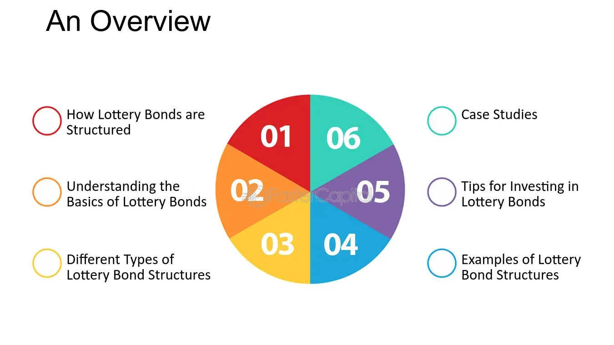

## Table of Contents

## What are lottery bonds?

Lottery bonds are a type of bond that combines the safety of a traditional bond with the excitement of a lottery. When you buy a lottery bond, you are lending money to the issuer, usually a government or a company, and in return, they promise to pay you back the money you lent them, plus interest, at a certain time. But what makes lottery bonds special is that they also give you a chance to win extra money through a lottery. The lottery part works by entering the bond numbers into a draw, and if your bond number is picked, you win a prize.

These bonds are popular because they offer a way to save money and have a chance to win big prizes at the same time. For example, in some countries, lottery bonds are used to encourage people to save money and help the government raise funds for public projects. The prizes can be quite large, which adds to the appeal. However, it's important to remember that like any lottery, the chances of winning are small, so you should not buy lottery bonds just for the chance to win the lottery. Instead, think of them as a safe way to save money, with the added fun of a lottery.

## How do lottery bonds differ from traditional bonds?

Lottery bonds and traditional bonds are both ways to lend money to a government or a company. With a traditional bond, you get your money back plus interest at the end of the bond's term. This makes traditional bonds a safe way to save money because you know exactly how much you will get back and when. They are popular with people who want a steady, predictable return on their savings.

Lottery bonds work a bit differently. Like traditional bonds, you lend money and get it back with interest. But lottery bonds also enter you into a lottery where you can win extra prizes. This adds excitement because there's a chance to win big money, even though the odds are small. So, lottery bonds are not just about saving; they also have the fun of a lottery, which can make saving more appealing to some people.

## What is the primary mechanism behind lottery bonds?

Lottery bonds work by combining the features of a regular bond and a lottery. When you buy a lottery bond, you are lending money to the issuer, like a government or a company. In return, they promise to pay you back your money plus interest at a set time. This part is just like a traditional bond, where you know how much you will get and when.

But lottery bonds add an extra feature: a chance to win prizes. The bond numbers are entered into a lottery draw. If your bond number is picked, you win a prize on top of the interest you earn. This makes lottery bonds exciting because you could win extra money, even though the chances are small. So, lottery bonds are a way to save money safely, with the fun of possibly winning a lottery prize.

## Who typically issues lottery bonds?

Lottery bonds are usually issued by governments. They use these bonds to help raise money for public projects like schools, roads, or hospitals. By offering the chance to win prizes, governments make saving money more fun for people, which can encourage more people to buy the bonds and help fund important projects.

Sometimes, companies can also issue lottery bonds. They might do this to raise money for their business, just like governments do. But it's more common for governments to issue lottery bonds because they can use the money for the public good and make saving more appealing to people.

## What are the potential benefits of investing in lottery bonds?

Investing in lottery bonds can be a good way to save money while also having a bit of fun. When you buy a lottery bond, you lend money to a government or a company. They promise to pay you back your money plus some interest at the end of the bond's term. This means your savings are safe and you know exactly how much you will get back. It's like putting your money in a safe place and watching it grow a little over time.

But what makes lottery bonds special is that they also give you a chance to win extra money through a lottery. The bond numbers are entered into a draw, and if your number is picked, you can win a big prize. This adds excitement to saving because you might get a nice surprise. So, lottery bonds can make saving more fun and might encourage people to save more money, which can be good for both them and the government or company issuing the bonds.

## What are the risks associated with lottery bonds?

Investing in lottery bonds comes with some risks, just like any investment. One main risk is that you might not win the lottery part of the bond. The chances of winning a prize are usually very small, so you should not buy lottery bonds just because you hope to win big. If you do that, you might be disappointed if you don't win.

Another risk is that the interest you earn on lottery bonds might be lower than other types of investments. This means that if you're looking to grow your money as much as possible, you might find better options elsewhere. Also, while lottery bonds are generally safe because they are backed by governments or companies, there's always a small chance that the issuer could run into financial trouble and not be able to pay you back. So, it's important to think about these risks before deciding to invest in lottery bonds.

## How are the winners of the lottery component determined?

Winners of the lottery part of lottery bonds are picked through a random drawing. Each bond has a unique number, and these numbers are put into a big lottery draw. If your bond's number is chosen in the draw, you win a prize. The draws happen at set times, and they are usually done in a way that everyone can see, so it's fair for everyone.

The prizes can be big, but the chance of winning is small. It's like any other lottery where lots of people enter, but only a few win. So, even though it's exciting to think about winning, you should remember that it's not likely to happen. Still, knowing that you could win a prize makes saving with lottery bonds more fun for many people.

## Can lottery bonds be traded on secondary markets?

Lottery bonds can be traded on secondary markets, but it's not as common as with regular bonds. When you buy a lottery bond, you can sell it to someone else before it matures. This means you can get your money back before the bond's term ends, but you might not get the full amount you paid, and you'll miss out on the chance to win the lottery prize.

The trading of lottery bonds on secondary markets depends a lot on the rules set by the issuer. Some governments or companies might allow trading, while others might not. If trading is allowed, the price of the bond can change based on how much people want to buy or sell it, and how close it is to the next lottery draw. So, if you're thinking about trading your lottery bond, it's important to check the rules and see if it's a good time to sell.

## What historical examples exist of lottery bonds?

One famous example of lottery bonds is from the United Kingdom. They used to have something called Premium Bonds. These were started in 1956 by the government to help people save money. Instead of getting interest, people who bought Premium Bonds entered a monthly lottery. If their bond number was picked, they could win big prizes. It was a fun way to save money and it helped the government raise funds for public projects.

Another example comes from Italy, where they have a type of lottery bond called BTP Italia. These bonds were first issued in 2009. They are a bit different because they also protect against inflation. So, people get their money back with interest, and they have a chance to win prizes in a lottery. This makes saving more exciting and helps the Italian government raise money for its needs.

## How do tax implications vary for lottery bonds compared to other investments?

The tax implications for lottery bonds can be different from other investments. When you win a prize from a lottery bond, you usually have to pay tax on that prize money. This is because the prize is seen as extra income. But, the interest you earn from the bond itself might be taxed differently. In some places, the interest might be taxed as regular income, while in others, it might have special tax rules or even be tax-free.

Compared to other investments like stocks or regular bonds, the tax rules can be more complicated with lottery bonds. With stocks, you might pay capital gains tax if you sell them for a profit. Regular bonds often have interest that is taxed as income. But with lottery bonds, you have to think about both the interest and the lottery prize. So, it's a good idea to check the tax laws in your country to understand how lottery bonds will affect your taxes.

## What is the impact of lottery bonds on the broader financial market?

Lottery bonds can have a small but interesting effect on the broader financial market. When governments or companies issue these bonds, they are trying to raise money. This can be good for the market because it gives people another way to save and invest their money. If lots of people buy lottery bonds, it means more money is flowing into the market, which can help the economy grow. But, since lottery bonds are not as common as other types of investments, their overall impact on the market is usually pretty small.

On the other hand, lottery bonds can make saving more fun for people. This might encourage more people to save money, which is good for the economy. But because the chances of winning the lottery part are small, people should not buy these bonds just hoping to win big. If too many people do that, it could mean less money going into other, more stable investments. So, while lottery bonds add a fun element to saving, they don't usually change the big picture of the financial market very much.

## How can advanced investors use lottery bonds in a diversified investment portfolio?

Advanced investors can use lottery bonds in their diversified investment portfolio as a way to add a bit of fun and excitement while still keeping their savings safe. Since lottery bonds are backed by governments or companies, they offer a low-risk way to invest. This means they can be a good choice for part of a portfolio that focuses on safety and stability. By including lottery bonds, advanced investors can enjoy the thrill of a potential lottery win without putting their entire portfolio at risk.

However, it's important for advanced investors to remember that the interest rates on lottery bonds might be lower than other investments. This means that while they add diversity and excitement, they might not be the best choice for growing wealth quickly. So, investors should balance their portfolio by also including other types of investments like stocks, regular bonds, and real estate. This way, they can aim for higher returns while still enjoying the fun of lottery bonds.

## References & Further Reading

[1]: Brealey, R. A., Myers, S. C., & Allen, F. (2017). ["Principles of Corporate Finance"](https://books.google.com/books/about/Principles_of_Corporate_Finance_12_e.html?id=TQGkDwAAQBAJ). McGraw-Hill Education.

[2]: Knottenbelt, S. (2016). ["Premium Bonds in the UK: A Social History and Economic Analysis"](https://scholar.google.com/citations?user=Vz8XWRoAAAAJ&hl=en). SSRN Electronic Journal.

[3]: Fox, J. (2009). ["The Myth of the Rational Market: A History of Risk, Reward, and Delusion on Wall Street"](https://www.amazon.com/Myth-Rational-Market-History-Delusion/dp/0060599030). HarperCollins.

[4]: ["Algorithmic and High-Frequency Trading"](https://www.cambridge.org/us/universitypress/subjects/mathematics/mathematical-finance/algorithmic-and-high-frequency-trading) by Álvaro Cartea, Sebastian Jaimungal, and José Penalva

[5]: O'Sullivan, M., & Sheffrin, S. M. (2003). ["Economics: Principles, Applications, and Tools"](https://www.pearsonhighered.com/assets/preface/0/1/3/5/0135173973.pdf). Prentice Hall. 

[6]: Chan, E. (2009). ["Quantitative Trading: How to Build Your Own Algorithmic Trading Business"](https://github.com/ftvision/quant_trading_echan_book). Wiley Trading.

[7]: ["Financial Markets and Institutions"](https://catalogimages.wiley.com/images/db/pdf/9781119330363.excerpt.pdf) by Frederic S. Mishkin and Stanley Eakins