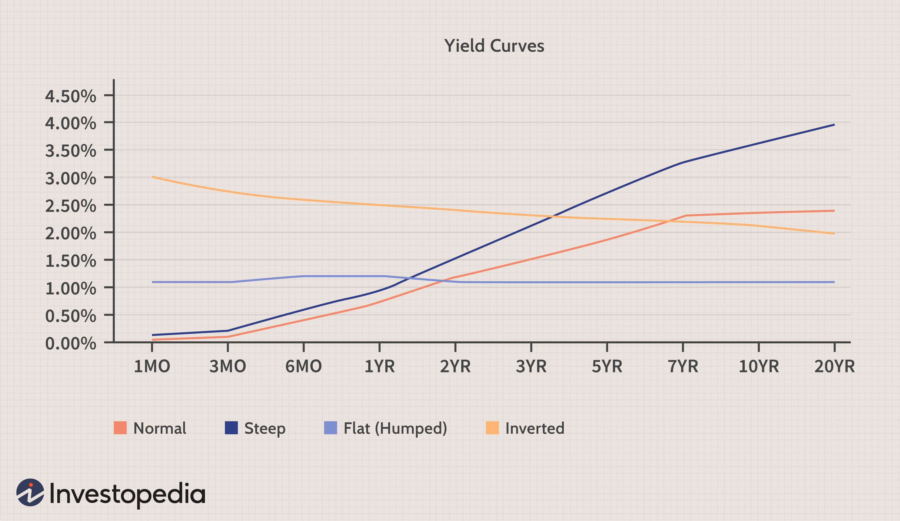

In the ever-evolving world of financial securities, investors are continually on the lookout for unique and diverse investment opportunities. Lottery bonds represent a distinctive blend of stability and excitement, offering a novel way to diversify one's investment portfolio. Unlike conventional bonds that provide fixed interest returns, lottery bonds entice investors with the potential of periodic lottery winnings, combining financial investment with the thrill of unpredictable outcomes.

Algorithmic trading is revolutionizing how securities, including lottery bonds, are traded. This technology-driven approach uses computer algorithms to execute trades at speeds and efficiencies unattainable by human traders. Through data analysis and pattern recognition, algorithmic trading provides unprecedented speed and precision in investment decision-making. The integration of algorithmic trading into investment strategies involving lottery bonds empowers investors to optimize their portfolios dynamically, responding swiftly to market changes.



This article explores the intersection of lottery bonds, investment strategies, financial securities, and algo trading. By understanding these elements, investors can make informed decisions that balance risk with potential reward. The strategic use of lottery bonds within a diverse portfolio, enhanced by the automation and analytical power of algorithmic trading, represents a modern approach to navigating the complexities of today's financial markets.

## Table of Contents

## Understanding Lottery Bonds

Lottery bonds represent a unique class of government bonds where the primary return mechanism is a lottery draw rather than fixed interest payments. Unlike conventional bonds, which guarantee periodic interest, lottery bonds offer the allure of intermittent lottery winnings, thereby blending traditional investment with elements of gambling. This hybrid nature makes lottery bonds appealing to risk-tolerant investors who are generally more open to non-traditional investment avenues and potential high payouts.

The design of lottery bonds is particularly attractive to those willing to take on the uncertainty of no fixed returns in exchange for the possibility of substantial gains. This unpredictable payout structure is akin to a lottery, where each period a set number of bonds are drawn, providing winners with a return significantly higher than typical bond interest. 

Countries like the United Kingdom and Ireland have successfully employed lottery bonds as a financial instrument. These nations utilize them as a means to raise capital efficiently while simultaneously granting citizens a chance at tax-free returns. In the U.K., for instance, Premium Bonds—one of the most well-known forms of lottery bonds—have been a staple since 1956. They allow individuals to invest in government securities with the added excitement of monthly prize draws.

Overall, lottery bonds serve a dual purpose. For governments, they offer a strategic tool for funding public expenditure, while for investors, they provide a thrilling opportunity to diversify portfolios with a product that promises both stability and a chance for larger-than-usual returns.

## Investment Strategies with Lottery Bonds

Investing in lottery bonds involves a strategy distinct from conventional bonds due to their unpredictable returns, primarily driven by lottery-based outcomes rather than fixed interest payments. The key to successfully navigating this type of investment hinges upon diversification. Lottery bonds should constitute a portion of a broader investment portfolio to mitigate the risks associated with their unique return structure. Diversification helps balance the overall risk by spreading investments across various asset classes, thereby stabilizing the potential financial return and reducing dependency on a singular asset type.

Investors should thoroughly assess their risk tolerance and financial goals before committing to lottery bonds. These securities present the possibility of no returns due to their inherent nature, where returns are largely influenced by chance. Therefore, understanding one's capacity for risk and aligning it with investment objectives is crucial. This assessment ensures that financial commitments align with the investor’s broader financial strategy without exposing the portfolio to unwarranted [volatility](/wiki/volatility-trading-strategies).

Incorporating lottery bonds can add a speculative edge to an otherwise conservative portfolio. Some investors find value in the thrill of potential high payouts coupled with the relative security of government-backed principal protection. Strategically, holding a small percentage of lottery bonds can introduce potential high upside without overwhelming the portfolio with undue risk, maintaining a balance between traditional, stable investments and more speculative opportunities.

Moreover, understanding the economic and regulatory environment surrounding lottery bonds is essential for informed investment decisions. Economic conditions, including interest rates and inflation, can influence lottery bond attractiveness and valuations. Regulatory frameworks ensure transparent operations and protect investor interests but may also impact the [liquidity](/wiki/liquidity-risk-premium) and availability of these bonds. Staying informed about changes in regulation and economic policies can enhance investment timing and decision-making processes. As such, knowledgeable investors continuously monitor these external factors alongside their own financial strategies to maximize return potential in lottery bonds.

## Financial Securities and Their Role in the Market

Financial securities are foundational elements of global financial markets, underpinning the mobilization and allocation of capital. Among these, lottery bonds represent a unique niche, providing a blend of investment stability and lottery-like rewards. Securities come in varied forms, including stocks, bonds, and derivatives, each serving specific functions within an investment strategy.

Stocks are equity instruments, representing ownership in a company and usually offering dividends, which vary based on corporate performance. Bonds, traditionally considered safer, are debt securities where investors lend money to issuers, typically governments or corporations, in exchange for periodic interest payments and return of principal upon maturity. Derivatives, which derive value from underlying assets such as commodities or currencies, are used primarily for hedging risk or speculative purposes.

These financial instruments empower investors to grow wealth by allowing them to tailor investment portfolios that match their risk appetites and return expectations. They also play a crucial role in supporting economic growth. By ensuring efficient capital allocation, securities enable companies to finance operations, undergo expansion, and foster innovation. The various forms of securities mean that investors can diversify risk and optimize returns.

The liquidity of a financial security is a critical [factor](/wiki/factor-investing) affecting its attractiveness. High liquidity indicates that a security can be easily bought or sold without significantly affecting its price. This is particularly important for investors who may need to quickly liquidate their holdings. Regulatory frameworks further influence the appeal and performance of securities by establishing the rules that govern trading and disclosure obligations, thereby ensuring market integrity and investor protection.

Investors must possess a sound understanding of market dynamics and inherent risk factors to optimize the use of financial securities. This requires continuous monitoring of market conditions, regulatory changes, and economic indicators that impact security prices. For niche securities like lottery bonds, which offer potential for periodic large gains, understanding these aspects is imperative. While lottery bonds provide governments with a mechanism to raise capital, the speculative nature requires investors to carefully balance them within their broader investment portfolios.

Overall, financial securities serve as vital tools both for individual wealth generation and economic development, demanding an informed approach to effectively harness their potential benefits.

## The Rise of Algorithmic Trading

Algorithmic trading, or algo trading, utilizes sophisticated computer algorithms to perform trades at speeds and frequencies that are unattainable for human traders. This technology fundamentally alters financial markets by enhancing efficiency and increasing liquidity. Algorithmic trading leverages the massive influx of data in the modern era to revolutionize investment strategies, making them more precise and responsive.

The integration of big data analytics is central to the impact of [algorithmic trading](/wiki/algorithmic-trading). By processing extensive datasets, algo trading platforms can discern complex patterns and trends. These systems are capable of making data-driven predictions, allowing for the optimization of investment strategies in real-time. For example, algorithms might analyze historical securities prices, economic indicators, and news sentiment to predict market movements, adjusting trading strategies accordingly.

The impact of algo trading extends to various types of securities, including lottery bonds. These bonds can benefit from the speed and agility of algorithmic systems, which allow investors to quickly react to fluctuations in market conditions. For investment instruments with non-traditional structures like lottery bonds, the ability to execute trades swiftly can translate into enhanced returns.

Artificial intelligence (AI) and [machine learning](/wiki/machine-learning) (ML) further enhance the capabilities of algorithmic trading. By continuously learning from new data, these technologies improve the accuracy of predictions and the effectiveness of trading strategies over time. AI models can adapt to market dynamics, incorporating new information to refine trading decisions. This adaptability positions algorithmic trading as a critical tool in the evolving landscape of financial markets.

In summary, algorithmic trading signifies a major advancement in the execution of financial transactions. Its capacity to process large data volumes at high speed facilitates more informed and timely investment decisions, greatly benefiting instruments like lottery bonds. The continued development of AI and ML in this domain promises to further revolutionize trading practices, emphasizing the growing importance of technology in finance.

## Integrating Lottery Bonds with Algo Trading

Integrating lottery bonds with algorithmic trading strategies offers a sophisticated approach to managing investments, enabling investors to make improved data-driven decisions. The core advantage of employing algorithms lies in their capability to analyze vast datasets and identify patterns that human traders might overlook. By leveraging historical data and market trends, algorithms can optimize the timing and sizing of lottery bond purchases, potentially enhancing returns.

Algorithmic trading facilitates dynamic portfolio management, allowing for adjustments based on fluctuations in bond valuations and changing market conditions. This adaptability is particularly useful for managing the volatility and unpredictability associated with lottery bonds, which combine the elements of investment and gambling. Through algorithmic models, investors can balance chance with methodical strategies.

Below is a simple Python example using a hypothetical algorithm that might be used for deciding when to purchase lottery bonds based on market data:

```python
import numpy as np
import pandas as pd

# Hypothetical market data of lottery bonds
market_data = pd.DataFrame({
    'date': pd.date_range(start='1/1/2020', periods=100),
    'bond_value': np.random.normal(100, 10, 100)  # Random bond prices
})

# Moving average to identify optimal buying points
window_size = 5
market_data['moving_avg'] = market_data['bond_value'].rolling(window=window_size).mean()

# Determine buying points where the bond value is below the moving average by a threshold
threshold = -5
buy_signals = market_data['bond_value'] - market_data['moving_avg'] < threshold

# Output potential buy signals
buying_opportunities = market_data[buy_signals]
print(buying_opportunities)
```

This algorithm uses simple moving average techniques to generate buy signals when a bond's current price is below its moving average by a certain threshold. While basic, such models can be expanded with machine learning methods to refine predictive accuracy and enhance decision-making depth.

While adopting algorithmic trading, investors must consider the technological infrastructure required. This includes ensuring high-speed processing capabilities and reliable data feeds, as well as robust risk management protocols to manage the inherent uncertainties of lottery bonds. The integration of machine learning can further enhance the sophistication of trading strategies by delivering real-time insights and predictive analytics. 

In conclusion, integrating lottery bonds with algorithmic trading creates a powerful synergy, allowing investors to exploit data and technology for potentially higher returns while managing unique investment risks. This approach offers a strategic edge in modern financial markets, providing a pathway toward more informed and agile investment strategies.

## Conclusion

Lottery bonds present a unique combination of investment security and the thrill of a potential lottery payout, making them particularly attractive to adventurous investors. These financial instruments stand out for their ability to offer both the stability usually associated with government bonds and the enticing prospect of a significant payoff typically linked to lottery winnings.

The evolution of algorithmic trading is significantly transforming how securities, such as lottery bonds, are approached, traded, and managed within investment portfolios. This transformation is driven by the enhanced capabilities of algorithms to process vast amounts of data swiftly, enabling investors to make informed decisions with precision and efficiency. The integration of big data analytics and machine learning into algorithmic trading platforms allows for an unprecedented level of strategy optimization, identifying patterns and predicting market movements with increased accuracy.

Investors who grasp the intricacies of both lottery bonds and algorithmic trading can develop innovative strategies that are aligned with their financial aspirations and risk tolerance. By leveraging algorithmic trading, they can optimize the timing and size of their lottery bond acquisitions, thereby maximizing the potential return while controlling associated risks. This synergy between traditional investment vehicles and advanced trading technologies exemplifies the future of investing.

As the investment landscape continues to evolve, the integration of innovative financial instruments with state-of-the-art trading technologies will play an increasingly pivotal role. For investors, staying informed and adaptable is crucial to harnessing the full potential of these emerging opportunities. By doing so, they can position themselves to take advantage of the intricate dynamics of the modern financial markets and potentially achieve superior investment outcomes.

## References & Further Reading

[1]: Brealey, R. A., Myers, S. C., & Allen, F. (2017). ["Principles of Corporate Finance"](https://books.google.com/books/about/Principles_of_Corporate_Finance_12_e.html?id=TQGkDwAAQBAJ). McGraw-Hill Education.

[2]: Knottenbelt, S. (2016). ["Premium Bonds in the UK: A Social History and Economic Analysis"](https://scholar.google.com/citations?user=Vz8XWRoAAAAJ&hl=en). SSRN Electronic Journal.

[3]: Fox, J. (2009). ["The Myth of the Rational Market: A History of Risk, Reward, and Delusion on Wall Street"](https://www.amazon.com/Myth-Rational-Market-History-Delusion/dp/0060599030). HarperCollins.

[4]: ["Algorithmic and High-Frequency Trading"](https://www.cambridge.org/us/universitypress/subjects/mathematics/mathematical-finance/algorithmic-and-high-frequency-trading) by Álvaro Cartea, Sebastian Jaimungal, and José Penalva

[5]: O'Sullivan, M., & Sheffrin, S. M. (2003). ["Economics: Principles, Applications, and Tools"](https://www.pearsonhighered.com/assets/preface/0/1/3/5/0135173973.pdf). Prentice Hall. 

[6]: Chan, E. (2009). ["Quantitative Trading: How to Build Your Own Algorithmic Trading Business"](https://github.com/ftvision/quant_trading_echan_book). Wiley Trading.

[7]: ["Financial Markets and Institutions"](https://catalogimages.wiley.com/images/db/pdf/9781119330363.excerpt.pdf) by Frederic S. Mishkin and Stanley Eakins