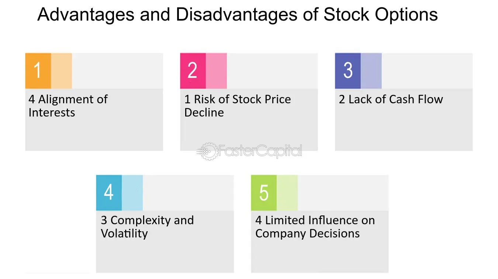

## Table of Contents

## What is a Low Exercise Price Option (LEPO)?

A Low Exercise Price Option (LEPO) is a type of financial product that is similar to a stock option. It allows the buyer to purchase a stock at a very low exercise price, which is usually just a small fraction of the stock's actual market value. This makes LEPOs attractive because they can be used to gain exposure to the stock's price movements without having to pay the full price of the stock upfront.

LEPOs are commonly used in Australia and are traded on the Australian Securities Exchange (ASX). They are designed to be more tax-efficient than traditional stock options. When you buy a LEPO, you are essentially betting on the future price of the stock. If the stock price goes up, the value of your LEPO will also increase, allowing you to sell it for a profit. However, if the stock price goes down, the value of your LEPO will decrease, and you could lose money.

## How does a LEPO differ from a traditional stock option?

A LEPO is different from a traditional stock option mainly because of its exercise price. A LEPO has a very low exercise price, often just a few cents, while a traditional stock option has an exercise price that is much closer to the current market price of the stock. This low exercise price means that when you buy a LEPO, you are mostly paying for the potential future value of the stock, not the stock itself.

Another big difference is how they are taxed. In Australia, where LEPOs are popular, they are treated more favorably for tax purposes than traditional stock options. With a LEPO, you might not have to pay as much tax on any profits you make, which can make them a more attractive investment. Both types of options let you bet on the future price of a stock, but the low cost and tax benefits of LEPOs make them a unique choice for investors looking to gain exposure to stock price movements without buying the stock outright.

## What are the key features of a LEPO?

A Low Exercise Price Option, or LEPO, is a type of financial product that lets you bet on the price of a stock without buying the stock itself. The key feature of a LEPO is its very low exercise price, which is usually just a few cents. This means when you buy a LEPO, you're mostly paying for the potential future value of the stock, not the stock itself. This can make LEPOs cheaper than buying the stock directly.

Another important feature of LEPOs is how they are taxed. In places like Australia, where LEPOs are common, they have tax advantages over traditional stock options. This means you might pay less tax on any profits you make from LEPOs. So, if you're looking for a way to invest in stocks with less upfront cost and possibly lower taxes, LEPOs could be a good choice.

## Who typically uses LEPOs and why?

People who typically use LEPOs are often investors looking for a cheaper way to bet on the price of a stock. Because LEPOs have a very low exercise price, you can get into the market without spending as much money as you would if you bought the stock directly. This makes LEPOs attractive to people who want to invest in stocks but don't have a lot of money to start with.

Another group that uses LEPOs are those looking to take advantage of tax benefits. In Australia, where LEPOs are popular, they are taxed more favorably than traditional stock options. This means investors can keep more of their profits. So, if you're an investor who wants to save on taxes while still getting exposure to stock price movements, LEPOs can be a smart choice.

## What are the advantages of using LEPOs for investors?

LEPOs offer investors a way to bet on the price of a stock without spending a lot of money upfront. Because LEPOs have a very low exercise price, they are much cheaper than buying the actual stock. This makes it easier for people who don't have a lot of money to start investing. If the stock price goes up, the value of the LEPO will also go up, and you can sell it for a profit.

Another big advantage of LEPOs is that they can save you money on taxes. In Australia, where LEPOs are popular, they are treated more favorably by the tax system than traditional stock options. This means that if you make a profit from a LEPO, you might not have to pay as much tax as you would with other types of investments. This tax benefit can make LEPOs a smart choice for investors looking to keep more of their earnings.

## What are the potential disadvantages or risks associated with LEPOs?

One big risk with LEPOs is that you could lose money. If the stock price goes down, the value of your LEPO will also go down. Since LEPOs are a way to bet on the price of a stock, they can be risky. You're not buying the stock itself, so if the stock price drops a lot, you might lose all the money you put into the LEPO.

Another thing to think about is that LEPOs can be hard to understand. They work differently from buying stocks directly, and they have their own rules and ways of being taxed. If you don't understand how LEPOs work, you might make a mistake that costs you money. It's important to do your homework and maybe even talk to a financial advisor before you start using LEPOs.

## How is the exercise price determined in a LEPO?

The exercise price in a LEPO is set very low, usually just a few cents. This is much lower than the actual price of the stock. When you buy a LEPO, you pay this small exercise price to have the right to buy the stock later. The low exercise price is what makes LEPOs different from regular stock options, where the exercise price is closer to the stock's market value.

The low exercise price is decided by the people who create the LEPO, usually a financial institution. They set it low to make the LEPO attractive to investors. This means you can get into the market without spending a lot of money upfront. But remember, the low exercise price also means you're mostly betting on the stock's future price, not buying the stock itself.

## Can you explain the tax implications of trading LEPOs?

When you trade LEPOs in Australia, you get some tax benefits that you don't get with regular stock options. The main thing is that LEPOs are treated as capital gains, not as income. This means you only pay tax on the profit you make when you sell the LEPO, not on the whole amount you get from exercising it. This can save you a lot of money because capital gains tax rates are often lower than income tax rates.

Another thing to know is that if you hold onto your LEPO for more than a year before selling it, you might get an even bigger tax break. In Australia, if you hold an asset for over 12 months, you only have to pay tax on half of your capital gain. So, if you make a profit from a LEPO and you've held it for over a year, you'll only pay tax on half of that profit. This makes LEPOs a smart choice for people looking to save on taxes while investing in the stock market.

## How do LEPOs fit into a broader investment strategy?

LEPOs can be a useful part of a broader investment strategy because they let you bet on the price of a stock without spending a lot of money upfront. If you think a stock's price will go up, you can buy a LEPO instead of the actual stock. This means you can get into the market with less money and still make a profit if the stock's price goes up. But remember, LEPOs are risky because if the stock's price goes down, you could lose all the money you put into the LEPO.

Another way LEPOs can fit into your investment plan is by helping you save on taxes. In Australia, LEPOs have special tax benefits. When you make a profit from a LEPO, you pay less tax compared to regular stock options. If you hold onto your LEPO for over a year, you only have to pay tax on half of your profit. This makes LEPOs a smart choice if you want to keep more of your earnings. Just make sure you understand how LEPOs work and the risks involved before adding them to your investment strategy.

## What are the regulatory considerations for trading LEPOs?

When trading LEPOs, you need to know the rules set by the Australian Securities Exchange (ASX), where LEPOs are mainly traded. The ASX has rules about how LEPOs can be bought and sold, and who can trade them. For example, only people who are considered "wholesale investors" can trade LEPOs. This means you have to meet certain financial requirements to be able to buy and sell LEPOs. The ASX also makes sure that everyone follows the rules and that trading is fair and transparent.

Another thing to think about is the tax rules for LEPOs. In Australia, the tax office has special rules for how LEPOs are taxed. LEPOs are treated as capital gains, not income, which can save you money on taxes. But you need to keep good records of your LEPO trades because you'll need them when you do your taxes. It's a good idea to talk to a tax advisor to make sure you're doing everything right and taking advantage of all the tax benefits you can.

## How do market conditions affect the value and performance of LEPOs?

Market conditions play a big role in how much a LEPO is worth and how well it does. If the stock price goes up, the value of your LEPO will also go up because you can sell it for more money. But if the stock price goes down, your LEPO will lose value, and you could lose money. Things like how the economy is doing, news about the company, and what other people think the stock will do in the future can all change the stock price and affect your LEPO.

Another thing to think about is how much people want to buy or sell LEPOs. If a lot of people want to buy LEPOs, the price might go up because there aren't enough LEPOs to go around. But if a lot of people want to sell their LEPOs, the price might go down because there are too many LEPOs for sale. So, it's important to keep an eye on what's happening in the market and understand how these things can change the value of your LEPOs.

## What advanced strategies can be employed with LEPOs for expert traders?

Expert traders can use LEPOs to make more complex bets on stock prices. One strategy is called "delta hedging," where you buy or sell LEPOs along with the actual stock to balance out the risk. If you think the stock price will go up, you might buy LEPOs and sell some of the stock to protect against a small drop in price. This way, you can still make money if the stock goes up a lot, but you won't lose as much if it goes down a little. It's like having your cake and eating it too, but it takes a lot of skill and watching the market closely.

Another strategy is to use LEPOs for "[arbitrage](/wiki/arbitrage)." This means you look for small differences in price between LEPOs and the stock they're based on. If you see a LEPO is cheaper than it should be compared to the stock, you might buy the LEPO and sell the stock at the same time. If everything goes right, you can make a small profit from the difference in price. This strategy needs you to be quick and good at finding these small price differences, but it can be a way to make money without taking a big risk.

## What are the challenges and risks associated with LEPOs?

The leveraged nature of Low Exercise Price Options (LEPOs) presents both opportunities and risks for investors. Their inherent leverage can magnify small price movements in the underlying assets, resulting in significant gains or losses. This characteristic requires traders to exercise caution, especially in volatile market conditions, where price swings can be unpredictable.

Margin requirements for LEPOs necessitate that traders maintain adequate collateral to support their positions. Such requirements are crucial as they mitigate the risks associated with leverage but also pose a potential downside: margin calls. In highly volatile markets, the value of the underlying asset can fluctuate rapidly, potentially triggering margin calls if the collateral falls below the required threshold. This risk underscores the importance of robust risk management practices when trading LEPOs.

Liquidity is another critical consideration for LEPOs. Unlike standard options, which typically enjoy widespread trading across various markets, LEPOs are less commonly traded, particularly outside Australian exchanges. The lower [liquidity](/wiki/liquidity-risk-premium) can lead to wider bid-ask spreads, making entry and [exit](/wiki/exit-strategy) from positions more costly and challenging. Traders in markets where LEPOs are less prevalent may find it difficult to execute large orders without impacting the market price adversely.

Furthermore, the pricing and margin mechanisms associated with LEPOs are complex and demand a thorough understanding. The unique structure of LEPOs, combining elements of both options and futures, requires traders to have a comprehensive grasp of how these instruments are valued and how margin accounts are managed. For instance, the computation of the intrinsic value of a LEPO closely parallels that of deep in-the-money options, with the formula for intrinsic value being:

$$
\text{Intrinsic Value} = (\text{Spot Price} - \text{Exercise Price}) \times \text{Number of Contracts}
$$

Given the exercise price is typically set at a nominal value (e.g., one cent), the intrinsic value closely mirrors the spot price of the underlying asset, amplifying the leverage effect.

Ultimately, the successful navigation of LEPO trades requires meticulous attention to market conditions, an understanding of liquidity constraints, and rigorous compliance with margin requirements. Traders must balance the potential for high returns with the associated risks, ensuring that risk management strategies are robust and adaptive to market dynamics.

## References & Further Reading

[1]: Black, F., & Scholes, M. (1973). ["The Pricing of Options and Corporate Liabilities."](https://www.cs.princeton.edu/courses/archive/fall09/cos323/papers/black_scholes73.pdf) Journal of Political Economy, 81(3), 637-654.

[2]: Pasquariello, P. (2014). ["Strategic Trading in Illiquid Markets."](https://scholar.google.com/citations?user=ByzWEGMAAAAJ&hl=en) Journal of Financial Economics, 114(1), 79-101.

[3]: Bos, T., & de Roon, F. (2005). ["LEPOs vs. Equity: Evidence From the Australian Market."](https://www.sciencedirect.com/science/article/pii/S0378426608002677) Review of Quantitative Finance and Accounting, 25(3), 257-278.

[4]: Chalamandaris, G., & Petrelli, A. (2009). ["The Use of Derivatives for Long-Term Interest-Rate Risk Management."](https://www.researchgate.net/publication/379667569_Risk_Management_Using_Derivatives_Review_of_Literature) The Quarterly Review of Economics and Finance, 49(3), 1-23.

[5]: Hull, J. C. (2018). ["Options, Futures, and Other Derivatives."](https://www.semanticscholar.org/paper/Options%2C-Futures%2C-and-Other-Derivatives-Hull/89bdee500c8623864fc9eb7a471546aa713acc44) 10th Edition, Pearson.