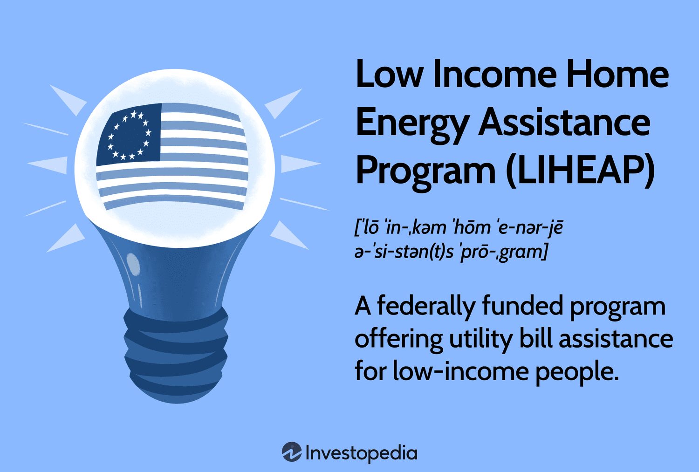

The Low Income Home Energy Assistance Program (LIHEAP) and algorithmic trading represent two significant yet seemingly disparate areas critical to modern society. LIHEAP is a vital program designed to support low-income households by mitigating the financial burden of energy costs. It plays an essential role in ensuring that vulnerable populations can maintain access to necessary heating and cooling, thus preventing energy poverty and its associated health and safety risks.

On the other hand, algorithmic trading stands as a testament to the technological advancement within financial markets. It utilizes complex algorithms and high-speed computing to execute trades with precision and efficiency. This innovative approach has transformed the landscape of trading by increasing market liquidity, optimizing trade execution, and substantially reducing transaction costs. However, it also brings challenges, such as potential contributions to market volatility and the marginalization of smaller traders.



The goal of this article is to explore how these two domains may intersect, recognizing the potential for cross-pollination of ideas and technologies. By examining the synergy between financial assistance programs like LIHEAP and the cutting-edge technology of algorithmic trading, we aim to identify innovative solutions that could enhance the effectiveness of assistance programs through data-driven approaches. This intersection has the potential to pave the way for improved resource allocation, predictive analytics, and operational efficiencies, thereby better serving low-income households and driving advancements in financial technologies.

## Table of Contents

## Understanding LIHEAP: Energy Assistance for Low-Income Households

LIHEAP, the Low Income Home Energy Assistance Program, is a federal initiative that provides financial support to low-income households to help them manage their energy costs. This program is essential for assisting individuals and families who are struggling to pay their energy bills, often due to limited income and high energy costs. LIHEAP aims to reduce the risk of health and safety problems that may arise from energy crises, such as broken heating systems or unpaid electricity bills leading to service disconnections.

The administration of LIHEAP is a collaborative effort between federal and state governments. At the federal level, the program is funded and overseen by the U.S. Department of Health and Human Services (HHS). However, the distribution and management of these funds are primarily handled by states and, in some instances, by local governments or tribal organizations. This decentralized administration allows for flexibility in the implementation of the program, enabling it to address the specific energy needs and circumstances within different communities.

Several types of support are available through LIHEAP, including help with paying heating or cooling bills, emergency services in cases of energy crises, and funding for weatherization projects aimed at improving energy efficiency in homes. The distribution of these services varies by state, with each state having the autonomy to prioritize and tailor assistance based on the most pressing needs of its residents.

To qualify for LIHEAP assistance, applicants must meet certain eligibility criteria, primarily based on their income. Generally, households with income levels at or below 150% of the federal poverty level or 60% of the state median income are eligible for assistance, although specific percentages can vary by state. Additionally, priority is often given to households with members who are elderly, disabled, or have young children, as these groups are particularly vulnerable to the adverse effects of energy insecurity. The application process typically involves submitting income verification, household composition details, and energy bill records.

The impact of LIHEAP on preventing energy crises for vulnerable populations cannot be overstated. By providing crucial financial support, LIHEAP helps to ensure that low-income families maintain access to necessary energy services, thereby reducing the potential for adverse health outcomes related to inadequate heating or cooling. Access to LIHEAP funding can prevent the need for households to choose between paying their energy bills and affording other essentials, such as food or healthcare. This program plays a vital role in enhancing the overall well-being and stability of economically disadvantaged communities across the United States.

## Algorithmic Trading: A Technological Leap in Financial Markets

Algorithmic trading, colloquially known as algo trading, refers to the use of computer algorithms to manage the trading of financial securities at optimal speed and prices. It has revolutionized how transactions are conducted in modern financial markets, fundamentally altering the landscape of trading through automation and efficiency. 

The primary feature of [algorithmic trading](/wiki/algorithmic-trading) is its ability to execute orders at a scale and speed that would be impossible for human traders. Algorithms are typically programmed to follow a set of rules or conditions that determine when to buy or sell assets. These conditions can be based on various quantitative metrics such as price, timing, [volume](/wiki/volume-trading-strategy), or any other mathematical model. By rapidly responding to changes in the market, algorithmic trading systems can take advantage of fleeting profit opportunities that might not be accessible to manual trading.

One of the notable advantages of algorithmic trading is increased trading efficiency. Automation allows for the execution of high volumes of trades at greatly reduced costs, as it eliminates the need for human intervention and minimizes human error. Furthermore, this level of efficiency enables traders to achieve better price execution. For instance, algorithms can be designed to break down large orders into small pieces and execute them at various times, which helps in obtaining more favorable prices without causing market disruptions.

Reduced transaction costs are another potent benefit of algorithmic trading. Traditional trading involves higher fees due to the involvement of brokers and manual processing. By automating the trading process, these additional costs are significantly cut down, thus improving the profitability margins for traders and institutions.

Despite its advantages, algorithmic trading is not without its challenges and controversies. One of the primary issues is its impact on market [volatility](/wiki/volatility-trading-strategies). High-frequency trading ([HFT](/wiki/high-frequency-trading-strategies)), a subset of algorithmic trading characterized by its rapid pace and high turnover, has been criticized for exacerbating market volatility and disproportionally affecting market stability. The rapid execution of trades can lead to "flash crashes," where prices of securities plummet and recover within minutes, destabilizing the market.

Moreover, the opaque nature of some algorithmic strategies has raised concerns about fairness and market manipulation. The lack of transparency can make it difficult for regulators to detect illicit activities or unfair practices, posing a risk to market integrity.

In conclusion, while algorithmic trading brings significant improvements to trading efficiency and cost savings, its implementation is met with challenges related to market volatility and regulatory oversight. As financial markets continue to integrate advanced technologies, balancing innovation with stability will be crucial for the sustainable development of this trading mechanism.

## Common Challenges for Low-Income Households and Financial Markets

Low-income households face a series of persistent challenges in managing their energy bills, often resulting from a combination of external socio-economic factors and inherent financial constraints. Key among these challenges is the fluctuation of energy prices, which can disproportionately affect households with limited income. These households tend to allocate a larger proportion of their income to cover energy costs, making them highly sensitive to any increases in energy prices. This has a direct impact on their ability to meet other essential needs, creating a cycle of financial instability.

In addition, these households frequently encounter barriers related to energy inefficiency. Many reside in older housing with outdated appliances and poor insulation, leading to higher energy consumption and, consequently, higher bills. The lack of financial resources often means they cannot afford the necessary upgrades to improve energy efficiency, further exacerbating their financial burden.

In financial markets, average consumers, including those from low-income backgrounds, face limited access and opportunities for investment. The barriers include high transaction fees, complex investment products, and a general lack of financial literacy. These factors contribute to the perceived exclusivity of financial markets and discourage participation from average consumers, perpetuating economic disparities.

Technological advancements, such as algorithmic trading, present both opportunities and challenges in this context. Algorithmic trading, which involves the use of computer algorithms to execute trades at speeds and efficiencies beyond human capability, has introduced a new dynamic to financial markets. While these advancements have lowered transaction costs and increased market efficiency, they have also contributed to increased market volatility, potentially affecting those with limited investment resources.

Furthermore, algorithmic trading is often dominated by large financial institutions capable of investing in the necessary infrastructure, creating a competitive advantage. This can lead to a concentration of market power and wealth, further widening the gap between those with access to these technologies and those without.

However, there is potential for these technologies to be harnessed in ways that could mitigate some of these disparities. For instance, advancements in data analytics and [machine learning](/wiki/machine-learning) could be utilized to develop more inclusive financial products tailored to the needs of low-income individuals. This could facilitate better market access and provide more opportunities for investment and growth for underrepresented groups.

In conclusion, while low-income households face significant hurdles in managing energy costs and accessing financial markets, emerging technologies hold the promise of addressing these challenges. By fostering innovations that prioritize equitable access and inclusivity, there is a potential to bridge existing economic disparities and improve financial stability for low-income individuals.

## Innovative Approaches: Utilizing Data for Enhancing LIHEAP Efficiency

The integration of algorithm-driven data analysis presents a transformative opportunity to enhance the efficiency of the Low Income Home Energy Assistance Program (LIHEAP). Traditionally, LIHEAP has relied on historical data and straightforward criteria to allocate funds, a process that, while effective, often misses opportunities for optimization and proactive resource distribution.

One way algorithmic data analysis can improve LIHEAP’s efficiency is through resource allocation optimization. By analyzing large datasets, algorithms can identify patterns and trends in energy consumption across various demographics and geographies. For instance, clustering algorithms can be used to segment data based on parameters such as average household energy usage, external temperature variations, and socio-economic indicators. This segmentation can help in prioritizing funds distribution to regions and communities in greater need, thus enhancing the program’s overall impact.

Furthermore, incorporating machine learning models can significantly optimize fund distribution processes. Predictive models can assess historical energy consumption data alongside weather forecasts to estimate future energy needs accurately. This could enable stakeholders to allocate resources more strategically, ensuring that aid reaches those in greatest need promptly. For instance, a regression model can be deployed to forecast energy consumption based on variables like temperature, household size, and previous usage patterns. This model can continuously update and refine its predictions with new data inputs, improving accuracy over time.

An example implementation in Python might involve utilizing a linear regression model from the `scikit-learn` library:

```python
from sklearn.model_selection import train_test_split
from sklearn.linear_model import LinearRegression
import pandas as pd

# Sample dataset with columns: 'temperature', 'household_size', 'previous_usage'
data = pd.read_csv('energy_data.csv')

# Features and target variable
X = data[['temperature', 'household_size', 'previous_usage']]
y = data['future_energy_consumption']

# Splitting the data into training and testing sets
X_train, X_test, y_train, y_test = train_test_split(X, y, test_size=0.2, random_state=42)

# Training the model
model = LinearRegression()
model.fit(X_train, y_train)

# Making predictions
predictions = model.predict(X_test)
```

Moreover, machine learning can be leveraged to develop models that predict the likelihood of energy crises for certain households based on socio-economic data and energy usage patterns. These predictive insights can enable preemptive measures, such as increasing assistance or implementing energy-saving interventions in at-risk communities.

Overall, the adoption of advanced data analysis and machine learning approaches could pave the way for a more responsive and equitable LIHEAP. By better predicting and responding to the energy needs of low-income households, these technologies can ensure that assistance is both timely and effective, ultimately reducing the risk of energy crises.

## The Intersection of Technology and Assistance Programs

Technology plays a pivotal role in enhancing assistance programs like the Low Income Home Energy Assistance Program (LIHEAP), reducing administrative burdens, and improving service delivery for low-income households. The application and approval process of such programs can be cumbersome, involving extensive paperwork and bureaucratic delays that often deter eligible applicants. Fintech innovations offer solutions to streamline these processes, making LIHEAP more accessible and efficient.

Digital platforms can simplify the LIHEAP application process by allowing applicants to submit necessary documents electronically, reducing the need for in-person visits. Automated verification systems can cross-check applicants’ eligibility by accessing relevant databases securely and efficiently, thus expediting approval processes. Such systems can also dynamically update the status of an application, offering transparency to applicants.

Additionally, fintech solutions have the potential to enhance fund distribution. By integrating digital wallets or direct deposit options, applicants can receive financial assistance more rapidly. This reduces the waiting period that can exacerbate energy crises for households just getting by. 

Algorithmic models, often powered by machine learning, offer predictive insights that can anticipate and mitigate energy crises. By analyzing patterns in energy consumption, these models can identify households at risk of energy shortages before they arise. Data variables such as local weather forecasts, historical usage patterns, and pricing trends can be synthesized to predict periods of high energy demand or likely shortages.

For instance, a predictive algorithm can be developed using Python’s machine learning libraries such as scikit-learn. This model can predict energy consumption levels based on past data, allowing LIHEAP administrators to optimize resource allocation. Here's an outline of a simple predictive model:

```python
import numpy as np
from sklearn.model_selection import train_test_split
from sklearn.linear_model import LinearRegression

# Sample dataset: historical weather and energy consumption data
# X: features (e.g., temperature, household size)
# y: target (e.g., energy consumption in kWh)

X, y = load_energy_data()  # hypothetical function to load dataset

# Split dataset into training and testing sets
X_train, X_test, y_train, y_test = train_test_split(X, y, test_size=0.2, random_state=42)

# Initialize and train the model
model = LinearRegression()
model.fit(X_train, y_train)

# Make predictions
predictions = model.predict(X_test)

# Evaluate model performance
performance = model.score(X_test, y_test)
print(f'Model performance: {performance}')
```

Incorporating such predictive models enables proactive measures—targeting assistance to those predicted to face energy shortages or financial difficulty. This not only maximizes the impact of available resources but also cushions vulnerable populations against volatile energy costs.

The convergence of technology and assistance programs signifies a progressive step towards reducing energy poverty. By harnessing digital innovations and predictive analytics, we can significantly enhance the effectiveness and reach of programs like LIHEAP, ultimately fostering equitable energy access for low-income households.

## Conclusion

In reviewing the dual themes of LIHEAP and algorithmic trading, it becomes evident how these represent distinct yet interconnected facets of modern assistance and finance. LIHEAP plays a crucial role in supporting low-income households by alleviating energy costs, thereby preventing energy crises and ensuring basic living standards. This program's emphasis on direct financial support exemplifies the traditional forms of assistance necessary for vulnerable populations.

On the other hand, algorithmic trading showcases the technological evolution within financial markets. By utilizing sophisticated algorithms, it optimizes trading processes, thus increasing market efficiency and reducing transaction costs. While primarily a financial tool, the principles of algorithmic trading highlight the transformative potential technologies hold.

Integrating advanced technologies into programs like LIHEAP can offer synergistic benefits. Data analytics and algorithm-driven decision-making can substantially optimize resource allocation and streamline processes, ensuring timely and equitable distribution of aid. Machine learning models, for example, could predict energy consumption patterns and preemptively identify households at risk of financial distress, allowing for proactive assistance.

Encouraging further exploration into innovative solutions is essential to enhance financial support systems for low-income households. By harnessing the capabilities of technology, it's possible to evolve assistance programs into more responsive and efficient systems. This evolution not only promises improved delivery of aid but also fosters a more inclusive economic environment where the disparities faced by low-income communities can be better addressed. The continuous intersection of technological advancements with traditional assistance paradigms holds the potential to transform support mechanisms fundamentally, improving quality of life and financial stability for those in need.

## References & Further Reading

[1]: Administration for Children and Families. ["Low Income Home Energy Assistance Program (LIHEAP)."](https://www.acf.hhs.gov/ocs/programs/liheap) U.S. Department of Health & Human Services.

[2]: Aldridge, I. (2013). ["High-Frequency Trading: A Practical Guide to Algorithmic Strategies and Trading Systems."](https://www.ahmetbeyefendi.com/wp-content/uploads/2020/07/High-Frequency-Trading-Irene-Aldridge.pdf) John Wiley & Sons.

[3]: Narayanan, M., & Shroff, P. K. (2018). ["Predictive Analytics in Energy Efficiency and Demand Response in Commercial Buildings: Harnessing Big Data."](https://en.wikipedia.org/wiki/IIFA_Award_for_Best_Supporting_Actor) IEEE.

[4]: Briggs, R. A., & Vasel, J. (2010). ["Addressing Energy Poverty and Vulnerability: The Role of LIHEAP."](https://onlinelibrary.wiley.com/doi/full/10.1002/sd.2965) National Academies of Sciences, Engineering, and Medicine.

[5]: Treleaven, P., Galas, M., & Lalchand, V. (2013). ["Algorithmic Trading and Information Systems."](https://dl.acm.org/doi/10.1145/2500117) Communications of the ACM.