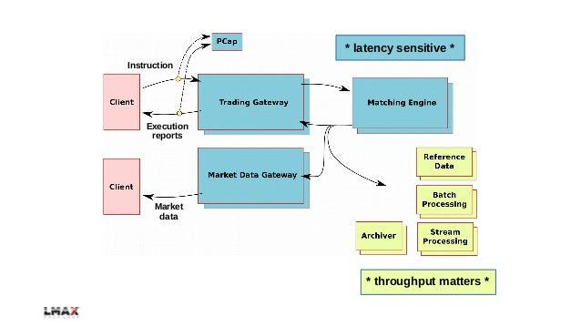

In the fast-paced world of financial trading, achieving low latency can be a decisive factor for success. Low latency in trading, particularly in algorithmic executions, requires carefully crafted strategies that span both hardware and software design. The ability to minimize the time delay between market movements and trade responses is crucial, as even microsecond differences can impact profitability. As such, low latency trading architectures have become pivotal, involving a blend of advanced technologies and innovative approaches to hardware and software integration.

This article explores the critical components and considerations involved in constructing low latency trading systems. An analysis of industry trends and performance metrics will provide a comprehensive understanding of current standards and practices. Additionally, the role of cloud computing in modern low latency solutions is examined, highlighting its potential to transform traditional trading infrastructures through enhanced flexibility and scalability. Cloud computing has emerged as a viable option for traders aiming to strike a balance between cost-efficiency and performance.

Understanding the intricacies and benefits of implementing cutting-edge trading infrastructures is essential for participants in algorithmic trading. With increasing demands for faster execution times and reliance on automated systems, adopting effective low latency strategies can define success. Through this exploration, readers will gain a deep understanding of the strategic considerations necessary for managing latency in high-frequency trading environments.

## Table of Contents

## Understanding Low Latency in Trading

Low latency in trading refers to the minimal delay experienced in the processing and execution of trade orders, a critical factor often measured in microseconds. This brief timespan can significantly influence trading outcomes, as latency is pivotal in determining the difference between capitalizing on a profitable trade and missing an opportunity. In algorithmic and high-frequency trading, latency dictates the speed at which trading systems respond to market shifts, directly impacting potential profitability.

To comprehend latency in trading environments, it is essential to evaluate various latency metrics. 'Round-trip latency,' for instance, represents the total time taken for a trade order to travel from the trader's system to the exchange and back. Another crucial metric is 'wire latency,' which refers to the delay introduced by the medium through which data travels. These measurements are invaluable for evaluating the system's efficiency and locating potential bottlenecks.

Traders actively target sub-millisecond latencies to maintain a competitive edge. Achieving such low latencies involves sophisticated hardware and software optimizations that reduce the time taken at each stage of order processing. For instance, network performance is optimized by using the fastest available routes and reducing the number of intermediary devices handling data packets.

The determination of acceptable latency levels is not a one-size-fits-all approach and heavily depends on the trading strategies and platforms employed. Strategies such as [arbitrage](/wiki/arbitrage), where traders capitalize on minute price discrepancies between markets, necessitate ultra-low latencies to execute trades before market conditions change. Conversely, longer-term trading strategies may tolerate higher latencies, focusing more on data analytics than on instantaneous execution.

In conclusion, understanding and managing low latency is integral to the design and operation of trading architectures. By utilizing precise latency metrics and aligning them with suitable trading strategies, traders can maximize the effectiveness of their trading systems and harness opportunities provided by market movements.

## Key Components of Low Latency Trading Architectures

Trading architectures are complex systems designed to facilitate quick and efficient trade executions. Key components integral to low latency trading architectures include messaging buses, market data feeds, and [algorithmic trading](/wiki/algorithmic-trading) systems. These elements collectively function to expedite the trading process, optimize performance, and minimize delays.

Messaging buses are essential for handling communication between different components of the trading system. They serve as conduits, ensuring that data and commands are transmitted swiftly across the network. High-performance messaging protocols, such as FIX (Financial Information eXchange), are typically used to handle large volumes of transaction data with minimal delay.

Market data feeds provide traders with real-time data essential for informed decision-making. These feeds deliver information such as stock prices, trade volumes, and market depth. The efficiency of market data feeds is closely linked to their ability to process and deliver data with low latency. Deploying technologies like multicast, which allows a single data stream to be sent to multiple recipients simultaneously, can significantly enhance feed performance.

Algorithmic trading systems are at the heart of low latency architectures. These systems use pre-programmed algorithms to execute trades automatically based on market conditions, reducing the need for manual intervention and thus minimizing latency. High-frequency trading algorithms, which rely on speed for competitive advantage, require precise tuning and optimization to execute trades within microseconds.

Utilizing high-speed interconnects, such as fiber-optic cables and InfiniBand, is critical for reducing communication time between the various elements of the trading infrastructure. Application acceleration techniques, including kernel bypass technologies like DPDK (Data Plane Development Kit), further enhance system responsiveness by allowing direct communication between network interfaces and user space applications, thus bypassing the kernel.

Efficient order routing mechanisms are imperative to ensure that trade orders reach their destinations as rapidly as possible. Techniques such as smart order routing (SOR) use algorithms to determine the best execution paths, selecting among various exchanges and [liquidity](/wiki/liquidity-risk-premium) pools based on parameters like price, speed, and reliability.

Optimizing server operations involves leveraging high-performance computing (HPC) resources and implementing techniques such as load balancing and parallel processing to handle extensive data and computations. Furthermore, reducing network latency through means such as co-location, where trading firms place their servers in close proximity to exchange servers, can significantly decrease the time it takes for an order to reach the market.

Network communications must be finely tuned to sustain low latency across all trade stages. This includes optimizing network configurations, deploying low-latency networking hardware, and utilizing techniques like TCP optimization to reduce transmission delays.

A strategic approach to low latency trading infrastructures involves combining multiple technologies to achieve optimal performance levels. This could include integrating [machine learning](/wiki/machine-learning) algorithms to predict market movements more accurately, thus enhancing the effectiveness of trading strategies. By adopting a multi-faceted technological framework, trading firms can ensure that their systems remain competitive in the fast-evolving financial markets.

## Achieving Low Latency in Cloud-based Trading Systems

Cloud computing provides a flexible and scalable framework for the deployment of trading systems, which is essential in achieving low latency. Utilizing dedicated virtual machines (VMs) within cloud environments can significantly improve the isolation of processes, resulting in consistent performance. This setup reduces contention for resources between trading applications, ultimately minimizing latency in trade execution.

One effective strategy to enhance network performance and reduce latency in cloud-based systems is the implementation of placement strategies. For instance, employing cluster placement groups facilitates the optimum placement of VMs in close proximity to one another within the cloud infrastructure. This arrangement minimizes the physical distance and hops between VMs, leading to reduced network latency. Network performance is further enhanced by leveraging advanced networking features offered by cloud providers such as enhanced networking adapters available on platforms like Amazon Web Services (AWS).

Multiregional and multi-zone deployments are another key consideration for attaining both high availability and low latency. By distributing trading systems across multiple geographic locations, cloud-based solutions ensure resilience and redundancy. Each region and zone can act as a failover option, safeguarding against local outages or disruptions. This geographical [dispersion](/wiki/dispersion-trading) also allows for improved latency, as trading operations can be directed to the closest available region or zone, reducing the distance that data must travel.

While the cloud offers these advantages, it is imperative to balance the trade-off between cost and performance. The cost-efficiency of cloud-based trading systems is directly related to the resource allocation and usage models adopted by trading entities. For example, on-demand instances may offer the flexibility needed for dynamic trading environments but at a premium price. Alternatively, reserve or spot instances provide cost savings with the possibility of certain trade-offs in availability or immediate scalability.

Ultimately, the configuration of cloud resources should align with the specific latency requirements and strategic goals of the trading operations. Cloud-based trading systems must continuously assess and optimize their deployments to ensure that both cost efficiency and low latency are achieved harmoniously.

## Performance and Resilience Considerations

Performance considerations in low latency trading architectures are pivotal, focusing primarily on minimizing processing times and maximizing throughput. Achieving these objectives involves a blend of strategic hardware and software optimizations.

Redundancy plays a crucial role in ensuring the resilience of trading systems. By establishing multiple pathways for data and operations, systems can maintain continuous trading even if one element fails. This redundancy can be implemented at various levels, such as network paths, server components, or even entire data centers. For instance, using dual power supplies and mirrored storage can protect against hardware failures.

Systematic latency monitoring and real-time adjustments are indispensable for sustaining optimal system performance. Monitoring tools can track latency metrics in real-time and trigger automated responses to anomalies. These tools often utilize machine learning algorithms to predict potential bottlenecks and preemptively adjust system configurations. For example, adaptive load balancing can redistribute network traffic in response to real-time latency data, preventing congestion and delays.

Tradeoff decisions between latency and throughput are often dictated by specific trading strategies. High-frequency trading ([HFT](/wiki/high-frequency-trading-strategies)) strategies generally prioritize latency over throughput, as the speed of execution can significantly impact profitability. Conversely, strategies that involve large volumes of data processing, such as financial modeling or [backtesting](/wiki/backtesting), may favor throughput. The decision-making process involves analyzing the acceptable latency level for a given strategy and adjusting system configurations accordingly.

Implementing a resilient architecture requires a comprehensive approach, considering both software and hardware elements. Hardware optimizations might include deploying specialized network cards that reduce data transfer times or utilizing high-performance CPUs with faster processing capabilities. Software resilience could involve developing robust error-handling routines and implementing failover mechanisms that automatically redirect processes when failures occur.

Ultimately, a balanced approach to performance and resilience in trading systems combines strategic investments in technology with continuous monitoring and adaptations. This approach not only enhances the capability to respond swiftly to market changes but also ensures ongoing operational integrity and competitiveness in a rapidly evolving financial landscape.

## Cost Implications and Benefits of Low Latency Architectures

Investing in low latency trading architectures involves considerable financial commitments but offers a crucial competitive advantage in high-frequency trading environments. The cost implication stems from acquiring specialized hardware, software, and skilled personnel capable of designing and maintaining these sophisticated systems. Organizations must perform a comprehensive cost-benefit analysis when choosing between cloud-based and on-premises solutions.

One critical consideration is the choice of infrastructure. Cloud-based solutions provide the advantage of elastic scalability, allowing firms to dynamically adjust their resources to align with fluctuating demands. This adaptability is particularly beneficial for firms operating in dynamic trading environments subject to varying levels of market activity. Additionally, optimally configured cloud infrastructure can significantly reduce resource utilization costs by enabling efficient allocation based on real-time needs.

Cloud solutions also alleviate the need for substantial capital expenditures associated with maintaining on-premises systems, such as physical servers and networking hardware. This capital expenditure reduction can liberate financial resources that can be redirected towards strategic investments in trading algorithm development and other growth initiatives. Moreover, the potential for operational expenditures to be reduced in cloud models presents an attractive financial outlook for trading firms aiming to maintain lean operating expenses.

The scalability inherent in cloud platforms aligns well with the evolving business needs of trading organizations. As firms expand or adapt to new market opportunities, cloud systems can seamlessly scale to accommodate increased trading volumes or the introduction of new trading strategies. This scalability ensures that firms can maintain optimal system performance without encountering the latency bottlenecks typical in static on-premises architectures.

Adopting low latency solutions ultimately results in enhanced trading performance. Reduced latency can lead to quicker order executions, minimizing the slippage that can occur when orders are processed more slowly than anticipated. This improved performance can translate to increased profitability and higher client satisfaction, as trades are executed closer to desired prices.

In conclusion, while the cost of implementing low latency architectures can be substantial, the resulting benefits—ranging from improved trading performance to increased customer satisfaction—underscore the value of these investments in the competitive trading landscape. A strategic approach in selecting and optimizing infrastructure solutions, whether cloud-based or on-premises, is essential for maximizing the return on investment in low latency trading architectures.

## Future Trends in Low Latency Trading

The demand for faster execution times in trading continues to push technological advancements. One of the prominent trends influencing low latency trading is the adoption of emerging technologies like [artificial intelligence](/wiki/ai-artificial-intelligence) (AI) and machine learning (ML). These technologies are increasingly being utilized to enhance predictive trading analytics, enabling traders to make more informed decisions at unprecedented speeds. AI and ML models can process vast amounts of data to uncover patterns and trends that were previously difficult to detect, thus providing a competitive edge through improved predictive accuracy and decision-making processes.

Another significant trend is the increased adoption of cloud solutions. The flexible scaling and cost benefits offered by cloud computing make it an attractive option for trading firms striving to achieve low latency. By leveraging cloud infrastructure, firms can deploy trading systems with agility and scale resources as needed to respond to market demands. Cloud environments offer the potential to reduce physical limitations and geographic constraints, thereby enhancing the speed at which trading operations can be conducted.

Regulatory changes also play a crucial role in shaping future trends in low latency trading. As financial markets evolve, so do the regulations that govern them. Compliance with emerging regulatory standards necessitates adaptations in trading strategies and infrastructure. These changes may impact the design and implementation of low latency systems, as firms must ensure that their operations remain within legal frameworks while optimizing for speed and efficiency.

Additionally, the integration of multi-asset trading capabilities is poised to further leverage low latency infrastructures. Traders are increasingly seeking platforms that allow them to engage with multiple asset classes seamlessly. By providing access to a broader range of markets and products, multi-asset trading platforms can capitalize on low latency architectures to execute cross-asset strategies effectively. This trend underscores the importance of robust and adaptable low latency solutions that can accommodate diverse trading needs and facilitate rapid execution across various asset classes.

These future trends highlight the necessity for continuous innovation and adaptation in the pursuit of low latency trading. By embracing technological advancements and navigating regulatory landscapes effectively, trading firms can maintain and enhance their competitive position.

## Conclusion

Low latency trading architectures are at the forefront of the competitive trading landscape, distinguishing successful firms in the fast-paced world of financial markets. The ability to process and execute trades with minimal delay often determines the difference between profit and loss. A robust trading system must effectively balance performance, cost, and scalability, ensuring that latency demands are met while optimizing resource utilization. Investments in cutting-edge technology and infrastructure are imperative, yielding significant long-term returns by enhancing speed and efficiency in trade executions.

As market conditions evolve and competition intensifies, continuous innovation is crucial to maintaining a competitive edge. Adaptations in algorithmic strategies and technology implementations must be continuously pursued to keep pace with rapid advancements in trading technologies and infrastructure. Understanding and incorporating effective low latency strategies into trading systems not only enhances operational capabilities but also defines success in algorithmic trading. These strategies leverage high-speed connections, efficient data processing, and strategic use of cloud services to ensure fast and accurate trade execution, ultimately leading to improved market opportunities and client satisfaction.

## References & Further Reading

[1]: Aldridge, I. (2013). ["High-Frequency Trading: A Practical Guide to Algorithmic Strategies and Trading Systems"](https://www.wiley.com/en-us/High+Frequency+Trading%3A+A+Practical+Guide+to+Algorithmic+Strategies+and+Trading+Systems%2C+2nd+Edition-p-9781118343500). Wiley.

[2]: "Building a Low Latency High Frequency Trading System" by Peter Lawrey. (2014). Available at [InfoQ](https://www.infoq.com/articles/low-latency-hft-architecture/).

[3]: Stevens, R. (2018). ["Working with FIX: Using the Financial Information Exchange Protocol to Customize Your Electronic Trading Solutions"](https://psycnet.apa.org/record/1995-43161-001). Wiley.

[4]: Duffy, D. J. (2013). ["Introduction to High-Frequency Finance"](https://www.amazon.com/Introduction-High-Frequency-Finance-Ramazan-Gen%C3%A7ay/dp/0122796713). Academic Press.

[5]: "The impact of latency on algorithmic trading profitability" by Uwe Wystup, et al., Journal of Trading, Vol. 10. (2015). Accessible at [ResearchGate](https://www.researchgate.net/publication/276028839_The_impact_of_latency_on_algorithmic_trading_profitability).

[6]: McPartland, John W., "Clearing and Settlement in the Twenty-first Century: Learning from Financial Crises Past and Present" (2017). Available at [The Federal Reserve Bank of Chicago](https://en.wikipedia.org/wiki/Settlement_(finance)).

[7]: "Algorithmic and High-Frequency Trading" by Álvaro Cartea, Sebastian Jaimungal, and José Penalva. Available at [Oxford University Press](https://assets.cambridge.org/97811070/91146/frontmatter/9781107091146_frontmatter.pdf).