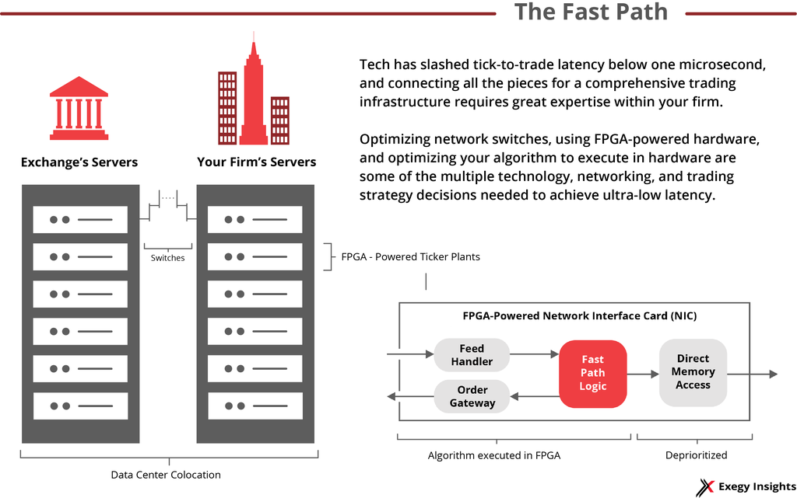

## Table of Contents

## What is low latency trading?

Low latency trading is a type of trading where people buy and sell things very quickly, often using computers. The goal is to make trades happen faster than other traders, which can give them an advantage. This is important in markets where prices change quickly, like the stock market or currency markets.

To achieve low latency, traders use special technology. This includes fast computers, direct connections to trading places, and software that can make decisions in milliseconds. By reducing the time it takes to make a trade, they can react to market changes before others do, which can lead to making more money.

## Why is low latency important in trading?

Low latency is important in trading because it helps traders make money faster. In trading, prices can change very quickly. If a trader can buy or sell something just a little bit faster than others, they can get a better price. This small difference can add up to a lot of money over time. So, having a system that can trade with low latency means a trader can react to these changes before others do.

This is especially important in markets like the stock market or currency markets where things move fast. If a trader's computer can send a trade order in milliseconds instead of seconds, they can take advantage of small price movements. This speed can be the difference between making a profit or losing money. That's why traders invest a lot in technology to make their trading as fast as possible.

## What are the basic components of a low latency trading system?

A low latency trading system has a few key parts that help it work fast. The first part is fast computers. These computers need to be able to process information quickly so they can make trading decisions in just a few milliseconds. The second part is a direct connection to the trading place, like a stock exchange. This means the system can send and receive information without any delays that might happen if it had to go through the regular internet.

Another important part is the software. This software is designed to make trading decisions very quickly. It looks at market data and decides when to buy or sell. The software needs to be very efficient so it doesn't slow down the system. Finally, there are data feeds that give the system up-to-date information about prices and market conditions. All these parts work together to make sure the trading happens as fast as possible.

## How does network latency affect trading performance?

Network latency is how long it takes for data to travel from one place to another. In trading, this means the time it takes for a trade order to go from a trader's computer to the stock exchange and back. If the network latency is high, it can slow down the whole trading process. This delay can cause traders to miss out on good prices because someone else with a faster connection might get there first. So, having low network latency is really important for traders who want to make quick trades and take advantage of small changes in the market.

To keep network latency low, traders use special connections called co-location services. This means they put their computers right next to the stock exchange's computers. By being so close, the data doesn't have to travel far, which cuts down on the time it takes to send and receive information. This can make a big difference in trading, where even a few milliseconds can matter. So, managing network latency is a key part of making sure a trading system works as fast as possible.

## What are the common technologies used to reduce latency in trading?

To reduce latency in trading, traders use special computers called high-frequency trading ([HFT](/wiki/high-frequency-trading-strategies)) servers. These servers are very fast and can process information in just a few milliseconds. They are often placed right next to the stock exchange in a practice called co-location. This means the data doesn't have to travel far, which cuts down on the time it takes to send and receive trading information. Traders also use special network connections called fiber optic cables, which can send data very quickly over long distances.

Another technology used is called FPGA, which stands for Field-Programmable Gate Array. FPGAs are chips that can be programmed to do specific tasks very quickly. They are often used in trading systems to handle the fast processing of market data and to make quick trading decisions. Software is also important. Traders use algorithms that are designed to make decisions in the shortest possible time. These algorithms look at market data and decide when to buy or sell, all while trying to keep the latency as low as possible. By using all these technologies together, traders can make their trading systems much faster.

## How can co-location services improve trading latency?

Co-location services help make trading faster by letting traders put their computers right next to the stock exchange. When the computers are close to each other, it takes less time for the trading information to travel back and forth. This is important because even a tiny delay can mean missing out on a good price. By being right next to the exchange, traders can send their buy or sell orders much quicker than if their computers were far away.

This closeness cuts down on what's called network latency, which is the time it takes for data to travel. When traders use co-location, they can react to changes in the market almost instantly. This can give them an edge over other traders who might have slower connections. So, co-location is a big help in making sure trading happens as fast as possible.

## What role does hardware acceleration play in low latency trading?

Hardware acceleration is really important for low latency trading because it helps make the trading system faster. It uses special chips like FPGAs (Field-Programmable Gate Arrays) that can do specific tasks much quicker than regular computer parts. These chips are programmed to handle things like looking at market data and making quick trading decisions. By using hardware acceleration, traders can cut down the time it takes to process information, which is key in a world where every millisecond counts.

This speed-up from hardware acceleration means traders can react to changes in the market faster than others. For example, if the price of a stock changes, a system with hardware acceleration can notice this change and make a trade decision almost instantly. This can give traders an edge in the market, helping them buy or sell at better prices before others can. So, hardware acceleration is a big part of making sure a trading system is as fast as it can be.

## How do FPGA and ASICs contribute to reducing latency in trading systems?

FPGAs and ASICs are special kinds of computer chips that help make trading systems faster. FPGAs, or Field-Programmable Gate Arrays, can be programmed to do specific jobs very quickly. In trading, they are used to look at market data and make quick decisions about buying or selling. This is important because it cuts down the time it takes to process information, which means traders can react to changes in the market faster. By using FPGAs, traders can get a head start on others and make trades at better prices.

ASICs, or Application-Specific Integrated Circuits, are another type of chip that is made for a specific task. Unlike FPGAs, ASICs are not programmable after they are made, but they can do their job even faster. In trading systems, ASICs are used to handle things like calculating prices or sending trade orders. Because they are made just for these tasks, they can do them very quickly, which helps reduce the time it takes to make a trade. Both FPGAs and ASICs play a big role in making sure trading happens as fast as possible.

## What are the challenges in maintaining a low latency trading environment?

Keeping a low latency trading environment can be really hard because there are so many things that can slow it down. One big challenge is making sure the computers and networks are always working their best. Even a tiny delay, like a slow internet connection or a computer that's not working right, can mess things up. Traders also have to keep updating their technology because new, faster tools are always coming out. If they don't stay up to date, other traders with better tech might beat them to the punch.

Another challenge is dealing with the rules and regulations that come with trading. Different places have different rules about what traders can and can't do, and these rules can change. Traders have to make sure their systems follow all these rules without slowing down. It's like trying to run a race while also following a bunch of different instructions. Plus, there's always the risk of something going wrong, like a computer breaking down or a power outage. Traders need to have backup plans in place to keep everything running smoothly, even when things go wrong.

## How does algorithmic trading integrate with low latency architectures?

Algorithmic trading works really well with low latency architectures because it helps traders make quick decisions based on the fast data they get. In [algorithmic trading](/wiki/algorithmic-trading), computers use special math formulas to figure out when to buy or sell. These formulas need to work fast, so they fit perfectly with low latency systems that can send and receive information in just a few milliseconds. When the market changes, the algorithms can look at the new data and decide what to do almost instantly, which is a big advantage in trading.

To make sure everything runs smoothly, traders use special hardware and software that can handle these fast calculations. They might use FPGAs or ASICs, which are types of computer chips that can do specific tasks really quickly. These chips help the algorithms process market data and make trading decisions without any delays. By combining algorithmic trading with low latency architectures, traders can react to the market faster than others, which can help them make more money.

## What advanced strategies can be employed to further minimize latency in trading?

To further minimize latency in trading, traders can use a strategy called "tick-to-trade" optimization. This means making sure every step from getting market data to making a trade happens as fast as possible. Traders look at each part of the process and try to make it quicker. For example, they might use special software that can handle data faster or use hardware like FPGAs to speed up the calculations. By focusing on every little detail, traders can cut down the time it takes to make a trade, which can help them get better prices in the market.

Another strategy is to use advanced network technologies like microwave or laser links for data transmission. These methods can send data much faster than traditional fiber optic cables, especially over long distances. By using these faster connections, traders can get market data and send trade orders quicker. This can be a big help, especially in markets where prices change very fast. Combining these advanced strategies with other low latency techniques can give traders a big edge in the market.

## How do regulatory requirements impact the design of low latency trading systems?

Regulatory requirements can make it harder to design low latency trading systems. These rules are there to make sure trading is fair and safe for everyone. For example, some rules say that traders have to keep records of all their trades, or they might need to wait a certain amount of time before they can trade again. These rules can slow down the trading system because it takes time to follow them. Traders have to find ways to do what the rules say without making their system too slow. This can be tricky because they need to keep their system fast to compete in the market.

To deal with these challenges, traders often build their systems in a special way. They might use separate parts of the system to handle the rules and keep the trading part as fast as possible. For example, they could have one part of the system that quickly makes trading decisions and another part that takes care of following the rules and keeping records. By doing this, they can still trade fast while making sure they follow all the rules. It's a bit like running a race with some extra steps you have to take, but you still want to finish as quickly as you can.

## References & Further Reading

[1]: Aldridge, I. (2013). ["High-Frequency Trading: A Practical Guide to Algorithmic Strategies and Trading Systems"](https://www.wiley.com/en-us/High+Frequency+Trading%3A+A+Practical+Guide+to+Algorithmic+Strategies+and+Trading+Systems%2C+2nd+Edition-p-9781118343500). Wiley.

[2]: "Building a Low Latency High Frequency Trading System" by Peter Lawrey. (2014). Available at [InfoQ](https://www.infoq.com/articles/low-latency-hft-architecture/).

[3]: Stevens, R. (2018). ["Working with FIX: Using the Financial Information Exchange Protocol to Customize Your Electronic Trading Solutions"](https://psycnet.apa.org/record/1995-43161-001). Wiley.

[4]: Duffy, D. J. (2013). ["Introduction to High-Frequency Finance"](https://www.amazon.com/Introduction-High-Frequency-Finance-Ramazan-Gen%C3%A7ay/dp/0122796713). Academic Press.

[5]: "The impact of latency on algorithmic trading profitability" by Uwe Wystup, et al., Journal of Trading, Vol. 10. (2015). Accessible at [ResearchGate](https://www.researchgate.net/publication/276028839_The_impact_of_latency_on_algorithmic_trading_profitability).

[6]: McPartland, John W., "Clearing and Settlement in the Twenty-first Century: Learning from Financial Crises Past and Present" (2017). Available at [The Federal Reserve Bank of Chicago](https://en.wikipedia.org/wiki/Settlement_(finance)).

[7]: "Algorithmic and High-Frequency Trading" by Álvaro Cartea, Sebastian Jaimungal, and José Penalva. Available at [Oxford University Press](https://assets.cambridge.org/97811070/91146/frontmatter/9781107091146_frontmatter.pdf).