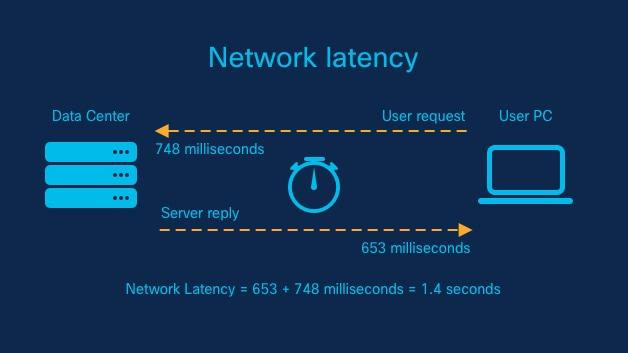

## Table of Contents

## What is latency in the context of computing and networking?

Latency in computing and networking is the time it takes for data to travel from its source to its destination across a network. Imagine you are sending a message to a friend. Latency is like the time it takes for your message to reach your friend after you hit send. This delay can be affected by many things, like the distance the data has to travel, the speed of the network, and how busy the network is.

In everyday life, low latency is important for activities like video calls or online gaming. If latency is high, you might experience delays or lag, which can make these activities frustrating. For example, in an online game, high latency could mean that your actions are delayed, making it hard to play smoothly. So, when people talk about wanting a "fast" internet connection, they often mean they want one with low latency.

## Why is low-latency important in various applications?

Low-latency is important in many applications because it makes things happen faster and more smoothly. For example, in online games, if you press a button to make your character jump, you want it to jump right away. If there's a lot of latency, there might be a delay, and that can make the game hard to play and less fun. In video calls, low latency means you can talk to someone and hear their response quickly, making the conversation feel more natural, like you're in the same room.

In finance, low-latency is crucial for trading. Traders need to buy and sell stocks very quickly, and even a small delay can mean losing money. In self-driving cars, low latency is vital for safety. The car needs to react to what's happening around it in real-time, so if there's a delay, it might not stop in time to avoid an accident. So, in many different areas, having low latency can make a big difference in how well things work and how safe they are.

## How is latency measured and what units are used?

Latency is measured by sending a signal from one point to another and then seeing how long it takes for the signal to come back. This back-and-forth time is called the round-trip time. To measure latency, people often use a tool called "ping," which sends a small packet of data to a destination and waits for a response. The time it takes for this round trip is the latency.

The units used to measure latency are usually milliseconds (ms). A millisecond is one-thousandth of a second. Sometimes, for very fast networks, you might see latency measured in microseconds (µs), which is one-millionth of a second. These units help us understand how quickly data is moving, and lower numbers mean less delay.

## What are some common causes of high latency?

High latency can happen because of many reasons. One big reason is the distance the data has to travel. If you're sending data from one side of the world to the other, it will take longer than sending it to someone nearby. Another reason is how busy the network is. If lots of people are using the same network at the same time, it can get crowded, and your data might have to wait in line before it can move.

The type of connection you're using can also affect latency. For example, a wired connection like an Ethernet cable usually has lower latency than a wireless connection like Wi-Fi. Also, the equipment you're using, like your router or modem, can make a difference. If they're old or not working well, they might slow things down. Finally, the way data is handled on its way from one place to another can add to latency. If it has to go through many different stops or if it gets slowed down at any point, that can increase the time it takes to get where it's going.

## Can you explain the difference between latency and bandwidth?

Latency and bandwidth are two different things that people often talk about when it comes to how fast their internet is. Latency is like the time it takes for a message to get from you to someone else. Imagine you're sending a letter. Latency is how long it takes for that letter to reach its destination. It's measured in time, usually milliseconds, and it's important for things like video calls and online games where you want things to happen right away.

Bandwidth, on the other hand, is like the size of the road that the data travels on. It's how much data can be sent at one time. Think of it like a highway. If the highway is wide, more cars can travel on it at the same time, meaning more data can be sent. Bandwidth is measured in bits per second, like megabits per second (Mbps). It's important for things like downloading big files or streaming videos, where you want a lot of data to come through quickly.

## What are some technologies or protocols designed to reduce latency?

Some technologies and protocols that help reduce latency are things like Content Delivery Networks (CDNs) and the use of fiber optic cables. CDNs work by storing copies of data in many places around the world. This means when you want to get something, like a video or a website, it can come from a server that's closer to you, which cuts down on the time it takes to get to you. Fiber optic cables are another way to lower latency. They use light to send data, which is much faster than the old copper wires, so the data can travel quickly from one place to another.

There are also protocols like TCP (Transmission Control Protocol) and UDP (User Datagram Protocol) that can affect latency. TCP is good for making sure all your data gets where it's going, but it can add some delay because it checks to make sure everything arrived correctly. UDP is faster because it doesn't do those checks, so it's often used for things like video calls or online games where you need things to happen quickly, even if a little bit of data gets lost along the way. By choosing the right protocol for the job, you can help keep latency low.

## How do real-time systems benefit from low-latency?

Real-time systems, like those used in self-driving cars or in online gaming, need things to happen very quickly. Low-latency helps these systems work better because it makes sure that the time between when something happens and when the system reacts is as short as possible. For example, in a self-driving car, low-latency means the car can see something in the road and stop or swerve to avoid it almost right away. If there's a lot of delay, the car might not be able to react in time, which could be dangerous.

In online gaming, low-latency makes the game feel smoother and more fun to play. When you press a button to move your character, you want it to move right away. If there's a lot of latency, there might be a delay, and that can make the game hard to play because your actions don't happen when you expect them to. So, low-latency in real-time systems helps make things safer and more enjoyable by keeping delays as small as possible.

## What strategies can be used to optimize network latency?

One way to make network latency better is by using things like Content Delivery Networks (CDNs). CDNs keep copies of data in lots of different places around the world. When you want to get something, like a video or a website, the data can come from a server that's closer to you. This makes the data travel a shorter distance, which cuts down on the time it takes to reach you. Another way is to use better cables, like fiber optic cables. These use light to send data, which is much faster than the old copper wires, so the data can get from one place to another more quickly.

Also, you can choose the right kind of internet connection. A wired connection, like an Ethernet cable, usually has lower latency than a wireless one, like Wi-Fi. If you can, using a wired connection can help make things faster. It's also important to keep your network equipment, like routers and modems, up to date and working well. Old or slow equipment can add to latency. Finally, choosing the right protocol for what you're doing can help too. For example, using UDP instead of TCP for things like video calls or gaming can lower latency because UDP is faster, even if it means a little bit of data might get lost along the way.

## How does latency impact the performance of online gaming?

Latency can make a big difference in how fun and smooth online gaming feels. When you play a game online, you need your actions to happen right away. If there's a lot of latency, there might be a delay between when you press a button and when your character moves or shoots. This delay, called lag, can make the game hard to play. For example, if you're playing a fast-paced game like a shooter, high latency means you might get shot before you can even react because your actions are delayed.

To keep latency low in online gaming, game developers use special servers that are close to where players live. This way, the distance the data has to travel is shorter, which helps reduce the delay. Also, many games use a protocol called UDP instead of TCP because UDP is faster, even if it means a little bit of data might get lost. By keeping latency as low as possible, games can feel more responsive and enjoyable for players.

## What role does latency play in financial trading systems?

In financial trading systems, latency is super important because it can mean the difference between making money and losing it. Traders need to buy and sell stocks very quickly, sometimes in just milliseconds. If there's a lot of latency, it can slow down their trades, and in the fast world of trading, even a tiny delay can make them miss out on a good deal or cause them to lose money. So, traders try to use the fastest connections and the best technology to keep latency as low as possible.

To help reduce latency, financial firms often use special connections like fiber optic cables that send data very quickly. They also set up their trading servers really close to the stock exchange servers, which makes the distance the data has to travel shorter. This way, their trades can happen almost instantly, giving them a better chance to make money. Keeping latency low is a big deal in financial trading because it helps traders stay ahead in a world where every millisecond counts.

## How can edge computing contribute to reducing latency?

Edge computing helps lower latency by moving some of the work that computers usually do away from big, central data centers and closer to where the data is actually being used. Imagine you're playing a game on your phone. Instead of sending all the game data to a faraway server and waiting for it to come back, edge computing lets some of that work happen on a server that's much closer to you. This means the data doesn't have to travel as far, so it can get to you faster.

This is really helpful for things like self-driving cars or smart home devices. For example, a self-driving car needs to react to what's happening around it right away. If it has to send data to a faraway server and wait for a response, that could be dangerous. But with edge computing, the car can process some of that data right there on the spot, making its reactions quicker and safer. So, by doing some of the work closer to where it's needed, edge computing can make a big difference in cutting down on delays.

## What are the current challenges and future trends in achieving ultra-low latency?

One of the biggest challenges in getting ultra-low latency is the physical distance data has to travel. Even with the fastest cables like fiber optics, it still takes time for data to go from one place to another. Also, networks can get crowded when lots of people are using them at the same time, which can slow things down. Another challenge is making sure all the different parts of a network, like routers and switches, can handle data quickly without adding too much delay. Keeping everything up to date and working well is important but can be hard and expensive.

In the future, new technologies like 5G and 6G networks are expected to help make latency even lower. These networks are designed to be much faster and handle more data at once, which should make things like video calls and online gaming feel even smoother. Edge computing will also play a big role, letting more data be processed closer to where it's needed, cutting down on the time it takes to get a response. As these technologies get better and more common, we can expect to see even less delay in our digital lives, making everything from self-driving cars to online shopping quicker and more enjoyable.

## References & Further Reading

[1]: Aldridge, I. (2013). ["High-Frequency Trading: A Practical Guide to Algorithmic Strategies and Trading Systems."](https://www.amazon.com/High-Frequency-Trading-Practical-Algorithmic-Strategies/dp/1118343506) Wiley.

[2]: Narang, R. (2013). ["Inside the Black Box: A Simple Guide to Quantitative and High-Frequency Trading."](https://onlinelibrary.wiley.com/doi/book/10.1002/9781118662717) Wiley.

[3]: MacKenzie, D., Beunza, D., Millo, Y., & Pardo-Guerra, J. P. (2012). ["Drilling through the Allegheny Mountains: Liquidity, Materiality, and High-Frequency Trading."](https://www.research.ed.ac.uk/en/publications/drilling-through-the-allegheny-mountains-liquidity-materiality-an) Journal of Economic Geography, 12(2).

[4]: Patterson, S. (2013). ["Dark Pools: High-Speed Traders, A.I. Bandits, and the Threat to the Global Financial System."](https://books.google.com/books/about/Dark_Pools.html?id=LIoNSKUEn24C) Crown Business.

[5]: Johnson, B. (2010). ["Algorithmic Trading & DMA: An Introduction to Direct Access Trading Strategies."](https://archive.org/details/algorithmictradi0000john) 4Myeloma Press.