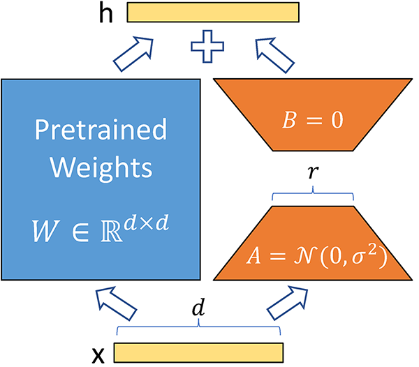

## Table of Contents

## What is Low-Rank Adaptability (Lora) in machine learning?

Low-Rank Adaptability (LoRA) is a method used in machine learning to make large models more efficient and adaptable. It works by changing only a small part of a big model instead of the whole thing. This is helpful because training big models can be very slow and use a lot of computer power. With LoRA, you can update the model quickly and with less effort. It's like tweaking a few knobs on a machine instead of rebuilding the entire machine.

LoRA uses something called low-rank matrices to make these changes. Imagine a matrix as a table full of numbers. A low-rank matrix is like a simpler version of this table, where you can still get good results but with fewer numbers. This makes the model easier to adjust and less demanding on computers. By using these low-rank matrices, LoRA helps keep the original model's performance while making it easier to adapt to new tasks or data.

## How does Lora differ from traditional machine learning methods?

LoRA differs from traditional machine learning methods mainly in how it updates and adapts models. In traditional methods, when you want to improve or change a model, you usually have to retrain the whole thing. This can take a lot of time and computer power, especially with big models. LoRA, on the other hand, focuses on changing just a small part of the model. It uses low-rank matrices to make these changes, which means you can update the model much faster and with less effort. Imagine you have a big puzzle, and instead of rearranging all the pieces, you just need to swap a few to get a new picture.

Another key difference is how LoRA keeps the original model's performance while making it adaptable. Traditional methods might change the model so much that it loses what it learned before. With LoRA, the changes are small and precise, so the model can still do what it was good at before, but now it can also handle new tasks or data. It's like giving your model a new skill without forgetting the old ones. This makes LoRA very useful for quickly adapting models to new situations without starting from scratch.

## What are the main applications of Lora in machine learning?

One of the main applications of LoRA in [machine learning](/wiki/machine-learning) is in fine-tuning large language models. When you have a big model that's already good at understanding and generating text, you might want to make it even better for a specific task, like writing emails or summarizing articles. With LoRA, you can do this without starting over. Instead of retraining the whole model, you just make small changes using low-rank matrices. This makes the process much quicker and uses less computer power. It's like giving your model a new skill without losing what it already knows.

Another important use of LoRA is in adapting models to new data. Imagine you have a model that's great at recognizing pictures of cats and dogs, but now you need it to recognize horses too. Instead of training a whole new model, LoRA lets you adjust the existing one. You can use low-rank matrices to make these changes, which means the model can learn about horses without forgetting about cats and dogs. This is really helpful when you're working with big models and need to keep updating them as new data comes in. It's like adding new pieces to a puzzle without messing up the parts you already have.

## Can you explain the mathematical foundation behind Lora?

The mathematical foundation of LoRA relies on the concept of low-rank matrices. In simple terms, a matrix is a table of numbers. When we say a matrix is low-rank, it means that it can be represented by fewer numbers than a full matrix. Imagine you have a big table with lots of numbers, but you can actually summarize it with just a few key numbers. This is what a low-rank matrix does. In LoRA, these low-rank matrices are used to make small changes to a big model. Instead of changing the whole model, which can have millions of numbers, you only change a few key numbers in these low-rank matrices. This makes the process of updating the model much faster and easier.

Mathematically, if you have a big matrix $$A$$ that represents your model, LoRA introduces a small change using two low-rank matrices, $$B$$ and $$C$$. The change to the model can be written as $$A + BC$$, where $$B$$ and $$C$$ are much smaller than $$A$$. The rank of $$BC$$ is low, meaning it can be represented with fewer numbers. This allows you to adjust the model without changing all of its parameters. By using these low-rank matrices, LoRA keeps the original performance of the model while making it adaptable to new tasks or data. It's like tweaking a few knobs on a machine instead of rebuilding the entire machine.

## How is Lora implemented in a typical machine learning workflow?

In a typical machine learning workflow, LoRA is implemented as a way to fine-tune large models without starting from scratch. Imagine you have a big model that's already trained and works well, but you want to make it better for a specific task. Instead of retraining the whole model, which can take a lot of time and computer power, you use LoRA. You add small changes to the model using low-rank matrices. These matrices are like a simpler version of the big model, so you can update the model quickly and easily. You can think of it as tweaking a few knobs on a machine instead of rebuilding the entire thing.

To implement LoRA, you start by identifying the parts of the model you want to change. These are usually the weights or parameters of the model. You then introduce two low-rank matrices, $$B$$ and $$C$$, to make these changes. The update to the model can be written as $$A + BC$$, where $$A$$ is the original model and $$BC$$ is the small change you're making. By using these low-rank matrices, you can adjust the model without changing all of its parameters. This keeps the original performance of the model while making it adaptable to new tasks or data. It's like adding new pieces to a puzzle without messing up the parts you already have.

## What are the advantages of using Lora over other dimensionality reduction techniques?

LoRA has some big advantages over other ways to reduce the size of data in machine learning. One of the main benefits is that it lets you change big models without starting over. With other methods, you might have to retrain the whole model, which can take a lot of time and use a lot of computer power. But with LoRA, you only need to make small changes using low-rank matrices. This means you can update the model quickly and easily, which is really helpful when you're working with big models. It's like tweaking a few knobs on a machine instead of rebuilding the entire thing.

Another advantage of LoRA is that it keeps the original model's performance while making it adaptable to new tasks or data. Other methods might change the model so much that it loses what it learned before. But with LoRA, the changes are small and precise, so the model can still do what it was good at before, but now it can also handle new things. It's like giving your model a new skill without forgetting the old ones. By using low-rank matrices, LoRA helps you make these changes without messing up the parts of the model you already have.

## What challenges might one face when applying Lora to a new dataset?

When applying LoRA to a new dataset, one of the main challenges is figuring out how to adjust the low-rank matrices to fit the new data. Since LoRA uses these matrices to make small changes to the model, it's important to get them right. If the matrices are too small, they might not capture the new information well enough. If they're too big, they might change the model too much and mess up what it already knows. Finding the right balance can take some trial and error, and it might need a lot of testing to see what works best.

Another challenge is making sure the model keeps its original performance while adapting to the new data. With LoRA, the changes are small, but they still need to be careful. If the changes are not done right, the model might forget some of the things it learned before. This can be tricky, especially if the new data is very different from what the model was trained on before. It's like trying to teach someone a new skill without making them forget what they already know. It takes a lot of care and attention to get it right.

## How does Lora help in improving the performance of machine learning models?

LoRA helps improve the performance of machine learning models by making it easier to fine-tune them for specific tasks. Imagine you have a big model that's good at understanding and generating text, but you want it to be even better at writing emails. Instead of retraining the whole model, which can take a lot of time and computer power, LoRA lets you make small changes using low-rank matrices. These changes are like tweaking a few knobs on a machine instead of rebuilding the entire thing. By using these low-rank matrices, you can update the model quickly and easily, which helps it perform better for the new task without losing what it already knows.

Another way LoRA improves model performance is by helping the model adapt to new data. If you have a model that's great at recognizing pictures of cats and dogs, but now you need it to recognize horses too, LoRA can help. Instead of training a whole new model, you can use low-rank matrices to make small changes to the existing one. This means the model can learn about horses without forgetting about cats and dogs. By keeping the original performance while making the model adaptable, LoRA helps it perform better on new data without starting from scratch.

## Can you provide examples of successful use cases of Lora in industry?

One successful use case of LoRA in industry is in the field of natural language processing. A big company that makes chatbots wanted to improve their chatbot's ability to understand and respond to customer queries about their products. Instead of retraining the entire model, which would have taken weeks and a lot of computer power, they used LoRA. They added small changes to the model using low-rank matrices, which allowed them to update the chatbot quickly and easily. The chatbot became much better at answering customer questions without losing its ability to handle other types of conversations. This saved the company time and money, and made their customers happier.

Another example is in the healthcare industry, where a medical imaging company used LoRA to improve their models for detecting diseases from X-ray images. They had a big model that was already good at identifying some diseases, but they wanted it to also detect a new type of disease. Instead of training a whole new model, they used LoRA to make small changes to the existing one. By using low-rank matrices, they were able to update the model to recognize the new disease without messing up its ability to detect the old ones. This helped doctors make better and faster diagnoses, which improved patient care.

## What are the limitations of Lora, and how can they be mitigated?

One limitation of LoRA is that it can be hard to find the right size for the low-rank matrices. If the matrices are too small, they might not capture all the new information well enough. If they're too big, they might change the model too much and make it forget what it already knows. Finding the right balance takes a lot of trial and error. To mitigate this, you can start with a small size and slowly increase it, testing the model's performance each time. This way, you can find the best size without messing up the model too much.

Another challenge is making sure the model keeps its original performance while adapting to new data. With LoRA, the changes are small, but they still need to be careful. If the changes are not done right, the model might lose some of its old skills. This can be tricky, especially if the new data is very different from what the model was trained on before. To help with this, you can use a technique called regularization, which helps keep the model's performance stable. Regularization makes sure the changes are small and precise, so the model can learn new things without forgetting the old ones.

## How does Lora integrate with other advanced machine learning techniques like deep learning?

LoRA integrates well with [deep learning](/wiki/deep-learning) by making big models easier to update and adapt. Deep learning models, especially the really big ones, can take a lot of time and computer power to train. LoRA helps by using low-rank matrices to make small changes to these models. Instead of changing the whole model, which can have millions of parameters, you only need to adjust a few key numbers in these matrices. This means you can fine-tune a deep learning model for a new task quickly and easily. For example, if you have a deep learning model that's good at understanding text, you can use LoRA to make it better at writing emails without starting over. The update to the model can be written as $$A + BC$$, where $$A$$ is the original model and $$BC$$ is the small change you're making.

Another way LoRA works with deep learning is by helping models adapt to new data. Deep learning models often need to keep learning from new data to stay useful. With LoRA, you can update the model to recognize new things without messing up what it already knows. For example, if you have a deep learning model that's good at recognizing pictures of cats and dogs, you can use LoRA to make it also recognize horses. By using low-rank matrices, you can make these changes quickly and keep the model's original performance. This makes LoRA a powerful tool for keeping deep learning models up-to-date and effective.

## What future developments can we expect in the field of Lora and machine learning?

In the future, we can expect LoRA to become even more important in machine learning. As models get bigger and more complex, it will be really helpful to have a way to update them quickly and easily. LoRA lets you make small changes to these big models using low-rank matrices, so you don't have to start over every time you want to improve them. This means that companies and researchers can keep their models up-to-date without using a lot of time and computer power. They can also use LoRA to make their models better at new tasks or with new data, which will make machine learning more useful in many different areas.

Another thing we might see is LoRA working together with other new techniques in machine learning. For example, it could be used with deep learning to make big models even more powerful. Deep learning models can be hard to update, but with LoRA, you can make small changes to them using low-rank matrices. This means you can fine-tune a deep learning model for a new task quickly and easily. The update to the model can be written as $$A + BC$$, where $$A$$ is the original model and $$BC$$ is the small change you're making. By combining LoRA with other advanced techniques, we can make machine learning models even better at understanding and working with new data.

## References & Further Reading

[1]: Hu, Edward J., et al. (2021). ["LoRA: Low-Rank Adaptation of Large Language Models."](https://arxiv.org/abs/2106.09685) arXiv preprint arXiv:2106.09685.

[2]: Belkin, Mikhail, and Kaushik Sinha. (2010). ["Polynomial Learning of Distribution Families."](https://arxiv.org/abs/1004.4864) IEEE Transactions on Information Theory.

[3]: Wang, Naigang, et al. (2020). ["Energy Efficient Neural Network Acceleration based on Outlier-Aware Low-Precision Computation."](https://ieeexplore.ieee.org/document/8416865) Proceedings of the 26th IEEE International Symposium on High-Performance Computer Architecture (HPCA).

[4]: Tibshirani, Robert. (1996). ["Regression Shrinkage and Selection via the Lasso."](https://academic.oup.com/jrsssb/article/58/1/267/7027929) Journal of the Royal Statistical Society: Series B (Methodological).

[5]: Gu, Jason, et al. (2018). ["Recent advances in convolutional neural networks."](https://www.sciencedirect.com/science/article/pii/S0031320317304120) Pattern Recognition.