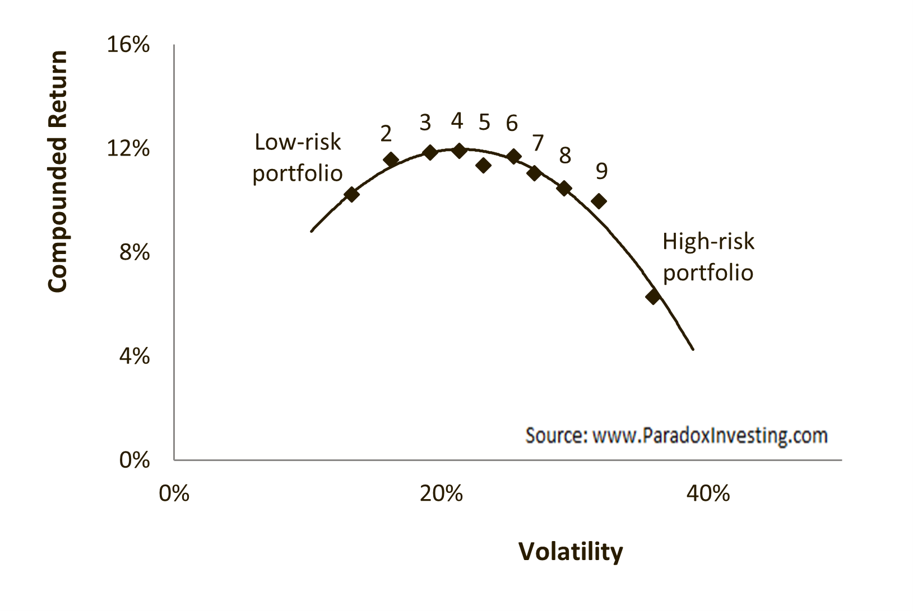

The low-volatility anomaly refers to the empirical finding that, contrary to the predictions of traditional financial theories such as the Capital Asset Pricing Model (CAPM), stocks or portfolios with lower volatility tend to provide higher risk-adjusted returns than their higher-volatility counterparts. This phenomenon is significant in the fields of investing and finance as it challenges the conventional understanding that higher risk is compensated with higher returns. According to CAPM, the expected return of a security is directly proportional to its beta, a measure of risk relative to the market. The model posits that investors require a risk premium for holding riskier assets, which should lead to higher returns for those assets. However, the low-volatility anomaly turns this idea on its head by suggesting that securities with lower risk (lower volatility) can yield better returns on a risk-adjusted basis, thereby questioning the foundational risk-return trade-off presented by CAPM.

The significance of this anomaly extends beyond mere theoretical implications; it influences investment strategies and portfolio management. Investors and fund managers have increasingly looked into low-volatility strategies to enhance returns while managing risk. This is particularly attractive during uncertain economic times or in markets with heightened volatility, offering a potential pathway to achieve returns without taking excessive risks.

In light of this anomaly, the use of algorithmic trading presents a sophisticated method to capitalize on these inefficiencies. Algorithmic trading employs complex algorithms and computational power to identify and exploit market anomalies such as low-volatility opportunities. By processing vast amounts of market data at speed and scale beyond human capability, these algorithms can continuously monitor markets, adjusting portfolios dynamically to benefit from volatility patterns in real-time. This approach not only enhances the precision of capturing the anomaly but also enables more disciplined and emotion-free trading, which might be challenging in manual trading settings.

Algorithmic trading, hence, serves as a powerful tool in optimizing investment strategies based on the low-volatility anomaly, offering a frontier of opportunities for further innovation and returns optimization. As markets evolve and data availability increases, strategies leveraging low-volatility patterns through advanced algorithms hold promise for investors seeking to navigate financial markets effectively.

## Table of Contents

## Understanding the Low-Volatility Anomaly

A low-[volatility](/wiki/volatility-trading-strategies) security is characterized by relatively stable price movements compared to the broader market. These securities are appealing because they tend to offer more predictable returns with less dramatic price swings. This stability, or lower volatility, implies a lower risk of loss over time, making them attractive to risk-averse investors who value steady returns.

Historically, the low-volatility anomaly has been a well-documented phenomenon across various global markets. This anomaly is a paradoxical situation where low-volatility stocks have unexpectedly outperformed their high-volatility counterparts over extended periods. Contrary to the Capital Asset Pricing Model (CAPM), which posits that higher risk (volatility) should be compensated with higher returns, low-volatility stocks have, paradoxically, delivered superior risk-adjusted returns.

One possible explanation for this anomaly lies in investor behavior and market mechanics. Low-volatility stocks might outperform high-volatility ones due to several [factor](/wiki/factor-investing)s that contradict CAPM predictions. Firstly, leverage constraints can impede investors' ability to purchase high-volatility stocks, leading to higher demand and, subsequently, higher prices for low-volatility stocks, bolstering their returns. Secondly, many investors are attracted to the potential of high returns from volatile stocks, often disregarding the associated risks – a cognitive bias that can lead to an overvaluation of high-volatility stocks.

Additionally, agency issues in fund management might play a role. Fund managers may gravitate towards high-volatility stocks to demonstrate active management and potential short-term gains, while overlooking the long-term benefits of low-volatility investing. Consequently, low-volatility stocks become undervalued, offering an attractive risk-adjusted return for those who invest in them.

Overall, the persistence of the low-volatility anomaly suggests systemic inefficiencies that can be exploited. Understanding these market dynamics and their implications provides promising avenues for both traditional and algorithmic investing strategies.

## Historical Context and Evidence

The Capital Asset Pricing Model (CAPM) emerged as a foundational framework in financial economics during the 1960s, primarily developed by William Sharpe, John Lintner, and Jack Treynor. CAPM introduced the concept of beta ($\beta$), a measure of a security's sensitivity to market movements, positing that higher beta securities should yield higher expected returns due to their increased risk. However, subsequent empirical research identified limitations within this model, notably that beta did not fully explain the differences in stock returns, casting doubt on its predictive power.

One such challenge to CAPM's framework is the low-volatility anomaly, which shows that stocks with lower volatility tend to outperform those with higher volatility, contrary to the CAPM's risk-return assumptions. Pioneering studies like the one conducted by Robert Haugen and Nardin Baker in the early 1990s brought attention to this anomaly. Their research, "The Efficient Market Inefficiency of Capitalization-Weighted Stock Portfolios," revealed that low-volatility stocks consistently produced higher risk-adjusted returns than their high-volatility counterparts.

Over the decades, several studies have reiterated the presence of the low-volatility anomaly across various markets and time periods. For instance, a noteworthy study by Malcolm Baker, Brendan Bradley, and Jeffrey Wurgler titled "Benchmarks as Limits to Arbitrage: Understanding the Low-Volatility Anomaly," outlined how these low-volatility portfolios yielded returns that defy CAPM predictions, attributing part of this outperformance to constraints faced by [arbitrage](/wiki/arbitrage)urs.

Empirical evidence spans international contexts, with findings from both U.S. and global markets reinforcing the anomaly's consistency. For example, research by Blitz and van Vliet in their paper "Global Tactical Cross-Asset Allocation" documented the anomaly's presence in European and Asian markets, demonstrating its persistence beyond the U.S. borders. Their study also highlighted that this anomaly persists even after accounting for other known factors, such as size and value anomalies, suggesting a deeply ingrained market inefficiency.

In summary, the low-volatility anomaly presents a significant challenge to the traditional understanding provided by the CAPM, as it undermines the model's risk-return linear relationship. Key studies over the years have documented this phenomenon extensively, firmly establishing its existence in both the United States and international markets. This evidence not only questions CAPM's original assertions but also invites new methods and models to better capture the nuances of market behavior.

## Explanations for the Anomaly

Leverage and shorting constraints can significantly influence the persistence of the low-volatility anomaly. Investors often face limitations on the ability to leverage low-risk investments or to short high-risk assets. Due to these constraints, investors cannot easily arbitrage away the higher returns offered by low-volatility stocks, which contradict the Capital Asset Pricing Model (CAPM) predictions where expected returns are linearly related to beta, a measure of risk. Without the ability to leverage low-risk stocks, investors seeking higher returns are nudged towards low-volatility stocks, thus inflating their prices and potentially increasing their realized returns due to sustained demand.

Investor behavior and agency issues also play a crucial role in explaining the anomaly. Institutional investors, primarily driven by quarterly performance metrics and compensation linked to relative performance benchmarks, might prefer low-volatility stocks. These stocks tend to have less dramatic price movements, providing a more consistent performance that aligns well with short-term evaluation frameworks. Consequently, fund managers gravitating towards these less volatile stocks can drive prices up, leading to their outperformance despite lower individual betas.

Behavioral biases further contribute to this anomaly. Many investors exhibit overconfidence, impulsively assuming that high-volatility stocks will generate high returns due to potential outsized gains, often compared to lottery ticket-like payoffs. This skewness preference leads them to irrationally bid up prices of high-volatility stocks, resulting in poor risk-adjusted returns over time. Moreover, investors are prone to loss aversion, preferring investments that offer more stable and predictable returns, thus favoring low-volatility stocks and increasing their market demand.

Ultimately, a combination of leverage constraints, institutional behaviors, and behavioral biases like skewness preference and loss aversion has perpetuated the low-volatility anomaly, ensuring that low-volatility stocks consistently deliver superior risk-adjusted returns. These explanations challenge traditional financial assumptions, prompting investors and researchers to reassess the foundational theories underlying asset pricing.

## Algorithmic Trading and the Low-Volatility Anomaly

Algorithmic trading refers to the use of computer algorithms to automate trading decisions and execute trades. These algorithms analyze market data, identify trading opportunities, and manage risks, making them particularly adept at exploiting financial anomalies, such as the low-volatility anomaly. This anomaly, where stocks with lower volatility tend to produce higher risk-adjusted returns than their high-volatility counterparts, presents a unique opportunity for [algorithmic trading](/wiki/algorithmic-trading) strategies.

Algorithms can efficiently process vast amounts of historical and real-time market data to identify low-volatility stocks. By employing statistical techniques and machine learning models, they can detect patterns and predictions that human traders might miss. The ability to automatically execute trades based on these insights offers several benefits, such as increased speed and precision, reduced costs, and the elimination of human biases.

Deploying algorithms to capitalize on the low-volatility anomaly provides the advantage of systematically executing trades across multiple securities and markets. By diversifying trades, algorithms can mitigate risks associated with individual stock volatility and optimize portfolios for higher returns while maintaining lower overall market risk exposure.

However, the implementation of such algorithmic strategies is not without challenges and risks. High-frequency trading and other algorithmic approaches have been criticized for contributing to market instability and flash crashes. Furthermore, the reliance on historical data to train models can lead to overfitting, where the algorithms perform well in backtests but fail in live markets. Additionally, unforeseen market conditions or changes in the regulatory landscape can impact algorithm performance, requiring constant monitoring and adjustment.

Robust risk management systems are essential to overcoming these challenges. Algorithms need to be regularly updated and backtested against diverse market conditions to ensure resilience. Adequate safeguards must be in place to manage unforeseen market disruptions, while adherence to regulatory requirements is paramount to avoid legal pitfalls. In summary, while algorithmic trading offers significant potential in exploiting the low-volatility anomaly, it requires meticulous design, constant refinement, and vigilant oversight to navigate its associated complexities effectively.

## Case Studies and Applications

Low-volatility strategies have gained traction in the investment world as traders and funds seek to exploit the low-volatility anomaly for consistent returns. Several real-world examples illustrate the success of algorithmic strategies targeting this anomaly, revealing its potential across diverse market sectors.

One notable case study involves Acadian Asset Management, a company recognized for its quantitative approach to investment. Acadian has developed algorithmic strategies that leverage the low-volatility anomaly by systematically identifying stocks across global markets that exhibit low volatility relative to their peers. Their empirical research indicates that such stocks tend to offer superior risk-adjusted returns, defying traditional capital market assumptions. By focusing on portfolios of less volatile stocks, Acadian has successfully managed to enhance performance while reducing risk exposure, thus attracting risk-averse investors. Their application of computer-driven models exemplifies how algorithms can effectively capitalize on the anomaly.

In the U.S. market, the Invesco S&P 500 Low Volatility [ETF](/wiki/etf-trading-strategies) (SPLV) serves as another exemplary application of low-volatility strategies. This ETF tracks an index designed to include 100 stocks from the S&P 500 with the lowest realized volatility over the past 12 months. By employing a systematic selection process, SPLV aims to provide investors with returns similar to the S&P 500 but with less volatility. Its success has made it a popular choice among investors seeking stable returns without sacrificing equity market exposure.

Different sectors exhibit varied impacts from this anomaly-driven strategy. The consumer staples and utilities sectors often house stocks prone to lower volatility, benefiting from sustained demand and stable cash flows regardless of economic cycles. By contrast, sectors like technology and biotechnology, known for higher volatility due to innovation and growth cycles, are less frequently targeted by low-volatility strategies. This sectoral differentiation allows algorithmic traders to build diversified portfolios that align with the low-volatility theme, thereby potentially enhancing their robustness in turbulent markets.

Beyond individual companies, several funds have distinguished themselves by harnessing this strategy. For instance, the American Century Investments company offers several funds focusing on low-volatility equities. By employing systematic, rules-based approaches, these funds have attracted a diverse investor base interested in achieving long-term growth with minimized drawdowns.

These case studies underscore the viability of using algorithmic trading to exploit the low-volatility anomaly. They not only demonstrate successful implementation across different sectors but also highlight the pivotal role of algorithmic strategies in modern portfolio management, adjusting to evolving market conditions while capitalizing on persistent inefficiencies. As technology advances, the sophistication and adaptability of such strategies are expected to grow, allowing for continued advantages in exploiting known market anomalies.

## Future Outlook

The future outlook for the low-volatility anomaly in financial markets presents an intriguing landscape shaped by evolving technologies and market dynamics. As market efficiency continues to improve, primarily due to technological advancements and increased globalization, the persistence of the low-volatility anomaly is likely to face challenges. However, it also opens new avenues for leveraging algorithmic trading to capitalize on any persistent inefficiencies.

With the rapid advancement in computational capabilities and [machine learning](/wiki/machine-learning), algorithmic trading is becoming increasingly sophisticated. Machine learning algorithms, particularly those based on large datasets and [neural network](/wiki/neural-network)s, can identify patterns and correlations that human analysts might miss. These advancements can significantly enhance the ability to detect and exploit the low-volatility anomaly by optimizing trading strategies for better risk-adjusted returns. Technologies such as natural language processing and sentiment analysis can also be integrated into trading models to forecast market volatility based on news and social media trends, thus providing a comprehensive toolset to exploit the anomaly.

Despite these advancements, the increasing market efficiency tends to erode anomalies over time. As more market participants identify and trade based on these inefficiencies, competitive forces generally reduce the profitability of anomaly-driven strategies. However, periods of market stress or changing economic conditions might temporarily reinstate these anomalies, offering renewed opportunities for traders equipped with agile algorithmic systems.

Regulatory and ethical considerations are becoming increasingly important as algorithmic trading grows. Regulators are concerned about the potential for algorithmic trading to contribute to market volatility and execution of unfair trading practices. Flash crashes and market manipulation are real threats in an ecosystem dominated by algorithmic decisions. Therefore, as algorithmic trading strategies continue to evolve, regulatory bodies may impose stricter rules to ensure a fair and transparent trading environment. Ethically, there is a need for enterprises leveraging algorithmic trading to ensure that their strategies do not exploit market participants unfairly or exacerbate systemic risks.

In conclusion, while the future may hold challenges for exploiting the low-volatility anomaly due to increasing market efficiency, advancements in algorithmic technology offer significant potential. However, stakeholders must remain vigilant to the regulatory and ethical implications of these powerful tools, ensuring that innovation contributes positively to market stability and fairness. Continued research and the development of adaptive, ethically-responsible trading algorithms will be crucial to successfully navigating the future landscape of financial markets.

## Conclusion

The low-volatility anomaly holds substantial significance in financial markets, challenging the traditional risk-return paradigms, such as those proposed by the Capital Asset Pricing Model (CAPM). This anomaly presents investors with opportunities to achieve superior returns while holding what are conventionally perceived as lower-risk securities. By questioning established financial theories, the low-volatility anomaly encourages continual evaluation and refinement of investment strategies, ultimately contributing to a broader understanding of market dynamics.

Algorithmic trading emerges as a powerful tool in the pursuit of exploiting market inefficiencies, such as the low-volatility anomaly. Using sophisticated algorithms allows investors to process vast amounts of data rapidly, identify patterns imperceptible to the human eye, and execute trades with precision. This capability not only maximizes the potential gains derived from the anomaly but also enhances market [liquidity](/wiki/liquidity-risk-premium) and efficiency. By automating decision-making processes, algorithmic strategies can swiftly adapt to market changes, ensuring opportunities are seized in an optimal manner.

Future exploration and innovation in trading strategies are crucial for maintaining a competitive edge in today's financial markets. Researchers and practitioners are encouraged to continue investigating the underlying causes of anomalies like low-volatility, developing novel methodologies and incorporating advanced technologies such as machine learning and [artificial intelligence](/wiki/ai-artificial-intelligence). As the landscape of financial markets evolves, staying at the forefront of algorithmic advancements will be essential for capitalizing on emerging anomalies and sustaining market resiliency.

In summary, the low-volatility anomaly remains a captivating and lucrative phenomenon within financial markets. Algorithmic trading serves as an essential conduit for capitalizing on these anomalies, with its potential continually being expanded by technological progress and innovative research. As such, the ongoing study and enhancement of algorithmic trading methodologies will play a pivotal role in shaping the future of finance, driving both academic inquiry and practical application forward.

## References & Further Reading

[1]: Haugen, R. A., & Baker, N. L. (1991). ["The Efficient Market Inefficiency of Capitalization-Weighted Stock Portfolios."](http://www.efalken.com/LowVolClassics/HaugenBaker991.pdf) The Journal of Portfolio Management, 17(3), 35-41.

[2]: Baker, M., Bradley, B., & Wurgler, J. (2011). ["Benchmarks as Limits to Arbitrage: Understanding the Low-Volatility Anomaly."](https://pages.stern.nyu.edu/~jwurgler/papers/wurgler_bradley_baker.pdf) Financial Analysts Journal, 67(1), 40-54.

[3]: Blitz, D., & van Vliet, P. (2007). ["The Volatility Effect: Lower Risk without Lower Return."](https://papers.ssrn.com/sol3/papers.cfm?abstract_id=980865) Journal of Portfolio Management, 34(1), 102-113.

[4]: ["Advances in Financial Machine Learning"](https://www.wiley.com/en-us/Advances+in+Financial+Machine+Learning-p-9781119482086) by Marcos Lopez de Prado

[5]: Pedersen, L. H. (2009). ["When Everyone Runs for the Exit."](https://www.nber.org/papers/w15297) The International Journal of Central Banking.

[6]: ["Quantitative Equity Portfolio Management: An Active Approach to Portfolio Construction and Management"](https://www.amazon.com/Quantitative-Equity-Portfolio-Management-Construction/dp/0071459391) by Ludwig B. Chincarini and Daehwan Kim