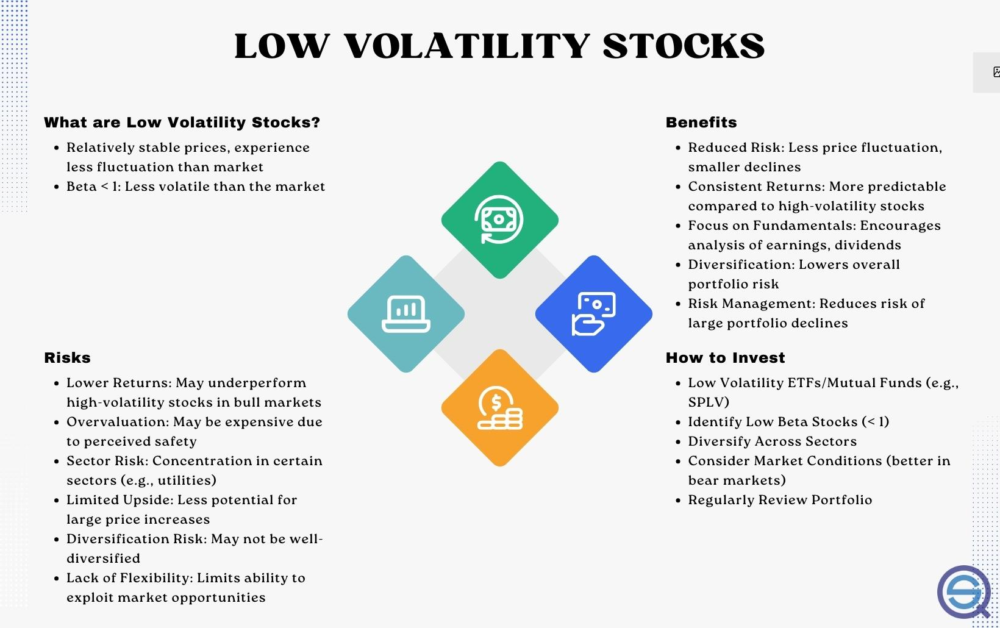

Low-volatility investing is a financial strategy that focuses on selecting stocks or a portfolio of assets that exhibit lower price fluctuations compared to the overall market. This approach is grounded in the notion that lower-risk investments can deliver comparable, if not superior, returns to their high-volatility counterparts. The significance of low-volatility investing lies in its potential to offer more stable returns and mitigate risk during turbulent market conditions, making it an attractive option for risk-averse investors.

The low-volatility anomaly, a key concept underpinning this strategy, challenges the traditional financial theories such as the Capital Asset Pricing Model (CAPM). According to CAPM, the expected return of an investment is proportional to its risk, measured by beta, which implies that higher-risk investments should yield higher returns. However, empirical evidence supporting the low-volatility anomaly suggests that less volatile stocks tend to outperform high-volatility stocks on a risk-adjusted basis over the long term. This contradiction to classical theories has spurred considerable interest and debate within the field of finance.

In the context of algorithmic trading, low-volatility investing holds particular relevance. Algorithmic trading systems, which rely on computational power and advanced algorithms to execute trades, can efficiently implement low-volatility strategies by analyzing vast datasets to identify and select low-risk assets in real-time. This integration of low-volatility strategies within algorithmic frameworks allows for more dynamic portfolio management, aligning with the goal of optimizing returns while managing risk exposure. As such, low-volatility investing continues to gain traction, not only as a standalone strategy but also as a critical component of sophisticated algorithmic trading systems.

## Table of Contents

## Historical Background

The low-volatility anomaly was first documented in the 1970s when researchers found that stocks with lower volatility tended to outperform those with higher volatility, contradicting the traditional financial theories that higher risk should come with higher returns. This anomaly presented a challenge to the Capital Asset Pricing Model (CAPM), which posits that the expected return of a security should be directly proportional to its risk, as measured by beta.

The significance of low-[volatility](/wiki/volatility-trading-strategies) investing gained traction following the 2008 financial crisis. During this period, markets experienced extreme shocks, and investors began searching for strategies that could offer better downside protection with less risk exposure. The crisis underscored the need for investment approaches that could mitigate risk while still providing reliable returns, and low-volatility investing fit this criterion.

Contributions from researchers like Eugene Fama and Kenneth French have been instrumental in developing the understanding of this anomaly. Though primarily known for their work on efficient markets and the Fama-French three-[factor](/wiki/factor-investing) model, their research has provided foundational insights into market behavior that inform various investment strategies, including low-volatility investing.

Furthermore, major financial institutions such as MSCI and S&P have acknowledged the relevance of low-volatility investing by developing specialized indices. The MSCI Minimum Volatility Indexes and the S&P 500 Low Volatility Index were created to track the performance of low-volatility stocks, providing a formal structure for investors seeking to implement these strategies. These indices have facilitated the growth of low-volatility exchange-traded funds ([ETF](/wiki/etf-trading-strategies)s) and mutual funds, making it easier for a broader range of investors to access and benefit from these strategies.

## Mechanics of Low-Volatility Investing

Low-volatility investing is an investment approach designed to minimize risk while achieving steady returns. This approach can be segmented into different styles: low-volatility, minimum variance, and smart beta, each with its unique characteristics and applications.

**Low-Volatility Investment Styles**: 
1. **Low-Volatility**: This strategy focuses on identifying stocks or other securities with lower price fluctuations. The idea is that by investing in less volatile securities, investors can achieve a more stable return profile. These investments are often seen as a refuge during periods of market turmoil, providing a cushion against severe market drops.

2. **Minimum Variance**: This strategy involves constructing a portfolio that aims to achieve the lowest possible variance, or risk, while still meeting return goals. By optimizing the portfolio's composition, investors attempt to reduce the overall volatility. The mathematical model for selecting the minimum variance portfolio involves solving:
$$
   \text{Minimize} \quad \sigma^2_p = w^T \Sigma w

$$

   Subject to:
$$
   \sum w_i = 1

$$

   Here, $w$ represents the weight of each asset in the portfolio, and $\Sigma$ is the covariance matrix of asset returns.

3. **Smart Beta**: This strategy attempts to capture specific systematic factors, like low volatility, beyond traditional cap-weighted indices. Unlike traditional indexing, smart beta approaches allow for the selection and weighting of securities based on various factors or rules rather than market capitalization alone.

**Algorithmic Trading and Low-Volatility Strategies**:
Algorithmic trading platforms integrate low-volatility strategies by using historical data and computing power to identify and execute trades that adhere to low-volatility criteria. These systems can rapidly adjust portfolios based on market conditions or new data to preserve the low-volatility nature. Algorithms can identify subtle market trends, correlations, and statistical anomalies that humans might overlook, thus optimizing the performance of low-volatility strategies.

**Role of Asset Managers and Hedge Funds**:
Asset managers and [hedge fund](/wiki/hedge-fund-trading-strategies)s play a pivotal role in low-volatility investing. They design products, such as exchange-traded funds (ETFs) and mutual funds, that focus on low-volatility or minimum variance strategies. By actively managing these funds, they aim to provide attractive risk-adjusted returns. Additionally, hedge funds often employ algorithmic models to exploit market inefficiencies related to volatility, dynamically adjusting their portfolios to optimize the risk-return profile.

Asset managers with a focus on low-volatility investing often combine quantitative models with [fundamental analysis](/wiki/fundamental-analysis) to achieve their goals. This comprehensive approach ensures a personalized strategy, minimizing risk while striving for consistent returns.

As financial markets evolve and technology advances, the mechanics of low-volatility investing are likely to become more sophisticated. Whether through traditional strategies or [algorithmic trading](/wiki/algorithmic-trading), the principles of low-volatility investing remain integral to managing and understanding risk in investment portfolios.

## Performance Analysis

Low-volatility investing suggests that stocks with lower volatility can yield better risk-adjusted returns than their high-volatility counterparts. This is backed by empirical research indicating that low-volatility stocks have historically outperformed higher-volatility stocks over the long term. One significant tool in assessing this performance is Jensen's alpha, which helps evaluate the excess returns of a portfolio over the expected return predicted by the Capital Asset Pricing Model (CAPM).

### Jensen's Alpha as a Performance Metric

Jensen's alpha is defined as:

$$
\alpha = R_i - \left( R_f + \beta \times (R_m - R_f) \right)
$$

where:
- $R_i$ is the actual return of the portfolio.
- $R_f$ is the risk-free rate.
- $\beta$ is the portfolio's beta.
- $R_m$ is the return of the market.

A positive $\alpha$ indicates that the portfolio has outperformed the expected returns, which makes it a crucial measure in supporting the viability of low-volatility strategies. Historically, funds and portfolios employing low-volatility strategies have consistently shown positive Jensen's alpha, particularly in stable or declining markets.

### Challenges During Different Market Phases

Despite these promising findings, low-volatility strategies aren't foolproof and face challenges during different market phases. In bullish phases when markets rally, high-volatility stocks often outperform due to their higher beta, capturing the broader market's substantial upward movements more effectively than low-volatility stocks. Resultant underperformance in such periods can detract from Low-volatility strategies' overall appeal.

Additionally, in a rising [interest rate](/wiki/interest-rate-trading-strategies) environment, low-volatility strategies may struggle. Investors might shift toward bonds and other interest-sensitive assets, reducing the capital flow into low-volatility stocks. Hence, understanding the broader economic context and market cycle is essential when considering low-volatility strategies within investment portfolios.

Overall, while low-volatility investing has demonstrated potential for superior long-term risk-adjusted returns using metrics such as Jensen's alpha, investors need to bear in mind the contextual challenges it can face during distinct market phases.

## Criticism and Challenges

The low-volatility strategy, while popular, is not without its challenges and criticisms. One major concern is the potential for its effectiveness to diminish over time. The strategy's premise contradicts traditional financial theories like the Capital Asset Pricing Model (CAPM), which suggests that higher risk should correlate with higher reward. Yet, as investor awareness and adoption of low-volatility strategies increase, the market could adjust, eroding potential returns and nullifying the anomaly that many have capitalized on.

Valuation concerns play a significant role in criticisms of low-volatility investing. Stocks exhibiting low volatility often become overpriced, as increased demand drives up their valuations. This pattern can lead to a disconnect between stock prices and fundamental values, exposing portfolios to the risk of price corrections. Historical data support that periods of high market enthusiasm often lead to elevated valuations, subsequently correcting when market sentiments shift.

Interest rate risks also pose a threat to the low-volatility strategy. Many low-volatility stocks reside in sectors such as utilities and consumer staples, which are sensitive to interest rate changes. As interest rates rise, the cost of debt increases for these companies, potentially impacting their profitability and leading to stock underperformance. Moreover, higher interest rates often result in a reallocation of investments as bonds become more attractive, reducing demand for low-volatility stocks.

Instances of underperformance illustrate the strategy's vulnerabilities. For example, during market rallies characterized by rapid economic growth or significant technological advancements, high-volatility stocks often outperform their low-volatility counterparts. Such occasions highlight the limitations of a strategy heavily reliant on lower-risk stocks, which may not capture the full upside potential present in bullish periods. The underperformance of low-volatility stocks during economic booms presents a challenge for investors seeking to adhere strictly to this strategy.

In conclusion, while low-volatility investing provides a pathway to potentially reducing risk and achieving steadier returns, it is not without its pitfalls. Valuation concerns, interest rate sensitivity, and periodic underperformance remain critical challenges that could undermine the strategy's effectiveness. Therefore, investors should carefully consider these risks and balance their portfolios to mitigate potential drawbacks.

## Conclusion

Low-volatility investing has carved a niche within algorithmic trading by offering a counterintuitive approach to maximizing returns while minimizing risk. Algorithmic trading platforms, built on advanced data analytics, are uniquely positioned to exploit the low-volatility anomaly, which defies traditional financial wisdom by suggesting that lower-risk stocks can yield higher long-term returns. This strategy aligns with the algorithms' ability to process vast datasets and identify patterns, thereby optimizing portfolio allocation toward stocks that exhibit less price fluctuation.

The future potential of low-volatility investing in algorithmic trading seems substantial, yet it isn't free from risks. As markets continue to evolve, there remains the possibility that the low-volatility anomaly may diminish or invert, influenced by changes in market dynamics, investor behavior, and macroeconomic factors such as interest rates. Algorithms need continual recalibration to account for these shifts, predicting not just immediate returns but also adjusting for underlying systemic changes that could alter volatility profiles.

In financial markets, the integration and evolution of low-volatility strategies suggest a promising yet cautious path forward. These strategies will likely continue to play a crucial role, as long as they adapt to new data and trading environments. As more investors recognize the value of reduced volatility, the influx of capital might compress future returns. However, the adaptive nature of algorithmic trading systems, combined with [machine learning](/wiki/machine-learning) advancements, could extend the viability and performance of low-volatility strategies. The ongoing challenge will be to balance the pursuit of reduced risk with the potential for diminished returns, ensuring sustainability while maintaining competitive advantage in diverse market conditions.

## References & Further Reading

[1]: Baker, M., Bradley, B., & Wurgler, J. (2011). ["Benchmarks as Limits to Arbitrage: Understanding the Low-Volatility Anomaly."](https://pages.stern.nyu.edu/~jwurgler/papers/wurgler_bradley_baker.pdf) Financial Analysts Journal, 67(1), 40-54.

[2]: Frazzini, A., & Pedersen, L. H. (2014). ["Betting Against Beta."](https://papers.ssrn.com/sol3/papers.cfm?abstract_id=2049939) Journal of Financial Economics, 111(1), 1-25.

[3]: MSCI Inc. (n.d.). ["MSCI Minimum Volatility Indexes."](https://www.msci.com/indexes/group/minimum-volatility-indexes)

[4]: S&P Dow Jones Indices. (n.d.). ["S&P 500 Low Volatility Index."](https://www.spglobal.com/spdji/en/indices/dividends-factors/sp-500-low-volatility-index/)

[5]: Fama, E. F., & French, K. R. (1992). ["The Cross-Section of Expected Stock Returns."](https://onlinelibrary.wiley.com/doi/abs/10.1111/j.1540-6261.1992.tb04398.x) Journal of Finance, 47(2), 427-465.

[6]: Blitz, D., & van Vliet, P. (2007). ["The Volatility Effect: Lower Risk without Lower Return."](https://papers.ssrn.com/sol3/papers.cfm?abstract_id=980865) Journal of Portfolio Management, 34(1), 102-113.

[7]: Ang, A., Hodrick, R. J., Xing, Y., & Zhang, X. (2006). ["The Cross-Section of Volatility and Expected Returns."](https://onlinelibrary.wiley.com/doi/full/10.1111/j.1540-6261.2006.00836.x) Journal of Finance, 61(1), 259-299.