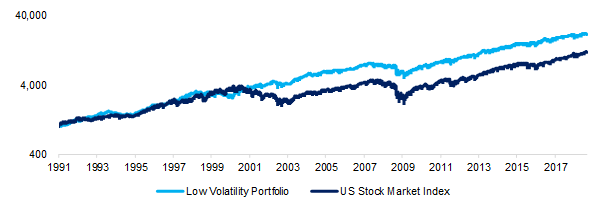

## Table of Contents

## What is low-volatility investing?

Low-volatility investing is a strategy where investors choose stocks or funds that don't go up and down in price as much as others. This means they are less risky because their value doesn't change a lot quickly. People who use this strategy want to protect their money from big losses that can happen in the stock market. They are okay with slower growth if it means their investments are safer.

This type of investing can be good for people who don't like taking big risks with their money. It's often used by people who are close to retiring or those who need steady income from their investments. By picking stocks or funds that are less likely to lose value suddenly, investors can feel more secure about their financial future. However, it's important to remember that even low-volatility investments can still lose value, just not as much or as often as others.

## How does low-volatility investing differ from traditional investing?

Low-volatility investing and traditional investing differ mainly in how much risk they take and how they grow. Traditional investing often involves picking a mix of stocks, some of which might go up a lot but also might go down a lot. This means traditional investing can be riskier because the value of the investments can change a lot. People who do traditional investing are usually okay with this risk because they hope to get bigger rewards over time.

On the other hand, low-volatility investing focuses on picking stocks or funds that don't change in value as much. This makes it less risky because the investments are more stable. People who choose low-volatility investing are more interested in protecting their money from big losses than in getting the biggest possible gains. They are okay with slower growth if it means their investments are safer and more predictable.

## What are the benefits of low-volatility investing?

Low-volatility investing has several benefits. One big benefit is that it helps protect your money from big losses. Since the stocks or funds you pick don't go up and down as much, you don't have to worry as much about losing a lot of money all at once. This can be really helpful if you're close to retiring or if you need steady money from your investments.

Another benefit is that it can help you feel more secure about your financial future. When your investments are more stable, you can plan better because you know they won't change a lot suddenly. This can make you feel more calm and confident, especially during times when the stock market is doing crazy things. So, even though low-volatility investing might grow your money slower, the peace of mind it gives can be worth it.

## Can you explain the risk-return profile of low-volatility stocks?

Low-volatility stocks have a risk-return profile that is different from other stocks. They are less risky because they don't go up and down in price as much. This means you won't see big drops in value like you might with other stocks. But, because they are less risky, they also don't grow as fast. You won't see the big gains that you might get from riskier stocks. So, the trade-off is that you get more safety but less chance for big rewards.

Even though low-volatility stocks grow slower, they can still be a good choice for some people. If you want to protect your money from big losses, these stocks can help you do that. They are good for people who need their investments to be stable and predictable. This can be really important if you're close to retiring or if you need steady income from your investments. So, while you might not get rich quick with low-volatility stocks, they can help you keep your money safe and grow it slowly over time.

## What are some common metrics used to identify low-volatility stocks?

To find low-volatility stocks, people often look at something called the beta of a stock. Beta measures how much a stock's price moves compared to the whole market. If a stock has a low beta, it means it doesn't move up and down as much as the market does. So, a stock with a beta less than 1 is usually thought of as a low-volatility stock.

Another common metric is the standard deviation of a stock's returns. This tells you how much the stock's price has changed over a certain time. If a stock has a low standard deviation, it means its price hasn't changed a lot, which makes it a low-volatility stock. People also look at the historical volatility of a stock, which is just how much its price has moved up and down in the past. If a stock has had low historical volatility, it's likely to keep being a low-volatility stock in the future.

## How has low-volatility investing performed historically compared to the broader market?

Historically, low-volatility investing has often done better than the broader market during times when the market goes down a lot. This is because low-volatility stocks don't lose as much value as other stocks when things get bad. For example, during the financial crisis in 2008, low-volatility stocks didn't drop as much as the rest of the market. This helped people who had these stocks lose less money than those who were invested in the broader market.

However, when the market is doing really well, low-volatility stocks might not grow as fast as other stocks. This means that during good times, people who invest in the broader market might see bigger gains than those who stick with low-volatility stocks. Over the long term, though, low-volatility investing has shown that it can give you good returns with less risk. This makes it a good choice for people who want to protect their money and still see it grow, just not as fast as it might with riskier investments.

## What are the potential drawbacks or limitations of low-volatility investing?

One big problem with low-volatility investing is that it might not grow your money as fast as other types of investing. When the stock market is doing well, low-volatility stocks usually don't go up as much as other stocks. This means if you want to make a lot of money quickly, low-volatility investing might not be the best choice for you. You might miss out on big gains that you could get from riskier stocks.

Another thing to think about is that low-volatility stocks can still lose value. They are less risky, but they are not completely safe. If the whole market goes down a lot, even low-volatility stocks will go down, just not as much. So, you still need to be ready for some losses, even if they are smaller than what you might see with other stocks. This means low-volatility investing is not a way to avoid all risk, just to manage it better.

## How can an investor construct a low-volatility portfolio?

To build a low-volatility portfolio, an investor first needs to find stocks that don't move up and down a lot. They can do this by looking at a stock's beta, which tells you how much a stock's price changes compared to the whole market. A stock with a beta less than 1 is usually a good choice for a low-volatility portfolio. Another thing to check is the standard deviation of a stock's returns, which shows how much the stock's price has changed in the past. Stocks with a low standard deviation are also good picks. By choosing stocks with these traits, an investor can start building a portfolio that is less risky.

Once the investor has picked out some low-volatility stocks, they need to put them together in a way that keeps the whole portfolio stable. This means spreading the money across different kinds of low-volatility stocks, like ones from different industries or from different countries. This helps make sure that if one stock or one industry does badly, it won't hurt the whole portfolio too much. By carefully choosing and mixing these stocks, an investor can create a low-volatility portfolio that grows slowly but safely, helping them protect their money from big losses.

## What role do low-volatility ETFs and mutual funds play in this strategy?

Low-volatility ETFs and mutual funds make it easier for people to use a low-volatility investing strategy without having to pick individual stocks. These funds are made up of a bunch of low-volatility stocks, so when you buy into one of these funds, you're getting a whole bunch of stable stocks all at once. This helps spread out the risk even more because your money is not just in one or two stocks, but in a whole group of them. It's like buying a basket of low-volatility stocks all in one go, which can save time and effort.

Using low-volatility ETFs and mutual funds also helps keep your portfolio balanced and stable. Since these funds are managed by professionals, they do the work of picking and keeping track of the low-volatility stocks for you. This means you don't have to worry about constantly checking and changing your investments to keep them low-risk. By investing in these funds, you can feel more secure about your financial future because they are designed to grow slowly but steadily, protecting your money from big swings in the market.

## How does sector allocation impact the effectiveness of a low-volatility strategy?

Sector allocation can make a big difference in how well a low-volatility strategy works. Some industries, like utilities and consumer staples, usually have stocks that don't go up and down a lot. If you put more of your money into these kinds of sectors, your portfolio can be more stable. But, if you put a lot of money into sectors like technology or energy, which can be more risky, your portfolio might not be as low-volatility as you want. So, choosing the right sectors is important to keep your investments safe and steady.

It's also good to spread your money across different sectors to keep your portfolio balanced. If you only invest in one sector and something bad happens to that sector, it could hurt your whole portfolio. By having money in different sectors, you can protect your investments better. Even though some sectors might be riskier, having a mix can help keep your overall portfolio low-volatility and help you avoid big losses.

## What advanced statistical measures can be used to enhance low-volatility investment strategies?

To make low-volatility investment strategies even better, investors can use something called the Sortino ratio. This measure looks at how much a stock or a portfolio goes up compared to how much it goes down, but it only counts the bad kind of going down, the kind that loses money. By using the Sortino ratio, investors can find stocks that not only don't move a lot but also lose less money when they do move. This can help them pick investments that give them a smoother ride and better protect their money from big drops.

Another advanced measure is Value at Risk (VaR). This tool helps investors figure out the most they could lose in their portfolio over a certain time, like a day or a month, with a certain level of confidence. For example, if the VaR of a portfolio is $10,000 at a 95% confidence level over a month, it means there's a 5% chance the portfolio could lose more than $10,000 in that month. By understanding VaR, investors can better manage the risks in their low-volatility portfolio and make sure it stays as safe as they want it to be.

## How can low-volatility investing be integrated into a broader asset allocation strategy?

Low-volatility investing can be a big part of a broader asset allocation strategy by helping to balance out riskier parts of your investments. If you have some money in stocks that go up and down a lot, you can put some money into low-volatility stocks or funds to make your whole portfolio more stable. This way, if the market goes down, the low-volatility parts won't lose as much value, which can help protect your money overall. By mixing low-volatility investments with other kinds of investments, you can make sure your portfolio grows slowly but safely, which is good if you want to avoid big losses.

Another way to use low-volatility investing in a broader strategy is to adjust how much you put into these investments based on your age or when you need the money. If you're close to retiring or if you need steady income from your investments, you might want to put more money into low-volatility stocks or funds. This can help you feel more secure because these investments are less likely to lose a lot of value suddenly. By thinking about your own situation and goals, you can use low-volatility investing to build a portfolio that fits your needs and helps you sleep better at night.

## What are the Mechanics of Low-Volatility Investing?

Low-volatility investing is an investment approach designed to minimize risk while achieving steady returns. This approach can be segmented into different styles: low-volatility, minimum variance, and smart beta, each with its unique characteristics and applications.

**Low-Volatility Investment Styles**: 
1. **Low-Volatility**: This strategy focuses on identifying stocks or other securities with lower price fluctuations. The idea is that by investing in less volatile securities, investors can achieve a more stable return profile. These investments are often seen as a refuge during periods of market turmoil, providing a cushion against severe market drops.

2. **Minimum Variance**: This strategy involves constructing a portfolio that aims to achieve the lowest possible variance, or risk, while still meeting return goals. By optimizing the portfolio's composition, investors attempt to reduce the overall volatility. The mathematical model for selecting the minimum variance portfolio involves solving:
$$
   \text{Minimize} \quad \sigma^2_p = w^T \Sigma w

$$

   Subject to:
$$
   \sum w_i = 1

$$

   Here, $w$ represents the weight of each asset in the portfolio, and $\Sigma$ is the covariance matrix of asset returns.

3. **Smart Beta**: This strategy attempts to capture specific systematic factors, like low volatility, beyond traditional cap-weighted indices. Unlike traditional indexing, smart beta approaches allow for the selection and weighting of securities based on various factors or rules rather than market capitalization alone.

**Algorithmic Trading and Low-Volatility Strategies**:
Algorithmic trading platforms integrate low-volatility strategies by using historical data and computing power to identify and execute trades that adhere to low-volatility criteria. These systems can rapidly adjust portfolios based on market conditions or new data to preserve the low-volatility nature. Algorithms can identify subtle market trends, correlations, and statistical anomalies that humans might overlook, thus optimizing the performance of low-volatility strategies.

**Role of Asset Managers and Hedge Funds**:
Asset managers and [hedge fund](/wiki/hedge-fund-trading-strategies)s play a pivotal role in low-volatility investing. They design products, such as exchange-traded funds (ETFs) and mutual funds, that focus on low-volatility or minimum variance strategies. By actively managing these funds, they aim to provide attractive risk-adjusted returns. Additionally, hedge funds often employ algorithmic models to exploit market inefficiencies related to volatility, dynamically adjusting their portfolios to optimize the risk-return profile.

Asset managers with a focus on low-volatility investing often combine quantitative models with [fundamental analysis](/wiki/fundamental-analysis) to achieve their goals. This comprehensive approach ensures a personalized strategy, minimizing risk while striving for consistent returns.

As financial markets evolve and technology advances, the mechanics of low-volatility investing are likely to become more sophisticated. Whether through traditional strategies or [algorithmic trading](/wiki/algorithmic-trading), the principles of low-volatility investing remain integral to managing and understanding risk in investment portfolios.

## What is the analysis of performance?

Low-volatility investing suggests that stocks with lower volatility can yield better risk-adjusted returns than their high-volatility counterparts. This is backed by empirical research indicating that low-volatility stocks have historically outperformed higher-volatility stocks over the long term. One significant tool in assessing this performance is Jensen's alpha, which helps evaluate the excess returns of a portfolio over the expected return predicted by the Capital Asset Pricing Model (CAPM).

### Jensen's Alpha as a Performance Metric

Jensen's alpha is defined as:

$$
\alpha = R_i - \left( R_f + \beta \times (R_m - R_f) \right)
$$

where:
- $R_i$ is the actual return of the portfolio.
- $R_f$ is the risk-free rate.
- $\beta$ is the portfolio's beta.
- $R_m$ is the return of the market.

A positive $\alpha$ indicates that the portfolio has outperformed the expected returns, which makes it a crucial measure in supporting the viability of low-volatility strategies. Historically, funds and portfolios employing low-volatility strategies have consistently shown positive Jensen's alpha, particularly in stable or declining markets.

### Challenges During Different Market Phases

Despite these promising findings, low-volatility strategies aren't foolproof and face challenges during different market phases. In bullish phases when markets rally, high-volatility stocks often outperform due to their higher beta, capturing the broader market's substantial upward movements more effectively than low-volatility stocks. Resultant underperformance in such periods can detract from Low-volatility strategies' overall appeal.

Additionally, in a rising [interest rate](/wiki/interest-rate-trading-strategies) environment, low-volatility strategies may struggle. Investors might shift toward bonds and other interest-sensitive assets, reducing the capital flow into low-volatility stocks. Hence, understanding the broader economic context and market cycle is essential when considering low-volatility strategies within investment portfolios.

Overall, while low-volatility investing has demonstrated potential for superior long-term risk-adjusted returns using metrics such as Jensen's alpha, investors need to bear in mind the contextual challenges it can face during distinct market phases.

## References & Further Reading

[1]: Baker, M., Bradley, B., & Wurgler, J. (2011). ["Benchmarks as Limits to Arbitrage: Understanding the Low-Volatility Anomaly."](https://pages.stern.nyu.edu/~jwurgler/papers/wurgler_bradley_baker.pdf) Financial Analysts Journal, 67(1), 40-54.

[2]: Frazzini, A., & Pedersen, L. H. (2014). ["Betting Against Beta."](https://papers.ssrn.com/sol3/papers.cfm?abstract_id=2049939) Journal of Financial Economics, 111(1), 1-25.

[3]: MSCI Inc. (n.d.). ["MSCI Minimum Volatility Indexes."](https://www.msci.com/indexes/group/minimum-volatility-indexes)

[4]: S&P Dow Jones Indices. (n.d.). ["S&P 500 Low Volatility Index."](https://www.spglobal.com/spdji/en/indices/dividends-factors/sp-500-low-volatility-index/)

[5]: Fama, E. F., & French, K. R. (1992). ["The Cross-Section of Expected Stock Returns."](https://onlinelibrary.wiley.com/doi/abs/10.1111/j.1540-6261.1992.tb04398.x) Journal of Finance, 47(2), 427-465.

[6]: Blitz, D., & van Vliet, P. (2007). ["The Volatility Effect: Lower Risk without Lower Return."](https://papers.ssrn.com/sol3/papers.cfm?abstract_id=980865) Journal of Portfolio Management, 34(1), 102-113.

[7]: Ang, A., Hodrick, R. J., Xing, Y., & Zhang, X. (2006). ["The Cross-Section of Volatility and Expected Returns."](https://onlinelibrary.wiley.com/doi/full/10.1111/j.1540-6261.2006.00836.x) Journal of Finance, 61(1), 259-299.