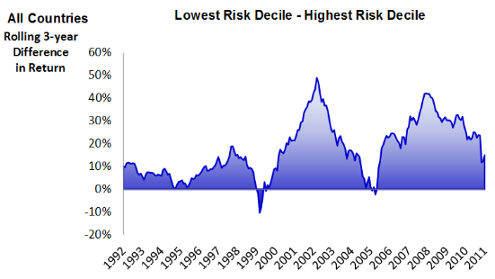

Algorithmic trading, commonly referred to as algo trading, employs automated systems to execute trades within financial markets. These sophisticated systems use pre-programmed instructions that account for variables such as timing, price, and volume to optimize trading performance. Algo trading is particularly significant in today's fast-paced markets, where speed and accuracy are vital for capitalizing on fleeting opportunities.

This article focuses on the utilization of low volatility stocks in algorithmic trading. Low volatility stocks are characterized by their relatively stable prices and reduced risk, offering an appealing option for investors seeking steady returns with minimized risk exposure. These stocks exhibit less price fluctuation, making them reliable components in portfolios, especially during turbulent market conditions.



Low volatility stocks are appealing in algo trading due to their predictable nature, which aligns well with systematic trading strategies aimed at consistent performance. This article explores the role of these stocks in algorithmic trading, assessing their benefits, challenges, and the strategic approaches for their effective use. Understanding the dynamics of low volatility stocks in automated trading can provide valuable insights for traders seeking to enhance their risk-adjusted returns in diverse market environments.

## Table of Contents

## Understanding Low Volatility Stocks

Low volatility stocks are characterized by their relatively stable prices and minimal fluctuations compared to the broader market. This stability is often quantified using a statistical measure known as beta, which assesses a stock's volatility in relation to the market. Low volatility stocks typically exhibit a beta of less than one, indicating that their price movements are less volatile than the market average.

These stocks are predominantly found in sectors such as utilities and consumer staples. Companies in these sectors are noted for having consistent earnings and reliable dividends, which contribute to their price stability. For instance, utility companies provide essential services like electricity and water, which are always in demand regardless of economic conditions. Similarly, consumer staples include goods like food and household products, which remain necessities irrespective of economic cycles.

Investing in low volatility stocks offers several benefits, with risk reduction being a primary advantage. These stocks help in dampening the overall risk of a portfolio, making them a favored choice for risk-averse investors. By cushioning against significant market downturns, they provide a degree of protection that can be crucial during periods of market turbulence.

Moreover, low [volatility](/wiki/volatility-trading-strategies) stocks can deliver consistent returns over time, aligning well with the needs of investors seeking steady income rather than speculative gains. Their stable nature also means that they attract investors with a long-term outlook, who are less concerned with short-term market fluctuations.

However, the trade-off for this stability is often a reduced potential for high returns during market rallies. During bullish market phases, low volatility stocks may not appreciate as rapidly as their high volatility counterparts. Therefore, while they contribute to a balanced portfolio by reducing risk, they might not fulfill the aggressive growth aspirations during booming market conditions.

In summary, low volatility stocks are an integral component of a well-diversified investment portfolio, particularly for those prioritizing lower risk and consistent returns. Their unique characteristics make them an attractive option for mitigating the uncertainties inherent in financial markets.

## The Role of Low Volatility Stocks in Algo Trading

Algorithmic trading leverages low volatility stocks due to their inherent stability and predictability, making them ideal candidates for systematic trading strategies. These stocks, characterized by less price fluctuation, provide a solid foundation for algorithms designed to exploit consistent market behaviors and patterns.

Algorithms in trading are typically programmed to respond to specific signals derived from the historical performance data of low volatility stocks. These signals might include moving averages, mean reversion patterns, or volatility [breakout](/wiki/breakout-trading) indicators. By focusing on predictable stocks, algorithms can more reliably execute trades with high precision based on historical metrics.

For example, consider an algorithm designed to take advantage of mean reversion. It might monitor a stock's price relative to its historical average and execute buy or sell orders when deviations occur, anticipating a return to the mean. The formula for a simple mean reversion strategy might involve calculating the Z-score:

$$
\text{Z-score} = \frac{(X_t - \mu)}{\sigma}
$$

where $X_t$ is the current price, $\mu$ is the mean of historical prices, and $\sigma$ is the standard deviation. The algorithm will trigger trades by entering positions when the Z-score exceeds predefined thresholds.

Furthermore, the use of low volatility stocks can mitigate risks in volatile market conditions. Algorithms running on such stocks are less susceptible to drastic market movements, contributing to reduced exposure to extreme risks. In periods of market turbulence, algorithms can exploit the relative stability of low volatility stocks, thereby optimizing the risk-return profile of the trading strategy.

Overall, low volatility stocks serve as a robust framework for [algorithmic trading](/wiki/algorithmic-trading), where consistency and risk management are crucial. The integration of historical performance data and advanced pattern detection allows algorithms to effectively leverage the low volatility anomaly, enhancing the potential for stable and consistent trading outcomes.

## Benefits and Challenges

Low volatility stocks present a range of benefits within algorithmic trading strategies. One of the primary advantages is the reduced risk associated with these stocks. Due to their lower price fluctuations, they contribute to a more stable investment portfolio. This characteristic is quantified using metrics like beta, with low volatility stocks exhibiting a beta less than 1, indicating lower deviation compared to the market. Consequently, investors find these stocks attractive for aligning with long-term investment strategies that prioritize stability and risk mitigation.

Another benefit is the potential for consistent returns. Low volatility stocks tend to come from sectors with stable earnings, such as utilities or consumer staples, which generally provide reliable dividends and less earnings volatility. This consistency is appealing for algorithmic models that rely on historical performance to predict future stock behavior, enabling algorithms to execute trades with higher confidence during varying market conditions.

Despite these advantages, there are notable challenges when incorporating low volatility stocks in algo trading strategies. One such challenge is the reduced potential for gains during bull markets. During periods of market upswing, low volatility stocks typically underperform compared to high-volatility counterparts, which can limit the upside potential of an investment portfolio focused heavily on these stocks.

Additionally, the increasing popularity of low volatility stocks can lead to overvaluation. As more investors are drawn to these stocks for their perceived stability, demand can drive prices up, which may inflate valuations and compress future returns. This crowding effect can pose a dilemma for algorithmic strategies that must continually adapt to an evolving market landscape and the changing risk-return profile of these stocks. 

Navigating these benefits and challenges effectively requires a strategic approach, often involving diversified algorithmic models that can account for varying market conditions and investor behaviors.

## Strategies for Implementing Low Volatility Stocks in Algo Trading

Implementing low volatility stocks in algorithmic trading requires strategic approaches that leverage the unique characteristics of these stocks. Three prominent strategies include mean reversion, [momentum](/wiki/momentum) strategies, and the utilization of [machine learning](/wiki/machine-learning) to enhance stock selection and timing.

### Mean Reversion Strategies

Mean reversion strategies are grounded in the idea that stock prices tend to revert to their historical average over time. Low volatility stocks, known for their stable price patterns, are particularly amenable to this approach. The strategy involves:

1. **Identifying Deviations**: Algorithms are designed to detect when a stock's price significantly deviates from its moving average. This can be accomplished using indicators like Bollinger Bands, which illustrate price behavior relative to moving averages.

2. **Automated Trading**: When a stock's price deviates beyond a certain threshold, the algorithm triggers a buy or sell action, anticipating a return to the mean.

3. **Mathematical Modeling**: Simple mathematical models, such as the Ornstein-Uhlenbeck process, can help quantify mean-reverting behavior. The stock price $(S_t)$ is modeled as:
$$
   dS_t = \theta (\mu - S_t) dt + \sigma dW_t

$$

   where $\theta$ is the speed of reversion, $\mu$ is the long-term mean, $\sigma$ is the volatility, and $dW_t$ represents a Wiener process.

Implementing these models helps algo traders systematically capture profits from expected price movements back to the average.

### Momentum Strategies

Momentum strategies focus on harnessing the inertia in stock price trends. Rather than assuming reversion to a mean, this approach targets prolonged movements in one direction, which can occur even in low volatility stocks:

1. **Signal Extraction**: Algorithms employ moving averages, the Relative Strength Index (RSI), or other momentum indicators to identify strong directional trends in stock price movements.

2. **Execution of Trades**: Once a momentum signal is confirmed, trades are executed to profit from the continuation of the trend. For instance, a crossover of short-term moving average over a long-term moving average may signal a buying opportunity.

3. **Risk Management**: Stop-loss and take-profit orders are essential to guard against trend reversals. The strategy thrives on the ability to cut losses quickly and let profits run.

### Machine Learning for Stock Selection and Prediction

The complexity of financial markets inspires the use of machine learning (ML) techniques to enhance prediction accuracy and selection of low volatility stocks:

1. **Feature Engineering**: ML models are trained on historical data with features such as price volatility, trading volume, and economic indicators. This process helps in identifying stable stock candidates with predictable price behavior.

2. **Predictive Modeling**: Techniques like decision trees, support vector machines, and deep learning models are employed to predict future price movements and volatility levels. These models can account for non-linear relationships in the data.

3. **Adaptive Algorithms**: Machine learning allows for adaptive algorithms that evolve with the market. By continuously learning from new data, these systems are able to adjust trading strategies in real-time, maintaining their relevance even in uncertain markets.

```python
# Example: Using ML to predict future volatility
from sklearn.ensemble import RandomForestRegressor
import numpy as np
import pandas as pd

# Sample data generation
np.random.seed(0)
dates = pd.date_range('20210101', periods=100)
price_data = np.random.randn(100).cumsum() + 100
volatility_data = np.random.rand(100) * 0.05

df = pd.DataFrame({'Price': price_data, 'Volatility': volatility_data}, index=dates)

# Features and target
X = df['Price'].values.reshape(-1, 1)
y = df['Volatility'].values

# Model Training
model = RandomForestRegressor(n_estimators=100, random_state=42)
model.fit(X, y)

# Predict future volatility
future_prices = np.array([110, 115, 120]).reshape(-1, 1)
future_volatility_prediction = model.predict(future_prices)

print(future_volatility_prediction)
```

By integrating these strategies, algorithmic traders can effectively harness low volatility stocks to achieve optimal performance. Each strategy offers nuanced ways to navigate market conditions and leverages the distinct advantages of algorithmic trading to maximize returns while managing risks.

## Backtesting and Performance Evaluation

Backtesting is a crucial process in algorithmic trading that allows traders to simulate the performance of trading strategies using historical market data. This process provides insights into how a strategy might perform under different market conditions and is particularly valuable when assessing the viability of strategies involving low volatility stocks.

To conduct an effective backtest, traders typically rely on historical price data for the specific stocks they are interested in, alongside data on market indices and other financial instruments. The essential metrics evaluated in [backtesting](/wiki/backtesting) include returns, volatility, and drawdowns:

1. **Returns**: This metric measures the profit or loss generated by a strategy. Returns for low volatility stocks are often more consistent but potentially lower compared to high volatility stocks. Calculating the average annual return gives a snapshot of the strategy's profitability over time. The formula for calculating returns is:
$$
   \text{Return} = \frac{\text{Ending Portfolio Value} - \text{Starting Portfolio Value}}{\text{Starting Portfolio Value}}

$$

2. **Volatility**: This measures the degree of variation in stock prices over time. Lower volatility stocks, by definition, should exhibit less price fluctuation, resulting in a smoother equity curve in backtest results. Standard deviation is commonly used to quantify volatility. In Python, volatility can be calculated using:

   ```python
   import numpy as np

   def calculate_volatility(price_series):
       return np.std(np.diff(np.log(price_series))) * np.sqrt(252)  # Annualized volatility
   ```

3. **Drawdowns**: These represent the decline from a peak to a trough in the portfolio's value and are crucial for understanding the risk associated with a strategy. A smaller maximum drawdown indicates a strategy's robustness against adverse market conditions. The formula for drawdown is:
$$
   \text{Drawdown} = \frac{\text{Peak Portfolio Value} - \text{Trough Portfolio Value}}{\text{Peak Portfolio Value}}

$$

To determine the suitability of low volatility stocks in algorithmic trading, these metrics provide foundational insights. Strategies that focus on such stocks aim to achieve a balanced trade-off between risk and reward, leveraging the stability of low volatility stocks to enhance consistency in returns. Proper performance evaluation helps in filtering out any strategies that could lead to significant capital erosion or suboptimal results.

Successful backtesting ensures a strategy is not optimized solely for past data, a phenomenon known as overfitting. Continuous evaluation and adaptation are essential, accompanied by forward-testing or paper trading in live markets before substantial capital commitments. This approach ensures that algorithmic strategies involving low volatility stocks can withstand the variances and unpredictabilities of actual market conditions while aligning with the trader's risk tolerance and investment goals.

## Real-World Examples and Case Studies

Low volatility strategies have garnered attention within investment circles, particularly through exchange-traded funds (ETFs) that track indices specifically designed around low volatility criteria. One notable example is the Invesco S&P 500® Low Volatility [ETF](/wiki/etf-trading-strategies), which aims to replicate the performance of the S&P 500 Low Volatility Index. This index systematically selects the 100 least volatile stocks from the S&P 500, offering investors exposure to companies with historically stable prices. The success of this ETF underscores how low volatility strategies can attract investors who prioritize minimized risk and consistent returns over aggressive growth.

Various funds and portfolio managers have adopted low volatility strategies due to their beneficial risk-adjusted returns. For instance, the Vanguard Global Minimum Volatility Fund integrates globally diversified holdings structured to yield lower volatility than the broader market. By prioritizing stocks with stable earnings and price stability across different regions, the fund demonstrates the utility of low volatility strategies in crafting resilient investment portfolios.

Prominent figures in the investment community also advocate for low volatility approaches. Among them is Robert Haugen, a pioneering figure in the development of low volatility theories, who has argued through studies and analysis that low volatility stocks do not necessarily sacrifice returns for stability. Haugen's research has often highlighted that stocks with lower volatility may outperform more volatile stocks on a risk-adjusted basis over time, providing a theoretical foundation for the widespread integration of these strategies into practical applications.

Another key player embracing low volatility strategies is BlackRock, one of the world's largest asset managers. BlackRock employs low volatility investment models through its iShares range of ETFs. These models seek to exploit the low volatility anomaly, where stocks with lower volatility yield higher risk-adjusted returns than would be suggested by traditional finance theories. The firm's successful navigation in this domain serves as a testament to the practical application of low volatility strategies and the pacifying effect they have on portfolios during market fluctuations.

In conclusion, the use of low volatility strategies is not merely theoretical but has practical, real-world applications among significant funds and investment managers. With the backing of empirical research and investment theory, these examples illustrate the potential for low volatility strategies to offer stable returns while mitigating risk, appealing to a broad range of investors in various market conditions.

## Future Trends and Developments

The future of algorithmic trading in low volatility stocks is increasingly being shaped by advancements in [artificial intelligence](/wiki/ai-artificial-intelligence) (AI) and machine learning (ML). These technologies have the potential to vastly improve the predictive capabilities of trading algorithms, allowing for more nuanced analysis of market patterns and enhanced adaptability to changing conditions. Machine learning models can handle large datasets to identify subtle patterns that traditional analysis might miss, offering a competitive edge in crafting effective trading strategies.

AI-driven algorithms can continuously refine their trading models based on live data input, gradually improving accuracy over time. This adaptability is particularly beneficial in predicting low volatility periods, enabling traders to make informed decisions with reduced risk. Moreover, machine learning approaches such as [reinforcement learning](/wiki/reinforcement-learning) can be used to optimize portfolios by dynamically adjusting the asset allocation in response to market movements.

Python code snippets are becoming increasingly integral for implementing these machine learning models. For instance, using libraries such as TensorFlow or Scikit-learn, algo traders can quickly prototype and deploy models that learn from historical market data:

```python
import numpy as np
from sklearn.ensemble import RandomForestClassifier

# Sample data: features and target
X = np.array([[0.05, 0.10], [0.20, 0.15], [0.10, 0.40], [0.50, 0.30]])
y = np.array([0, 1, 0, 1])  # 0: low volatility, 1: high volatility

# Initialize and fit the model
model = RandomForestClassifier()
model.fit(X, y)

# Predict future volatility state
new_data = np.array([[0.07, 0.12]])
prediction = model.predict(new_data)
```

Regulatory developments are also poised to influence how such strategies are implemented. With financial markets evolving, regulators are increasingly focused on ensuring that algorithmic trading practices remain fair and transparent. Upcoming regulations may seek to govern the use of AI in trading, focusing on aspects such as data privacy, algorithmic accountability, and systemic risk management. These changes aim to protect investors and maintain market stability but may also pose compliance challenges for trading firms as they adapt their strategies to align with new rules.

Overall, the integration of AI and ML in trading low volatility stocks represents a significant leap forward, optimizing returns while curbing risks. However, market participants must stay abreast of regulatory requirements to effectively leverage these advancements. As such, continuous innovation coupled with regulatory mindfulness will characterize the future landscape of algorithmic trading in low volatility environments.

## Conclusion

Low volatility stocks represent a compelling addition to the portfolios of algorithmic traders, particularly for those prioritizing risk mitigation. These stocks, characterized by their historically stable price movements and lower risk profiles, provide a strategic advantage in crafting algorithmic trading strategies that prioritize consistent returns and portfolio resilience. In algorithmic trading, the systematic and strategic approach can be fully leveraged to exploit the low volatility effect, allowing algorithms to execute trades with precision based on historical patterns and metrics. This reduces the impact of market noise and enhances the predictability of trading outcomes.

Advancements in technology play a pivotal role in refining trading strategies involving low volatility stocks. With the integration of cutting-edge tools like artificial intelligence and machine learning, traders can achieve greater predictive accuracy and adaptability. These technologies enable algorithms to process vast amounts of data, recognize complex patterns, and make informed trading decisions. Consequently, algorithmic strategies incorporating low volatility stocks are poised to become more efficient and globally applicable, adapting dynamically to changing market conditions.

As financial markets continue to evolve, the fusion of low volatility stock investment and advanced algorithmic trading methodologies will offer investors an enhanced toolkit for minimizing risk while pursuing stable returns. This synergy promises to shape the future of trading, making low volatility stocks an integral component of sophisticated, data-driven investment strategies.

## References & Further Reading

[1]: Ang, A. (2014). ["Asset Management: A Systematic Approach to Factor Investing."](https://www.amazon.com/Asset-Management-Systematic-Investing-Association/dp/0199959323) Oxford University Press.

[2]: Blitz, D. C., & van Vliet, P. (2007). ["The Volatility Effect: Lower Risk Without Lower Return."](https://papers.ssrn.com/sol3/papers.cfm?abstract_id=980865) Journal of Portfolio Management, 34(1), 102-113.

[3]: BlackRock. ["Minimum Volatility: A Long Sojourn is Overrated."](https://www.ishares.com/us/insights/what-is-min-vol) Accessed via BlackRock Market Insights.

[4]: Haugen, R. A., & Baker, N. L. (1991). ["The Efficient Market Inefficiency of Capitalization-Weighted Stock Portfolios."](http://www.efalken.com/LowVolClassics/HaugenBaker991.pdf) Journal of Portfolio Management, 17(3), 35-40.

[5]: Invesco. ["Invesco S&P 500® Low Volatility ETF."](https://www.invesco.com/us/financial-products/etfs/product-detail?audienceType=investors&productId=splv) Product details and strategy insights.