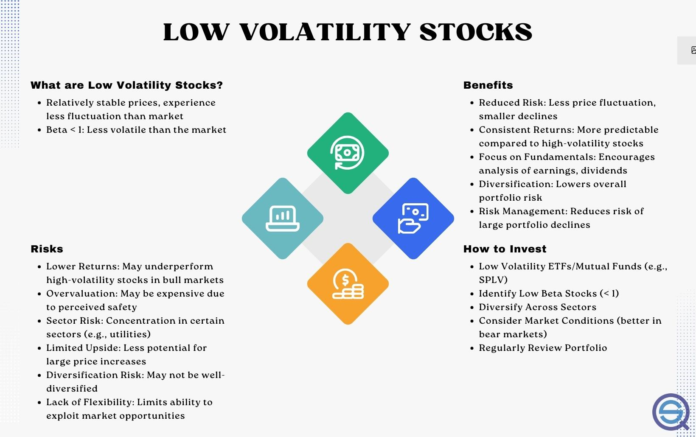

## Table of Contents

## What is a low volatility stock?

A low volatility stock is a type of stock that doesn't go up and down in price very much. This means that the price of the stock stays pretty steady over time. Investors like these stocks because they are less risky. They don't lose as much money when the market goes down, and they don't gain as much when the market goes up.

These stocks are often found in big, stable companies that have been around for a long time. Examples might include utility companies or big consumer goods companies. People who are close to retirement or who don't like taking big risks with their money often choose to invest in low volatility stocks. They want to keep their money safe and avoid big losses.

## Why might investors be interested in a low volatility stocks strategy?

Investors might be interested in a low volatility stocks strategy because it helps them avoid big ups and downs in their investments. When the stock market goes through rough times, low volatility stocks don't lose as much value as other stocks. This can give investors peace of mind, knowing their money is safer. It's like choosing a calm, steady ride instead of a roller coaster.

Another reason is that low [volatility](/wiki/volatility-trading-strategies) stocks can still grow over time, just not as fast as high-risk stocks. This steady growth can be good for people who want their money to grow slowly but surely. It's especially useful for people who are getting close to retirement or who don't want to take big risks with their money. They can sleep better at night knowing their investments are not going to suddenly drop in value.

## How does a low volatility stock differ from a high volatility stock?

A low volatility stock is one that doesn't change its price a lot over time. It stays pretty steady, going up or down just a little bit. This means it's less risky because it doesn't lose a lot of value when the market goes down. People who don't like taking big risks with their money often choose these stocks. They want to keep their money safe and avoid big losses.

On the other hand, a high volatility stock changes its price a lot. It can go up and down by a lot in a short time. This makes it riskier because you can lose a lot of money if the stock price drops suddenly. But, if the stock price goes up a lot, you can also make a lot of money. People who are okay with taking bigger risks and want the chance to make more money might choose high volatility stocks.

## What are the key metrics used to identify low volatility stocks?

To find low volatility stocks, investors look at a few important numbers. One key metric is the stock's beta. Beta measures how much a stock moves compared to the overall market. A beta of less than 1 means the stock is less volatile than the market. Another important number is the standard deviation of the stock's returns. This shows how much the stock's price changes over time. A lower standard deviation means the stock's price stays more steady.

Another metric used is the stock's historical volatility. This looks at how much the stock's price has moved in the past. If a stock has had small price changes over time, it might be a low volatility stock. Investors also look at the stock's drawdown, which is the biggest drop in the stock's price from its highest point. A smaller drawdown means the stock is less risky. By looking at these numbers, investors can find stocks that are likely to be less volatile.

## Can you explain the basic principles behind a low volatility stocks strategy?

A low volatility stocks strategy is all about choosing stocks that don't move up and down a lot in price. This means the stocks are less risky because they don't lose much value when the market goes down. Investors who follow this strategy want to keep their money safe. They're okay with not making as much money as they might with riskier stocks, but they also don't want to lose a lot. It's like choosing a calm, steady ride instead of a roller coaster.

People often use this strategy when they are close to retirement or if they don't like taking big risks with their money. They want their investments to grow slowly but surely, without big ups and downs. By [picking](/wiki/asset-class-picking) stocks with low volatility, they can sleep better at night knowing their money is safer. It's a way to balance the need for some growth with the desire to avoid big losses.

## What are the historical performance trends of low volatility stocks?

Historically, low volatility stocks have shown that they can do well, but in a different way than high volatility stocks. They don't go up and down as much, so they don't lose as much money when the market is doing badly. This means they can give investors a smoother ride. Over long periods of time, low volatility stocks have often done better than the overall market, especially during times when the market is falling. This is because they don't drop as much as other stocks, so they keep more of their value.

However, low volatility stocks usually don't grow as fast as high volatility stocks when the market is doing well. They might miss out on some of the big gains that come with taking more risk. But for many investors, the trade-off is worth it. They want to keep their money safe and avoid big losses. So, while low volatility stocks might not make you rich quickly, they can help you keep your money safe and grow it slowly over time.

## How does a low volatility stocks strategy fit into a broader investment portfolio?

A low volatility stocks strategy can be a good part of a bigger investment plan. It helps balance out the riskier parts of your portfolio. If you have some stocks that go up and down a lot, adding low volatility stocks can make your whole portfolio less risky. This is good for people who want to keep their money safe while still having some chance to make money. By mixing in low volatility stocks, you can avoid big losses when the market goes down.

Low volatility stocks can also help you sleep better at night. They don't lose as much value when the market falls, so your overall investments won't drop as much. This can be especially useful for people who are close to retirement or who don't like taking big risks. While these stocks might not grow as fast as riskier ones, they can still grow over time. So, they can help your money grow slowly and steadily, which is a good part of a well-rounded investment plan.

## What are the potential risks and drawbacks of focusing on low volatility stocks?

One risk of focusing on low volatility stocks is that they might not grow as fast as other stocks. When the stock market is doing well, high volatility stocks can go up a lot and make more money. But low volatility stocks might not go up as much, so you could miss out on big gains. If you only invest in low volatility stocks, you might not make as much money over time as someone who takes more risks.

Another drawback is that even though low volatility stocks are usually safer, they can still lose money. Nothing is completely safe in the stock market. If something bad happens to the company or the whole market goes down a lot, even low volatility stocks can drop in value. So, while they are less risky, they're not risk-free. It's important to know that and not think your money is totally safe just because you're investing in low volatility stocks.

## How can an investor implement a low volatility stocks strategy?

To start using a low volatility stocks strategy, an investor first needs to find stocks that don't go up and down a lot in price. They can do this by looking at numbers like beta, standard deviation, and historical volatility. A low beta, a small standard deviation, and steady past price changes mean a stock might be low volatility. Investors can use websites, financial news, and tools like stock screeners to find these stocks. Once they have a list, they can pick the ones that fit their goals and start buying them.

After choosing the stocks, the investor needs to keep an eye on their investments. Even though low volatility stocks are safer, it's still good to check on them from time to time. The investor might need to make changes if something big happens to the company or if the market changes a lot. By sticking with this strategy, the investor can aim for slow and steady growth, which can be a good way to keep their money safe while still making some money over time.

## What are some advanced techniques for optimizing a low volatility stocks portfolio?

One advanced way to make a low volatility stocks portfolio even better is to use something called sector rotation. This means looking at different parts of the economy, like technology, health care, or utilities, and figuring out which ones are doing well at different times. By moving money into the sectors that are less likely to go up and down a lot, you can make your portfolio even safer. Another technique is to use something called risk parity. This means balancing your investments so that each part of your portfolio has the same amount of risk. It can help make sure that no single stock or sector can hurt your whole portfolio too much.

Another way to improve your low volatility stocks portfolio is to use options strategies. Options are like contracts that give you the right to buy or sell a stock at a certain price. By using options, you can protect your stocks from big drops in price. This is called hedging. It's like buying insurance for your stocks. You can also use something called dividend reinvestment. This means taking the money you get from stock dividends and using it to buy more shares of the same stock. Over time, this can help your investments grow even if the stock prices don't go up a lot. By using these advanced techniques, you can make your low volatility stocks portfolio work even better for you.

## How do market conditions affect the effectiveness of a low volatility stocks strategy?

Market conditions can really change how well a low volatility stocks strategy works. When the market is going down a lot, low volatility stocks can be a big help. They don't lose as much value as other stocks, so your money stays safer. This is great for times when the economy is not doing well, and you want to avoid big losses. But, when the market is going up a lot, low volatility stocks might not make as much money as other stocks. They grow slowly, so you could miss out on bigger gains if you only stick with low volatility stocks during good times.

It's also important to know that different parts of the market can affect low volatility stocks in different ways. For example, if interest rates go up, it might hurt companies that borrow a lot of money, even if they are low volatility. Or, if there's a lot of uncertainty in the market, people might move their money into safer stocks, which could help low volatility stocks do better. So, it's good to keep an eye on what's happening in the market and be ready to make changes to your strategy if things change a lot.

## What are the latest research findings on the efficacy of low volatility stocks strategies?

Recent research shows that low volatility stocks can still be a good choice for investors who want to keep their money safe. Studies have found that these stocks often do better than the overall market during bad times. This means they lose less money when the market goes down. Researchers have also looked at long-term data and found that low volatility stocks can beat the market over many years, even though they don't grow as fast as riskier stocks. This is because they keep more of their value during market downturns.

However, some new research has pointed out that the benefits of low volatility stocks might not be as big as they used to be. More investors are using this strategy now, so it's not as special as it once was. This means the extra returns you might get from low volatility stocks could be smaller. Also, some studies have found that other factors, like how big a company is or how much it's growing, can affect how well low volatility stocks do. So, while low volatility stocks can still be a good choice, it's important to think about other things too when you're making your investment plan.

## What is the Role of Low Volatility Stocks in Algo Trading?

Algorithmic trading leverages low volatility stocks due to their inherent stability and predictability, making them ideal candidates for systematic trading strategies. These stocks, characterized by less price fluctuation, provide a solid foundation for algorithms designed to exploit consistent market behaviors and patterns.

Algorithms in trading are typically programmed to respond to specific signals derived from the historical performance data of low volatility stocks. These signals might include moving averages, mean reversion patterns, or volatility [breakout](/wiki/breakout-trading) indicators. By focusing on predictable stocks, algorithms can more reliably execute trades with high precision based on historical metrics.

For example, consider an algorithm designed to take advantage of mean reversion. It might monitor a stock's price relative to its historical average and execute buy or sell orders when deviations occur, anticipating a return to the mean. The formula for a simple mean reversion strategy might involve calculating the Z-score:

$$
\text{Z-score} = \frac{(X_t - \mu)}{\sigma}
$$

where $X_t$ is the current price, $\mu$ is the mean of historical prices, and $\sigma$ is the standard deviation. The algorithm will trigger trades by entering positions when the Z-score exceeds predefined thresholds.

Furthermore, the use of low volatility stocks can mitigate risks in volatile market conditions. Algorithms running on such stocks are less susceptible to drastic market movements, contributing to reduced exposure to extreme risks. In periods of market turbulence, algorithms can exploit the relative stability of low volatility stocks, thereby optimizing the risk-return profile of the trading strategy.

Overall, low volatility stocks serve as a robust framework for [algorithmic trading](/wiki/algorithmic-trading), where consistency and risk management are crucial. The integration of historical performance data and advanced pattern detection allows algorithms to effectively leverage the low volatility anomaly, enhancing the potential for stable and consistent trading outcomes.

## What are the strategies for implementing low volatility stocks in algo trading?

Implementing low volatility stocks in algorithmic trading requires strategic approaches that leverage the unique characteristics of these stocks. Three prominent strategies include mean reversion, [momentum](/wiki/momentum) strategies, and the utilization of [machine learning](/wiki/machine-learning) to enhance stock selection and timing.

### Mean Reversion Strategies

Mean reversion strategies are grounded in the idea that stock prices tend to revert to their historical average over time. Low volatility stocks, known for their stable price patterns, are particularly amenable to this approach. The strategy involves:

1. **Identifying Deviations**: Algorithms are designed to detect when a stock's price significantly deviates from its moving average. This can be accomplished using indicators like Bollinger Bands, which illustrate price behavior relative to moving averages.

2. **Automated Trading**: When a stock's price deviates beyond a certain threshold, the algorithm triggers a buy or sell action, anticipating a return to the mean.

3. **Mathematical Modeling**: Simple mathematical models, such as the Ornstein-Uhlenbeck process, can help quantify mean-reverting behavior. The stock price $(S_t)$ is modeled as:
$$
   dS_t = \theta (\mu - S_t) dt + \sigma dW_t

$$

   where $\theta$ is the speed of reversion, $\mu$ is the long-term mean, $\sigma$ is the volatility, and $dW_t$ represents a Wiener process.

Implementing these models helps algo traders systematically capture profits from expected price movements back to the average.

### Momentum Strategies

Momentum strategies focus on harnessing the inertia in stock price trends. Rather than assuming reversion to a mean, this approach targets prolonged movements in one direction, which can occur even in low volatility stocks:

1. **Signal Extraction**: Algorithms employ moving averages, the Relative Strength Index (RSI), or other momentum indicators to identify strong directional trends in stock price movements.

2. **Execution of Trades**: Once a momentum signal is confirmed, trades are executed to profit from the continuation of the trend. For instance, a crossover of short-term moving average over a long-term moving average may signal a buying opportunity.

3. **Risk Management**: Stop-loss and take-profit orders are essential to guard against trend reversals. The strategy thrives on the ability to cut losses quickly and let profits run.

### Machine Learning for Stock Selection and Prediction

The complexity of financial markets inspires the use of machine learning (ML) techniques to enhance prediction accuracy and selection of low volatility stocks:

1. **Feature Engineering**: ML models are trained on historical data with features such as price volatility, trading volume, and economic indicators. This process helps in identifying stable stock candidates with predictable price behavior.

2. **Predictive Modeling**: Techniques like decision trees, support vector machines, and deep learning models are employed to predict future price movements and volatility levels. These models can account for non-linear relationships in the data.

3. **Adaptive Algorithms**: Machine learning allows for adaptive algorithms that evolve with the market. By continuously learning from new data, these systems are able to adjust trading strategies in real-time, maintaining their relevance even in uncertain markets.

```python
# Example: Using ML to predict future volatility
from sklearn.ensemble import RandomForestRegressor
import numpy as np
import pandas as pd

# Sample data generation
np.random.seed(0)
dates = pd.date_range('20210101', periods=100)
price_data = np.random.randn(100).cumsum() + 100
volatility_data = np.random.rand(100) * 0.05

df = pd.DataFrame({'Price': price_data, 'Volatility': volatility_data}, index=dates)

# Features and target
X = df['Price'].values.reshape(-1, 1)
y = df['Volatility'].values

# Model Training
model = RandomForestRegressor(n_estimators=100, random_state=42)
model.fit(X, y)

# Predict future volatility
future_prices = np.array([110, 115, 120]).reshape(-1, 1)
future_volatility_prediction = model.predict(future_prices)

print(future_volatility_prediction)
```

By integrating these strategies, algorithmic traders can effectively harness low volatility stocks to achieve optimal performance. Each strategy offers nuanced ways to navigate market conditions and leverages the distinct advantages of algorithmic trading to maximize returns while managing risks.

## What is Backtesting and Performance Evaluation?

Backtesting is a crucial process in algorithmic trading that allows traders to simulate the performance of trading strategies using historical market data. This process provides insights into how a strategy might perform under different market conditions and is particularly valuable when assessing the viability of strategies involving low volatility stocks.

To conduct an effective backtest, traders typically rely on historical price data for the specific stocks they are interested in, alongside data on market indices and other financial instruments. The essential metrics evaluated in [backtesting](/wiki/backtesting) include returns, volatility, and drawdowns:

1. **Returns**: This metric measures the profit or loss generated by a strategy. Returns for low volatility stocks are often more consistent but potentially lower compared to high volatility stocks. Calculating the average annual return gives a snapshot of the strategy's profitability over time. The formula for calculating returns is:
$$
   \text{Return} = \frac{\text{Ending Portfolio Value} - \text{Starting Portfolio Value}}{\text{Starting Portfolio Value}}

$$

2. **Volatility**: This measures the degree of variation in stock prices over time. Lower volatility stocks, by definition, should exhibit less price fluctuation, resulting in a smoother equity curve in backtest results. Standard deviation is commonly used to quantify volatility. In Python, volatility can be calculated using:

   ```python
   import numpy as np

   def calculate_volatility(price_series):
       return np.std(np.diff(np.log(price_series))) * np.sqrt(252)  # Annualized volatility
   ```

3. **Drawdowns**: These represent the decline from a peak to a trough in the portfolio's value and are crucial for understanding the risk associated with a strategy. A smaller maximum drawdown indicates a strategy's robustness against adverse market conditions. The formula for drawdown is:
$$
   \text{Drawdown} = \frac{\text{Peak Portfolio Value} - \text{Trough Portfolio Value}}{\text{Peak Portfolio Value}}

$$

To determine the suitability of low volatility stocks in algorithmic trading, these metrics provide foundational insights. Strategies that focus on such stocks aim to achieve a balanced trade-off between risk and reward, leveraging the stability of low volatility stocks to enhance consistency in returns. Proper performance evaluation helps in filtering out any strategies that could lead to significant capital erosion or suboptimal results.

Successful backtesting ensures a strategy is not optimized solely for past data, a phenomenon known as overfitting. Continuous evaluation and adaptation are essential, accompanied by forward-testing or paper trading in live markets before substantial capital commitments. This approach ensures that algorithmic strategies involving low volatility stocks can withstand the variances and unpredictabilities of actual market conditions while aligning with the trader's risk tolerance and investment goals.

## References & Further Reading

[1]: Ang, A. (2014). ["Asset Management: A Systematic Approach to Factor Investing."](https://www.amazon.com/Asset-Management-Systematic-Investing-Association/dp/0199959323) Oxford University Press.

[2]: Blitz, D. C., & van Vliet, P. (2007). ["The Volatility Effect: Lower Risk Without Lower Return."](https://papers.ssrn.com/sol3/papers.cfm?abstract_id=980865) Journal of Portfolio Management, 34(1), 102-113.

[3]: BlackRock. ["Minimum Volatility: A Long Sojourn is Overrated."](https://www.ishares.com/us/insights/what-is-min-vol) Accessed via BlackRock Market Insights.

[4]: Haugen, R. A., & Baker, N. L. (1991). ["The Efficient Market Inefficiency of Capitalization-Weighted Stock Portfolios."](http://www.efalken.com/LowVolClassics/HaugenBaker991.pdf) Journal of Portfolio Management, 17(3), 35-40.

[5]: Invesco. ["Invesco S&P 500® Low Volatility ETF."](https://www.invesco.com/us/financial-products/etfs/product-detail?audienceType=investors&productId=splv) Product details and strategy insights.