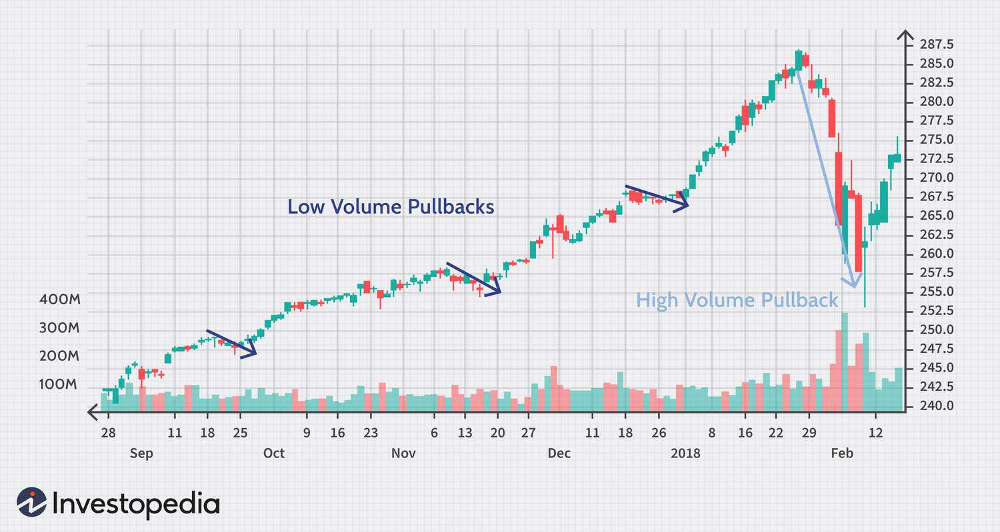

The financial markets offer a variety of trading strategies designed to capitalize on different market conditions. These strategies are developed with the primary aim of optimizing returns while managing risk, each tailoring to specific market behaviors and investor goals. In recent years, algorithmic trading, which employs computer algorithms to execute trades based on pre-defined criteria, has gained immense popularity. Its ability to process large amounts of data and execute trades at high speed presents a strategic advantage in the fast-paced world of financial trading.

This article provides an in-depth exploration of trading strategies, focusing specifically on stock market indicators, low volume pullbacks, and algo trading. Stock market indicators are crucial tools for traders, assisting them in predicting future price movements based on historical price data and market volume. Among these, low volume pullbacks stand out as a key technical indicator, effectively offering unique opportunities for traders seeking to enhance their risk/reward ratio.



Low volume pullbacks, characterized by a temporary decrease in stock price along with a decline in trading volume, can signal a potential continuation of the prevailing trend. These indicators are instrumental for traders aiming to time their entry points more accurately, thus optimizing the potential for profit. The guide will meticulously dissect the low volume pullback strategy, its integration with algorithmic trading, and how it can benefit traders by automating complex tasks and reducing emotional biases in trading decisions. This approach not only streamlines the trading process but also leverages technological advancements to ensure precision and efficiency in strategy execution.

## Table of Contents

## Understanding Low Volume Pullbacks

A low volume pullback is characterized by a temporary decline in stock price coinciding with a decrease in trading volume. These events typically signify limited market participation during the retracement phase, suggesting that the primary trend is likely to continue once the pullback concludes. Traders interpret these scenarios as opportune moments to enter the market at more favorable prices, thereby optimizing their risk/reward ratio.

In the analysis of a low volume pullback, the focus is primarily on volume patterns alongside price movements. When a stock exhibits a downtrend in price but is accompanied by decreasing volume, it implies a lack of strong selling pressure. This lack of volume suggests that the pullback does not have broad market support and may lead to the continuation of the prior trend, which is often bullish if the pullback occurs in an uptrend.

The fundamental principle underlying this strategy is the concept of volume analysis. Specifically, when observing a pullback with low volume, it indicates the countertrend is weak, reinforcing the expectation that the prevailing trend will resume. Mathematically, this can be monitored by the volume-to-price signal:

$$
\text{Signal} = \frac{\Delta \text{Price}}{\Delta \text{Volume}}
$$

Where a smaller $\Delta \text{Volume}$ relative to $\Delta \text{Price}$ strengthens the case for a weak pullback. Traders may use additional technical indicators such as the Moving Average Convergence Divergence (MACD) or the Relative Strength Index (RSI) to confirm their analysis and decision to enter the market.

This approach enables traders to enter trades during pullbacks with a calculated assessment of risk, positioned for potential gains as the initial trend resumes. By carefully analyzing historical [volume](/wiki/volume-trading-strategy) data and current market conditions, traders can enhance their strategic decisions and improve overall trading performance.

## Why Use Low Volume Pullbacks in Trading?

Low volume pullbacks offer a strategic advantage for traders aiming to exploit prevailing market trends with minimal risk. Entering a trade during a pullback allows traders to secure a more advantageous market position, enhancing their ability to withstand potential market reversals. This proactive approach involves buying or increasing positions during temporary price declines, anticipating the continuation of the primary upward trend.

From a technical perspective, a low volume pullback signifies a brief reduction in market interest or activity, typically marked by decreased trading volume. In such scenarios, the price tends to consolidate around support levels. These levels are crucial as they indicate where demand might counterbalance selling pressure, often serving as a foundation for a trend reversal or continuation. By entering trades near these support levels, traders maximize their potential for profit once the market regains [momentum](/wiki/momentum).

Low volume pullbacks prove especially advantageous in bullish markets. In such environments, traders aim to maintain a long position while minimizing downside exposure. By leveraging the reduced risk associated with these pullbacks, traders can retain purchasing power within their portfolios and capitalize on the primary trend's resumption. Ultimately, this strategy aligns with the core objective of maximizing the risk/reward ratio, ensuring that traders are positioned to gain from both price recovery and broader market uptrends.

## Integrating Algo Trading with Low Volume Pullbacks

Algorithmic trading systems excel in executing complex trading strategies, adapting to varying market conditions, and optimizing the execution of these strategies. By integrating low volume pullback strategies with [algorithmic trading](/wiki/algorithmic-trading), traders can achieve substantial improvements in both speed and accuracy. This integration allows for the identification of low volume pullback opportunities, precise execution of trades, and meticulous management of exits.

Algorithmic trading, often referred to as algo trading, leverages computer programs and software to automate trading processes. These systems are engineered to execute trades automatically based on predefined criteria. In the context of low volume pullbacks, an algorithm might be programmed to scrutinize historical data to identify patterns where price declines correspond with low trading volume, thus indicating a potential continuation of the primary trend.

Automation through algorithms significantly mitigates the influence of human emotion, a frequent pitfall in trading decisions. Emotions often lead to impulsive decisions that can derail a well-conceived trading plan. Algorithms remove this emotional element by executing trades based strictly on logical conditions derived from mathematical models and historical performance data.

For instance, consider a simple Python algorithm designed to identify low volume pullbacks and execute trades. The algorithm might include steps such as scanning for stocks experiencing a temporary price decline, verifying that the decline corresponds to diminished volume, and executing a buy order if these criteria are met, with [exit](/wiki/exit-strategy) strategies predetermined to lock in gains or minimize losses. Below is a conceptual example of such an algorithm:

```python
import pandas as pd

def identify_low_volume_pullback(data):
    data['price_change'] = data['close'].pct_change()
    data['volume_change'] = data['volume'].pct_change()
    low_volume_pullbacks = data[(data['price_change'] < 0) & (data['volume_change'] < -0.1)]
    return low_volume_pullbacks

def execute_trade(data):
    for index, row in data.iterrows():
        if row['volume'] < threshold and row['price'] < moving_average:
            place_order('buy', row['ticker'], order_quantity)

def place_order(action, ticker, quantity):
    print(f"{action.capitalize()} order placed for {quantity} shares of {ticker}.")
    # Add broker API integration for real order placement

# Example usage with dummy data
market_data = pd.DataFrame({
    'ticker': ['AAPL', 'AAPL', 'AAPL'],
    'close': [150, 148, 147],
    'volume': [20000, 18000, 17000]
})

pullbacks = identify_low_volume_pullback(market_data)
execute_trade(pullbacks)
```

This code serves as a simplified demonstration, where `identify_low_volume_pullback` filters market data for low volume pullbacks, and `execute_trade` initiates purchase orders based on the strategy. The integration of algorithmic systems thus ensures trades are executed more swiftly and consistently compared to manual trading efforts.

Incorporating algorithms into trading not only refines the entry and exit points but also scales the ability to manage multiple trades simultaneously across diverse markets. The application of historical data for [backtesting](/wiki/backtesting) further enhances the reliability of this integrated approach, ensuring that the strategies employed are statistically sound and relevant to current market behaviors.

## Real-World Examples of Low Volume Pullback Strategies

Case studies demonstrate how low volume pullbacks are identified and exploited in real market scenarios. Low volume pullbacks are often identified in charts of rising stocks, where they present multiple opportunities for traders to re-enter or increase their positions at potentially advantageous points. The concept relies on recognizing when a stock's price decreases temporarily with decreased trading volume, suggesting that the downtrend lacks strong momentum and that the primary uptrend may likely resume.

For instance, when examining a notable security like the SPDR S&P 500 [ETF](/wiki/etf-trading-strategies) (SPY), traders may observe low volume pullbacks preceding a continuation of a significant upward trend. In such cases, a trader could potentially enter the market during these pullbacks, capitalizing on the temporary price decline and the likelihood of trend continuation. These phases present sequential entry opportunities where traders can position themselves favorably before the stock price resumes its upward trajectory. 

To implement this strategy algorithmically, a sample Python algorithm can be employed using libraries such as `pandas` and `numpy` for data handling and `matplotlib` for visualization. The algorithm would scan historical price and volume data to identify pullbacks characterized by relatively low volume. Here is a simple example of how one might script this analysis:

```python
import pandas as pd
import numpy as np
import matplotlib.pyplot as plt

# Load historical data for SPY
data = pd.read_csv('SPY.csv')
data['Date'] = pd.to_datetime(data['Date'])
data.set_index('Date', inplace=True)

# Calculate rolling average for volume
data['Volume_Avg'] = data['Volume'].rolling(window=20).mean()

# Identify low volume pullbacks
conditions = (data['Close'] < data['Close'].shift(1)) & (data['Volume'] < data['Volume_Avg'])
pullbacks = data[conditions]

# Plotting
plt.figure(figsize=(14,7))
plt.plot(data['Close'], label='SPY Close Price')
plt.scatter(pullbacks.index, pullbacks['Close'], color='red', label='Low Volume Pullback')
plt.title('SPY Close Price with Low Volume Pullbacks')
plt.xlabel('Date')
plt.ylabel('Price')
plt.legend()
plt.show()
```

This example algorithm identifies low volume pullbacks by checking when the closing price is lower than the previous day and the volume is below the 20-day average volume. Traders and analysts widely recognize the importance of these pullback patterns as they provide clearer signals when contextualized with concurrent volume data. By applying quantitative analysis through algorithmic tools, traders can refine their entry points and enhance the precision of their trading strategies.

## Challenges and Considerations

Low volume pullback strategies, despite their potential for profit, come with inherent challenges that traders need to navigate carefully. One significant challenge is market [volatility](/wiki/volatility-trading-strategies), which can alter the dynamics of a trade unpredictably. Volatility can cause abrupt price changes, making it difficult to pinpoint the optimal entry and exit points even when using low volume indicators. Unanticipated economic events, such as major policy announcements or geopolitical tensions, can further complicate trading strategies, often leading to sharp market reversals or unexpected trend changes that defy technical assumptions.

To mitigate these challenges, implementing robust risk management measures is crucial. This includes setting stop-loss orders to protect against excessive losses and determining appropriate position sizing to manage exposure. A stop-loss order automatically sells a security when it reaches a certain price, ensuring that traders limit potential losses. Position sizing, on the other hand, involves determining the amount of capital to risk on a single trade, which can be calculated using the formula:

$$
\text{Position Size} = \frac{\text{Risk per Trade}}{\text{Stop Loss Distance}}
$$

where the risk per trade is the maximum amount a trader is willing to lose on a trade, and the stop-loss distance is the difference between the entry point and the stop-loss price.

Comprehensive backtesting of low volume pullback strategies is indispensable for assessing their efficacy under various market conditions. Backtesting involves using historical data to simulate a trading strategy, allowing traders to evaluate its performance, uncover its strengths and weaknesses, and refine the strategy before applying it in live markets. Traders should be prepared to adapt their strategies as market conditions evolve. Rapid advances in technology provide tools and resources that can assist in refining strategies in response to new data and market insights.

Staying adaptable not only involves tweaking technical parameters but also being receptive to learning and integrating new approaches. By continuously refining their strategies and keeping abreast of technological advancements, traders can better position themselves to capitalize on the unique opportunities presented by low volume pullbacks while mitigating associated risks.

## Conclusion

Low volume pullbacks are a significant element within a trader's toolkit, particularly when employed alongside algorithmic trading systems. By leveraging these pullbacks, traders can gain advantageous market entry points, optimizing their reward potential while minimizing associated risks. The fundamental understanding of low volume pullbacks—temporary declines in stock prices with diminished trading activity—enables traders to anticipate potential trend continuations and align their strategies accordingly.

The integration of algorithmic trading with low volume pullbacks further boosts the effectiveness of this strategy. Algorithms can analyze vast amounts of market data quickly, identifying patterns and executing trades with precision that manual trading may not achieve. This not only increases the speed of transactions but also eliminates the emotional biases that human traders might face, such as fear or overconfidence. Consequently, the use of mathematical models and historical data allows traders to capitalize on market movements consistently.

Continuous learning and adaptation are critical in refining these strategies and in integrating emerging technologies within trading practices. As market dynamics evolve, the necessity for traders to remain informed and adaptable becomes paramount. Exploring new analytical techniques, [machine learning](/wiki/machine-learning) algorithms, and real-time data processing methods can significantly augment a trader's ability to respond to fluctuating markets.

In conclusion, the adept use of low volume pullbacks, facilitated by algorithmic trading, empowers traders to enhance their trading outcomes by optimally timing market entries and exits. This strategy not only helps in maximizing profit potential but also in sustaining a competitive edge within the rapidly changing landscape of stock market trading.

## References & Further Reading

[1]: Bergstra, J., Bardenet, R., Bengio, Y., & Kégl, B. (2011). ["Algorithms for Hyper-Parameter Optimization."](https://dl.acm.org/doi/10.5555/2986459.2986743) Advances in Neural Information Processing Systems 24.

[2]: ["Advances in Financial Machine Learning"](https://www.amazon.com/Advances-Financial-Machine-Learning-Marcos/dp/1119482089) by Marcos Lopez de Prado

[3]: ["Evidence-Based Technical Analysis: Applying the Scientific Method and Statistical Inference to Trading Signals"](https://www.amazon.com/Evidence-Based-Technical-Analysis-Scientific-Statistical/dp/0470008741) by David Aronson

[4]: ["Machine Learning for Algorithmic Trading"](https://github.com/stefan-jansen/machine-learning-for-trading) by Stefan Jansen

[5]: ["Quantitative Trading: How to Build Your Own Algorithmic Trading Business"](https://www.amazon.com/Quantitative-Trading-Build-Algorithmic-Business/dp/1119800064) by Ernest P. Chan