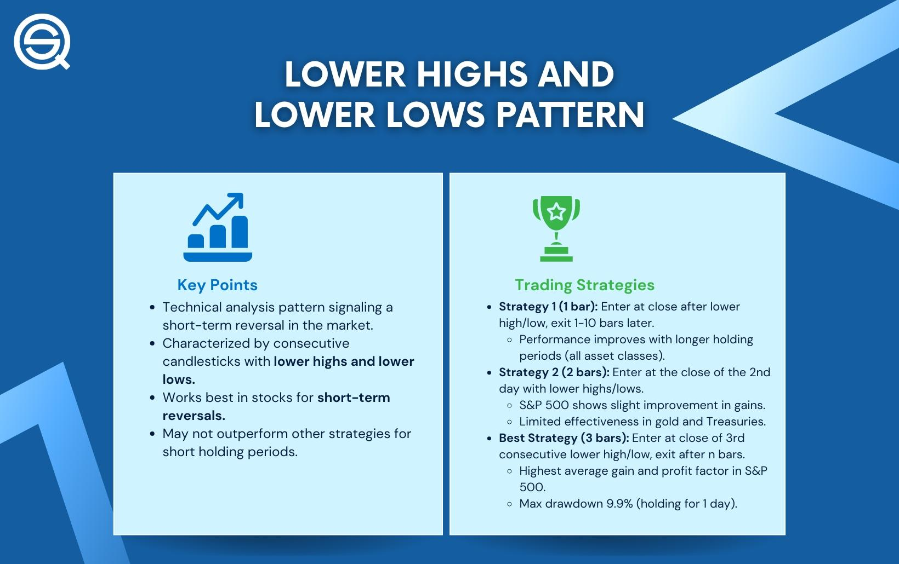

Algorithmic trading, often referred to as algo trading, involves the use of computer programs and systems to execute trading strategies based on predetermined criteria. This form of trading has revolutionized modern financial markets by enabling rapid execution, reducing transaction costs, and minimizing human error. Algorithms can analyze vast amounts of data and execute orders at speeds and frequencies that are impossible for a human trader. This advancement has made algorithmic trading integral to equities, futures, and even cryptocurrency markets, often contributing to increased market efficiency and liquidity.

Within algorithmic trading, the lower low pattern in technical analysis is a crucial concept that aids in understanding market trends. A lower low pattern occurs when the price of an asset drops below the previous low, signaling a potential continuing downtrend. This pattern is essential for traders aiming to capture market movements and optimize entry and exit points. By incorporating these patterns, algorithms can identify opportune moments to buy or sell, enhancing the effectiveness of trading strategies.



Understanding patterns like lower lows can significantly improve trading outcomes by providing insights into market behavior and potential trend reversals. Algorithms programmed to recognize such patterns can make informed decisions, often outperforming traditional trading methods. The systematic approach reduces the emotional and psychological challenges faced by manual traders, leading to consistent execution of trading strategies.

By leveraging lower low patterns, traders can develop sophisticated algorithms that adapt quickly to ever-changing market conditions, potentially improving profitability and reducing risks. This analytical edge is why understanding and implementing pattern-recognition strategies are pivotal in the landscape of algo trading.

## Table of Contents

## Understanding the Lower Low Pattern

A lower low pattern is a technical analysis tool used to identify potential bearish trends in market price movements. It is characterized by a sequence in which a security's price forms a series of descending troughs, where each subsequent low is lower than the previous one. This pattern is crucial for traders as it suggests increasing selling pressure and the potential continuation of a downward trend.

To identify a lower low pattern within a price chart, traders typically analyze historical price data to determine the lows over a given period. The pattern becomes visible when each subsequent low is inferior to its predecessor, indicating a weakening in the asset's price levels and signaling that sellers are in control. For example, if a stock's price drops from \$100 to \$95, then rebounds to only \$98 before dropping again to \$92, a lower low is observed at the \$92 level compared to the initial \$95 low. This can be visually represented on a price chart using the following Python code:

```python
import matplotlib.pyplot as plt

# Example data: dates and corresponding prices
dates = ["Day 1", "Day 2", "Day 3", "Day 4", "Day 5", "Day 6"]
prices = [100, 95, 98, 92, 93, 91]

plt.plot(dates, prices, marker='o')
plt.title('Lower Low Pattern Identification')
plt.xlabel('Time')
plt.ylabel('Price')
plt.annotate('Lower Low', xy=("Day 4", 92), xytext=("Day 4", 95),
             arrowprops=dict(facecolor='black', shrink=0.05))
plt.grid(True)
plt.show()
```

The importance of the lower low pattern lies in its ability to signal potential market trends and reversals. When a lower low pattern is observed, it often indicates that an asset is experiencing bearish sentiment, which could continue unless reversed by significant buying pressure. For traders, recognizing a lower low pattern is essential as it helps in making informed decisions about entry and [exit](/wiki/exit-strategy) points, risk management, and the overall trading strategy employed.

Lower lows are not only indicative of potential downside risks but also aid traders in forecasting the direction of the trend. By identifying these patterns, traders can more accurately predict when to sell assets or place short positions, thus enhancing the precision and effectiveness of their trading strategies.

## The Role of Lower Lows in Algo Trading

Algorithmic systems are designed to automatically identify and respond to predefined patterns within financial markets. One such pattern is the lower low, which is significant due to its potential to signal bearish market conditions. A lower low pattern occurs when the price of an asset falls below its previous low, suggesting a possible continuation of a downtrend. 

Algorithmic systems detect a lower low pattern by leveraging historical price data. For instance, these systems can be programmed using technical analysis indicators such as moving averages or specific price points to mark lower lows. A basic algorithm might track successive daily low prices and trigger a signal when the latest low is lower than the prior one. This process involves calculating the price difference over successive time periods and checking for downward trends.

An example of an algorithm using the lower low pattern is a [momentum](/wiki/momentum)-based trading algorithm. Such systems might execute sell orders when a lower low is confirmed, potentially coupled with other indicators like the Relative Strength Index (RSI) to validate the trend. By incorporating multiple indicators, these algorithms attempt to reduce the risk of false signals.

The advantages of utilizing automated systems to identify lower low patterns are notable. Firstly, these systems operate without the emotional biases that can impact human decision-making. Automated systems can analyze vast amounts of data at significant speeds, identifying patterns and executing trades faster than human traders. Furthermore, these systems can be backtested on historical data to refine accuracy and optimize performance before live trading implementation. This capability allows for enhanced precision in executing trades based on real-time market conditions. 

Overall, the adoption of [algorithmic trading](/wiki/algorithmic-trading) for patterns such as lower lows can improve the efficiency and efficacy of trading strategies. The automation of pattern detection and response enables traders to capture more opportunities and manage risks effectively.

## Strategies Incorporating Lower Lows

Incorporating lower low patterns into trading strategies can be an effective approach to capitalize on market trends and potential reversals. This section explores specific strategies that utilize the lower low pattern, assesses their effectiveness in various market conditions, and presents case studies and [backtesting](/wiki/backtesting) data to illustrate potential outcomes.

### Trend-Following Strategies

Trend-following strategies aim to capitalize on existing market momentum by entering trades in the direction of the prevailing trend. A lower low pattern, which indicates a continuation of a downward trend, can serve as a trigger for short-selling opportunities.

1. **Implementation**: A trend-following algorithm can be designed to scan for lower low patterns across multiple time frames. Once identified, the algorithm triggers a short position if other indicators, such as moving averages or the Relative Strength Index (RSI), confirm a bearish trend.

2. **Backtesting and Outcomes**: Backtesting data often shows that trend-following strategies perform well in markets characterized by strong, sustained trends. For instance, during the 2008 financial crisis, a lower low-based trend-following strategy using equities would likely have resulted in substantial profits as many stocks saw significant downward trends.

### Reversal Strategies

Reversal strategies are designed to profit from market turning points. A lower low pattern can signal a potential bottoming out, suggesting a reversal might be imminent.

1. **Implementation**: In reversal strategies, a lower low is paired with divergence indicators, such as RSI or MACD, to identify potential reversal points. If the price makes a new low, but the indicator does not, it might signal weakening downward momentum, prompting a long position.

2. **Evaluation**: Reversal strategies tend to perform well in volatile or oversold market conditions but can be less effective in strong trending markets where reversals are less common.

### Backtesting Data and Case Studies

#### Case Study: EUR/USD Forex Pair

**Scenario**: Between January and March of a given year, the EUR/USD pair demonstrated a series of lower lows amid a downtrend.

1. **Trend-Following Strategy**:
   - Implemented a moving average crossover in conjunction with lower lows.
   - Result: The strategy yielded a 12% return over the period, outperforming the simple buy-and-hold approach, which would have resulted in a loss.

2. **Reversal Strategy**:
   - Applied RSI divergence on lower low signals.
   - Result: This approach identified key reversal points, achieving a 9% gain across several trades during short-term market recoveries.

### Strategy Effectiveness

- **Trending Markets**: Strategies based on lower lows are particularly effective during strong trending phases, either up or down. The ability to latch onto trending movements can result in significant profits, as confirmed by historical backtesting.

- **Volatile Markets**: In volatile market conditions, reversal strategies using lower lows can capture sharp price corrections, though at the risk of more frequent false signals.

### Considerations

Both trend-following and reversal strategies leveraging lower lows need rigorous backtesting and adjustments to adapt to changing market dynamics. Parameters like stop-loss limits and position sizing are crucial to mitigate the risks of false signals and optimize trade execution.

By understanding and harnessing the lower low pattern within algorithmic trading strategies, traders can effectively respond to diverse market scenarios, enhancing their potential for consistent profits.

## Technical Requirements for Implementing Lower Low Algo Trading

Implementing algorithms based on lower low patterns requires a robust technical infrastructure. This infrastructure ensures that the trading strategies are executed efficiently and effectively, leveraging the latest advancements in technology for optimal performance.

### Data Feeds

For executing lower low pattern algorithms, high-quality data feeds are essential. These data feeds should provide real-time market data, including price movements, [volume](/wiki/volume-trading-strategy) data, and potentially news events that could influence market behavior. Most algorithmic trading platforms require access to comprehensive historical data for backtesting purposes. Data providers such as Bloomberg, Reuters, or dedicated trading platforms like MetaTrader offer extensive data coverage essential for developing lower low-based strategies.

### Computational Resources

The computational demand for algo trading varies significantly depending on the complexity of the algorithms and the frequency of trading. Implementing lower low pattern recognition requires moderate computational power. However, to ensure seamless operation and quick response times, many traders opt for high-performance computing environments. A typical setup might include:

- **Multi-core processors:** These allow the simultaneous execution of multiple trading algorithms or multiple iterations of the same algorithm.
- **Large RAM:** Facilitates efficient processing of large datasets necessary for identifying patterns.
- **GPU acceleration:** Useful for parallel processing tasks, especially if machine learning techniques are integrated for pattern recognition.

### Trading Platforms

An ideal trading platform for implementing lower low algorithms should support custom coding and integration with various data feeds. Platforms like MetaTrader 4/5, NinjaTrader, or QuantConnect provide extensive APIs and support for various programming languages, making them suitable for traders who wish to implement custom lower low strategies.

### Programming Skills

Solid programming skills are a cornerstone of effective algorithm implementation. Languages like Python and C++ are prevalent in this domain due to their speed and ease of use. Python, in particular, is favored for its extensive libraries and frameworks conducive to data analysis and [machine learning](/wiki/machine-learning). 

An example of a simple Python algorithm to detect lower lows might look like this:

```python
def detect_lower_lows(prices):
    lower_lows = []
    for i in range(1, len(prices) - 1):
        if prices[i] < prices[i - 1] and prices[i] < prices[i + 1]:
            lower_lows.append(i)
    return lower_lows
```

In this function, `prices` is a list of historical price data. The function identifies indices where lower lows occur, which can then be used to trigger trading actions.

### Conclusion

Algorithmic trading based on lower low patterns necessitates a well-considered technical setup that includes reliable data feeds, appropriate computational resources, and a flexible trading platform. Combined with strong programming skills, these elements form the foundation for creating, optimizing, and executing effective trading algorithms.

## Risk Management in Lower Low Algo Trading

In algorithmic trading, particularly when utilizing lower low patterns, effective risk management is crucial to safeguard against potential losses. Lower low patterns indicate a bearish trend, where each subsequent low is lower than the previous one. While these patterns can signal potential trading opportunities, they also [carry](/wiki/carry-trading) inherent risks that need careful management.

**Risk Factors Associated with Lower Low Patterns**

One primary risk [factor](/wiki/factor-investing) when using lower low patterns is the possibility of false signals. Market [volatility](/wiki/volatility-trading-strategies) can sometimes create patterns that resemble lower lows but do not lead to a sustained downward trend. Such false signals can result in premature or incorrect trading decisions. Additionally, sudden market reversals, where prices shift unexpectedly, can result in significant losses if trades are not optimally managed. 

**Role of Risk Management Tools**

To mitigate these risks, traders often employ various tools and strategies:

1. **Stop Losses:** Stop-loss orders are predetermined price levels at which a trade is automatically closed to prevent further losses. They are essential in controlling risk by ensuring that losses are capped at a certain point, depending on the trader's risk tolerance. For instance, if a lower low pattern suggests a bearish trend, a stop-loss can prevent significant capital erosion if the market reverses.
$$
   \text{Stop Loss Level} = \text{Entry Price} - (\text{Risk Percentage} \times \text{Entry Price})

$$

2. **Position Sizing:** This involves determining the amount of capital to allocate to a particular trade based on the trader’s risk tolerance and the volatility of the market. By adjusting the position size, traders can manage their exposure and potential loss, maintaining a balanced risk profile. The formula for calculating position size can include factors like account size and risk per trade:
$$
   \text{Position Size} = \frac{\text{Account Risk}}{\text{Trade Risk}}

$$

   Where Account Risk is the total capital a trader is willing to risk, and Trade Risk is the difference between entry price and stop loss.

**Continuous Evaluation and Adjustment**

To stay profitable, continuous evaluation and adjustment of algorithms are vital. Market conditions are dynamic, and algorithms configured to respond to lower low patterns may initially perform well, but degrade over time as conditions change. 

Regular backtesting and performance analysis can identify when an algorithm's effectiveness starts to decline. By analyzing past trade data, traders can adjust parameters, refine entry and exit points, and even adapt the algorithm to recognize new patterns. Machine learning can also be integrated to enhance the adaptive capability of these algorithms, allowing them to learn from new market data and improve accuracy over time. 

```python
# Example of backtesting an algo
import pandas as pd
import numpy as np

# Example function to backtest a lower low strategy
def backtest_strategy(data, entry_threshold, exit_threshold):
    data['signal'] = np.where(data['lower_low'] < entry_threshold, 1, 0)
    data['signal'] = np.where(data['lower_low'] > exit_threshold, -1, data['signal'])
    data['returns'] = data['signal'].shift(1) * data['price_change']
    cumulative_return = (1 + data['returns']).cumprod() - 1
    return cumulative_return

# Sample data
market_data = pd.DataFrame({
    'lower_low': np.random.randn(100),
    'price_change': np.random.randn(100)
})

cumulative_return = backtest_strategy(market_data, entry_threshold=-1.5, exit_threshold=1.5)
print(cumulative_return)
```

In summary, robust risk management strategies, such as stop losses and position sizing, along with ongoing evaluation and adaptation, are critical in minimizing the risks associated with using lower low patterns in algorithmic trading. Adjustments based on comprehensive market analysis and predictive modeling can further enhance the robustness and adaptability of trading algorithms.

## Advantages and Challenges

Algorithmic strategies that utilize lower low patterns offer several advantages, particularly in enhancing the efficiency and effectiveness of trading activities. One of the primary benefits is the ability to conduct emotion-free trading. Algorithms operate based on predefined criteria, removing emotional biases that human traders might introduce, such as fear or euphoria, which can impair decision-making. They execute trades consistently and accurately, based on lower low pattern detections, regardless of market volatility or external pressures.

Another advantage of using algorithmic strategies is the overall efficiency they bring to trading operations. Algorithms can analyze large datasets, identify lower low patterns, and execute trades much faster than human traders. This speed is crucial in modern markets where price movements can happen in milliseconds. By leveraging such systems, traders can capitalize on fleeting opportunities that might otherwise be missed.

However, these strategies also present challenges. One major issue is the risk of false signals. Lower low patterns may occasionally indicate a continuation of a bearish trend that might not materialize, leading to potentially unprofitable trades. The accuracy of pattern recognition is inherently tied to the quality and precision of the data available. Inaccurate or delayed data can lead to erroneous signal generation, thereby diminishing the efficacy of the trading strategy.

Mitigating these challenges requires thoughtful algorithm adjustments and enhancements. For instance, integrating additional technical indicators alongside lower low patterns can help filter out false signals, thus improving trade accuracy. Complementary indicators might include moving averages or the Relative Strength Index (RSI), which can corroborate the authenticity of identified patterns. An example of enhancing an algorithm:

```python
import talib
import numpy as np

def is_lower_low(data):
    # This function checks if the last data point is a lower low compared to the previous N (e.g. 3) points
    N = 3
    last_low = data[-1]
    previous_lows = data[-N-1:-1]
    return all(last_low < low for low in previous_lows)

def enhanced_trading_signal(data, short_window=14, long_window=200):
    """Generates a trading signal that combines lower low patterns with moving average logic."""
    close_prices = np.array(data['close'])
    mavg_short = talib.SMA(close_prices, timeperiod=short_window)
    mavg_long = talib.SMA(close_prices, timeperiod=long_window)

    if is_lower_low(data['low']) and mavg_short[-1] < mavg_long[-1]:
        return "Sell"
    else:
        return "Hold"

# Example usage
data = {'low': [102, 100, 99, 97], 'close': [105, 103, 102, 101]}
signal = enhanced_trading_signal(data)
print(signal)
```

This Python pseudo-code identifies lower low patterns and corroborates these with short and long moving averages to reduce false signals.

Additionally, precise data acquisition and processing capabilities are critical. Reliable data feeds and robust computational frameworks can improve the accuracy of pattern detection. Continuous evaluation and adjustment of algorithms are essential for adapting to evolving market conditions.

Lastly, overcoming challenges involves ongoing experimentation and backtesting of strategies to reflect real market dynamics. This continuous process helps traders refine their algorithms for better performance under various market conditions. Algorithms that incorporate machine learning methods can also be programmed to learn from past trading behavior and improve over time, potentially increasing their robustness in live trading scenarios.

## Conclusion

In summarizing the exploration of lower low patterns within algorithmic trading, we emphasize their pivotal role in enhancing trading strategies. Lower low patterns are significant indicators in technical analysis, providing valuable signals regarding potential market trends. Their integration into algorithmic systems allows traders to systematically recognize and react to these patterns, thereby optimizing decision-making processes.

One of the primary benefits of incorporating lower low strategies into trading algorithms lies in their potential to improve efficiency. Automated systems can process substantial amounts of data at speeds unattainable manually, enabling timely identification and response to emerging patterns. Furthermore, automation minimizes emotional influences, leading to more consistent and objective trading practices.

However, successful implementation of these strategies requires continuous research and development. This includes refining algorithmic parameters to adapt to dynamic market conditions and mitigate risks associated with false signals. Traders and developers should prioritize ongoing experimentation, leveraging backtesting and real-time adjustments to further enhance algorithmic performance.

In conclusion, lower low patterns offer a robust framework for algorithmic trading strategies with significant potential benefits. By investing in research and iterative experimentation, traders can better harness these patterns to achieve improved trading outcomes.

## Frequently Asked Questions (FAQ)

**Frequently Asked Questions (FAQ)**

**What is a lower low pattern?**

A lower low pattern is a formation in technical analysis where a security's price reaches a low that is lower than the previous low on a chart. It is indicative of a downtrend and can signal potential continuation of trends when confirmed with other patterns and indicators. Identifying these patterns can assist in making informed decisions about buying or selling securities.

**Why are lower low patterns important in algorithmic trading?**

Lower low patterns are essential in algorithmic trading as they provide clear and quantifiable signals that can be used to automate trading decisions. By automating the detection of such patterns, algorithms can quickly react to market movements without human intervention, potentially capturing more consistent gains or limiting losses. Using programming languages like Python, traders can create algorithms to track these patterns and execute trades automatically based on predefined criteria.

**How can algorithms detect lower low patterns?**

Algorithms detect lower low patterns by analyzing price data over time. The basic principle involves comparing current price lows with previous lows to ascertain if a pattern exists. In Python, this can be implemented using libraries such as `pandas` to manipulate time series data, and logic to identify when a new low is lower than the previous low. For instance:

```python
import pandas as pd

def identify_lower_lows(prices):
    lower_lows = []
    for i in range(1, len(prices)):
        if prices[i] < prices[i-1]:
            lower_lows.append((i, prices[i]))
    return lower_lows

prices = [100, 98, 96, 97, 95, 94]
print(identify_lower_lows(prices))
```

**What are potential challenges when using lower low patterns in trading algorithms?**

Challenges include the possibility of false signals, where a lower low doesn't indicate a continued downtrend but is instead a market anomaly. Algorithms must be designed to account for such anomalies, possibly by incorporating additional indicators or confirmation signals. High-quality data and precise programming are necessary to avoid erroneous trades based on misinterpreted patterns.

**What resources are available for learning more about algorithmic trading strategies?**

There are several excellent resources for those interested in learning about algorithmic trading strategies:

1. **Books:**
   - "Algorithmic Trading: Winning Strategies and Their Rationale" by Ernie Chan
   - "Quantitative Trading: How to Build Your Own Algorithmic Trading Business" by Ernie Chan

2. **Online Courses:**
   - Coursera and edX offer courses on algorithmic trading and quantitative finance.
   - Interactive Brokers, a trading platform, also provides educational resources for algorithmic trading.

3. **Forums and Communities:**
   - Quantitative Finance Stack Exchange
   - Elite Trader Forum

4. **Research Papers:**
   - Access academic papers through platforms like JSTOR or SSRN to explore technical and theoretical aspects of algorithmic trading.

Continued learning and experimentation with these resources can significantly enhance trading strategies and outcomes.

## References & Further Reading

[1]: Bergstra, J., Bardenet, R., Bengio, Y., & Kégl, B. (2011). ["Algorithms for Hyper-Parameter Optimization."](https://papers.nips.cc/paper/4443-algorithms-for-hyper-parameter-optimization) Advances in Neural Information Processing Systems 24.

[2]: ["Advances in Financial Machine Learning"](https://www.amazon.com/Advances-Financial-Machine-Learning-Marcos/dp/1119482089) by Marcos Lopez de Prado

[3]: ["Evidence-Based Technical Analysis: Applying the Scientific Method and Statistical Inference to Trading Signals"](https://www.amazon.com/Evidence-Based-Technical-Analysis-Scientific-Statistical/dp/0470008741) by David Aronson

[4]: ["Machine Learning for Algorithmic Trading"](https://github.com/stefan-jansen/machine-learning-for-trading) by Stefan Jansen

[5]: ["Quantitative Trading: How to Build Your Own Algorithmic Trading Business"](https://books.google.com/books/about/Quantitative_Trading.html?id=j70yEAAAQBAJ) by Ernest P. Chan