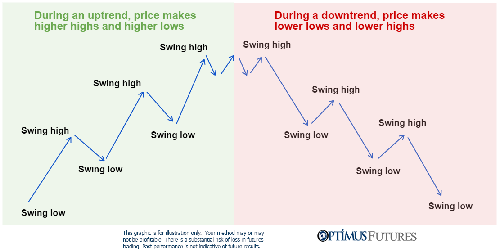

## Table of Contents

## What is the Lower Highs and Lower Lows pattern in trading?

The Lower Highs and Lower Lows pattern in trading is a way to see if a market or a stock is going down. It happens when the price of something keeps making new lower peaks and new lower troughs over time. Imagine you're looking at a chart. If you see that each time the price goes up, it doesn't go as high as it did before, and each time it goes down, it goes lower than the last time, that's a Lower Highs and Lower Lows pattern. This pattern can tell traders that the thing they're looking at might keep going down in the future.

Traders use this pattern to make decisions about buying or selling. If they see Lower Highs and Lower Lows forming, they might decide to sell what they have because they think the price will keep dropping. On the other hand, some traders might see this as a chance to buy, hoping to make money when the price eventually goes back up. It's important for traders to look at other things too, like news and other patterns, to make sure they're making the best choice.

## How can a beginner identify Lower Highs and Lower Lows on a chart?

To identify Lower Highs and Lower Lows on a chart, a beginner should start by looking at the peaks and valleys of the price movements. A peak is the highest point the price reaches before it starts to go down again, and a valley is the lowest point before the price starts to go up. If you see that each new peak is lower than the last peak, those are Lower Highs. Similarly, if each new valley is lower than the last valley, those are Lower Lows. By connecting these points with a line, you can see the downward trend more clearly.

It's helpful to use a chart with clear time frames, like daily or weekly charts, to make it easier to spot these patterns. As you look at the chart, try to find at least two or three instances of Lower Highs and Lower Lows to confirm the pattern. Remember, the key is to see a consistent pattern where the highs keep getting lower and the lows keep getting lower over time. This will give you a good indication that the price is in a downtrend.

## What does the Lower Highs and Lower Lows pattern indicate about market trends?

The Lower Highs and Lower Lows pattern tells us that the market or a stock is in a downtrend. This means that the price is going down over time. When you see this pattern, it means that every time the price goes up a little bit, it doesn't go as high as it did before. And every time it goes down, it goes lower than the last time. This shows that the people selling the stock are stronger than the people buying it, so the price keeps dropping.

This pattern is important for traders because it helps them make decisions. If they see Lower Highs and Lower Lows, they might decide to sell their stock because they think the price will keep going down. Some traders might also see this as a good time to buy, hoping to make money when the price eventually goes back up. But it's always a good idea to look at other things too, like news and other patterns, to make the best choice.

## Can you explain the psychological aspects behind the formation of Lower Highs and Lower Lows?

When you see Lower Highs and Lower Lows on a chart, it's like seeing people's feelings about the market changing. At first, when the price goes up a little bit, people might feel hopeful and buy more. But then, if the price doesn't go as high as it did before, they start to feel worried. They think the price might keep going down, so they start selling instead of buying. This makes the price go down even more, and that's how Lower Highs happen.

As the price keeps dropping and making new lows, more and more people get scared. They see the price going down and down, and they don't want to lose more money, so they sell their stocks. This selling makes the price go even lower, creating Lower Lows. It's all about people feeling more and more worried and not wanting to hold onto their stocks, which pushes the price down in a cycle.

## What are the key differences between Lower Highs and Lower Lows and other bearish patterns?

The Lower Highs and Lower Lows pattern is different from other bearish patterns because it shows a clear and steady downward trend over time. Unlike patterns like the Head and Shoulders or the Double Top, which have specific shapes and can signal a reversal after an uptrend, Lower Highs and Lower Lows show that the price is consistently going down without a clear shape. This pattern focuses on the gradual decrease in both highs and lows, making it easier to spot a long-term downtrend.

Other bearish patterns, like the Bearish Engulfing or the Evening Star, often signal a sudden change or reversal in the market after a period of rising prices. These patterns can appear quickly and are based on specific candlestick formations, which might not show a long-term trend as clearly as Lower Highs and Lower Lows do. While these patterns can be useful for short-term trading decisions, Lower Highs and Lower Lows are more about seeing the bigger picture and understanding that the market is in a sustained downtrend.

## How reliable is the Lower Highs and Lower Lows pattern as a trading signal?

The Lower Highs and Lower Lows pattern is pretty reliable as a trading signal when you're looking at the big picture. It shows a clear trend of the price going down over time. If you see this pattern, it's a good sign that the market might keep going down, so you can make choices like selling your stocks or waiting to buy at a lower price. But remember, no pattern is perfect, and things can change quickly in the market.

It's important to use the Lower Highs and Lower Lows pattern along with other things, like news or other chart patterns, to make the best choices. Sometimes, even if you see this pattern, other signs might tell you something different. So, it's good to look at everything together before you decide to buy or sell. That way, you can be more sure about what might happen next in the market.

## What are some common mistakes traders make when interpreting Lower Highs and Lower Lows?

One common mistake traders make when looking at Lower Highs and Lower Lows is jumping to conclusions too quickly. They might see just a couple of lower highs and lows and think the price will keep going down forever. But sometimes, the market can change direction suddenly, and what looked like a downtrend might not last long. It's important to wait and see the pattern over a longer time before deciding it's a sure thing.

Another mistake is not looking at the bigger picture. Traders might focus only on the Lower Highs and Lower Lows and ignore other important signs, like news about the company or other patterns on the chart. If they only look at this one pattern, they might miss out on other information that could change their mind about what to do. It's always better to look at everything together to make the best choices.

Lastly, some traders might get too scared when they see Lower Highs and Lower Lows and sell their stocks too early. They might think the price will keep dropping and want to get out fast, but then the price could start going up again, and they miss out on making money. It's important to stay calm and not let fear make all the decisions for you.

## How can technical indicators enhance the analysis of Lower Highs and Lower Lows?

Technical indicators can make it easier to see and understand the Lower Highs and Lower Lows pattern. For example, moving averages can help smooth out the price movements on a chart. If you see the price making Lower Highs and Lower Lows and it's also below a moving average, it can confirm that the market is really in a downtrend. Another helpful indicator is the Relative Strength Index (RSI). If the RSI is going down along with the Lower Highs and Lower Lows, it can show that the market is getting weaker and the downtrend might keep going.

It's also good to use volume indicators when looking at Lower Highs and Lower Lows. If you see the price making Lower Highs and Lower Lows and the trading volume is high, it means more people are selling, which can make the downtrend stronger. On the other hand, if the volume is low, it might mean the downtrend isn't as strong and could change soon. By using these technical indicators, traders can get a better idea of whether the Lower Highs and Lower Lows pattern is a good sign to make trading decisions or if they should wait and see more.

## What strategies can be employed when trading based on Lower Highs and Lower Lows?

When you see Lower Highs and Lower Lows on a chart, one strategy you can use is to sell your stocks. This pattern shows that the price is going down over time, so selling can help you avoid losing more money. You might want to set a stop-loss order just above the most recent lower high. This way, if the price suddenly goes up, your stocks will be sold automatically, and you won't lose too much. Another thing you can do is short selling, which means you borrow stocks and sell them, hoping to buy them back later at a lower price. If the price keeps going down like the pattern suggests, you can make money this way.

Another strategy is to wait for the price to go down even more before buying. If you think the price will eventually go back up, you can buy when it's low and sell when it goes up again. This is called buying the dip. It's important to be patient and not buy too early, or you might end up losing money if the price keeps dropping. You can use technical indicators like moving averages or RSI to help you decide when it's a good time to buy. By waiting for the right moment and using these tools, you can make better choices based on the Lower Highs and Lower Lows pattern.

## How does the timeframe affect the interpretation of Lower Highs and Lower Lows?

The timeframe you use when looking at a chart can change how you see the Lower Highs and Lower Lows pattern. If you look at a short timeframe, like a 15-minute or 1-hour chart, you might see Lower Highs and Lower Lows that seem to show the price is going down. But these short-term patterns can be part of a bigger trend that's going up. So, it's important to check longer timeframes, like daily or weekly charts, to see if the pattern is really showing a long-term downtrend or if it's just a small dip in a bigger uptrend.

On longer timeframes, the Lower Highs and Lower Lows pattern is more reliable for seeing a real downtrend. When you see this pattern on a daily or weekly chart, it means the price has been going down over a longer time. This can give you more confidence that the market is in a downtrend and help you make better trading decisions. But remember, even on longer timeframes, it's good to use other tools and information to make sure your understanding of the pattern is right.

## Can Lower Highs and Lower Lows be used in conjunction with other technical analysis tools?

Yes, Lower Highs and Lower Lows can be used with other technical analysis tools to make better trading decisions. For example, you can use moving averages to see if the price is really going down. If the price is making Lower Highs and Lower Lows and it's also below a moving average, it can confirm that the market is in a downtrend. Another tool you can use is the Relative Strength Index (RSI). If the RSI is going down along with the Lower Highs and Lower Lows, it can show that the market is getting weaker and the downtrend might keep going.

Volume indicators are also helpful when looking at Lower Highs and Lower Lows. If you see the price making Lower Highs and Lower Lows and the trading volume is high, it means more people are selling, which can make the downtrend stronger. On the other hand, if the volume is low, it might mean the downtrend isn't as strong and could change soon. By using these technical indicators along with the Lower Highs and Lower Lows pattern, you can get a better idea of whether the market is really going down and make smarter choices about buying or selling.

## What advanced techniques can be used to confirm a Lower Highs and Lower Lows pattern?

One advanced technique to confirm a Lower Highs and Lower Lows pattern is to use trend lines. You can draw a trend line that connects the lower highs and another that connects the lower lows. If both lines are sloping downwards and the price keeps touching or getting close to these lines, it's a strong sign that the downtrend is real. Another technique is to use the Fibonacci retracement tool. When you see Lower Highs and Lower Lows, you can draw Fibonacci levels between the highs and lows. If the price bounces off these levels and continues to make lower highs and lows, it can confirm the downtrend.

Another way to confirm the pattern is by using momentum indicators like the Moving Average Convergence Divergence (MACD). If the MACD line is below the signal line and both are moving downwards while you see Lower Highs and Lower Lows, it can show that the downtrend has strong momentum. You can also look at the Average Directional Index (ADX) to see how strong the trend is. If the ADX is rising while the price is making Lower Highs and Lower Lows, it means the downtrend is getting stronger. By using these advanced techniques, you can be more sure that the Lower Highs and Lower Lows pattern is a good sign to make trading decisions.

## How is risk managed in lower low algo trading?

In algorithmic trading, particularly when utilizing lower low patterns, effective risk management is crucial to safeguard against potential losses. Lower low patterns indicate a bearish trend, where each subsequent low is lower than the previous one. While these patterns can signal potential trading opportunities, they also [carry](/wiki/carry-trading) inherent risks that need careful management.

**Risk Factors Associated with Lower Low Patterns**

One primary risk [factor](/wiki/factor-investing) when using lower low patterns is the possibility of false signals. Market [volatility](/wiki/volatility-trading-strategies) can sometimes create patterns that resemble lower lows but do not lead to a sustained downward trend. Such false signals can result in premature or incorrect trading decisions. Additionally, sudden market reversals, where prices shift unexpectedly, can result in significant losses if trades are not optimally managed. 

**Role of Risk Management Tools**

To mitigate these risks, traders often employ various tools and strategies:

1. **Stop Losses:** Stop-loss orders are predetermined price levels at which a trade is automatically closed to prevent further losses. They are essential in controlling risk by ensuring that losses are capped at a certain point, depending on the trader's risk tolerance. For instance, if a lower low pattern suggests a bearish trend, a stop-loss can prevent significant capital erosion if the market reverses.
$$
   \text{Stop Loss Level} = \text{Entry Price} - (\text{Risk Percentage} \times \text{Entry Price})

$$

2. **Position Sizing:** This involves determining the amount of capital to allocate to a particular trade based on the trader’s risk tolerance and the volatility of the market. By adjusting the position size, traders can manage their exposure and potential loss, maintaining a balanced risk profile. The formula for calculating position size can include factors like account size and risk per trade:
$$
   \text{Position Size} = \frac{\text{Account Risk}}{\text{Trade Risk}}

$$

   Where Account Risk is the total capital a trader is willing to risk, and Trade Risk is the difference between entry price and stop loss.

**Continuous Evaluation and Adjustment**

To stay profitable, continuous evaluation and adjustment of algorithms are vital. Market conditions are dynamic, and algorithms configured to respond to lower low patterns may initially perform well, but degrade over time as conditions change. 

Regular backtesting and performance analysis can identify when an algorithm's effectiveness starts to decline. By analyzing past trade data, traders can adjust parameters, refine entry and exit points, and even adapt the algorithm to recognize new patterns. Machine learning can also be integrated to enhance the adaptive capability of these algorithms, allowing them to learn from new market data and improve accuracy over time. 

```python
# Example of backtesting an algo
import pandas as pd
import numpy as np

# Example function to backtest a lower low strategy
def backtest_strategy(data, entry_threshold, exit_threshold):
    data['signal'] = np.where(data['lower_low'] < entry_threshold, 1, 0)
    data['signal'] = np.where(data['lower_low'] > exit_threshold, -1, data['signal'])
    data['returns'] = data['signal'].shift(1) * data['price_change']
    cumulative_return = (1 + data['returns']).cumprod() - 1
    return cumulative_return

# Sample data
market_data = pd.DataFrame({
    'lower_low': np.random.randn(100),
    'price_change': np.random.randn(100)
})

cumulative_return = backtest_strategy(market_data, entry_threshold=-1.5, exit_threshold=1.5)
print(cumulative_return)
```

In summary, robust risk management strategies, such as stop losses and position sizing, along with ongoing evaluation and adaptation, are critical in minimizing the risks associated with using lower low patterns in algorithmic trading. Adjustments based on comprehensive market analysis and predictive modeling can further enhance the robustness and adaptability of trading algorithms.

## References & Further Reading

[1]: Bergstra, J., Bardenet, R., Bengio, Y., & Kégl, B. (2011). ["Algorithms for Hyper-Parameter Optimization."](https://papers.nips.cc/paper/4443-algorithms-for-hyper-parameter-optimization) Advances in Neural Information Processing Systems 24.

[2]: ["Advances in Financial Machine Learning"](https://www.amazon.com/Advances-Financial-Machine-Learning-Marcos/dp/1119482089) by Marcos Lopez de Prado

[3]: ["Evidence-Based Technical Analysis: Applying the Scientific Method and Statistical Inference to Trading Signals"](https://www.amazon.com/Evidence-Based-Technical-Analysis-Scientific-Statistical/dp/0470008741) by David Aronson

[4]: ["Machine Learning for Algorithmic Trading"](https://github.com/stefan-jansen/machine-learning-for-trading) by Stefan Jansen

[5]: ["Quantitative Trading: How to Build Your Own Algorithmic Trading Business"](https://books.google.com/books/about/Quantitative_Trading.html?id=j70yEAAAQBAJ) by Ernest P. Chan