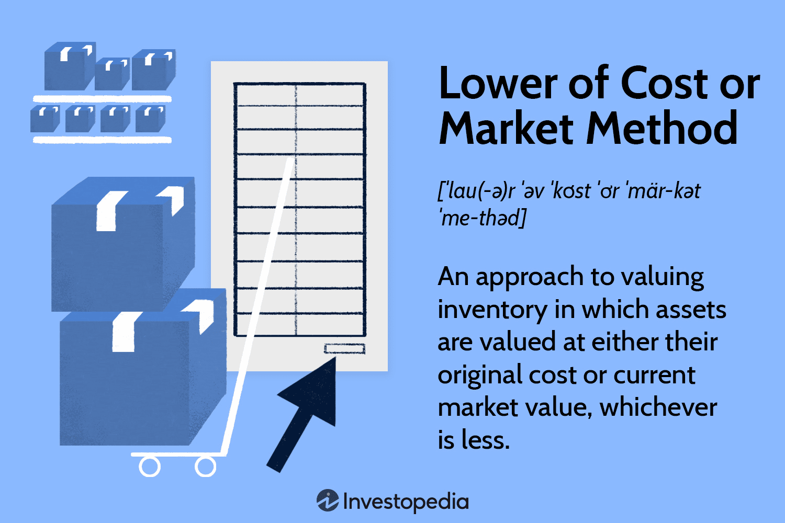

In the rapidly evolving world of finance and technology, certain principles and methodologies remain fundamental to the conduct of business and strategy formation. Despite the rapid advancements and complexities introduced by modern innovations, foundational elements like inventory valuation and cost accounting persist as crucial components of financial management. Inventory valuation, for example, forms the backbone of accurate financial reporting, allowing companies to represent their asset values and manage cash flows effectively.

This article examines the intersection of inventory valuation, cost accounting methods, and algorithmic trading, with a specific focus on the Lower of Cost or Market (LCM) method within inventory management. The LCM method remains an essential approach in contemporary cost accounting, providing a conservative strategy for recording inventory. By adopting the lower of historical cost or market value, businesses can avoid overstating their assets, ensuring a realistic representation of their financial stance.

Furthermore, we explore how advancements in algorithmic trading are influencing these traditional accounting standards. Algorithmic trading, characterized by using complex mathematical models and computer algorithms to automate and execute trades at speeds and frequencies beyond human capabilities, significantly impacts financial markets. Its integration with accounting practices challenges existing norms, pushing businesses to innovate and adapt. This confluence of traditional accounting methodologies with advanced technologies underlines the dynamic nature of modern financial management.

Emerging technologies and traditional accounting principles continue to shape the strategies and operations of businesses worldwide. Understanding and navigating this confluence is crucial for companies aiming to remain competitive and resilient in today's ever-changing financial landscape.

## Table of Contents

## Understanding the Lower of Cost or Market (LCM) Method

The Lower of Cost or Market (LCM) method is a widely recognized inventory valuation approach used in accounting to ensure that inventory assets are not overstated on financial statements. This method is particularly significant under the Generally Accepted Accounting Principles (GAAP), which guide financial reporting in the United States.

The LCM method dictates that inventory should be recorded at the lower value between its historical cost and its current market value. The market value, in this context, is considered to be the replacement cost of the inventory, with certain constraints. This method is essential because it adheres to the accounting principle of conservatism, which emphasizes minimizing overstatement of assets and income. By valuing inventory at the lower of cost or market, companies safeguard against potential financial statement inaccuracies that could mislead investors and stakeholders regarding the value of the company's assets.

From a practical perspective, the LCM method works by comparing the historical cost of each inventory item with its market value. If the market value is lower than the cost, the inventory is written down to reflect this lower value. The formula for determining the LCM can be expressed as:

$$
\text{Inventory Value} = \min(\text{Historical Cost}, \text{Market Value})
$$

This conservative approach helps prevent future losses by recognizing declines in inventory value as they occur rather than deferring recognition until sales are made. This becomes especially crucial during periods of market [volatility](/wiki/volatility-trading-strategies) where inventory values may fluctuate significantly.

Accounting for LCM involves evaluating the three components that define market value: net realizable value (NRV), replacement cost, and net realizable value minus a normal profit margin. According to GAAP, the market is bounded by the ceiling (NRV) and the floor (NRV minus a normal profit margin):

$$
\text{Market Value} = \max\left(\text{Floor}, \min\left(\text{Replacement Cost}, \text{Ceiling}\right)\right)
$$

This construct ensures that inventory is not undervalued, protecting against excessive write-downs that could misrepresent the financial health of a company. 

Overall, the LCM method is a crucial accounting standard that aids businesses in maintaining transparency and accuracy in their financial disclosures, which is vital for maintaining investor confidence and regulatory compliance.

## LCM Method and its Impact on Financial Statements

The Lower of Cost or Market (LCM) method significantly impacts financial statements by affecting the valuation of inventory, which plays a crucial role in determining a company's financial health. On the balance sheet, inventory is recorded as a current asset. Using the LCM method ensures that inventory is not overstated, thereby providing a more conservative estimate of asset values. This conservative approach helps in ensuring that the financial position of a company is not inflated by recording inventory at a higher value than what is realizable.

The application of the LCM method influences several key financial metrics and ratios. For example, the inventory turnover ratio, calculated as 

$$
\text{Inventory Turnover Ratio} = \frac{\text{Cost of Goods Sold (COGS)}}{\text{Average Inventory}}
$$

is directly impacted. A lower inventory value can lead to a higher turnover ratio, indicating a potentially more efficient management of inventory. On the other hand, lower inventory value can reduce current assets, impacting the current ratio, defined as

$$
\text{Current Ratio} = \frac{\text{Current Assets}}{\text{Current Liabilities}}
$$

A decreased current ratio may signal lower [liquidity](/wiki/liquidity-risk-premium). Additionally, the LCM method affects the income statement by potentially increasing the cost of goods sold when inventory values decrease, thereby reducing net income. This adjustment reflects a more conservative depiction of profitability, as companies account for potential losses in inventory value.

When adjustments in inventory value are needed under the LCM method, they must be reflected in financial reports. If market value drops below historical cost, an impairment loss is recorded, affecting the net income for the period. Such adjustments ensure the financial statements accurately represent economic realities by incorporating potential devaluations in inventory.

Implementing the LCM method can result in significant implications for financial reporting. Companies may need to regularly assess market conditions to determine if adjustments are necessary, ensuring their financial statements remain accurate and compliant with accounting standards like the Generally Accepted Accounting Principles (GAAP). This approach underscores the importance of conservative accounting practices in safeguarding stakeholders' interests by preventing over-valuation of inventories and assets.

## Cost Accounting and Inventory Valuation Methods

Cost accounting plays a critical role in accurately determining inventory value, which is essential for financial reporting. Accurate inventory valuation influences both the balance sheet and the income statement, allowing businesses to present their financial health transparently. Several methods exist for inventory valuation, each offering distinct advantages and challenges. The Lower of Cost or Market (LCM) method is one such method, providing a conservative valuation approach but standing in contrast to methodologies such as First-In, First-Out (FIFO) and Last-In, First-Out (LIFO).

### LCM Method in Inventory Valuation

The LCM method ensures that inventory is recorded on the financial statements at either its historical cost or the current market value, whichever is lower. This conservative approach prevents overstatement of assets, thus safeguarding against potential losses resulting from market fluctuations. The LCM method aligns with the principle of prudence, a fundamental aspect of the Generally Accepted Accounting Principles (GAAP).

### FIFO and LIFO Methods

The FIFO method assumes that the oldest inventory items are sold first. This can result in lower cost of goods sold (COGS) and higher net income during times of rising prices, as older, presumably cheaper inventory is used to calculate COGS. Conversely, the LIFO method assumes that the most recently acquired inventory is sold first. This can lead to higher COGS and lower net income in inflationary periods, due to the use of recent, higher-priced inventory.

### Advantages and Disadvantages of LCM in a Globalized Economy

The adoption of the LCM method in a global economy presents both advantages and disadvantages. On one hand, its conservative nature provides protection against overstating the value of inventory, a critical consideration in volatile markets. This is especially pertinent in industries such as technology and fashion, where market prices can rapidly fluctuate.

However, the LCM method can be challenging in a globalized economy that increasingly leverages technology. Unlike FIFO and LIFO, which have clear procedural calculations, LCM often requires subjective judgment to determine market value, introducing potential variability in financial reporting. Additionally, as technology-driven solutions evolve, they necessitate real-time inventory valuation, which may not align perfectly with traditional LCM methodologies.

In summary, selecting an inventory valuation method depends on various factors including industry characteristics, inflation rates, and the regulatory environment. Each method provides unique insights and presents particular challenges that businesses must navigate to achieve accurate financial reporting.

## Algorithmic Trading and its Influence on Accounting Practices

Algorithmic trading, often referred to as "algo trading," involves using complex algorithms to automate trading decisions in financial markets. These algorithms can analyze multiple market variables simultaneously and execute trades at speeds far beyond human capability. This form of trading has gained significant importance in modern financial markets due to its ability to optimize trading strategies, improve liquidity, and reduce transaction costs. 

The intersection of technology and cost accounting through [algorithmic trading](/wiki/algorithmic-trading) has a profound impact on market dynamics and inventory valuation. Technology-driven trading strategies can alter the perceived market value of commodities and securities, affecting how inventory is priced. This shift necessitates a re-evaluation of traditional cost accounting practices that rely on established market values to inform inventory valuation methods, like the Lower of Cost or Market (LCM) method.

One challenge of integrating algorithmic trading with traditional accounting practices lies in the inherent volatility algo trading can introduce to market prices. Algorithms may exploit short-term inefficiencies, leading to price fluctuations that can complicate the accurate valuation of inventory. Companies that use the LCM method might find it difficult to maintain consistency in reporting, as frequent price changes could result in constant revaluation of inventory.

On the opportunity side, algorithmic trading can offer enhanced data analytics capabilities. With access to real-time data, businesses can make more informed decisions regarding inventory management and cost accounting. This can lead to more accurate forecasting models, improved risk management practices, and optimized inventory turnover.

Integrating algo trading with traditional accounting systems presents opportunities to harness big data and advanced analytics for better financial decision-making. For instance, predictive models powered by [machine learning](/wiki/machine-learning) algorithms can enhance the precision of inventory valuation methods, minimizing discrepancies and reducing the risk of asset overvaluation.

In conclusion, while algorithmic trading introduces complexity and volatility in pricing strategies that can challenge traditional accounting methods like LCM, it also offers opportunities for innovation and improvement. Navigating these challenges requires a balanced approach, effectively leveraging technological advancements while maintaining the integrity of established accounting principles.

## Case Studies and Real-World Applications

### Case Studies and Real-World Applications

The Lower of Cost or Market (LCM) method is crucial in industries subject to volatile market values, such as technology and retail. Understanding its application through case studies provides valuable insights into its practical utility and challenges.

One notable example is the technology sector, wherein firms often deal with rapidly depreciating inventory due to technological advancements. A well-documented case involved a consumer electronics company that applied the LCM method to its smartphone inventory. Due to continuous innovations, older models rapidly lost market value, requiring the company to write down inventory values to reflect the lower market cost. This conservative approach ensured the firm's asset values were not overstated, preserving the integrity of financial statements and maintaining investor confidence.

In the retail industry, fast fashion companies utilize the LCM method to address the rapid turnover and seasonality of their inventory. For instance, a major retailer applied the LCM method during an unseasonably warm winter, which led to decreased demand for winter clothing. By writing down the inventory to market value, which was lower than the cost, the company aligned its reported inventory with market conditions. This approach not only facilitated accurate financial reporting but also enabled better inventory management and strategic planning for future seasons.

Algorithmic trading introduces another dynamic element by affecting market liquidity and price efficiency. A real-world example highlighting this influence is seen in commodity markets, where algorithmic trading has increased the frequency and [volume](/wiki/volume-trading-strategy) of trades, leading to more volatile price movements. A study showed that companies using algorithmic trading data in inventory valuation and financial reporting could better anticipate market trends, thus refining their use of the LCM method. These firms adjusted their inventory valuation models to integrate real-time market data, enhancing the precision of financial reports and inventory management.

The lessons learned from these case studies highlight several best practices for businesses striving to adapt to both traditional and technological accounting methods. Firstly, companies should maintain flexibility in their accounting practices, allowing them to respond to rapid market changes attributed to algorithmic trading. Investing in technology and analytics to derive insights from market data can provide a competitive edge, improving the accuracy of inventory valuation and financial reporting.

Additionally, integrating cross-functional teams involving finance, technology, and operations can facilitate better application of the LCM method. Such collaboration ensures that all aspects of the business are aligned with financial strategies, fostering a comprehensive understanding of how external factors impact inventory valuation and accounting decisions.

Overall, these real-world applications and lessons emphasize the importance of adapting established accounting practices to the evolving financial environment shaped by technology. By doing so, businesses can achieve more accurate and transparent financial reporting, driving informed decision-making and sustainable growth.

## Conclusion

The intersection of the Lower of Cost or Market (LCM) method, cost accounting, and algorithmic trading reveals a fascinating convergence of traditional accounting practices and novel technological advancements. The LCM method, deeply rooted in historical financial principles, remains relevant by providing a conservative approach to inventory valuation—protecting companies from overstating assets and ensuring accurate financial reporting. This aligns with the principles of Generally Accepted Accounting Principles (GAAP), emphasizing prudence and reliability in accounting practices.

Cost accounting, tasked with determining precise inventory values, must adapt to an evolving global economy where technological solutions, such as algorithmic trading, hold increasing relevance. Algorithmic trading introduces dynamic market conditions and fluctuations, challenging traditional inventory valuation methods and prompting a reevaluation of existing accounting paradigms. Its influence necessitates a shift towards integrating real-time data analysis, machine learning, and automation, offering both challenges and opportunities for the accounting profession.

Adopting a balanced approach, acknowledging both the foundational methods like the LCM and the advancements brought by technology, is crucial for businesses. This balanced methodology enables organizations to maintain rigorous financial discipline while adapting to the speed and complexity of modern markets. Businesses that successfully navigate these avenues will likely benefit from improved financial transparency, efficiency, and strategic decision-making.

Looking forward, as algorithmic trading and technology continue to shape market dynamics, businesses must be proactive in incorporating innovations in accounting practices. This could involve leveraging [artificial intelligence](/wiki/ai-artificial-intelligence) for predictive analytics or blockchain for enhanced transparency and traceability in inventory management. By embracing these innovations while respecting established accounting principles, businesses can position themselves strategically in an increasingly digital financial landscape, ensuring robust financial reporting and strategic agility.

## References

- Financial Accounting Standards Board (FASB). (2023). Accounting Standards Codification. Retrieved from [www.fasb.org](https://www.fasb.org)

- International Financial Reporting Standards (IFRS) Foundation. (2023). IFRS Standards. Retrieved from [www.ifrs.org](https://www.ifrs.org)

- Hayes, A. (2023). Lower of Cost or Market (LCM) Method Explained. Investopedia. Retrieved from [www.investopedia.com](https://www.investopedia.com/terms/l/lowerofcostormarket.asp)

- AccountingTools. (2023). Lower of Cost Or Market Rule. Retrieved from [www.accountingtools.com](https://www.accountingtools.com/articles/what-is-the-lower-of-cost-or-market-rule.html)

- Rittenberg, L., Johnstone, K., & Gramling, A. (2023). Auditing: A Business Risk Approach. Cengage Learning.

- Hull, J. C. (2023). Options, Futures, and Other Derivatives. Pearson Education Limited.

- Narang, R. K. (2021). Inside the Black Box: The Simple Truth About Quantitative Trading. John Wiley & Sons.

- PWC. (2023). Inventory. PricewaterhouseCoopers. Retrieved from [www.pwc.com](https://www.pwc.com)

- Silva, A. J., & Carrell, A. (2023). Algorithmic Trading: Winning Strategies and Their Rationale. Wiley.

- Deloitte. (2023). Inventory Valuation and Accounting. Deloitte Insights. Retrieved from [www2.deloitte.com](https://www2.deloitte.com)

- Kothari, S. P., & Lester, R. (2023). Market Efficiency: Evidence from the Financial Crisis. Journal of Financial Economics, 110(4), 555-579.  

These references provide a comprehensive foundation for further study into the topics of inventory valuation, cost accounting, and algorithmic trading.

## References & Further Reading

[1]: ["Lower of Cost or Market (LCM) Method Explained"](https://www.investopedia.com/terms/l/lowerofcostandmarketmethod.asp) by Adam Hayes, Investopedia.

[2]: ["Lower of Cost Or Market Rule"](https://www.investopedia.com/terms/l/lowerofcostandmarketmethod.asp) by AccountingTools.

[3]: Narang, R. K. (2021). ["Inside the Black Box: The Simple Truth About Quantitative Trading."](https://www.amazon.com/Inside-Black-Box-Quantitative-Trading/dp/0470432063) John Wiley & Sons.

[4]: Silva, A. J., & Carrell, A. (2023). ["Algorithmic Trading: Winning Strategies and Their Rationale."](https://www.wiley.com/en-us/Algorithmic+Trading%3A+Winning+Strategies+and+Their+Rationale-p-9781118460146) Wiley.

[5]: Hayes, A. (2023). ["Inventory Valuation: Methods and Financial Implications."](https://accountinginsights.org/effective-inventory-valuation-methods-and-their-financial-impact-3/) Investopedia.

[6]: Deloitte. (2023). ["Inventory Valuation and Accounting."](https://www2.deloitte.com/content/dam/Deloitte/us/Documents/audit/us-technology-industry-accounting-guide-inventory.pdf) Deloitte Insights.

[7]: Financial Accounting Standards Board (2023). ["Accounting Standards Codification."](https://fasb.org/standards) FASB.

[8]: Hull, J. C. (2023). ["Options, Futures, and Other Derivatives,"](https://www.amazon.com/Options-Futures-Other-Derivatives-11th/dp/B0B9JS99C2) Pearson Education Limited.