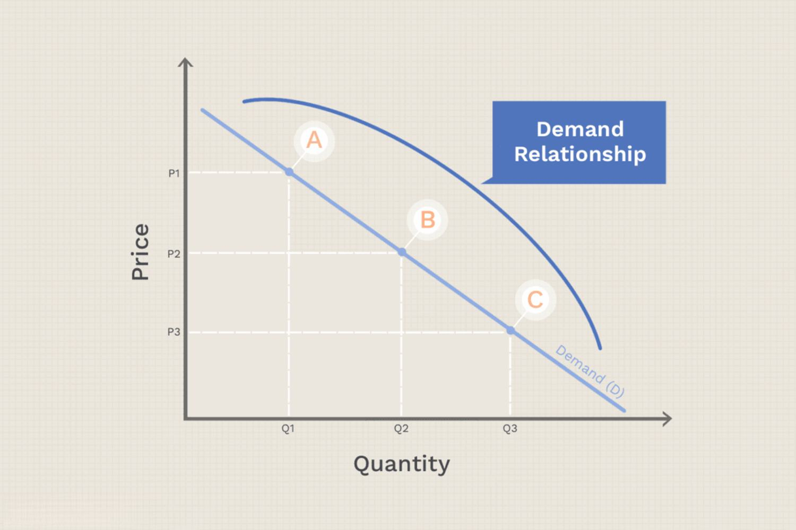

The modern marketplace is constantly evolving, with businesses seeking competitive advantages through innovative strategies. Pricing strategies play a pivotal role in this pursuit, as they can decisively influence consumer behavior and directly affect company profitability. By setting appropriate pricing, businesses can attract and retain customers, enhance market share, and improve their overall financial performance.

Advancements in technology, particularly in data analysis and automation, have introduced algorithmic trading as a tool for optimizing pricing and trading strategies. Algorithmic trading, or "algo trading," involves leveraging complex algorithms to streamline and enhance the efficiency of trading processes. This technological paradigm shift allows companies to perform rapid market analysis, execute trades at optimal prices, and dynamically adjust pricing strategies in response to real-time market data.



This article examines how pricing strategy, consumer pricing behavior, cost reduction, and algorithmic trading intersect to create new opportunities and challenges within today's business landscape. As companies navigate the intricacies of modern market dynamics, understanding and implementing innovative pricing strategies aligned with technological advances like algorithmic trading can provide a significant edge. This exploration seeks to highlight the transformative potential of integrating these elements for businesses striving to maintain and enhance their competitive positioning.

## Table of Contents

## Understanding Pricing Strategies

Pricing strategy is a fundamental aspect of business operations that significantly affects consumer purchasing decisions and the overall market positioning of a company. Effective pricing strategies consider various elements, including the cost of production, consumer demand, and competitive environment. 

One common approach is competitive pricing, where businesses set prices based on what competitors are charging for similar products. This strategy aims to offer a price that is attractive to customers while remaining sustainable for the company, and it often requires ongoing market research to monitor competitor pricing and market conditions.

Cost-plus pricing is another widely utilized strategy. It involves calculating the total cost of producing a product and then adding a markup to ensure profitability. This method ensures all costs are covered and a profit margin is maintained. The formula for cost-plus pricing can be represented as:

$$
\text{Selling Price} = \text{Cost of Production} + \text{Markup}
$$

where the markup is a percentage of the cost of production that determines the desired profit margin.

Value-based pricing, on the other hand, focuses on the perceived value of the product to the customer rather than the cost of production or competitor prices. This approach is particularly effective with unique or highly differentiated products where customers are willing to pay a premium for features they perceive as valuable. Establishing this pricing strategy requires an in-depth understanding of customer preferences and their willingness to pay, often involving market research and customer feedback to gauge perception and satisfaction.

These strategies rely heavily on understanding consumer behavior, which is crucial for setting prices that not only attract new customers but also ensure retention. Businesses can employ tools such as price elasticity of demand to measure how sensitive customers are to price changes, helping to refine pricing strategies more accurately. Price elasticity of demand is calculated as:

$$
E_d = \frac{\%\ \text{Change in Quantity Demanded}}{\%\ \text{Change in Price}}
$$

A good understanding of consumer pricing behavior allows businesses to predict how changes in price affect demand and adjust their strategies accordingly to optimize revenue. By effectively assessing market conditions and consumer behavior, businesses can identify the most suitable pricing strategy to achieve their financial and strategic objectives.

## The Role of Cost Reduction in Pricing

Cost reduction is pivotal in shaping pricing strategies, as it directly influences a company's ability to maintain competitive pricing. The essential goal of cost reduction is to decrease production expenses, allowing businesses to lower their prices while sustaining or even enhancing profitability. Several techniques are employed to achieve cost reduction, including process optimization and supply chain management.

Process optimization involves the systematic improvement of a company's operational workflow to eliminate inefficiencies, reduce waste, and streamline production processes. By using methods such as Lean manufacturing or Six Sigma, businesses can identify and eliminate non-value-adding activities, leading to substantial cost reductions. For instance, Lean manufacturing emphasizes waste minimization without sacrificing productivity. Six Sigma focuses on reducing process variation and improving quality systematically. Implementing these methodologies effectively can result in lower operational costs, thereby enabling more competitive pricing.

Supply chain management is another critical area where cost reduction can significantly impact pricing strategies. By optimizing the supply chain, businesses can achieve cost savings through better negotiation with suppliers, efficient inventory management, logistics planning, and adopting technology for enhanced supply chain visibility. Efficient supply chain management reduces costs associated with transportation, warehousing, procurement, and raw materials. This can be achieved through strategies such as just-in-time inventory, which minimizes inventory holding costs by aligning production schedules closely with demand forecasts.

Lowering production expenses through cost-effective strategies allows companies to reduce their prices or offer more value to their customers without eroding profit margins. Price competitiveness gained via cost reduction can provide a significant market advantage, especially in industries where consumers are sensitive to price changes.

In sum, by adopting comprehensive cost reduction techniques, businesses can reinforce their pricing strategies, ensuring competitive positioning in the market while safeguarding profitability. Using models and methodologies to optimize processes and manage supply chains effectively paves the way for sustainable cost management. This, in turn, offers businesses the flexibility to adjust their pricing strategies in response to changing market conditions, ultimately enhancing their ability to attract and retain customers.

## Algorithmic Trading: A Catalyst for Pricing and Cost Management

Algorithmic trading, or algo trading, utilizes sophisticated algorithms to automate trading activities in financial markets, leveraging computational power to analyze data and execute trades at speeds and accuracies unattainable by human traders. The automation aspect of algo trading significantly enhances efficiency by eliminating the lags and errors typical of manual trading.

A primary advantage of [algorithmic trading](/wiki/algorithmic-trading) is its ability to conduct rapid analysis on multiple market variables, which assists businesses in optimizing their trading strategies. Algorithms can process vast amounts of data, identify patterns or trends, and make data-driven decisions in real-time. This capability promotes cost efficiencies by enabling traders to achieve better pricing on transactions, reducing transaction costs, and minimizing market impact costs.

To illustrate, consider a scenario where the price of a commodity is volatile, fluctuating with market demand and supply. An algorithm can analyze incoming price data and execute trades almost instantaneously, allowing for optimal pricing. Mathematically, this can be represented as a function $P(t)$, where the algorithm evaluates and reacts to the price changes over time $t$ to achieve the minimum cost or maximum profit.

Moreover, incorporating the principles of algo trading into corporate pricing strategies empowers companies to adapt swiftly to market dynamics. Through analyzing real-time data, businesses can modify prices in immediate response to changes in market conditions, customer behavior, or competitor actions. For instance, e-commerce platforms may employ algorithms to adjust product prices based on inventory levels or consumer purchase patterns, ensuring competitive pricing while safeguarding profit margins.

Python, due to its extensive libraries and ease of use, is a preferred choice for implementing algorithmic trading systems. A basic example of an algorithm that could be used in a dynamic pricing strategy is shown below:

```python
import numpy as np

def dynamic_pricing(current_price, demand, supply, alpha=0.01):
    # Adjust price based on demand-supply dynamics
    price_adjustment = alpha * (demand - supply)
    new_price = current_price + price_adjustment
    return new_price

# Example usage
current_price = 100
demand = 150
supply = 130

new_price = dynamic_pricing(current_price, demand, supply)
print(f"Adjusted Price: {new_price}")
```

By adapting pricing using real-time data, businesses can optimize their strategies, increase profitability, and maintain a competitive edge. As the landscape of technology and commerce continues to evolve, the integration of algorithmic trading with cost management and pricing strategies could further drive innovation and efficiency in business operations.

## Integrating Algo Trading with Pricing Strategies

Algorithmic trading leverages sophisticated algorithms to process large volumes of data and execute trades with minimal human intervention. This technology can be a powerful tool for businesses aiming to refine their pricing strategies in response to market dynamics. By analyzing market trends and consumer behaviors through real-time data, algorithmic trading provides valuable insights that can inform dynamic pricing strategies.

Dynamic pricing, also known as surge pricing or demand pricing, involves adjusting prices in response to demand and supply fluctuations. Algorithmic trading systems excel in this area by using predictive analytics to forecast market movements and consumer behavior accurately. For example, an algorithm can analyze historical sales data, consumer purchasing patterns, and external factors such as economic indicators to predict future demand variations.

To demonstrate, consider a simplified Python algorithm that uses historical sales data to predict future demand and adjust prices. The following code illustrates how a company might use [machine learning](/wiki/machine-learning) to inform pricing strategies:

```python
import pandas as pd
from sklearn.model_selection import train_test_split
from sklearn.linear_model import LinearRegression

# Load historical sales data
data = pd.read_csv('sales_data.csv')
X = data[['day_of_week', 'holiday', 'temperature']]
y = data['units_sold']

# Split data into training and test sets
X_train, X_test, y_train, y_test = train_test_split(X, y, test_size=0.2, random_state=42)

# Train a linear regression model
model = LinearRegression()
model.fit(X_train, y_train)

# Predict future demand
predicted_demand = model.predict(X_test)

# Adjust pricing based on predicted demand
for demand in predicted_demand:
    if demand > threshold_high:
        price = base_price * demand_factor
    elif demand < threshold_low:
        price = base_price / demand_factor
    else:
        price = base_price
    print(f"Adjusted price: {price}")
```

This code uses a linear regression model to predict demand based on features such as the day of the week, holidays, and weather conditions. The output guides pricing adjustments: increasing prices when demand surges and potentially lowering them when demand drops.

By integrating algorithmic trading into traditional pricing strategies, businesses can achieve a competitive advantage. Real-time data processing enables them to adapt quickly to changing market conditions, helping to maximize sales revenue and market share. Adjusting prices dynamically ensures that companies are responsive to consumer needs and can optimize their profit margins without alienating customers.

In summary, algorithmic trading facilitates a proactive approach to pricing by providing data-driven insights. Companies that harness this capability can strategically position themselves to capitalize on market opportunities, ultimately enhancing their operational efficiency and profitability.

## Case Studies and Real-World Applications

In recent years, several industries have successfully integrated algorithmic trading techniques into their pricing strategies, leading to enhanced competitiveness and profitability. These advances have been particularly prominent in the retail, e-commerce, and finance sectors.

### Retail Sector

The retail industry has grown increasingly reliant on dynamic pricing algorithms to adjust product prices in real time. Major retailers like Amazon utilize complex algorithms that analyze vast amounts of data, including competitor pricing, consumer behavior, and inventory levels, to modify prices and maximize sales. A study conducted by Chen et al. (2016) indicated that Amazon changes prices on millions of products daily, allowing the company to sustain market leadership by offering competitive prices. This approach enables retailers to align pricing with customer demand, optimizing inventory turnover and increasing revenue.

### E-Commerce Platforms

E-commerce platforms have also benefited significantly from the integration of pricing algorithms. Platforms such as eBay and Alibaba use machine learning models to tailor prices for individual users based on their browsing and purchasing history. This personalized pricing strategy enhances customer experience by offering relevant deals, thereby boosting conversion rates. A report by McKinsey & Company (2018) highlighted that firms implementing dynamic and personalized pricing witness an average increase in revenue by 2-5%.

### Finance Sector

In the financial sector, algorithmic trading has revolutionized stock pricing and trading strategies. High-frequency trading ([HFT](/wiki/high-frequency-trading-strategies)) firms employ sophisticated algorithms to execute trades at speeds far surpassing human capability, capitalizing on minute price discrepancies across markets. This method not only reduces transaction costs but also enhances [liquidity](/wiki/liquidity-risk-premium). An article published in the Journal of Finance indicated that algorithmic trading contributes to reduced bid-ask spreads, benefiting investors through better pricing and increased market efficiency.

### Conclusion

Case studies across different industries illustrate that adopting algorithmic trading and dynamic pricing strategies can lead to significant cost savings and heightened profitability. By embracing these technological advancements, companies can adapt to market shifts promptly, attract and retain customers, and ultimately thrive in an increasingly competitive business environment.

## Challenges and Considerations

Implementing algorithm-based pricing strategies introduces several challenges that businesses must consider. One major concern is the technological cost associated with establishing and maintaining sophisticated algorithmic systems. These systems require substantial investment in hardware, software, and continuous updates to keep up with evolving market demands and technological advancements. Additionally, data management presents another significant challenge. Effective algorithmic pricing relies heavily on the accurate collection, management, and analysis of vast amounts of data. Businesses must ensure robust data infrastructure and management practices to support real-time decision-making and maintain data integrity.

Besides these logistical challenges, businesses must also evaluate the potential risks, such as algorithmic errors, which can lead to inaccurate pricing and ultimately impact profitability. Market [volatility](/wiki/volatility-trading-strategies) is another risk [factor](/wiki/factor-investing), as sudden and unpredictable market changes can render previously effective algorithms less effective or even detrimental. This necessitates continuous monitoring and adjustment of algorithms to align with current market dynamics.

Ethical considerations also play a crucial role in the adoption of algorithmic pricing strategies. Ensuring ethical use of data involves securing customer data and using it responsibly to uphold consumer trust. Misuse of data or lack of transparency can lead to privacy violations and damage company reputation. Maintaining consumer trust is paramount, as any breach could result in customer attrition and reduced customer loyalty.

Overall, while algorithmic pricing offers numerous benefits, businesses must carefully address these challenges and ethical considerations to successfully implement these strategies and maintain a competitive edge.

## Conclusion

The convergence of pricing strategies, consumer pricing, cost reduction, and algorithmic trading offers a substantial opportunity for businesses to enhance their market positioning. By synthesizing these elements, companies can develop robust frameworks that not only attract and retain customers but also optimize operational efficiency. The integration of algorithmic trading into pricing strategies, for instance, enables real-time data analysis and dynamic pricing models that align with market demand fluctuations and consumer behavior patterns. This adaptability can lead to improved sales revenue and market share while minimizing costs.

Furthermore, effective cost reduction plays a crucial role in sustainability, allowing businesses to offer competitive pricing without sacrificing profitability. Techniques such as process optimization and advanced supply chain management contribute significantly to cost efficiency, providing a foundation for strategic pricing decisions.

As technological advancements continue to redefine market parameters, staying informed and flexible in adopting novel strategies becomes imperative for maintaining a competitive edge. Companies that strategically leverage pricing strategies alongside consumer insights and cost management practices stand to gain a distinct advantage in a rapidly evolving business landscape. Embracing emerging trends with an adaptive approach positions businesses effectively to capitalize on new opportunities, fostering growth and resilience in an ever-changing marketplace.

## References & Further Reading

[1]: Bergstra, J., Bardenet, R., Bengio, Y., & Kégl, B. (2011). ["Algorithms for Hyper-Parameter Optimization."](https://dl.acm.org/doi/10.5555/2986459.2986743) Advances in Neural Information Processing Systems 24.

[2]: ["Advances in Financial Machine Learning"](https://www.amazon.com/Advances-Financial-Machine-Learning-Marcos/dp/1119482089) by Marcos Lopez de Prado

[3]: ["Evidence-Based Technical Analysis: Applying the Scientific Method and Statistical Inference to Trading Signals"](https://www.amazon.com/Evidence-Based-Technical-Analysis-Scientific-Statistical/dp/0470008741) by David Aronson

[4]: ["Machine Learning for Algorithmic Trading"](https://github.com/stefan-jansen/machine-learning-for-trading) by Stefan Jansen

[5]: ["Quantitative Trading: How to Build Your Own Algorithmic Trading Business"](https://github.com/LucindaYa/quant-resources/blob/master/Quantitative%20Trading%20How%20to%20Build%20Your%20Own%20Algorithmic%20Trading%20Business.pdf) by Ernest P. Chan