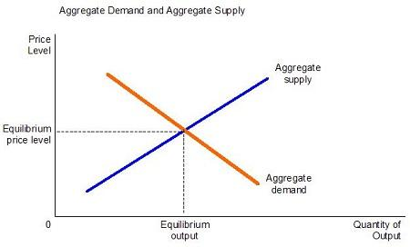

## Table of Contents

## What is the definition of the lowest possible price?

The lowest possible price is the smallest amount of money someone can pay for something. It's the cheapest price you can find for a product or service. Imagine you're looking to buy a toy. If you check different stores and find that one store sells it for less money than anywhere else, that's the lowest possible price for that toy.

Sometimes, the lowest possible price can change. It might go down if a store has a sale or if a new store starts selling the same thing for less. Other times, it might go up if the item becomes harder to find or if costs go up for the people selling it. Knowing the lowest possible price helps people save money and make smart choices about what to buy.

## Why is the concept of the lowest possible price important in economics?

The concept of the lowest possible price is important in economics because it helps people and businesses make choices about what to buy and sell. When people know the lowest price for something, they can save money by choosing the cheapest option. This is good for them because they can use their money for other things they need or want. For businesses, knowing the lowest price helps them decide how to price their own products. If they can offer a lower price than their competitors, they might sell more and make more money.

Also, the lowest possible price affects how the whole economy works. When prices are low, more people can afford to buy things, which can help the economy grow. This is because when people buy more, businesses make more money and might hire more workers. On the other hand, if prices are too low, businesses might not make enough money to keep going, which can hurt the economy. So, finding the right balance with the lowest possible price is key for a healthy economy.

## How does competition affect the lowest possible price?

Competition makes the lowest possible price go down. When many stores or companies sell the same thing, they all want to get your business. So, they try to make their price lower than the others. This is like a race to see who can offer the cheapest price. If one store lowers its price, the others might do the same to keep up. This keeps going until the price is as low as it can be while still letting the stores make some money.

Sometimes, competition can make the lowest possible price go even lower than what it costs to make the product. This is called a price war. In a price war, stores keep lowering their prices to beat each other, even if it means they lose money on each sale. They hope that by selling a lot, they can still make money in the end. But this can be risky because if the price stays too low for too long, stores might go out of business.

## What role do production costs play in determining the lowest possible price?

Production costs are how much it costs to make something. They include things like the materials needed, the workers' pay, and the machines used to make the product. These costs are really important because they set the bottom limit for the price of the product. If a store sells something for less than it cost to make, they will lose money on every sale. So, the lowest possible price has to be higher than the production costs, or the store won't be able to keep selling that product.

But, stores can still lower their prices by finding ways to make the product cheaper. They might find cheaper materials or figure out how to make the product faster. When they do this, the production costs go down, and the lowest possible price can go down too. This means more people can afford to buy the product, and the store can still make money. So, keeping an eye on production costs is key to setting the lowest possible price that keeps everyone happy.

## Can the lowest possible price vary by market, and if so, how?

Yes, the lowest possible price can change from one market to another. A market is just a place where people buy and sell things, like a city or a country. In different markets, things like how much it costs to make the product, how much people want it, and how many other stores are selling it can be different. For example, if it costs more to make something in one country because materials are more expensive there, the lowest price for that product will be higher in that country than in a place where materials are cheaper.

Also, the number of stores selling the same thing can change from one market to another. If there are lots of stores selling the same product in one city, they might all lower their prices to try to get more customers. This can make the lowest possible price in that city lower than in a city where there are fewer stores selling the same thing. So, the lowest possible price can be different in different markets because of all these reasons.

## What are the mechanisms businesses use to achieve the lowest possible price?

Businesses use different ways to make their prices as low as they can. One way is by making things cheaper to produce. They might find cheaper materials, use machines that work faster, or move their factories to places where it costs less to make things. By cutting down on how much it costs to make something, businesses can sell it for less and still make money. Another way is by buying things in big amounts. When businesses buy a lot of materials at once, they often get a discount, which helps them lower their costs and prices.

Competition is another big reason businesses can offer low prices. When there are many stores selling the same thing, they all want to get your business. So, they might lower their prices to be cheaper than the others. This can start a price war where everyone keeps dropping their prices to beat each other. Also, businesses sometimes use sales and discounts to make their prices lower for a short time. This can help them sell more and clear out old stock, which keeps their prices competitive.

Sometimes, businesses work together to keep costs down. They might share the cost of shipping or use the same suppliers to get better deals. By working together, they can all offer lower prices. But they have to be careful not to work together too much, because that can be against the law if it stops other businesses from competing fairly. In the end, all these ways help businesses find the lowest possible price they can offer to their customers.

## How do economies of scale influence the lowest possible price?

Economies of scale happen when a business makes a lot of something and it gets cheaper to make each piece. Imagine you're baking cookies. If you bake just one cookie, you have to turn on the oven and use a lot of time and energy for just that one cookie. But if you bake a hundred cookies at once, the cost of the oven and your time is spread out over all those cookies, making each cookie cheaper to make. When businesses can make things cheaper this way, they can sell them for less money, which helps them reach the lowest possible price.

This is important because it lets big businesses offer lower prices than small ones. If a big company can make a thousand toys for less money per toy than a small company making a hundred toys, the big company can sell those toys for less. This makes the lowest possible price go down. But it's not just about making more; it's also about using resources better. When businesses get bigger, they can buy things in bulk, use better machines, and find smarter ways to work, all of which help them lower their costs and prices.

## What is the relationship between supply and demand and the lowest possible price?

Supply and demand have a big impact on the lowest possible price. Supply is how much of something is available, and demand is how much people want it. When there's a lot of something (high supply) and not many people want it (low demand), the price goes down. Stores have to lower their prices to sell all the stuff they have. This can make the lowest possible price even lower because there's so much of the product around.

On the other hand, when there's not much of something (low supply) and a lot of people want it (high demand), the price goes up. Stores can charge more because people are willing to pay more to get it. This makes the lowest possible price higher because the product is harder to find. So, the balance between how much of something there is and how much people want it can change the lowest possible price a lot.

## How do government regulations impact the lowest possible price?

Government rules can make the lowest price for something go up or down. Some rules make it more expensive for businesses to make things. For example, if the government says businesses have to pay workers more or use safer materials, it costs more to make the product. This means the lowest price has to be higher because businesses can't sell the product for less than it costs to make it. Also, if the government puts a tax on the product, like a sales tax, that makes the price go up too.

But sometimes, government rules can help lower prices. For example, if the government gives businesses money to help them make things, like subsidies, it can cost less to make the product. This can make the lowest price go down because businesses can sell the product for less and still make money. Also, rules that stop businesses from working together to keep prices high can help keep prices low by making sure there's lots of competition. So, government rules can change the lowest possible price in different ways.

## What are the ethical considerations of selling at the lowest possible price?

Selling at the lowest possible price can be good for customers because it helps them save money. When prices are low, more people can afford to buy things they need or want. This can make life easier for people who don't have a lot of money. But, selling things too cheap can also cause problems. If businesses sell things for less than it costs to make them, they might not be able to pay their workers fairly or keep their business running. This can lead to job losses and hurt the economy.

There are also ethical issues to think about. Some businesses might cut corners to keep prices low, like using cheaper materials that aren't as safe or good quality. This can be bad for customers if the products break easily or are dangerous. Also, if businesses move to places where they can pay workers less, it might mean those workers are not treated well or paid enough to live on. So, while low prices can help customers, businesses need to think about how they reach those low prices and make sure they are doing it in a fair and safe way.

## How can technological advancements help in achieving the lowest possible price?

Technology can help businesses make things cheaper and faster. New machines and computers can do work that used to take a lot of time and people. For example, a robot can make a car part much quicker than a person can. This means businesses don't have to pay as much for workers or wait as long to make things. When it costs less to make something, businesses can sell it for less money too. Also, technology like the internet lets businesses find the cheapest materials from all over the world. This helps them keep their costs down and offer lower prices to customers.

But technology can also help in other ways. For example, businesses can use computers to figure out the best price for their products. They can look at what other stores are charging and see how much people are willing to pay. This helps them set a price that is low enough to sell a lot but high enough to make money. Also, technology can help businesses talk to their customers better. They can use the internet to send out sales and discounts, which can make the lowest price even lower for a short time. So, technology can help businesses find and offer the lowest possible price in many different ways.

## What are the long-term sustainability issues associated with maintaining the lowest possible price?

Keeping prices as low as possible can be hard to keep up in the long run. If a business sells things for less than it costs to make them, they might lose money. This can lead to the business going broke if they do it for too long. Also, if businesses cut costs by paying workers less or using cheaper materials, it might not be good for the workers or the customers. Workers might not have enough money to live on, and customers might get products that break easily or are not safe. So, trying to keep prices low all the time can hurt the business, the workers, and the customers in the end.

Another problem is that always having the lowest price can make it hard for new businesses to start up. If big businesses keep prices super low, new businesses might not be able to compete because they can't sell things for that cheap. This can stop new ideas and businesses from coming into the market. Also, if everyone is trying to have the lowest price, it might lead to businesses working together to keep prices low, which can be against the law. So, while low prices are good for customers right now, they can cause big problems for everyone in the long run if they're not done in a fair and smart way.

## What are the key aspects of understanding pricing strategies?

Pricing strategy is a fundamental aspect of business operations that significantly affects consumer purchasing decisions and the overall market positioning of a company. Effective pricing strategies consider various elements, including the cost of production, consumer demand, and competitive environment. 

One common approach is competitive pricing, where businesses set prices based on what competitors are charging for similar products. This strategy aims to offer a price that is attractive to customers while remaining sustainable for the company, and it often requires ongoing market research to monitor competitor pricing and market conditions.

Cost-plus pricing is another widely utilized strategy. It involves calculating the total cost of producing a product and then adding a markup to ensure profitability. This method ensures all costs are covered and a profit margin is maintained. The formula for cost-plus pricing can be represented as:

$$
\text{Selling Price} = \text{Cost of Production} + \text{Markup}
$$

where the markup is a percentage of the cost of production that determines the desired profit margin.

Value-based pricing, on the other hand, focuses on the perceived value of the product to the customer rather than the cost of production or competitor prices. This approach is particularly effective with unique or highly differentiated products where customers are willing to pay a premium for features they perceive as valuable. Establishing this pricing strategy requires an in-depth understanding of customer preferences and their willingness to pay, often involving market research and customer feedback to gauge perception and satisfaction.

These strategies rely heavily on understanding consumer behavior, which is crucial for setting prices that not only attract new customers but also ensure retention. Businesses can employ tools such as price elasticity of demand to measure how sensitive customers are to price changes, helping to refine pricing strategies more accurately. Price elasticity of demand is calculated as:

$$
E_d = \frac{\%\ \text{Change in Quantity Demanded}}{\%\ \text{Change in Price}}
$$

A good understanding of consumer pricing behavior allows businesses to predict how changes in price affect demand and adjust their strategies accordingly to optimize revenue. By effectively assessing market conditions and consumer behavior, businesses can identify the most suitable pricing strategy to achieve their financial and strategic objectives.

## References & Further Reading

[1]: Bergstra, J., Bardenet, R., Bengio, Y., & Kégl, B. (2011). ["Algorithms for Hyper-Parameter Optimization."](https://dl.acm.org/doi/10.5555/2986459.2986743) Advances in Neural Information Processing Systems 24.

[2]: ["Advances in Financial Machine Learning"](https://www.amazon.com/Advances-Financial-Machine-Learning-Marcos/dp/1119482089) by Marcos Lopez de Prado

[3]: ["Evidence-Based Technical Analysis: Applying the Scientific Method and Statistical Inference to Trading Signals"](https://www.amazon.com/Evidence-Based-Technical-Analysis-Scientific-Statistical/dp/0470008741) by David Aronson

[4]: ["Machine Learning for Algorithmic Trading"](https://github.com/stefan-jansen/machine-learning-for-trading) by Stefan Jansen

[5]: ["Quantitative Trading: How to Build Your Own Algorithmic Trading Business"](https://github.com/LucindaYa/quant-resources/blob/master/Quantitative%20Trading%20How%20to%20Build%20Your%20Own%20Algorithmic%20Trading%20Business.pdf) by Ernest P. Chan