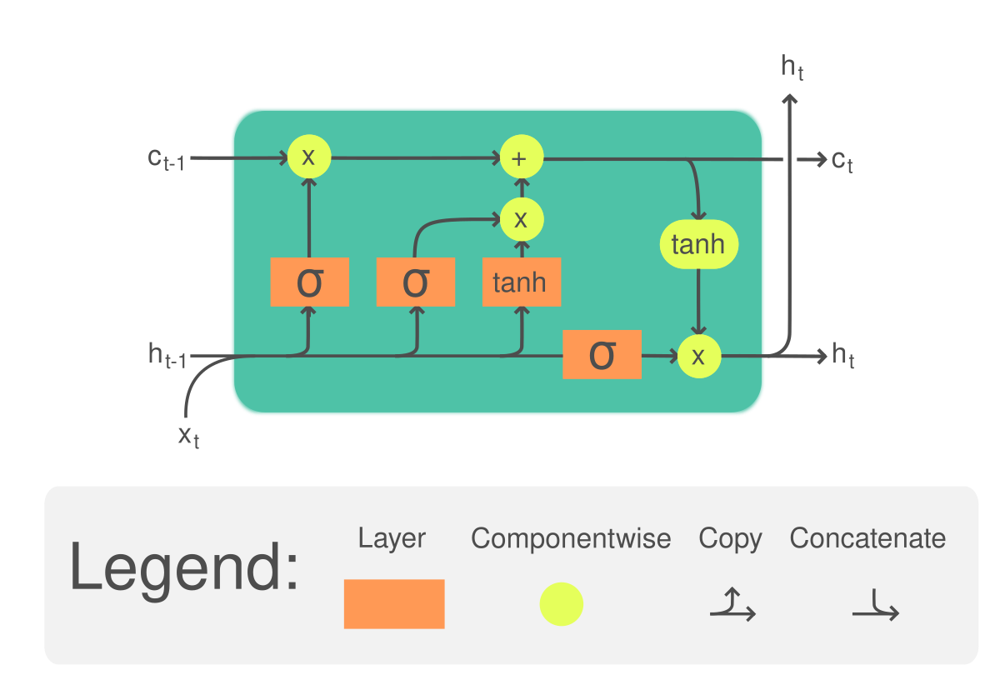

## Table of Contents

## What is an LSTM and how does it differ from a standard RNN?

An LSTM, or Long Short-Term Memory, is a type of recurrent neural network (RNN) designed to solve the problem of vanishing gradients that can occur in standard RNNs. In simple terms, standard RNNs have a hard time remembering information from many time steps ago because the information can become very small as it gets passed through the network. LSTMs address this issue by using a special structure called a memory cell, which can maintain information for long periods. This cell is controlled by structures called gates, which decide what information to keep or forget, allowing the LSTM to effectively learn and remember long-term dependencies in data.

The main difference between an LSTM and a standard RNN lies in their internal architecture and how they handle information over time. A standard RNN uses a simple repeating module that applies the same function to each input, which can lead to the vanishing gradient problem. In contrast, an LSTM's repeating module includes the memory cell and gates, which allow it to selectively remember or forget information. For example, the forget gate in an LSTM can decide to completely ignore certain past inputs, while the input gate can choose to add new information to the cell state. This ability to manage the flow of information makes LSTMs much better at tasks involving sequences, such as language translation or time series prediction, where understanding long-term context is crucial.

## Why are LSTMs important in the field of machine learning?

LSTMs are important in machine learning because they can handle data that comes in sequences, like words in a sentence or stock prices over time. Regular neural networks struggle with this kind of data because they can't remember information from far back in the sequence. LSTMs solve this problem with a special memory cell that can keep important information for a long time. This makes them really good at tasks like predicting the next word in a sentence or understanding the context of a whole document.

Another reason LSTMs are important is that they can learn long-term patterns in data. For example, in a language, the meaning of a word might depend on something that was said much earlier in the conversation. LSTMs use gates to decide what to remember and what to forget, which helps them understand these long-distance relationships. This ability to capture long-term dependencies makes LSTMs useful in many areas, from speech recognition to generating music, where understanding the overall structure is key.

Overall, LSTMs have become a fundamental tool in [machine learning](/wiki/machine-learning) because they can effectively process and learn from sequential data. Their ability to remember and use information from earlier in a sequence makes them more powerful than regular RNNs for tasks where context and order matter. This has led to their widespread use in applications like natural language processing, time series forecasting, and more, making them an essential part of modern machine learning techniques.

## What are the main components of an LSTM cell?

An LSTM cell has several important parts that help it work well with sequences. The first part is the memory cell, which is like a container that holds information over time. This cell can remember things from far back in the sequence, which is really helpful. The second part is the gates, which control what goes in and out of the memory cell. There are three types of gates: the forget gate, the input gate, and the output gate. The forget gate decides what to forget from the memory cell, the input gate chooses what new information to add, and the output gate decides what information to send out of the cell.

Each gate in an LSTM cell uses a special formula to make its decisions. For example, the forget gate might use a formula like $$ f_t = \sigma(W_f \cdot [h_{t-1}, x_t] + b_f) $$ to figure out what to forget. Here, $$ \sigma $$ is the sigmoid function, which squashes numbers between 0 and 1. The input gate uses a similar formula to decide what new information to add, and the output gate uses another formula to decide what to send out. These formulas help the LSTM cell manage the flow of information and make sure it remembers the right things at the right time.

These components work together to let the LSTM cell learn and remember long sequences of data. By controlling what information stays in the memory cell and what gets sent out, the gates help the LSTM understand the context of the whole sequence. This makes LSTMs really good at tasks like predicting the next word in a sentence or understanding the overall structure of a piece of music.

## How does the LSTM's gating mechanism work?

The gating mechanism in an LSTM is like a set of traffic lights that control the flow of information into and out of the memory cell. There are three gates: the forget gate, the input gate, and the output gate. The forget gate decides what information from the past should be forgotten. It uses a formula like $$ f_t = \sigma(W_f \cdot [h_{t-1}, x_t] + b_f) $$ to calculate this, where $$ \sigma $$ is the sigmoid function that gives a number between 0 and 1. If the result is close to 0, the LSTM forgets that information; if it's close to 1, it keeps it. The input gate decides what new information to add to the memory cell. It uses a similar formula to figure out what to add, and then combines this with a new candidate value to update the memory cell.

The output gate controls what information from the memory cell gets sent out as the output. It uses a formula like $$ o_t = \sigma(W_o \cdot [h_{t-1}, x_t] + b_o) $$ to decide this. The output gate takes the current memory cell state, applies a tanh function to it, and then multiplies it by the output gate's decision. This way, the LSTM can send out only the information that's relevant at that moment. By working together, these gates help the LSTM remember important information over long sequences and forget what's not needed, making it great for tasks like understanding sentences or predicting future values in a time series.

## What are the common applications of LSTMs?

LSTMs are really useful in areas where understanding sequences is important. One common use is in natural language processing, like translating languages or predicting the next word in a sentence. For example, when translating from English to French, an LSTM can remember the context of the whole sentence, not just the last few words. This helps it make better translations. Another use is in speech recognition, where an LSTM can understand spoken words by remembering the sounds that came before.

Another big application is in time series prediction, like forecasting stock prices or weather patterns. LSTMs can look at past data and learn patterns that happen over long periods. For example, they can see if stock prices go up in the summer and down in the winter, and use that to make better predictions. They're also used in generating sequences, like creating new music or writing text. An LSTM can learn the style of a piece of music and then create new music that sounds similar, by remembering the patterns it learned.

Overall, LSTMs are great at tasks where the order of things matters. Whether it's understanding a sentence, predicting future events, or creating new sequences, LSTMs help machines understand and work with data that changes over time.

## How do you train an LSTM network?

Training an LSTM network is a lot like teaching a student. You start by showing the LSTM examples of what you want it to learn, like sentences in a language or a series of numbers. Each example is called a "sequence," and you feed these sequences into the LSTM one at a time. The LSTM tries to predict what comes next in the sequence, and you compare its prediction to the actual next item. If the prediction is wrong, you use something called "backpropagation through time" to figure out how to adjust the LSTM's internal weights so it can do better next time. This process repeats over and over with many sequences until the LSTM gets good at predicting.

The key to training an LSTM is to use a loss function and an optimizer. The loss function measures how wrong the LSTM's predictions are. A common loss function for sequences is the "cross-entropy loss," which compares the LSTM's output to the correct answer. The optimizer then uses this loss to update the LSTM's weights. A popular optimizer is "Adam," which adjusts the weights in a smart way to help the LSTM learn faster. You keep training until the loss gets low enough, which means the LSTM is making good predictions. This whole process can be done using libraries like TensorFlow or PyTorch, which make it easier to set up and run the training.

For example, in PyTorch, you might set up an LSTM and train it like this:

```python
import torch
import torch.nn as nn
import torch.optim as optim

# Define the LSTM model
class LSTMModel(nn.Module):
    def __init__(self, input_size, hidden_size, output_size):
        super(LSTMModel, self).__init__()
        self.hidden_size = hidden_size
        self.lstm = nn.LSTM(input_size, hidden_size)
        self.fc = nn.Linear(hidden_size, output_size)

    def forward(self, x):
        lstm_out, _ = self.lstm(x)
        output = self.fc(lstm_out[:, -1, :])
        return output

# Set up the model, loss function, and optimizer
input_size = 10
hidden_size = 20
output_size = 2
model = LSTMModel(input_size, hidden_size, output_size)
criterion = nn.CrossEntropyLoss()
optimizer = optim.Adam(model.parameters())

# Training loop
for epoch in range(num_epochs):
    for sequence, target in dataset:
        optimizer.zero_grad()
        output = model(sequence)
        loss = criterion(output, target)
        loss.backward()
        optimizer.step()
```

This code shows how you can create an LSTM model, set up the loss function and optimizer, and then train the model using a loop that goes through many sequences.

## What are the advantages of using LSTMs over traditional RNNs?

LSTMs are better than traditional RNNs because they can remember things from far back in a sequence. Traditional RNNs have a problem called the vanishing gradient, where information from earlier in the sequence gets smaller and smaller as it goes through the network. This makes it hard for them to remember important details from a long time ago. LSTMs fix this problem with a special memory cell and gates that control what information to keep or forget. For example, the forget gate in an LSTM uses a formula like $$ f_t = \sigma(W_f \cdot [h_{t-1}, x_t] + b_f) $$ to decide what to forget. This ability to manage information over long sequences makes LSTMs much better at tasks like understanding sentences or predicting future events.

Another advantage of LSTMs is that they can learn long-term patterns in data. Traditional RNNs struggle with this because they can only look at a few steps back. But LSTMs can use their gates to keep important information and throw away what's not needed. This helps them understand the overall structure of a sequence, which is really helpful in things like language translation or music generation. For example, in language translation, an LSTM can remember the context of the whole sentence, not just the last few words, which leads to better translations. This makes LSTMs a powerful tool for working with sequences where understanding the context is important.

## Can you explain the concept of long-term dependencies in LSTMs?

Long-term dependencies in LSTMs refer to the ability of the network to remember and use information from far back in a sequence. In simple terms, when you're trying to understand a sentence or predict future values in a time series, some information from the beginning might be crucial even after many steps. Traditional RNNs struggle with this because the information can get lost or become very small as it passes through the network. This problem is called the vanishing gradient. LSTMs solve this by using a special memory cell and gates that control what information to keep or forget. For example, the forget gate in an LSTM uses a formula like $$ f_t = \sigma(W_f \cdot [h_{t-1}, x_t] + b_f) $$ to decide what to forget, helping the network remember important details from earlier in the sequence.

This ability to handle long-term dependencies makes LSTMs very useful in tasks where context matters a lot. For instance, in language translation, the meaning of a word might depend on something said much earlier in the sentence. An LSTM can keep track of this context and use it to make better translations. Similarly, in time series prediction, an LSTM can see patterns that happen over long periods, like seasonal trends in stock prices or weather patterns. By remembering and using information from far back, LSTMs can understand and predict sequences much better than traditional RNNs, making them a powerful tool in machine learning.

## What are some common challenges and limitations when working with LSTMs?

One common challenge with LSTMs is that they can take a long time to train, especially for very long sequences. This is because LSTMs have to go through each step in the sequence one at a time, and if the sequence is long, it can take a lot of time and computing power. Another challenge is that LSTMs can sometimes overfit the data, meaning they learn the training data too well and don't work as well on new data. This can happen if the LSTM is too complex or if it's trained for too long. To avoid overfitting, you might need to use techniques like regularization or early stopping.

Another limitation of LSTMs is that they can struggle with capturing very long-term dependencies if the sequences are extremely long. Even though LSTMs are better than traditional RNNs at this, they still have limits. For example, if you're trying to predict something that depends on information from thousands of steps ago, an LSTM might not be able to keep track of it all. In these cases, you might need to use more advanced models or techniques, like attention mechanisms, which can focus on specific parts of the sequence more effectively.

## How can LSTMs be optimized for better performance?

One way to make LSTMs work better is by tuning their hyperparameters. Hyperparameters are settings you can change before training, like the number of layers or the learning rate. For example, you might try different learning rates to see which one helps the LSTM learn faster without making too many mistakes. Another thing you can do is use regularization techniques, like dropout, which randomly turns off some connections in the network during training. This can help prevent the LSTM from overfitting, where it learns the training data too well but doesn't work as well on new data. You can also use early stopping, which means you stop training the LSTM when its performance on a validation set starts to get worse, even if it's still getting better on the training data.

Another way to optimize LSTMs is by using advanced techniques like attention mechanisms. Attention helps the LSTM focus on the most important parts of the sequence, which can be really helpful for tasks like language translation. For example, when translating a sentence, the LSTM can pay more attention to certain words that are crucial for understanding the meaning. You can also try using different optimizers, like Adam, which can help the LSTM learn faster and more efficiently. Adam adjusts the learning rate for each parameter, which can make the training process smoother. By combining these techniques, you can make your LSTM perform better and handle more complex tasks.

## What are some advanced LSTM architectures and their uses?

One advanced LSTM architecture is the Bidirectional LSTM (BiLSTM). A BiLSTM is like having two LSTMs working together, one reading the sequence forward and the other reading it backward. This helps the network understand the context from both sides of the sequence, which is really useful for tasks like understanding sentences or classifying text. For example, when you read a sentence, knowing what comes before and after a word can help you understand its meaning better. BiLSTMs are often used in natural language processing tasks, like sentiment analysis or named entity recognition, where understanding the whole context of a sentence is important.

Another advanced architecture is the LSTM with attention mechanisms. Attention helps the LSTM focus on the most important parts of the sequence, making it better at tasks like machine translation or text summarization. For instance, when translating a sentence, the LSTM can pay more attention to certain words that are key to the meaning. This makes the translation more accurate because the LSTM can use the right context. Attention mechanisms are also used in other sequence-to-sequence tasks, like generating answers to questions or creating summaries of long documents, where [picking](/wiki/asset-class-picking) out the most relevant information is crucial.

A third example is the Stacked LSTM, where multiple LSTM layers are stacked on top of each other. Each layer can learn different levels of abstraction from the sequence. The lower layers might focus on basic patterns, while the higher layers can understand more complex patterns. Stacked LSTMs are used in tasks like speech recognition or time series prediction, where understanding different levels of detail in the sequence can improve performance. For example, in speech recognition, the lower layers might pick up on individual sounds, while the higher layers understand words and phrases.

## How do LSTMs compare to other deep learning models like Transformers?

LSTMs and Transformers are both used for understanding sequences, but they work in different ways. LSTMs are good at remembering things from earlier in a sequence because they have a special memory cell and gates that control what to keep or forget. For example, the forget gate in an LSTM uses a formula like $$ f_t = \sigma(W_f \cdot [h_{t-1}, x_t] + b_f) $$ to decide what to forget. This makes LSTMs great for tasks like predicting the next word in a sentence or understanding long documents. However, training LSTMs can take a long time, especially for very long sequences, and they might struggle with capturing dependencies that are extremely far apart.

Transformers, on the other hand, use something called attention mechanisms to focus on different parts of the sequence at the same time. This means they can understand the context of the whole sequence without having to go through it step by step like LSTMs do. Transformers are really good at tasks like translating languages or summarizing text because they can see the big picture and pay attention to the most important parts. They also train faster than LSTMs because they can process sequences in parallel. But Transformers can be more complex to set up and might need more data to work well.