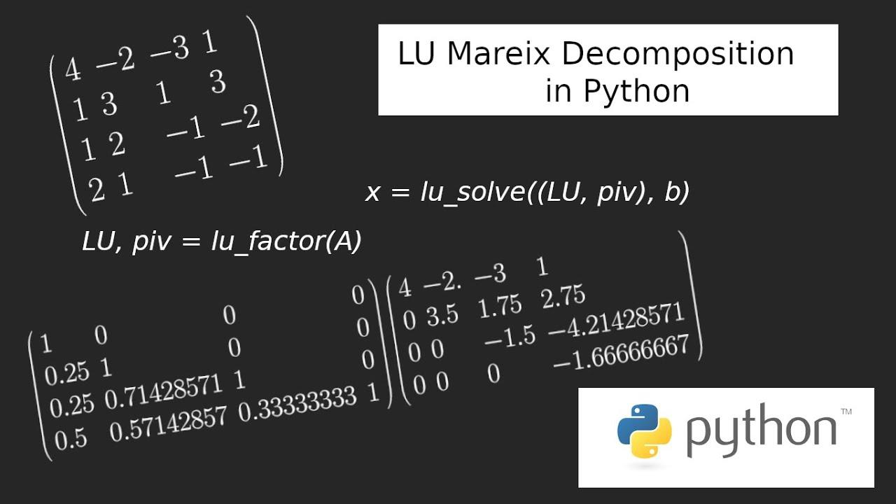

 to LU Decomposition and Algorithmic Trading

LU decomposition, also known as LU factorization, is a mathematical technique used to decompose a given square matrix $A$ into the product of a lower triangular matrix $L$ and an upper triangular matrix $U$. Mathematically, this can be expressed as $A = LU$. This decomposition is significant because it transforms complex matrix operations into simpler ones, facilitating the efficient solution of linear equations, matrix inversion, and determinant computations. Due to its computational efficiency, LU decomposition is widely used in numerical analysis and various applied fields.



Algorithmic trading involves the use of computational algorithms to make trading decisions and execute orders in financial markets. These algorithms are designed to identify market patterns, execute trades at optimal prices, and manage risk. The success of algorithmic trading strategies largely depends on the speed and accuracy of the underlying mathematical computations. Efficient numerical methods, such as LU decomposition, are integral to processing the vast amounts of market data and executing trades within fractions of a second.

The connection between LU decomposition and algorithmic trading emerges from the need for rapid and accurate solutions to mathematical models used in trading strategies. For instance, many financial problems, such as portfolio optimization and risk management, require solving large systems of linear equations. LU decomposition can be employed to perform these calculations efficiently, offering advantages in both computational speed and resource usage.

Numerical methods are critical in financial computing because they provide the tools needed to model, analyze, and solve complex financial problems. They enable traders and financial analysts to derive insights from data, optimize trading strategies, and assess risk more effectively.

As we explore the implementation of LU decomposition using Python in the context of algorithmic trading, it becomes evident that mastering such numerical methods can offer a competitive edge in the fast-paced financial markets. With the proliferation of high-frequency trading and the increasing complexity of financial instruments, the role of mathematical techniques like LU decomposition in enhancing the performance of trading algorithms continues to grow. This exploration will detail the practical application of LU decomposition in Python, demonstrating its utility in developing robust algorithmic trading strategies.

## Table of Contents

## Understanding LU Decomposition

LU decomposition is a fundamental matrix factorization technique in numerical linear algebra. It involves breaking down a square matrix $A$ into the product of two matrices: a lower triangular matrix $L$ and an upper triangular matrix $U$. This decomposition is expressed as:

$$
A = LU
$$

In this representation, the matrix $L$ is a lower triangular matrix, where all the entries above the diagonal are zero. Conversely, $U$ is an upper triangular matrix, characterized by zero entries below its diagonal. This factorization is particularly useful for simplifying complex matrix computations.

To illustrate this with a simple example, consider a 3x3 matrix $A$:

$$
A = \begin{bmatrix} 4 & 3 & 2 \\ 6 & 3 & 1 \\ 2 & 3 & 8 \end{bmatrix}
$$

Its LU decomposition would yield:

$$
L = \begin{bmatrix} 1 & 0 & 0 \\ l_{21} & 1 & 0 \\ l_{31} & l_{32} & 1 \end{bmatrix}
$$

$$
U = \begin{bmatrix} u_{11} & u_{12} & u_{13} \\ 0 & u_{22} & u_{23} \\ 0 & 0 & u_{33} \end{bmatrix}
$$

where the matrix $L$ contains the multipliers used during the Gaussian elimination process, and $U$ is the resultant matrix after these operations.

LU decomposition is pivotal in solving systems of linear equations. For a system $Ax = b$, where $A$ is decomposed into $LU$, the equation can be rewritten as $LUx = b$. By setting $Ux = y$, we first solve the equation $Ly = b$ through forward substitution. Subsequently, we resolve $Ux = y$ via backward substitution. This two-step process significantly enhances computational efficiency, especially for large systems, because both forward and backward substitutions are operations with lower computational complexity compared to direct matrix inversion.

One of the computational benefits of LU decomposition is its ability to reduce the complexity of matrix operations, making them more suitable for implementation on computers. By transforming the problem of matrix inversion into simpler triangular matrix operations, LU decomposition minimizes the accumulation of rounding errors in floating-point calculations and enhances numerical stability.

Furthermore, LU decomposition proves advantageous when multiple solutions are required for different matrices with a shared coefficient matrix $A$. Once the LU decomposition is computed for $A$, it can be reused to solve multiple systems with varying right-hand sides, thus saving considerable computational resources.

## Why LU Decomposition is Useful in Algorithmic Trading

LU decomposition serves as an essential tool in [algorithmic trading](/wiki/algorithmic-trading) by optimizing complex financial calculations through efficient matrix factorization. This matrix decomposition technique finds its application in solving systems of linear equations, a frequent requirement in trading algorithms involving real-time data processing and decision-making.

In algorithmic trading, decisions often need to be made swiftly based on vast datasets of market information. LU decomposition aids in this high-speed requirement by breaking down complex matrix operations, thus accelerating computations. For instance, when executing large-scale portfolios that require ongoing revaluation and risk assessment, strategies depend heavily on solving equations derived from historical prices, correlation matrices, or [factor](/wiki/factor-investing) models, much of which necessitate matrix manipulations.

A prime example where LU decomposition is beneficial is in portfolio optimization. Here, an investor might seek to minimize risk subject to a set constraint on expected returns. The optimization process involves solving a series of linear equations derived from the covariance matrices of asset returns. LU decomposition can transform the original matrices into lower and upper triangular forms, simplifying the process of deriving solutions in a computationally efficient manner.

Another significant application is in modeling the pricing of complex financial derivatives. Derivative pricing models, such as those based on stochastic differential equations, often require the inversion of covariance matrices or solving linear systems at each time step in a simulation. LU decomposition can effectively reduce the computational burden by facilitating these matrix operations swiftly.

However, while LU decomposition offers notable speed advantages, the algorithmic trading field often faces a trade-off between accuracy and computational speed. Given the high-frequency nature of some trading environments, achieving a balance where computations are performed swiftly enough to meet real-time constraints without sacrificing accuracy becomes crucial. Numerical stability is an aspect to watch for—poorly conditioned matrices can lead to imprecise decompositions.

To alleviate these issues, traders and quants often incorporate additional numerical techniques to ensure the robustness of LU decomposition. Methods such as pivoting (partial or complete) can improve the stability and accuracy of solutions by rearranging the rows or columns of a matrix to optimize the numerical properties of the factorization process. By carefully managing these trade-offs, algorithmic trading systems can effectively incorporate LU decomposition for reliable real-time decision-making.

## Implementing LU Decomposition in Python

LU decomposition is a mathematical method used to simplify the process of solving linear equations, and it can be efficiently implemented in Python using libraries such as NumPy and SciPy. These libraries provide robust, optimized functions for performing LU decomposition, allowing for more precise calculations with reduced computational overhead.

### Availability of Python Libraries

**NumPy** and **SciPy** are two popular Python libraries that facilitate numerical computations. NumPy offers basic linear algebra functions, while SciPy extends these functionalities, providing more sophisticated and efficient numerical methods, including LU decomposition.

### Step-by-Step Guide to Implementing LU Decomposition

Here is a guide to implementing LU decomposition in Python using these libraries:

1. **Install the Required Libraries**: Ensure NumPy and SciPy are installed in your Python environment. You can install them via pip if they are not already available:
   ```bash
   pip install numpy scipy
   ```

2. **Import Libraries**: Import the necessary modules from NumPy and SciPy.
   ```python
   import numpy as np
   from scipy.linalg import lu
   ```

3. **Define a Matrix**: Create the matrix you intend to decompose.
   ```python
   A = np.array([[4, 3], 
                 [6, 3]])
   ```

4. **Perform LU Decomposition**: Use the `lu` function from SciPy to decompose the matrix.
   ```python
   P, L, U = lu(A)
   print("P:\n", P)
   print("L:\n", L)
   print("U:\n", U)
   ```

   The `lu` function returns three matrices:
   - **P**: A permutation matrix.
   - **L**: A lower triangular matrix.
   - **U**: An upper triangular matrix.

5. **Verification**: Verify the result by checking if the original matrix can be reconstructed from P, L, and U.
   ```python
   A_reconstructed = P @ L @ U
   print("A_reconstructed:\n", A_reconstructed)
   ```

### Error Handling and Precision Considerations

When implementing LU decomposition, it is crucial to handle errors and consider precision:

- **Singularity and Conditioning**: Check the condition number of the matrix before decomposition to ensure it is not singular or ill-conditioned, which can lead to numerical instability. You can do this using NumPy:
  ```python
  cond_number = np.linalg.cond(A)
  if cond_number < 1/np.finfo(A.dtype).eps:
      print("Matrix is well-conditioned")
  else:
      print("Matrix is poorly conditioned")
  ```

- **Floating Point Precision**: Be mindful of floating-point arithmetic precision, particularly for large matrices or matrices with very small or very large values. Adjusting the data type to higher precision (e.g., `np.float64`) can mitigate some precision issues.

- **Exception Handling**: Utilize Python's exception handling to manage potential errors during matrix operations.
  ```python
  try:
      P, L, U = lu(A)
  except Exception as e:
      print(f"An error occurred during LU decomposition: {e}")
  ```

### Best Practices in Coding

- **Use Structured Arrays**: For large datasets, consider using structured arrays or matrices for better management and manipulation.
- **Optimize Performance**: Leverage SciPy's efficient functions and NumPy's array operations to optimize performance.
- **Documentation and Comments**: Always document the code and include comments to improve readability and maintainability.

By using the functionalities provided by NumPy and SciPy, LU decomposition can be executed effectively in Python, providing computational efficiency and accuracy, essential for applications in algorithmic trading and other numerical computation fields.

## Practical Applications of LU Decomposition in Algo Trading with Python

LU decomposition is a matrix factorization technique that can significantly enhance computational efficiency in algorithmic trading systems. Its applications are manifold and often focus on optimizing complex financial calculations that rely on solving systems of linear equations.

Algorithmic trading strategies can leverage LU decomposition in numerous ways, such as improving the speed and accuracy of pricing models, optimizing portfolios, or managing risks more effectively. In particular, LU decomposition can be instrumental in scenarios where linear algebra calculations form a considerable part of the trading logic, such as when handling covariance matrices in portfolio optimization or linear regression for predictive modeling.

### Portfolio Optimization Example

In portfolio optimization, traders aim to construct a portfolio that maximizes returns while minimizing risk. This often involves calculating the inverse of a covariance matrix to determine the weights of the assets. LU decomposition can efficiently perform this matrix inversion and thus expedite the optimization process.

#### Implementation Steps

1. **Define the Problem:**
   Assume we have a portfolio with returns represented by a covariance matrix $\Sigma$ and we wish to find the asset weights $w$ that minimize risk for a given level of expected return.

2. **LU Decomposition for Matrix Inversion:**
   To implement this in Python, we can use the `scipy.linalg` library, which provides efficient functions for performing LU decomposition. The inverse of the covariance matrix can be obtained and used to solve optimization problems.

3. **Code Example:**

```python
import numpy as np
from scipy.linalg import lu, solve

# Sample covariance matrix
cov_matrix = np.array([[0.1, 0.02, 0.01],
                       [0.02, 0.08, 0.02],
                       [0.01, 0.02, 0.09]])

# Perform LU decomposition
P, L, U = lu(cov_matrix)

# Calculate the inverse using LU decomposition
identity_matrix = np.eye(len(cov_matrix))
cov_matrix_inv = solve(cov_matrix, identity_matrix)

# Display the inverse
print("Covariance Matrix Inverse:\n", cov_matrix_inv)

# The inverse can now be used in further optimization steps
```

4. **Optimizing the Portfolio:**
   With the inverse covariance matrix, various optimization algorithms can be applied to determine the asset weights that meet desired constraints, such as the Efficient Frontier approach.

### Scalability and Improvements

While LU decomposition provides computational efficiency, its scalability can be challenged by large datasets typical in algorithmic trading environments. One must consider techniques for improving matrix conditioning and ensuring numerical stability, such as using regularization methods or pivoting strategies during decomposition.

#### Potential Improvements:

- **Regularization:** Incorporating techniques like Tikhonov regularization can help manage matrix singularity or ill-conditioning.

- **Parallel Processing:** Implementing parallel computing strategies to distribute matrix computation across multiple CPUs or GPUs can significantly reduce computational time for large-scale problems.

In conclusion, employing LU decomposition in algo trading systems facilitates rapid and robust mathematical computations, vital for making timely trading decisions. As data volumes grow and trading strategies become more complex, leveraging advanced computational methods like LU decomposition will remain essential to maintaining competitive advantages in the financial markets.

## Challenges and Considerations

LU decomposition is a powerful tool for matrix factorization, frequently used in numerical analysis and available for many computational applications. However, when applied to financial contexts like algorithmic trading, it presents certain limitations and challenges.

One primary concern is numerical stability. While LU decomposition works well for many well-conditioned matrices, its stability can be compromised with ill-conditioned or nearly singular matrices. Near-zero pivot elements can lead to significant rounding errors, which can be problematic when high precision is critical, as in financial calculations. To combat this, techniques such as partial pivoting, which rearranges the rows of a matrix to place the largest absolute value in a pivot position, may be used. This approach enhances stability but requires additional computational steps, which can impact performance.

Another challenge is handling large datasets, commonplace in algorithmic trading due to the high [volume](/wiki/volume-trading-strategy) of transactions and market data. The computational complexity of LU decomposition is $O(n^3)$, where $n$ is the number of rows or columns in a square matrix. This complexity means that as matrix size increases, the computational time and resources required grow exponentially. This can be prohibitive, necessitating the exploration of parallel computing techniques or more efficient algorithms to manage computations within a reasonable timeframe effectively.

Matrix singularity is another issue, as LU decomposition cannot be applied directly to singular matrices—those having a determinant of zero—and could fail in the process. In such cases, alternative decompositions like the Singular Value Decomposition (SVD) offer a robust solution, as SVD can handle singular and non-square matrices. Moreover, Cholesky decomposition could be considered when dealing with positive-definite matrices, which ensures greater stability and efficiency due to its reduced computational complexity of $O(n^3/3)$.

In practice, testing the condition number of matrices (a measure of their sensitivity to changes in input) can also guide the appropriate use of LU decomposition. A high condition number indicates potential stability issues, suggesting the need for alternative methods or more stable numerical techniques.

Algorithms should have mechanisms to detect and handle these cases gracefully, either by choosing different matrix decomposition methods when applicable or by preprocessing matrices to make them more suitable for LU decomposition. These strategies can ensure more reliable and efficient computational practices in the nuanced environment of financial trading.

## Conclusion

In conclusion, LU decomposition serves as a pivotal tool in algorithmic trading by facilitating efficient and accurate matrix computations essential for complex financial analysis. Its ability to break down matrices into lower and upper triangular forms simplifies the process of solving systems of linear equations, optimizing calculations crucial for real-time decision-making processes in trading environments. This method significantly enhances the computational efficiency required to analyze and act upon vast datasets swiftly.

The utility of LU decomposition in algorithmic trading extends to applications such as portfolio optimization, risk management, and other strategy implementations. By leveraging Python libraries like NumPy and SciPy, traders and financial analysts have at their disposal robust tools to execute these calculations effectively. These libraries not only streamline LU decomposition processes but also improve the accuracy and speed of computations critical to maintaining a competitive edge in trading.

Looking ahead, the future of algorithmic trading will likely see continued integration and evolution of mathematical techniques like LU decomposition. As datasets grow larger and more complex, the demand for efficient numerical methods will escalate. Researchers and practitioners are expected to explore hybrid approaches that combine LU decomposition with other advanced computational methods to tackle emerging challenges such as matrix singularity and numerical stability. Additionally, advancements in computing power and algorithm design will further enhance the scalability and application scope of these mathematical techniques, solidifying their role in the ever-evolving landscape of algorithmic trading.

## Additional Resources

### Additional Resources

For readers interested in expanding their knowledge of LU decomposition and its applications in algorithmic trading, the following resources are highly recommended:

**Books and Papers:**

1. **"Numerical Linear Algebra" by Lloyd N. Trefethen and David Bau III** - This book provides a comprehensive introduction to the principles of numerical linear algebra, including LU decomposition, and explains its practical applications.

2. **"Matrix Computations" by Gene H. Golub and Charles F. Van Loan** - A crucial resource for understanding advanced matrix algorithms and their applications in scientific computing, making it useful for those deploying LU decomposition in algorithmic trading.

3. **"Algorithmic Trading: Winning Strategies and Their Rationale" by Ernie Chan** - While not focused solely on LU decomposition, this book illustrates the broader scope of mathematical techniques, including those where LU decomposition can play a role in optimizing trading strategies.

4. **Research Papers in Financial Computational Methods** - Journals like the Journal of Financial Econometrics and Quantitative Finance often publish research on advanced numerical methods used in trading, some of which may cover topics related to LU decomposition.

**Online Courses and Tutorials:**

1. **Coursera's "Algorithmic Trading Strategies"** - Offered by various universities, these courses explore the foundational strategies in algorithmic trading, providing context on where LU decomposition might fit among other numerical methods.

2. **edX's "Quantitative Methods in Finance"** - This course includes sections on numerical methods in finance which might touch upon the implementation of linear algebra techniques such as LU decomposition.

3. **Khan Academy's Linear Algebra Course** - Though broader, its sections on matrix decomposition provide a useful background for understanding the mathematics behind LU decomposition.

4. **SciPy and NumPy Documentation and Tutorials** - These provide practical guides and examples of implementing LU decomposition in Python, which is particularly useful for algorithmic trading applications.

**Communities and Forums:**

1. **Quantitative Finance Stack Exchange** - A question-and-answer site for finance professionals and enthusiasts to discuss numerical methods and other algorithmic trading topics.

2. **GitHub Repositories** - Searching for repositories related to algorithmic trading provides access to open-source projects where LU decomposition might be applied, offering both learning opportunities and community engagement.

3. **Reddit's r/algotrading** - A community where enthusiasts and professionals share insights and discuss algorithmic trading strategies, tools, and techniques.

4. **LinkedIn Groups** such as "Algorithmic Traders Association" - Networking opportunities with industry professionals who can offer practical advice and insights on the application of mathematical methods like LU decomposition in trading systems. 

By exploring these resources, readers can gain a deeper understanding of how LU decomposition and similar mathematical techniques are leveraged in the field of algorithmic trading, enhancing both their theoretical knowledge and practical applications.

## References & Further Reading

[1]: Trefethen, L. N., & Bau, D. (1997). ["Numerical Linear Algebra."](https://epubs.siam.org/doi/book/10.1137/1.9780898719574) SIAM.

[2]: Golub, G. H., & Van Loan, C. F. (2013). ["Matrix Computations."](https://books.google.com/books/about/Matrix_Computations.html?id=X5YfsuCWpxMC) Johns Hopkins University Press.

[3]: Chan, E. (2009). ["Algorithmic Trading: Winning Strategies and Their Rationale."](https://github.com/NehrenD/algo_trading_and_quant_strategies) Wiley.

[4]: Press, W. H., Teukolsky, S. A., Vetterling, W. T., & Flannery, B. P. (2007). ["Numerical Recipes: The Art of Scientific Computing."](https://assets.cambridge.org/97805218/80688/frontmatter/9780521880688_frontmatter.pdf) Cambridge University Press.

[5]: SciPy and NumPy Documentation. ["SciPy Documentation."](https://docs.scipy.org/doc/) and ["NumPy Documentation."](https://docs.scipy.org/doc/)