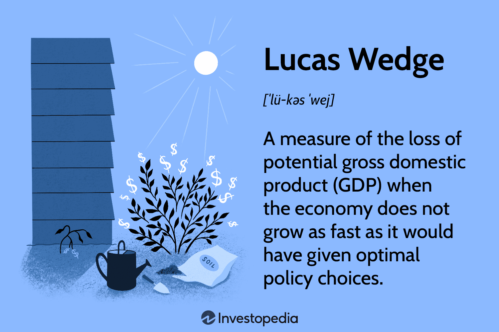

## Table of Contents

## What is a Lucas Wedge?

A Lucas Wedge is a special tool used in surgery. It helps doctors see inside the body better during operations. The tool is shaped like a wedge, which is why it's called a Lucas Wedge. It is often used in surgeries where doctors need to look at the liver or other organs in the belly.

Doctors use the Lucas Wedge by putting it into the body through a small cut. The wedge shape helps push organs aside gently, so the doctor can see the area they need to work on. This tool makes surgeries safer and easier because it helps doctors do their job without hurting other parts of the body.

## What is the basic concept behind the Lucas Wedge?

The basic idea behind the Lucas Wedge is to help doctors see better inside the body during surgery. It's a special tool shaped like a wedge that doctors can use to gently move organs out of the way. This makes it easier for them to see the part of the body they need to work on, like the liver or other organs in the belly.

The Lucas Wedge is used by making a small cut in the body and then inserting the tool. Once inside, the wedge shape helps push organs aside without causing harm. This tool is really helpful because it makes surgeries safer and easier, allowing doctors to focus on the area they need to operate on without disturbing other parts of the body.

## How does the Lucas Wedge function in simple terms?

The Lucas Wedge is a tool that helps doctors during surgery. It is shaped like a wedge, which is a triangle that gets thinner at one end. Doctors use it to gently move organs out of the way so they can see better inside the body. They put the Lucas Wedge into the body through a small cut.

Once inside, the wedge shape helps push organs aside without hurting them. This makes it easier for doctors to see the part they need to work on, like the liver or other organs in the belly. Using the Lucas Wedge makes surgeries safer and easier because it helps doctors focus on the right spot without disturbing other parts of the body.

## Can you provide a basic example of how a Lucas Wedge is used?

During a surgery, a doctor needs to look at a patient's liver to see if it has any problems. To do this, the doctor makes a small cut in the patient's belly. Then, the doctor carefully puts the Lucas Wedge into the cut. The Lucas Wedge is a tool that looks like a triangle and gets thinner at one end.

Once the Lucas Wedge is inside, the doctor uses it to gently push the other organs in the belly out of the way. This helps the doctor see the liver clearly without moving or hurting the other organs. By using the Lucas Wedge, the doctor can focus on checking the liver and do the surgery safely and easily.

## What are the key components of a Lucas Wedge?

A Lucas Wedge is a surgical tool that is made up of a few important parts. The main part is the wedge-shaped piece, which looks like a triangle that gets thinner at one end. This shape is what helps the doctor push organs out of the way gently. The wedge is usually made from a strong material like stainless steel, which can be cleaned and used again.

The other important part of a Lucas Wedge is the handle. The handle is what the doctor holds onto when using the tool. It needs to be easy to grip and comfortable to use during long surgeries. Sometimes, the handle might have a special coating to make it easier to hold, even if it gets slippery. Together, the wedge and the handle make the Lucas Wedge a useful tool for doctors.

## How does the mechanism of a Lucas Wedge work in detail?

The Lucas Wedge is a surgical tool that helps doctors see inside the body better during operations. It works by using its special wedge shape to gently move organs out of the way. The wedge is made of strong materials like stainless steel, which makes it durable and easy to clean. When a doctor needs to look at a specific part of the body, like the liver, they make a small cut in the patient's belly. Then, they carefully insert the Lucas Wedge through this cut. The thin end of the wedge goes in first, and the doctor uses the handle to guide it.

Once the Lucas Wedge is inside the body, the doctor uses it to push organs aside gently. The wedge shape is important because it allows the doctor to move organs without causing harm. The handle of the Lucas Wedge is designed to be easy to grip and comfortable to use, even during long surgeries. This helps the doctor focus on the area they need to work on, like the liver, without disturbing other parts of the body. By using the Lucas Wedge, doctors can perform surgeries more safely and effectively.

## What are the common applications of Lucas Wedges?

Lucas Wedges are often used in surgeries that involve looking at the liver or other organs in the belly. Doctors use them to gently move organs out of the way so they can see the part they need to work on better. This is really helpful in surgeries where the doctor needs to check if the liver has any problems or if there are issues with other organs in the belly area.

The tool is also used in surgeries where doctors need to see inside the body without making big cuts. By using a Lucas Wedge, doctors can make a small cut and still see everything they need to. This makes the surgery safer and helps patients recover faster because the cuts are smaller.

## What are the advantages of using a Lucas Wedge over other mechanisms?

Using a Lucas Wedge has some big advantages over other tools. One main advantage is that it lets doctors see inside the body better without making big cuts. The Lucas Wedge is shaped like a triangle that gets thinner at one end. This shape helps doctors gently move organs out of the way so they can focus on the part they need to work on, like the liver. Because the cuts are smaller, patients can recover faster and have less pain after surgery.

Another advantage is that the Lucas Wedge is easy to use. The handle is designed to be comfortable and easy to grip, even during long surgeries. This makes it easier for doctors to do their job without getting tired. The tool is also made from strong materials like stainless steel, so it can be cleaned and used again. This makes it a good choice for hospitals because it is both effective and long-lasting.

## What are the limitations or challenges when using a Lucas Wedge?

One challenge when using a Lucas Wedge is that it needs a skilled doctor to use it right. The tool has to be put into the body through a small cut, and the doctor must be careful not to hurt any organs while moving them aside. If the doctor is not experienced, they might have a hard time using the Lucas Wedge correctly, which could make the surgery riskier.

Another limitation is that the Lucas Wedge might not work well for all types of surgeries. It is mainly used for looking at organs in the belly, like the liver. If a doctor needs to see other parts of the body, the Lucas Wedge might not be the best tool. Also, the tool can only move organs out of the way, not fix them, so doctors might need to use other tools along with the Lucas Wedge during surgery.

## How can the performance of a Lucas Wedge be optimized?

To make the Lucas Wedge work better, doctors need to practice a lot. They should use it in training sessions so they know how to put it into the body and move organs out of the way without causing harm. The more a doctor practices, the better they will get at using the Lucas Wedge during real surgeries. Also, doctors can work with other team members to make sure everyone knows how to help with the tool. This teamwork can make the surgery go smoother and safer.

Another way to improve how the Lucas Wedge works is to keep it clean and in good shape. The tool is made of strong materials like stainless steel, but it still needs to be taken care of. Doctors should clean the Lucas Wedge well after each use and check it for any damage. If the tool is not working right, it might not move organs out of the way as well, which could make the surgery harder. By keeping the Lucas Wedge in good condition, doctors can make sure it works the best it can during surgeries.

## What advanced techniques can be applied to enhance the functionality of a Lucas Wedge?

To make the Lucas Wedge work even better, doctors can use it with other tools during surgery. For example, they might use small cameras called laparoscopes that go inside the body through the same small cut as the Lucas Wedge. These cameras let the doctor see everything clearly on a screen. By using the Lucas Wedge to move organs and the laparoscope to look around, doctors can see the area they need to work on better. This can make the surgery safer and help the doctor do a better job.

Another way to improve how the Lucas Wedge works is by using special imaging techniques. Doctors can use things like ultrasound or CT scans to see inside the body before they even start the surgery. This helps them plan where to put the Lucas Wedge and how to move organs out of the way. By knowing exactly what's inside the body, doctors can use the Lucas Wedge more carefully and effectively. This can make the surgery go smoother and help patients recover faster.

## Can you discuss a complex real-world scenario where a Lucas Wedge was effectively utilized?

In a complex surgery at a major hospital, a doctor used a Lucas Wedge to help with a liver transplant. The patient had a serious liver problem and needed a new liver to survive. The doctor made a small cut in the patient's belly and carefully put the Lucas Wedge inside. The wedge shape helped the doctor gently move other organs out of the way so they could see the liver clearly. Using the Lucas Wedge made it easier for the doctor to take out the old liver and put in the new one without hurting the other organs. This helped make the surgery safer and helped the patient recover faster.

During the surgery, the doctor also used a small camera called a laparoscope along with the Lucas Wedge. The camera went inside the body through the same small cut and showed the doctor everything on a screen. By using the Lucas Wedge to move organs and the camera to see, the doctor could focus on the liver without making big cuts. This made the surgery less painful for the patient and helped them get better quicker. The Lucas Wedge was a big help in this complex surgery, showing how useful it can be in tough situations.

## What is GDP Growth?

Gross Domestic Product (GDP) represents the total monetary or market value of all the finished goods and services produced within a country's borders in a specified period, often annually or quarterly. It serves as a comprehensive measure of a nation's overall economic activity and, by extension, its economic health. The concept of GDP is integral to understanding economic growth, as it encompasses consumption, investment, government spending, and net exports of goods and services.

GDP growth, typically expressed as a percentage, indicates the rate at which a country's economy is expanding or contracting. A positive GDP growth rate signifies an increase in the production of goods and services, which is usually associated with elevated levels of employment, increased consumer spending, and improved business profitability. Consequently, GDP growth is often correlated with enhanced living standards, as economic expansion generally results in better access to goods, services, and resources for the population.

Economists and policymakers closely monitor GDP growth rates as they inform a wide range of fiscal and monetary policy decisions. For instance, sustained GDP growth might lead to policy measures to control inflation, whereas declining growth could prompt initiatives to stimulate the economy through spending or cutting interest rates.

GDP can be calculated using three primary approaches: the production (or output) approach, the income approach, and the expenditure approach. Among these, the expenditure approach is the most commonly used and is formulated as:

$$
\text{GDP} = C + I + G + (X - M)
$$

Where:
- $C$ represents consumption expenditure,
- $I$ denotes investment expenditure,
- $G$ stands for government expenditure,
- $X$ signifies exports of goods and services,
- $M$ indicates imports of goods and services.

Each component of this formula reflects different facets of economic activity, underlining the multifaceted nature of GDP as a metric. As the global economic landscape evolves, tracking GDP growth remains vital in assessing and strategizing for future economic health and development.

## What is the Understanding of the Lucas Wedge?

The Lucas Wedge is a crucial concept in macroeconomics that seeks to measure the shortfall in potential Gross Domestic Product (GDP) attributable to suboptimal policy decisions over time. This concept was introduced by Robert E. Lucas Jr., a prominent economist whose work on rational expectations and macroeconomic theory earned him the Nobel Prize in Economics in 1995. The Lucas Wedge critically evaluates how policy inefficiencies contribute to prolonged economic sluggishness, ultimately reflecting on the broader spectrum of economic growth and development.

The Lucas Wedge can be visualized as the area between two curves on a graph of GDP over time: one representing potential GDP under optimal policy conditions and the other representing actual GDP under realized policy decisions. Mathematically, if $Y_t^*$ denotes the potential GDP at time $t$ and $Y_t$ is the actual GDP, the Lucas Wedge ($L_t$) at any given time can be expressed as:

$$
L_t = \int_{0}^{t} (Y_s^* - Y_s) \, ds
$$

Here, $Y_s^* - Y_s$ captures the difference between potential and actual GDP at any instance $s$, and integrating this difference over time highlights the cumulative loss in GDP growth attributable to policy inefficiencies.

The concept underscores the significance of effective economic policy in not only achieving short-term economic goals but also in fostering long-term economic prosperity. Inefficient policies, such as high taxation, regulatory constraints, and macroeconomic mismanagement, can create long-lasting adverse effects on economic productivity and living standards. The Lucas Wedge highlights how policy missteps cost economies in terms of foregone investments, innovation, and productivity gains, thereby affecting wealth generation and living standards over an extended period.

The Lucas Wedge serves as a powerful analytical tool for policymakers, enabling them to quantify the cost of economic mismanagement and prioritize reforms that align actual economic growth closer to its potential. By evaluating the size and growth of the Lucas Wedge, economists can identify periods when policy interventions might have been deficient and assess the long-term impacts of such policies on economic output and societal welfare. As such, the Lucas Wedge not only reflects historical policy errors but also guides future policy development to enhance economic efficiency and growth.

## How does Lucas Wedge compare with Okun's Gap?

The Lucas Wedge and Okun's Gap are two economic concepts that shed light on the unrealized potential within an economy, yet they approach this from different angles. Understanding their distinctions is essential for economists and policymakers striving to enhance economic performance.

Okun's Gap, developed from the work of economist Arthur Okun, centers on the relationship between unemployment and GDP. It highlights the impact of unutilized labor on economic output, positing that a 1% increase in unemployment leads to a roughly 2% decrease in GDP from its potential output. This relationship emphasizes the importance of full employment in maximizing an economy's productive capacity. Okun's Gap is expressed mathematically as:

$$

\text{Okun's Gap} = \text{Potential GDP} - \text{Actual GDP}
$$

where Potential GDP is the level of output the economy could achieve if labor resources were fully utilized.

In contrast, the Lucas Wedge, named after economist Robert E. Lucas Jr., focuses on the cumulative loss in GDP resulting from suboptimal policy decisions that lead to less-than-optimal economic growth. Unlike Okun's Gap, which centers on current labor market inefficiencies, the Lucas Wedge examines long-term growth trajectories and policy inefficiencies. It measures the divergence between what the GDP could have been if optimal growth policies were pursued and the actual GDP. Over time, these differences accumulate, representing a substantial loss in potential economic wealth and standards of living.

The key difference lies in their scope and the underlying causal factors they emphasize. Okun's Gap is more immediate and labor-focused, assessing current economic slack due to unemployment. Meanwhile, the Lucas Wedge considers a broader set of factors over a longer-term horizon, reflecting how structural policy decisions cumulatively impact economic prosperity. Balancing these concepts is critical in designing policies that minimize labor market inefficiencies while fostering supportive conditions for sustained economic growth.

## References & Further Reading

[1]: Lucas, R. E. (1988). ["On the Mechanics of Economic Development."](https://www.sciencedirect.com/science/article/abs/pii/0304393288901687) Journal of Monetary Economics, 22(1), 3-42.

[2]: Okun, Arthur M. (1962). ["Potential GNP: Its Measurement and Significance."](https://www.sciencedirect.com/science/article/pii/0167223179900095) In Proceedings of the Business and Economics Statistics Section of the American Statistical Association.

[3]: Chordia, T., Roll, R., & Subrahmanyam, A. (2001). ["Market Liquidity and Trading Activity."](https://onlinelibrary.wiley.com/doi/abs/10.1111/0022-1082.00335) Journal of Finance, 56(2), 501-530.

[4]: Lopez de Prado, M. (2018). ["Advances in Financial Machine Learning."](https://www.amazon.com/Advances-Financial-Machine-Learning-Marcos/dp/1119482089) Wiley.

[5]: Jansen, S. (2020). ["Machine Learning for Algorithmic Trading: Predictive models to extract signals from market and alternative data for systematic trading strategies with Python."](https://www.amazon.com/Machine-Learning-Algorithmic-Trading-alternative/dp/1839217715) Packt Publishing.

[6]: Chan, E. (2009). ["Quantitative Trading: How to Build Your Own Algorithmic Trading Business."](https://github.com/ftvision/quant_trading_echan_book) Wiley.

[7]: Aronson, D. R. (2007). ["Evidence-Based Technical Analysis: Applying the Scientific Method and Statistical Inference to Trading Signals."](https://onlinelibrary.wiley.com/doi/book/10.1002/9781118268315) Wiley.

[8]: Kumar, A. & Lee, C. M. C. (2006). ["Retail Investor Sentiment and Return Comovements."](https://onlinelibrary.wiley.com/doi/abs/10.1111/j.1540-6261.2006.01063.x) Journal of Finance, 61(6), 2451-2486.