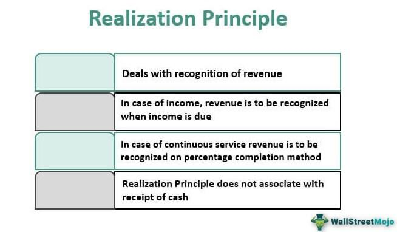

Algorithmic trading, commonly referred to as algo trading, has significantly transformed the landscape of financial markets by harnessing the power of computer programs to execute trades at optimal conditions. This approach can capitalize on market fluctuations with remarkable speed and precision, offering a compelling advantage over traditional trading methods that rely heavily on human discretion. A central aspect of successful algorithmic trading is the profitability of the trading strategies employed. Traders are keenly focused on maximizing returns while minimizing the associated risks, aiming to achieve a balance that ensures sustainable economic gain.

The financial evaluation of algorithmic trading strategies is essential for determining their effectiveness and potential for profit. Traders systematically assess various factors to gauge the lucrativeness of a strategy, examining historical performance, market dynamics, and statistical paradigms to discern opportunities. This process involves an array of performance metrics that reveal the depth of a trading strategy's viability, offering insights into its risk-return profile and operational stability.



Among these metrics, Profit Factor, maximum drawdown, Sharpe ratio, and other key indicators play a pivotal role. They help in quantifying success and highlight areas requiring improvement. A robust analysis of such metrics enables traders to optimize their strategies, aligning them with financial objectives and market conditions. In doing so, they gain the capability to better navigate the complexities of financial markets, thereby increasing the likelihood of achieving consistent and substantial returns over time.

Ultimately, understanding the metrics and mechanisms behind profitable algorithmic trading is crucial for participants in the financial markets. This knowledge facilitates informed decision-making, helping traders to devise strategies that are not only effective in current markets but adaptable to future changes as well. Efficient evaluation and continuous refinement of these strategies are key steps towards enhancing profitability and achieving success in the competitive world of algorithmic trading.

## Table of Contents

## Understanding Lucrative Trading

The term 'lucrative' in the context of trading pertains to any strategy capable of producing substantial profits. A strategy can be considered lucrative if it consistently demonstrates an ability to yield profits over time. This consistency is critical, as it differentiates a fleetingly profitable strategy from a sustainable one.

In algorithmic trading, understanding what contributes to a strategy's lucrativeness is fundamental to financial evaluation and decision-making. Several key factors can influence whether a strategy is lucrative:

1. **Consistency of Returns**: The strategy must reliably generate profits over a significant period, not merely in isolated instances. This stability is often measured through historical backtesting, analyzing past data to estimate a strategy’s future performance.

2. **Risk Management**: A strategy's lucrativeness is not determined solely by gross profits but also by the risks undertaken to achieve those profits. Metrics such as the Sharpe ratio are commonly utilized to assess risk-adjusted returns, providing insight into whether the profits justify the risks.

3. **Market Adaptability**: Lucrative strategies are adaptable to changing market conditions. Rigid strategies can fall prey to market shifts, rendering previously successful approaches obsolete. Continual monitoring and adjustment are necessary to maintain profitability.

4. **Transaction Costs and Slippage**: Even a strategy that shows potential for high returns on paper can be undermined by transaction costs and slippage. These factors need to be incorporated into the strategy's evaluation to accurately gauge its potential profitability.

5. **Technological Execution**: Algorithmic trading often requires fast execution speeds and efficient computing power. Superior technology can be a decisive factor in executing strategies effectively, ensuring the lucrative opportunities are capitalized on without delay.

Understanding these aspects allows traders to craft strategies that are not only theoretically profitable but also practically viable in live trading environments. This holistic approach to evaluating a strategy's potential profit generation ensures that it aligns with broader financial goals and risk thresholds.

## Financial Evaluation of Trading Strategies

To evaluate the financial performance of an [algorithmic trading](/wiki/algorithmic-trading) strategy, traders focus on several key financial metrics to measure profitability and risk. One predominant metric is the Profit Factor, which serves as an indicator of the efficiency and risk-adjusted performance of a trading strategy. The Profit Factor is calculated as the ratio of gross profits to gross losses:

$$
\text{Profit Factor} = \frac{\text{Gross Profits}}{\text{Gross Losses}}
$$

A Profit Factor greater than 1 indicates a profitable strategy, suggesting that the gross profits generated exceed the gross losses incurred. Conversely, a Profit Factor less than 1 implies that losses are surpassing the gains, pointing to an unprofitable strategy.

Profit Factor provides a straightforward measure of a strategy's effectiveness but does not account for variability in returns or the frequency of trades. As a standalone metric, it lacks sensitivity to the nuances of risk exposure and return distribution over time. Therefore, traders often supplement it with other metrics like Sharpe Ratio and maximum drawdown for a more holistic view. However, the simplicity and directness of the Profit Factor make it a favored initial assessment tool for evaluating algorithmic trading strategies.

In practical application, traders use software tools to calculate these metrics. For instance, a basic Python snippet to compute the Profit Factor might look like this:

```python
def calculate_profit_factor(gross_profits, gross_losses):
    if gross_losses == 0:
        return float('inf')  # Avoid division by zero; return infinity if no losses are recorded
    return gross_profits / gross_losses

gross_profits = 5000  # example value
gross_losses = 2500   # example value

profit_factor = calculate_profit_factor(gross_profits, gross_losses)
print(f"Profit Factor: {profit_factor}")
```

Traders analyze these outputs to refine and adjust their algorithms, aiming to achieve a higher, positive Profit Factor, which indicates a robust and potentially lucrative trading strategy. Continuous monitoring and reevaluation based on updated market data are essential to maintain the profitability of these strategies over time.

## Key Metrics for Assessing Profitability

Profitability metrics are crucial for evaluating the success of a trading strategy as they provide a clear assessment of the strategy's ability to generate returns relative to its risk. Among these metrics, the Profit Factor, Sharpe Ratio, Maximum Drawdown, and Win/Loss Ratio are particularly significant.

The **Profit Factor** is a straightforward yet powerful metric calculated as the ratio of gross profits to gross losses. This metric provides a clear indication of a strategy's efficiency in converting risk into profit. A Profit Factor greater than 1 signifies that the strategy is profitable; the higher the number, the better the strategy's risk-adjusted profits.

The **Sharpe Ratio** is a widely used measure that indicates how much excess return you receive for the extra [volatility](/wiki/volatility-trading-strategies) you endure for holding a riskier asset. It's defined as:

$$
\text{Sharpe Ratio} = \frac{E[R] - R_f}{\sigma}
$$

where $E[R]$ is the expected return of the trading strategy, $R_f$ is the risk-free rate, and $\sigma$ is the standard deviation of the excess return. A higher Sharpe Ratio indicates a more favorable risk-return tradeoff.

**Maximum Drawdown** is a metric that captures the worst loss from peak to trough over a particular period for a portfolio, providing insights into the potential risk exposure of the strategy. It is essential for understanding the durability of a strategy under adverse market conditions. The smaller the maximum drawdown, the better the strategy's risk management.

The **Win/Loss Ratio**, calculated as the number of winning trades divided by the number of losing trades, offers insight into the frequency of successful trades relative to unsuccessful ones. A ratio greater than 1 indicates more winning trades than losing ones, but this metric should be considered alongside the average win to average loss ratio to gain a comprehensive understanding of the strategy's profitability.

Together, these metrics reflect the multifaceted nature of trading strategy evaluation, each offering a unique perspective on how effectively a strategy can balance risk and return. By examining these metrics collectively, traders can more accurately discern the strengths and weaknesses of their strategies and make more informed adjustments.

## Challenges in Measuring Lucrativeness

In algorithmic trading, achieving high profitability during [backtesting](/wiki/backtesting) does not necessarily translate to future success due to the dynamic nature of financial markets. One core reason for this discrepancy is the changing conditions within markets. Markets are influenced by numerous external factors such as economic indicators, geopolitical events, regulatory changes, and technological advancements. These factors can cause significant shifts in trends, volatility, and [liquidity](/wiki/liquidity-risk-premium), which are conditions that algorithmic models might not have accounted for during their design phase. Consequently, strategies optimized for past market conditions may underperform when these conditions evolve.

Another significant challenge in measuring the lucrativeness of algorithmic trading strategies is the problem of overfitting. Overfitting occurs when a model is excessively complex and describes random error or noise in the historical data rather than the underlying relationship. This leads to a model that performs admirably on historical datasets but fails to generalize to unseen data. Such a model captures the idiosyncrasies of the past data instead of the actual market dynamics. A telltale sign of overfitting is a disproportionately high Profit Factor in backtesting while showing a considerably lower performance in live markets.

Data snooping bias is another [factor](/wiki/factor-investing) that can obscure the true performance of a strategy. It involves using the same dataset multiple times for testing and refinement, leading to models that seem robust but are merely tailored to anomalies in the dataset. To avoid this, traders should employ techniques such as cross-validation or out-of-sample testing to ensure their models are genuinely predictive.

To mitigate these challenges, algorithmic traders can utilize robust model validation techniques. Cross-validation, particularly k-fold cross-validation, and walk-forward optimization are invaluable in evaluating a model's robustness. Walk-forward optimization involves testing and optimizing a model in a rolling, forward-looking manner to better simulate live trading conditions. 

A proper understanding and implementation of risk management principles is also crucial. This involves setting realistic expectations, employing conservative leverage, and regularly recalibrating the model to adapt to current market conditions. Automation in monitoring market changes can help quickly adapt strategies without human intervention delays.

Overall, while high Profit Factors in backtesting can indicate potential lucrativeness, traders must be wary of overfitting and changing market conditions. By employing comprehensive validation techniques and dynamic risk management, traders can improve their strategies' resilience and profitability in real-world scenarios.

## Real-world Applications and Examples

Analyzing real-world case studies such as Apple's financial statements can offer valuable insights into the factors that contribute to a company's success and lucrativeness. Apple's consistent profitability over the years can be attributed to a variety of factors, including innovative product offerings, efficient supply chain management, and a strong brand presence. By examining such financial statements, one can discern key performance indicators such as revenue growth, profit margins, and return on investment (ROI) that contribute to the company's competitive edge.

In algorithmic trading, similar principles apply. Much like a successful company, a profit-generating trading strategy must strike a balance between risk management and profitable execution. The financial evaluation and monitoring of such strategies often involve metrics paralleling those used in business assessments, like revenue growth and ROI. For example, traders might monitor the Sharpe Ratio as a measure of risk-adjusted return, similar to how a business might analyze its profit margins. A high Sharpe Ratio, like a high profit margin, suggests a lucrative and sustainable strategy, as it indicates that a strategy is generating more returns per unit of risk taken.

Furthermore, real-world examples show the necessity of adapting strategies to changing conditions. For instance, just as Apple continuously evolves its product offerings in response to market trends, traders must also adapt algorithmic strategies to accommodate shifts in market conditions. The phenomenon of overfitting in algorithmic trading, where a strategy performs well on historical data but fails on new data, parallels the business risk of reliance on past success without innovation.

A practical coding approach to ensuring sustainable trading strategies can involve the use of Python to backtest and optimize trading algorithms. The following Python code snippet demonstrates a simple backtesting routine using historical price data:

```python
import pandas as pd
import numpy as np

# Example historical prices as a pandas DataFrame
prices = pd.DataFrame({
    'date': pd.date_range(start='1/1/2020', periods=5),
    'price': [100, 102, 101, 105, 107]
})

# Simple moving average strategy
prices['sma'] = prices['price'].rolling(window=3).mean()

# Generate signals: 1 for buy, -1 for sell
prices['signal'] = np.where(prices['price'] > prices['sma'], 1, -1)

# Calculate returns
prices['returns'] = prices['price'].pct_change()
prices['strategy_returns'] = prices['signal'].shift(1) * prices['returns']

# Output the strategy performance
strategy_performance = (prices['strategy_returns'] + 1).cumprod()
print(strategy_performance)

```

This example illustrates the basic components involved in backtesting a strategy using a moving average. The performance can then be analyzed using profitability metrics such as the Profit Factor or Sharpe Ratio to determine its lucrativeness.

In summary, understanding and applying lessons from successful companies like Apple can guide algorithmic traders in developing and refining strategies that are not only profitable but also sustainable over time. Like adept companies, proficient algorithmic traders must execute a well-researched strategy, continually adapt to market changes, and employ robust financial evaluation techniques to ensure ongoing success.

## Conclusion

Determining the lucrativeness of an algorithmic trading strategy is crucial for achieving consistent returns in the financial markets. Algorithmic trading relies on precise and efficient execution, driven by a series of defined rules and performance metrics. Among these metrics, the Profit Factor stands out as a key indicator, measuring the ratio of gross profits to gross losses. A high Profit Factor signifies a strategy that efficiently balances risk with reward, thereby enhancing its viability over time.

By conducting a comprehensive evaluation of such metrics, traders can make informed decisions that help them to better navigate the complexities of financial markets. Other essential metrics, such as the Sharpe ratio, maximum drawdown, and win/loss ratio, provide additional layers of insight into the strategy's risk-adjusted performance. For instance, a high Sharpe ratio implies that the returns are significant relative to the volatility, while a low maximum drawdown indicates the strategy's resilience against significant capital loss.

Nevertheless, measuring lucrativeness in algorithmic trading is not without its challenges. Market conditions are subject to frequent changes, making past success not always indicative of future results. Furthermore, overfitting, a common pitfall in strategy development, can lead to misleading results by tailoring models too closely to historical data. This highlights the importance of not only initial evaluations but also ongoing optimization and monitoring. By continuously refining algorithms to adapt to new market conditions, traders can enhance the likelihood of maintaining profitable strategies over time.

In conclusion, the journey to consistent profitability in algorithmic trading is complex and demands a diligent approach to assessing and optimizing trading strategies. By employing a robust framework for evaluating performance metrics like the Profit Factor and carrying out sustained strategy adjustments, traders are better positioned to capitalize on the dynamic nature of financial markets.

## References & Further Reading

[1]: Bergstra, J., Bardenet, R., Bengio, Y., & Kégl, B. (2011). ["Algorithms for Hyper-Parameter Optimization."](https://dl.acm.org/doi/10.5555/2986459.2986743) Advances in Neural Information Processing Systems 24.

[2]: ["Advances in Financial Machine Learning"](https://www.amazon.com/Advances-Financial-Machine-Learning-Marcos/dp/1119482089) by Marcos Lopez de Prado

[3]: ["Evidence-Based Technical Analysis: Applying the Scientific Method and Statistical Inference to Trading Signals"](https://www.amazon.com/Evidence-Based-Technical-Analysis-Scientific-Statistical/dp/0470008741) by David Aronson

[4]: ["Machine Learning for Algorithmic Trading"](https://github.com/stefan-jansen/machine-learning-for-trading) by Stefan Jansen

[5]: ["Quantitative Trading: How to Build Your Own Algorithmic Trading Business"](https://www.amazon.com/Quantitative-Trading-Build-Algorithmic-Business/dp/1119800064) by Ernest P. Chan