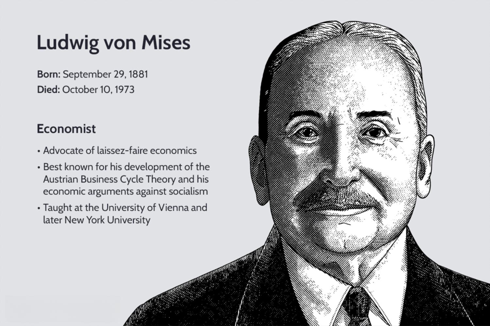

## Table of Contents

## Who was Ludwig von Mises?

Ludwig von Mises was an important economist and thinker. He was born in Austria in 1881 and lived until 1973. Mises is famous for his ideas about free markets and how economies work. He believed that people should be free to make their own economic choices without too much government control. This way, he thought, economies would grow and people would be better off.

Mises wrote many books and articles. One of his most famous books is called "Human Action." In this book, he explains his ideas about how people make choices and how these choices affect the economy. Mises also taught at universities and influenced many other economists and thinkers. His ideas are still studied and discussed today, especially by people who believe in free markets and limited government.

## When and where was Ludwig von Mises born?

Ludwig von Mises was born on September 29, 1881. He was born in the city of Lviv, which was part of Austria-Hungary at that time. Today, Lviv is in Ukraine.

Mises grew up in a time when many big changes were happening in the world. He later became famous for his ideas about economics and how people should be free to make their own choices. His birthplace, Lviv, was an important city in the region, and it played a big role in shaping his early life.

## What were the key events in Ludwig von Mises' early life and education?

Ludwig von Mises was born on September 29, 1881, in Lviv, which was part of Austria-Hungary at the time. He grew up in a well-off family and was the second of three sons. His father was a successful engineer, and his mother came from a wealthy family. Mises showed an early interest in learning and was a good student. He attended the University of Vienna, where he studied law and economics. During his time at the university, he was influenced by the ideas of the Austrian School of economics, which would shape his later work.

At the University of Vienna, Mises earned his doctorate in law in 1906. After completing his studies, he worked for the Austrian government in various roles, including at the Austrian Chamber of Commerce and as an economic advisor. These positions allowed him to put his economic theories into practice and gain real-world experience. In 1913, Mises published his first major work, "The Theory of Money and Credit," which established him as a leading thinker in the field of economics. His early life and education laid the foundation for his later contributions to economic theory and policy.

## What positions did Ludwig von Mises hold throughout his career?

Ludwig von Mises had many important jobs throughout his life. He started working for the Austrian government after finishing his studies at the University of Vienna. He worked at the Austrian Chamber of Commerce and also as an economic advisor. These jobs helped him learn a lot about how economies work in real life. In 1913, he published his first big book, "The Theory of Money and Credit," which made him well-known in the world of economics. During World War I, Mises served in the Austro-Hungarian Army and continued to work on economic issues.

After the war, Mises continued to work for the Austrian government and also started teaching at the University of Vienna. He became a professor there and taught many students who later became important economists themselves. In 1934, he moved to Geneva, Switzerland, to work at the Graduate Institute of International Studies. When World War II started, Mises moved to the United States. In the U.S., he worked at New York University as a visiting professor. He stayed there until he retired in 1969. Throughout his career, Mises wrote many [books](/wiki/algo-trading-books) and articles and influenced a lot of people with his ideas about free markets and limited government.

## What is the Austrian School of Economics, and how did Mises contribute to it?

The Austrian School of Economics is a way of thinking about how economies work. It was started by economists from Austria, like Carl Menger, who believed that the best way to understand the economy is by looking at how people make choices. The Austrian School says that people's choices and actions are very important for understanding how markets work. They think that markets should be free, and that too much government control can make things worse. This school of thought is different from other types of economics because it focuses a lot on individual choices and freedom.

Ludwig von Mises was a big part of the Austrian School. He helped to grow and spread its ideas. Mises believed strongly in free markets and thought that people should be able to make their own economic choices without too much government interference. He wrote many books, including his famous book "Human Action," where he explained how people's choices affect the economy. Mises also taught many students who became important economists themselves. His work helped to make the Austrian School more well-known and respected. Mises's ideas are still studied today by people who believe in free markets and limited government.

## What are the main principles of Ludwig von Mises' economic theories?

Ludwig von Mises believed in the power of free markets. He thought that people should be able to make their own economic choices without too much government control. Mises said that when people are free to choose, they make decisions that help the economy grow. He thought that prices in the market are important because they tell people what things are worth. If the government tries to set prices or control the economy too much, Mises believed it would cause problems like shortages and waste.

Mises also talked a lot about how people make choices. He said that people always try to make the best choices they can with what they have. This idea is called "human action." Mises thought that understanding how people make choices is the key to understanding the economy. He wrote about this in his big book called "Human Action." Mises believed that if the government stays out of the way, the economy will work better because people's choices will lead to more wealth and happiness for everyone.

## How did Ludwig von Mises view the role of government in the economy?

Ludwig von Mises believed that the government should have a very small role in the economy. He thought that people should be free to make their own choices without the government telling them what to do. Mises said that when the government tries to control prices or tell businesses what to do, it often makes things worse. He believed that free markets, where people can buy and sell what they want, are the best way to make the economy grow and help everyone.

Mises thought that the government's job should be to protect people's rights and keep the peace, but not to run the economy. He warned that if the government gets too involved, it can lead to problems like shortages and waste. Mises believed that when people are free to make their own choices, they will make decisions that help the economy work better. He wanted a world where people could be free to create wealth and improve their lives without too much government interference.

## What is Mises' theory of money and credit?

Ludwig von Mises' theory of money and credit is explained in his book "The Theory of Money and Credit." Mises believed that money is important because it helps people trade things easily. He said that money's value comes from what people think it's worth, not just because the government says so. Mises thought that if the government prints too much money, it can cause inflation, which means prices go up and money becomes worth less. He believed that the best way to keep money stable is to let people use it freely without too much government control.

Mises also talked about credit in his theory. He said that credit is when someone lends money to someone else, expecting to get it back later with interest. Mises thought that credit is important for the economy because it lets people spend money they don't have right now, which can help businesses grow. But he warned that if there's too much credit, it can lead to bubbles, where prices go up too fast and then crash. Mises believed that the government should not control credit too much because it can make these problems worse. He wanted a system where people can borrow and lend freely, based on what they think is best.

## How did Mises critique socialism and central planning?

Ludwig von Mises thought that socialism and central planning were bad for the economy. He said that in a socialist system, where the government owns everything and tells people what to do, it's hard to know if things are being used well. Mises believed that without prices set by the market, people can't tell what things are worth. He called this the "economic calculation problem." Mises thought that without prices, the government would make bad choices and waste resources, leading to shortages and less wealth for everyone.

Mises also said that central planning, where the government tries to control the whole economy, doesn't work well. He believed that people know their own needs and wants better than the government does. When the government plans everything, it can't respond quickly to what people really need. Mises thought that free markets, where people can choose and trade freely, are much better at making sure resources go where they're needed most. He warned that central planning leads to big problems and less freedom for people.

## What is the significance of Mises' book 'Human Action' in economics?

Ludwig von Mises' book 'Human Action' is very important in the world of economics. It came out in 1949 and is a big book where Mises explains his ideas about how people make choices and how these choices affect the economy. Mises believed that understanding how people act is the key to understanding economics. He called this idea "praxeology," which is the study of human action. In 'Human Action,' Mises says that people always try to make the best choices they can with what they have. He thought that if people are free to make their own choices, the economy will work better and everyone will be happier.

The book is also important because it strongly supports free markets and limited government. Mises believed that when the government tries to control the economy too much, it can cause big problems like shortages and waste. He thought that prices in the market are important because they tell people what things are worth. 'Human Action' helped spread the ideas of the Austrian School of Economics, which focuses on individual choices and freedom. Many economists and thinkers have been influenced by this book, and it's still studied today by people who believe in free markets and less government control.

## How have Ludwig von Mises' theories influenced modern economic thought?

Ludwig von Mises' theories have had a big impact on how people think about economics today. He was a strong believer in free markets and thought that people should be free to make their own choices without too much government control. His ideas are part of the Austrian School of Economics, which focuses on how people's choices affect the economy. Many economists and thinkers today still study and use Mises' ideas, especially those who believe in free markets and limited government. His book "Human Action" is very important because it explains how understanding people's actions is key to understanding economics.

Mises' theories have also influenced how people think about money and credit. He warned that if the government prints too much money, it can cause inflation, which makes money worth less. He also talked about how credit is important for the economy but can cause problems if there's too much of it. These ideas are still talked about today, especially when people discuss things like inflation and how to manage the economy. Mises' work has helped shape the thinking of many modern economists who believe in letting markets work freely.

## What criticisms have been leveled against Ludwig von Mises' economic theories?

Some people don't agree with Ludwig von Mises' ideas about economics. They say that his belief in free markets and less government control is too simple. Critics think that the real world is more complicated and that sometimes the government needs to step in to help. They argue that Mises' ideas don't work well in situations like the Great Depression, where the economy was in big trouble and needed help from the government. Some also say that Mises didn't pay enough attention to things like unemployment and inequality, which are important problems that need to be fixed.

Another criticism is about Mises' idea of the "economic calculation problem." He said that socialism doesn't work because without market prices, people can't tell what things are worth. But some people think this isn't completely true. They say that governments can use other ways to figure out what things are worth, like planning and data. Critics also think that Mises' focus on individual choices ignores how big businesses and groups can affect the economy. They believe that his theories don't fully explain how the economy works in the real world.

## References & Further Reading

[1]: Mises, L. von. (1998). ["Human Action: A Treatise on Economics."](https://www.econlib.org/library/Mises/HmA/msHmA.html) Ludwig von Mises Institute.

[2]: Mises, L. von. (1953). ["The Theory of Money and Credit."](https://mises.org/library/book/theory-money-and-credit) Yale University Press.

[3]: Rothbard, M. N. (2006). ["Economic Controversies"](https://mises.org/library/book/economic-controversies) Ludwig von Mises Institute.

[4]: Hayek, F. A. (1945). ["The Use of Knowledge in Society."](https://german.yale.edu/sites/default/files/hayek_-_the_use_of_knowledge_in_society.pdf) American Economic Review, 35(4), 519-530.

[5]: Schumpeter, J. A. (2003). ["Capitalism, Socialism and Democracy."](https://www.taylorfrancis.com/books/mono/10.4324/9780203202050/capitalism-socialism-democracy-joseph-schumpeter) Routledge.

[6]: Jansen, S. (2020). ["Machine Learning for Algorithmic Trading: Predictive Models to Extract Signals from Market and Alternative Data for Systematic Trading Strategies."](https://www.amazon.com/Machine-Learning-Algorithmic-Trading-alternative/dp/1839217715) Packt Publishing.

[7]: Chan, E. P. (2008). ["Quantitative Trading: How to Build Your Own Algorithmic Trading Business."](https://github.com/ftvision/quant_trading_echan_book) John Wiley & Sons.