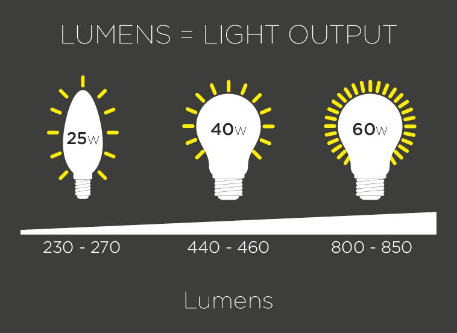

In today's fast-paced and technologically driven world, the role of light and its quantification has expanded beyond their conventional applications. This article examines the intriguing intersection between lumen measurement in lighting systems and algorithmic trading within financial markets. Just as lumens serve as a critical metric for assessing lighting effectiveness, the metaphorical application of light measurement principles in algorithmic trading aims to illuminate pathways that influence both decision-making and profitability.

Algorithmic trading, which relies on complex algorithms to execute trades with speed and precision, benefits from clear and precise data analysis—much like achieving optimal lighting conditions through accurate lumen measurement. Both fields emphasize an underlying data-centric approach, processing vast amounts of information to achieve desirable outcomes. As such, drawing parallels between these two seemingly disparate domains can yield valuable insights, enhancing understanding and innovation for lighting experts and financial traders alike.



By exploring how the metaphorical convergence of light and algorithmic trading can broaden perspectives and applications, we aim to clarify the underlying principles shared by both domains. This approach not only highlights the nuances of each field but also suggests a new paradigm of interdisciplinary thinking. Join us as we illuminate the complexities behind this fascinating connection, and discover how understanding these concepts can lead to enhanced outcomes in both lighting design and financial strategy.

## Table of Contents

## Understanding Lumen in Lighting Systems

Lumen is a fundamental unit of measurement for quantifying the total amount of visible light emitted by a light source. This measurement is pivotal in evaluating the effectiveness and efficiency of lighting systems. One lumen represents the amount of light emitted by a source that uniformly radiates one candela of luminous intensity across a solid angle of one steradian. This unit is integral not only in assessing the brightness of light fixtures but also in ensuring that lighting solutions are both energy-efficient and compliant with established safety and performance standards.

When selecting lighting solutions for different environments, the number of lumens required can vary significantly. In residential settings, lighting requirements are often dictated by the need for comfort and ambiance, with typical living areas requiring approximately 150-300 lumens per square meter. For example, a living room might benefit from softer lighting for relaxation, while a kitchen or workspace may necessitate brighter light to aid in tasks requiring visual precision.

Commercial spaces, on the other hand, demand more strategic lighting approaches. Offices and workspaces typically require higher lumen outputs to enhance productivity and reduce eye strain. The Illuminating Engineering Society (IES) provides guidelines suggesting around 300-500 lumens per square meter for office environments. Retail spaces might use higher lumens to accentuate displays and attract customers, often exceeding 500 lumens per square meter, depending on the desired effect.

In terms of design and functionality, the correct lumen output ensures that lighting fixtures meet the users' needs while promoting energy efficiency. Higher lumens typically equate to brighter light, which can lead to increased energy consumption. Thus, selecting fixtures that provide the necessary brightness without excessive energy usage is crucial. Using LED technology, which offers high lumen output with lower energy consumption compared to traditional incandescent bulbs, is a prime example of integrating lumens effectively in design. 

The application of lumens extends to the design of lighting layouts, which must account for variables such as the room's dimensions, the purpose of the space, and the presence of natural light sources. By calculating the necessary lumens using formulas that consider these factors, architects and designers can create environments that optimize both illumination and energy consumption.

For example, the formula used to calculate the lumens required for a room is:

$$
\text{Lumens Required} = \text{Area (in square meters)} \times \text{Lumens per square meter}
$$

Choosing the appropriate lumens is not just about achieving the right level of brightness. It's also a matter of ensuring safety and compliance with local regulations and standards, such as those stipulated by the International Commission on Illumination (CIE) or national regulatory bodies. Proper lighting design, guided by accurate lumen measurements, enhances the functionality and aesthetic appeal of spaces while ensuring energy and cost efficiency. By understanding and applying the concept of lumens, designers and consumers can make informed decisions that illuminate spaces effectively and sustainably.

## Algorithmic Trading in Financial Markets

Algorithmic trading, commonly known as algo trading, leverages sophisticated algorithms to make trading decisions at speeds and frequencies that exceed human capabilities. These algorithms process vast amounts of market data in real-time, enabling traders to predict trends and execute trades with precision and efficiency that manual trading cannot match.

At the core of [algorithmic trading](/wiki/algorithmic-trading) systems is the analysis of market data. This involves using historical and real-time data to identify trading opportunities. Prices, [volume](/wiki/volume-trading-strategy), and timing are critical data points, often analyzed through statistical and mathematical models. Techniques such as moving averages, oscillators, and other indicators are employed to detect patterns and forecast potential price movements. The use of [machine learning](/wiki/machine-learning) algorithms has further enhanced this process, providing adaptive and predictive insights through models that learn and refine strategies over time.

Decision-making protocols in algorithmic trading are guided by predefined criteria embedded within the algorithms. These criteria, often based on technical or [fundamental analysis](/wiki/fundamental-analysis), dictate when trades should be executed. Rules are encoded into the algorithms to ensure that trades are carried out only when certain conditions are met, such as price thresholds, order sizes, or timing requirements. This automated decision-making process minimizes emotional bias and enhances consistency in trade execution.

The implementation strategies of algo trading systems involve the integration of trading platforms and algorithmic models. Trading platforms provide the infrastructure necessary for executing trades, communicating with exchanges, and managing risk. The algorithms, written in programming languages such as Python or C++, interact with these platforms to monitor markets, analyze data, and initiate trades.

```python
import numpy as np
import pandas as pd

# Example of a simple moving average crossover strategy
def sma_crossover_strategy(data, short_window=40, long_window=100):
    signals = pd.DataFrame(index=data.index)
    signals['price'] = data['price']
    signals['short_mavg'] = data['price'].rolling(window=short_window, min_periods=1, center=False).mean()
    signals['long_mavg'] = data['price'].rolling(window=long_window, min_periods=1, center=False).mean()
    signals['signal'] = 0.0
    signals['signal'][short_window:] = np.where(signals['short_mavg'][short_window:] > signals['long_mavg'][short_window:], 1.0, 0.0)
    signals['positions'] = signals['signal'].diff()
    return signals

data = pd.DataFrame({'price': np.random.rand(100)})
signals = sma_crossover_strategy(data)
print(signals)
```

Understanding these systems highlights their growing dominance and impact on financial markets. High-frequency traders (HFTs), a subset of algo traders, now account for a significant proportion of trading volume across major exchanges. This shift has led to improved market [liquidity](/wiki/liquidity-risk-premium) and reduced bid-ask spreads, though it also raises concerns over market stability and fairness.

In essence, the application of algorithmic trading has revolutionized the financial markets by providing a mechanism for rapid and data-driven decision-making. Its ability to process complex data sets and execute trades with high efficiency underscores the importance of understanding its components and operations, for both seasoned traders and newcomers to the field.

## The Metaphorical Convergence of Light and Trading

In lighting systems, lumens serve as a critical metric for quantifying the brightness created by a light source. This measurement is integral to ensuring spaces are adequately illuminated to meet human needs, whether it be for productivity, safety, or comfort. Similarly, in financial markets, algorithmic trading harnesses data-driven insights to uncover and illuminate trading opportunities. The process involves analyzing vast quantities of market data to make informed decisions quickly and efficiently, somewhat akin to adjusting light levels to achieve optimal visibility in a physical space.

Both lumens and algorithmic trading rely on precise analysis—lumens quantify light intensity while algorithms analyze market trends. The parallels between these two can be understood by considering how each system maximizes its respective domain's visibility. In lighting design, selecting the appropriate lumens and distributing light effectively ensures clarity and eliminates shadows. In trading, algorithms are designed to sift through layers of data to identify patterns and optimize trade strategies, effectively 'illuminating' viable pathways for profit.

Mathematically, the optimization processes in both fields can be seen through similar lenses. In lighting, the objective is to balance lumens to achieve desired brightness while reducing energy consumption: 

$$
\text{Energy Consumption} = \sum (\text{Lumens} \times \text{Wattage})
$$

In algorithmic trading, optimization involves maximizing returns while minimizing risks, often modeled through quadratic programming:

$$
\text{Objective: Maximize } \sum (\text{Expected Return} \times \text{Weight}) - \frac{1}{2} \times \sum (\text{Weight} \times \text{Covariance} \times \text{Weight}^T)
$$

Code-wise, both lighting simulations and financial algorithms can be represented using Python. For instance, a simple Python function to calculate total lumens in a lighting setup could morph into similar logic to calculate potential market exposure in algorithmic trading.

```python
# Hypothetical function to calculate total lumens
def total_lumens(lights):
    return sum(light['lumens'] for light in lights)

# Hypothetical function to calculate market exposure
def total_exposure(trades):
    return sum(trade['exposure'] for trade in trades)
```

The cross-disciplinary understanding of these concepts can enhance both fields by developing more efficient lighting systems and more profitable trading algorithms. The philosophy of achieving clarity and efficiency is invaluable, drawing a clear connection between how lumens and algorithmic trading illuminate their respective environments. Understanding these analogies can lead to a richer comprehension of methodologies that can in turn inspire innovative solutions applicable to both lighting experts and financial traders.

## Implementing Lumens 'Philosophy' in Trading Strategies

Implementing the principles of lighting, particularly those associated with lumens, into algorithmic trading strategies involves drawing parallels between clarity, precision, and efficiency. In lighting, lumens measure the brightness or the visible light emitted by a source, making it essential to ensure optimal illumination suitable for specific environments. Similarly, in algorithmic trading, strategies can be optimized for clarity by processing and analyzing vast datasets to uncover clear insights into market movements.

Clarity in algorithmic trading requires the use of sophisticated data analysis techniques. For example, signal processing algorithms can help discern trends or patterns amidst noisy market data. Python, a favored language among data scientists and quantitative analysts, can be effectively utilized for such tasks. Consider the use of libraries like NumPy for numerical operations and Pandas for manipulating time series data. Here’s a simple Python script exemplifying how traders might enhance clarity in data analysis:

```python
import numpy as np
import pandas as pd

# Load market data
data = pd.read_csv('market_data.csv')

# Applying a moving average to smooth out noise
data['Moving_Average'] = data['Close'].rolling(window=20).mean()

# Visualize the results
data[['Close', 'Moving_Average']].plot(title='Market Data with Moving Average')
```

Precision in lumen measurement demands accurate calculation of light output to ensure proper visibility. In algorithmic trading, precision is mirrored in the need for precise data analysis and execution of trades. Machine learning algorithms, such as supervised learning techniques, can provide this precision by predicting price changes or [volatility](/wiki/volatility-trading-strategies) based on historical data.

Efficiency, a fundamental aspect of effective lighting, translates into reduced energy consumption while maintaining optimal light output. In trading, efficiency involves executing transactions quickly and with minimal errors to exploit market conditions. High-frequency trading ([HFT](/wiki/high-frequency-trading-strategies)) exemplifies this, where algorithms are designed to execute trades within microseconds, minimizing latency and maximizing profit opportunities.

Traders can benefit from this philosophical approach by adapting similar meticulousness and systematic methodologies for strategy development and implementation. Considerations such as enhancing algorithmic models to reflect precision akin to lumen measurement or employing real-time data processing strategies can yield a more informed and strategic trading approach. Through integrating these concepts, traders can navigate the complexities of financial markets with a keen sense of clarity and precision, much like adjusting light intensities to reveal an environment in its best form.

## The Future of Illumination in Trading and Beyond

As technology advances, both lighting systems and financial markets are positioned for transformation through innovative developments. In lumen measurement technologies, emerging advancements are poised to redefine paradigms not only in lighting but potentially in algorithmic trading. Innovations in smart lighting systems, which utilize sensors and real-time data analytics, could offer valuable insights into the development of data-driven trading algorithms. The integration of [artificial intelligence](/wiki/ai-artificial-intelligence) and machine learning in lighting technology exemplifies this, allowing systems to automatically adjust brightness and energy usage based on environmental conditions and user preferences. 

Such principles of adaptability and efficiency are fundamental in enhancing algorithmic trading platforms. In financial markets, the need for rapid analysis and decision-making parallels the requirements in lighting for instantaneous response to changes in ambient conditions. The convergence is exemplified by adaptive algorithms in trading, akin to dynamic lighting systems, which adjust strategies based on real-time market conditions. This interoperability of data processing and sensor technology lays the groundwork for potential cross-disciplinary applications.

Furthermore, the growing interconnectedness of technological fields fosters an environment where breakthroughs in one area can lead to advancements in another. For example, quantum computing's impact on cryptographic practices could revolutionize both data security in trading algorithms and the development of highly efficient lighting materials. Advances in optical computing could enhance data transmission speeds, benefitting both industries by facilitating faster communication and data analysis.

The future promises further integration, with lighting and trading systems continuously influencing one another. For instance, the principles underpinning energy efficiency in lighting systems — maximizing output while minimizing resource expenditure — align closely with strategies for optimizing trading algorithms to achieve the highest returns on investment with minimal risk. As these fields increasingly converge, professionals in both domains can harness the shared knowledge to refine practices, improve efficiency, and drive innovation. This interdisciplinary approach is likely to catalyze creative solutions that address complex problems, highlighting the value of cross-sector collaboration in technological advancement.

## Conclusion

In both lighting systems and financial algorithms, there is a critical reliance on the intricate understanding of complex systems to enable effective illumination and profitable trading. The precision and efficiency required in these fields highlight their shared foundation rooted in data-centric methodologies. For instance, in lighting systems, the accurate measurement of lumens ensures optimal brightness and energy efficiency, while in algorithmic trading, precise data analysis enables the execution of trades with minimal latency and maximized returns.

The interplay between these fields can be observed through their mutual focus on clarity and precision. In lighting, adjusting light intensity is crucial for clarity and energy-saving purposes, similarly in trading, the fine-tuning of algorithms is essential for the clarity of market signals and energy-efficient computations, often handled through optimized code execution. The application of the following Python snippet, for instance, demonstrates how an efficient algorithmic trading strategy is developed with a keen focus on minimizing computational resources while maximizing trading accuracy:

```python
def optimize_trading_strategy(data):
    # Assuming data is a list of historical price points
    # Efficiently calculate moving average as a signal
    moving_avg = sum(data[-5:]) / 5  # Using the last 5 data points

    thresholds = {'buy': 1.01, 'sell': 0.99}

    if data[-1] > moving_avg * thresholds['buy']:
        return "Buy"
    elif data[-1] < moving_avg * thresholds['sell']:
        return "Sell"
    else:
        return "Hold"

historical_data = [100, 101, 102, 103, 104, 105]
optimal_action = optimize_trading_strategy(historical_data)
print(f"Optimal Trading Action: {optimal_action}")
```

The mutual benefit across these domains is accentuated by understanding one can lead to enriched knowledge in the other. Lighting experts can grasp the significance of precision in data evaluation by studying algorithmic trading techniques, just as traders can adopt principles of illumination design to refine their strategies for clarity and optimal decision-making.

Professionals and enthusiasts who explore this junction not only enhance their expertise within their field but also contribute to a broader understanding of how cross-disciplinary innovations can drive progress. This exploration fosters an appreciation for the interconnectedness of modern technologies, paving the way for future breakthroughs that transcend individual disciplines. As lighting and trading strategies continue to evolve, their convergence offers promising potential for innovation, emphasizing the value of an integrative approach in technological advancements.

## References & Further Reading

[1]: Bergstra, J., Bardenet, R., Bengio, Y., & Kégl, B. (2011). ["Algorithms for Hyper-Parameter Optimization."](https://papers.nips.cc/paper/4443-algorithms-for-hyper-parameter-optimization) Advances in Neural Information Processing Systems 24.

[2]: ["Advances in Financial Machine Learning"](https://www.amazon.com/Advances-Financial-Machine-Learning-Marcos/dp/1119482089) by Marcos Lopez de Prado

[3]: ["Evidence-Based Technical Analysis: Applying the Scientific Method and Statistical Inference to Trading Signals"](https://www.amazon.com/Evidence-Based-Technical-Analysis-Scientific-Statistical/dp/0470008741) by David Aronson

[4]: ["Machine Learning for Algorithmic Trading"](https://github.com/stefan-jansen/machine-learning-for-trading) by Stefan Jansen

[5]: ["Quantitative Trading: How to Build Your Own Algorithmic Trading Business"](https://www.amazon.com/Quantitative-Trading-Build-Algorithmic-Business/dp/1119800064) by Ernest P. Chan