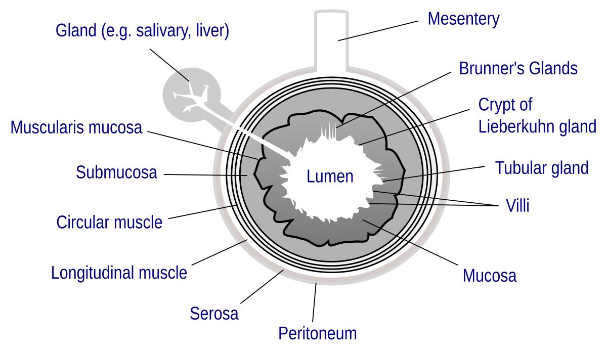

## Table of Contents

## What is Lumen?

Lumen is a device that helps you understand how your body uses the food you eat. It's a small gadget that you breathe into, and it measures the levels of carbon dioxide in your breath. This information tells you whether your body is burning fat or carbs for energy at that moment. By using Lumen regularly, you can learn more about your metabolism and make better choices about what and when to eat.

The device is easy to use. You just need to breathe into it for a few seconds in the morning and before meals. Lumen then gives you a score from 1 to 5, which shows if your body is using fat (higher scores) or carbs (lower scores) for fuel. Based on your score, Lumen gives you personalized advice on what to eat to reach your health goals, like losing weight or improving your energy levels. It's like having a nutrition coach that helps you every day.

## Who developed Lumen and when was it first released?

Lumen was developed by a team of scientists and engineers led by Merav Mor, a biochemist, and Michal Almog, an engineer. They wanted to create a tool that could help people understand their metabolism better and make healthier eating choices. The idea for Lumen came from their own experiences and the need for a simple way to measure how the body uses energy from food.

The first version of Lumen was released in 2019. Since then, it has become popular among people who want to manage their weight and improve their health. The device has been praised for its ease of use and the personalized advice it provides based on the user's metabolic state.

## What are the main features of Lumen?

Lumen is a small device that you breathe into to check your metabolism. It tells you if your body is using fat or carbs for energy by measuring the carbon dioxide in your breath. You use it in the morning and before meals, and it gives you a score from 1 to 5. A higher score means your body is burning more fat, and a lower score means it's burning more carbs.

Based on your score, Lumen gives you advice on what to eat to reach your health goals. It's like having a personal nutrition coach. The device is easy to use and helps you understand how your body uses food, which can help you lose weight or improve your energy levels.

## How does Lumen compare to other micro-frameworks like Laravel?

Lumen and Laravel are both created by the same team, but they are different in how they work and what they are used for. Lumen is a micro-framework, which means it's smaller and faster than Laravel. It's designed for building small, fast web applications and APIs. If you want to make something simple and quick, Lumen is a good choice because it doesn't have all the extra features that Laravel has.

Laravel, on the other hand, is a full-featured framework. It has a lot more tools and options for building bigger and more complex web applications. Laravel is great if you need things like user authentication, a lot of database options, and other advanced features. It takes more time to set up and run compared to Lumen, but it gives you more power and flexibility.

In short, if you need a simple, fast solution for a small project, Lumen is the way to go. But if you're working on a bigger project that needs a lot of features and customization, Laravel would be a better fit. Both are good tools, but they serve different purposes depending on what you need.

## What are the system requirements for running Lumen?

To run Lumen, you need a computer with PHP installed. PHP is a programming language that Lumen uses. You should have at least PHP version 7.2 or higher because Lumen needs this to work properly. Besides PHP, you'll need a web server like Apache or Nginx to host your Lumen application. You also need a database, such as MySQL or PostgreSQL, to store and manage your data.

Lumen is designed to be lightweight and fast, so it doesn't need a lot of resources. It can run on most modern computers, whether you're using Windows, macOS, or Linux. As long as you have the right version of PHP and a web server set up, you should be able to get Lumen running without any problems.

## How do you install Lumen on a local machine?

To install Lumen on your local machine, first make sure you have PHP version 7.2 or higher installed. You can check this by opening a command prompt or terminal and typing 'php -v'. If you don't have PHP installed or your version is too old, you'll need to download and install the latest version from the PHP website. Once PHP is set up, open your command prompt or terminal and use Composer, a tool for managing PHP packages, to install Lumen. Type 'composer create-project --prefer-dist laravel/lumen your-project-name' and hit enter. This command will download Lumen and set up a new project for you.

After the installation is complete, navigate to the project folder by typing 'cd your-project-name' in the command prompt or terminal. To make sure everything is working, you can start a local development server by typing 'php artisan serve'. This command will start a server that you can access in your web browser at 'localhost:8000'. Now you have Lumen installed and running on your local machine, ready for you to start building your application.

## What is the basic structure of a Lumen application?

A Lumen application has a simple structure that makes it easy to find and work with different parts of your project. When you install Lumen, you'll see a main folder called 'app' where most of your code lives. Inside 'app', there are folders like 'Http' for handling web requests, 'Console' for command-line tasks, and 'Exceptions' for managing errors. You'll also find files like 'Http/Kernel.php' which controls how your app processes requests, and 'Exceptions/Handler.php' which deals with any errors that come up.

Outside of the 'app' folder, there are other important parts of your Lumen project. The 'bootstrap' folder has files that help start your application, like 'app.php'. The 'config' folder holds all your app's settings in files like 'app.php' and 'database.php'. The 'public' folder is where your main 'index.php' file lives, which is the entry point for your web app. Lastly, the 'routes' folder contains 'web.php', where you set up the paths visitors can take through your app. This clear structure helps you keep your project organized and easy to manage.

## How do you create and manage routes in Lumen?

In Lumen, routes are paths that guide users through your app. You set them up in a file called 'web.php' which you'll find in the 'routes' folder. To create a route, you write a line of code that tells Lumen what to do when someone visits a certain path. For example, if you want to show a welcome message when someone visits '/hello', you'd write something like `$app->get('/hello', function () { return 'Welcome!'; });`. This line says that when someone goes to '/hello', Lumen should show 'Welcome!'.

Managing routes in Lumen is easy because you can group them, add middleware, or even name them for easier reference. Middleware are like filters that can check if a user is logged in before letting them see a page. You can group routes that need the same middleware or prefix by using `$app->group(['middleware' => 'auth'], function () use ($app) { ... });`. This groups routes that need the user to be logged in. Naming routes helps you link to them easily in your app, like `$app->get('/profile', ['as' => 'user.profile', 'uses' => 'ProfileController@show']);`. This way, you can use the name 'user.profile' to link to the profile page without worrying about the exact path.

## What are middleware in Lumen and how are they used?

Middleware in Lumen are like helpers that do things before a request reaches your app or after it leaves. They can check if someone is logged in, add information to the request, or change the response before it's sent back. Think of them as gatekeepers that make sure everything is okay before letting the request go through.

To use middleware in Lumen, you add them to your routes or route groups. For example, if you want to make sure someone is logged in before they can see a page, you can use an 'auth' middleware. You'd write something like `$app->group(['middleware' => 'auth'], function () use ($app) { ... });` in your 'web.php' file. This tells Lumen to check if the user is logged in before letting them see any pages in that group. Middleware make it easier to keep your app safe and organized.

## How can you integrate databases with Lumen?

To integrate databases with Lumen, you first need to set up your database connection in the 'database.php' file in the 'config' folder. This file tells Lumen which database to use, like MySQL or PostgreSQL, and how to connect to it. You'll need to enter details like the database name, username, password, and the server's address. Once you've set this up, Lumen can talk to your database and start using it.

After setting up the connection, you can use Eloquent, which is a part of Laravel that Lumen can use, to work with your database. Eloquent lets you create 'models' that represent tables in your database. For example, if you have a 'users' table, you can create a 'User' model to interact with it. You can then use this model to do things like save new users, find existing ones, or update information. This makes it easy to manage your data without writing a lot of complicated code.

## What are some advanced features of Lumen that can enhance application performance?

Lumen has some advanced features that can make your app run faster and work better. One of these features is called 'caching'. Caching means storing information that your app uses a lot so it doesn't have to get it from the database every time. This can make your app much quicker because it doesn't have to wait for the database to send back the same information over and over. Another feature is 'queueing', which lets your app do heavy tasks in the background. This means your app can keep running smoothly for users while it works on big jobs like sending emails or processing data.

Another way Lumen can boost performance is by using 'compiled routes'. This means Lumen turns your routes into a faster format that it can use more quickly. It's like having a shortcut to get to where you need to go faster. Also, Lumen supports 'database migrations', which let you easily change your database structure without messing things up. This keeps your app running smoothly even as you make changes. By using these features, you can make your Lumen app faster and more reliable.

## How can you deploy a Lumen application to a production environment?

To deploy a Lumen application to a production environment, you first need to make sure your app is ready. This means testing it thoroughly to catch any bugs and optimizing it for better performance. Once your app is ready, you'll need to choose a hosting service where you can put your app online. Popular choices include platforms like Heroku, AWS, or DigitalOcean. You'll need to set up your server with the right version of PHP and any other tools your app needs, like a web server and a database.

After setting up the server, you can deploy your Lumen app by uploading your code to the server. You can do this using tools like Git, which lets you push your code to the server easily. Once your code is on the server, you need to run any necessary commands to set up your app, like running database migrations or setting up environment variables. After everything is set up, you can start your app and make sure it's working correctly. Regular updates and monitoring will help keep your app running smoothly in the production environment.

## What is the role of Lumen in lighting systems?

Lumen is a fundamental unit of measurement for quantifying the total amount of visible light emitted by a light source. This measurement is pivotal in evaluating the effectiveness and efficiency of lighting systems. One lumen represents the amount of light emitted by a source that uniformly radiates one candela of luminous intensity across a solid angle of one steradian. This unit is integral not only in assessing the brightness of light fixtures but also in ensuring that lighting solutions are both energy-efficient and compliant with established safety and performance standards.

When selecting lighting solutions for different environments, the number of lumens required can vary significantly. In residential settings, lighting requirements are often dictated by the need for comfort and ambiance, with typical living areas requiring approximately 150-300 lumens per square meter. For example, a living room might benefit from softer lighting for relaxation, while a kitchen or workspace may necessitate brighter light to aid in tasks requiring visual precision.

Commercial spaces, on the other hand, demand more strategic lighting approaches. Offices and workspaces typically require higher lumen outputs to enhance productivity and reduce eye strain. The Illuminating Engineering Society (IES) provides guidelines suggesting around 300-500 lumens per square meter for office environments. Retail spaces might use higher lumens to accentuate displays and attract customers, often exceeding 500 lumens per square meter, depending on the desired effect.

In terms of design and functionality, the correct lumen output ensures that lighting fixtures meet the users' needs while promoting energy efficiency. Higher lumens typically equate to brighter light, which can lead to increased energy consumption. Thus, selecting fixtures that provide the necessary brightness without excessive energy usage is crucial. Using LED technology, which offers high lumen output with lower energy consumption compared to traditional incandescent bulbs, is a prime example of integrating lumens effectively in design. 

The application of lumens extends to the design of lighting layouts, which must account for variables such as the room's dimensions, the purpose of the space, and the presence of natural light sources. By calculating the necessary lumens using formulas that consider these factors, architects and designers can create environments that optimize both illumination and energy consumption.

For example, the formula used to calculate the lumens required for a room is:

$$
\text{Lumens Required} = \text{Area (in square meters)} \times \text{Lumens per square meter}
$$

Choosing the appropriate lumens is not just about achieving the right level of brightness. It's also a matter of ensuring safety and compliance with local regulations and standards, such as those stipulated by the International Commission on Illumination (CIE) or national regulatory bodies. Proper lighting design, guided by accurate lumen measurements, enhances the functionality and aesthetic appeal of spaces while ensuring energy and cost efficiency. By understanding and applying the concept of lumens, designers and consumers can make informed decisions that illuminate spaces effectively and sustainably.

## What is the metaphorical convergence of light and trading?

In lighting systems, lumens serve as a critical metric for quantifying the brightness created by a light source. This measurement is integral to ensuring spaces are adequately illuminated to meet human needs, whether it be for productivity, safety, or comfort. Similarly, in financial markets, algorithmic trading harnesses data-driven insights to uncover and illuminate trading opportunities. The process involves analyzing vast quantities of market data to make informed decisions quickly and efficiently, somewhat akin to adjusting light levels to achieve optimal visibility in a physical space.

Both lumens and algorithmic trading rely on precise analysis—lumens quantify light intensity while algorithms analyze market trends. The parallels between these two can be understood by considering how each system maximizes its respective domain's visibility. In lighting design, selecting the appropriate lumens and distributing light effectively ensures clarity and eliminates shadows. In trading, algorithms are designed to sift through layers of data to identify patterns and optimize trade strategies, effectively 'illuminating' viable pathways for profit.

Mathematically, the optimization processes in both fields can be seen through similar lenses. In lighting, the objective is to balance lumens to achieve desired brightness while reducing energy consumption: 

$$
\text{Energy Consumption} = \sum (\text{Lumens} \times \text{Wattage})
$$

In algorithmic trading, optimization involves maximizing returns while minimizing risks, often modeled through quadratic programming:

$$
\text{Objective: Maximize } \sum (\text{Expected Return} \times \text{Weight}) - \frac{1}{2} \times \sum (\text{Weight} \times \text{Covariance} \times \text{Weight}^T)
$$

Code-wise, both lighting simulations and financial algorithms can be represented using Python. For instance, a simple Python function to calculate total lumens in a lighting setup could morph into similar logic to calculate potential market exposure in algorithmic trading.

```python
# Hypothetical function to calculate total lumens
def total_lumens(lights):
    return sum(light['lumens'] for light in lights)

# Hypothetical function to calculate market exposure
def total_exposure(trades):
    return sum(trade['exposure'] for trade in trades)
```

The cross-disciplinary understanding of these concepts can enhance both fields by developing more efficient lighting systems and more profitable trading algorithms. The philosophy of achieving clarity and efficiency is invaluable, drawing a clear connection between how lumens and algorithmic trading illuminate their respective environments. Understanding these analogies can lead to a richer comprehension of methodologies that can in turn inspire innovative solutions applicable to both lighting experts and financial traders.

## References & Further Reading

[1]: Bergstra, J., Bardenet, R., Bengio, Y., & Kégl, B. (2011). ["Algorithms for Hyper-Parameter Optimization."](https://papers.nips.cc/paper/4443-algorithms-for-hyper-parameter-optimization) Advances in Neural Information Processing Systems 24.

[2]: ["Advances in Financial Machine Learning"](https://www.amazon.com/Advances-Financial-Machine-Learning-Marcos/dp/1119482089) by Marcos Lopez de Prado

[3]: ["Evidence-Based Technical Analysis: Applying the Scientific Method and Statistical Inference to Trading Signals"](https://www.amazon.com/Evidence-Based-Technical-Analysis-Scientific-Statistical/dp/0470008741) by David Aronson

[4]: ["Machine Learning for Algorithmic Trading"](https://github.com/stefan-jansen/machine-learning-for-trading) by Stefan Jansen

[5]: ["Quantitative Trading: How to Build Your Own Algorithmic Trading Business"](https://www.amazon.com/Quantitative-Trading-Build-Algorithmic-Business/dp/1119800064) by Ernest P. Chan