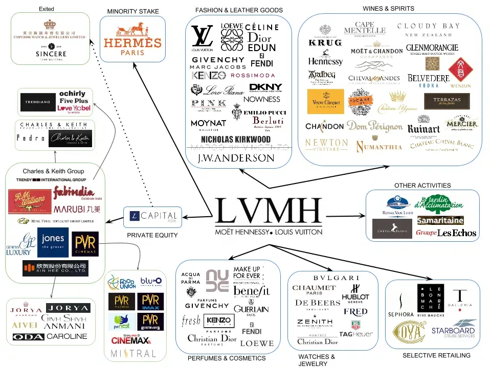

## Table of Contents

## What is LVMH and what does it stand for?

LVMH is a big company that owns many famous brands. It stands for "LVMH Moët Hennessy Louis Vuitton." The company sells luxury things like clothes, bags, makeup, and drinks. It was started in 1987 when two companies, Moët Hennessy and Louis Vuitton, joined together.

LVMH is very important in the luxury market. It has over 70 brands, including well-known names like Christian Dior, Givenchy, and Sephora. The company is run by a man named Bernard Arnault, who is very rich and helps make the company successful. LVMH makes a lot of money by selling high-quality products to people all over the world.

## What are the different types of ownership structures at LVMH?

LVMH has different ways to own its brands. Some brands are fully owned by LVMH, which means LVMH has complete control over them. For example, Louis Vuitton and Christian Dior are fully owned by LVMH. This type of ownership is called a wholly-owned subsidiary. It helps LVMH make all the decisions for these brands without needing to ask anyone else.

Other brands are partly owned by LVMH. This means LVMH owns a part of the brand, but not all of it. For example, LVMH might own 50% or 70% of a brand, and other people or companies own the rest. This type of ownership is called a joint venture or a minority stake. It can be good because LVMH can work with others to grow the brand, but it also means they have to share control and profits.

LVMH also uses licensing agreements with some brands. This means LVMH lets other companies use their brand names to make and sell products, but LVMH still gets money from it. This helps LVMH reach more customers without having to own the whole brand. Each type of ownership structure helps LVMH in different ways to grow and make money.

## How does LVMH's ownership influence its business strategy?

LVMH's ownership structure plays a big role in how it makes business plans. When LVMH fully owns a brand, it can make all the decisions about what to do with it. This means LVMH can decide to open new stores, change the products, or spend more money on advertising without asking anyone else. This helps LVMH grow these brands quickly and keep them in line with its overall goals. For example, LVMH can use its big resources to make Louis Vuitton even more famous and successful.

When LVMH only partly owns a brand, it has to work with other people. This can be good because it shares the costs and risks with others. But it also means LVMH can't make all the decisions alone. It has to talk with the other owners and agree on what to do. This can slow things down, but it can also bring in new ideas and help LVMH reach different customers. For example, working with other companies on a brand like Sephora can help LVMH learn new ways to sell beauty products and grow in new markets.

## What role does the Arnault family play in LVMH's ownership?

The Arnault family has a big role in owning LVMH. Bernard Arnault, the head of the family, is the Chairman and CEO of LVMH. He and his family own a lot of the company's shares, which gives them a lot of control over what LVMH does. Because they own so much, they can make important decisions about the company's future and how it grows.

The Arnault family's ownership helps keep LVMH stable and focused on long-term goals. Since they have a big say in what happens, they can make sure LVMH keeps doing well and stays a leader in the luxury market. Their strong leadership helps LVMH make smart choices about which brands to buy, how to grow, and how to keep customers happy.

## How is LVMH's stock distributed among shareholders?

LVMH's stock is spread out among different shareholders, but the Arnault family owns the biggest part. They have about 48% of the voting rights through a company called Agache. This gives them a lot of control over LVMH's decisions. The rest of the stock is owned by other people and companies, like big investment firms and regular people who buy shares.

The other big shareholders include companies like BlackRock and Vanguard, which are big investment firms that own a lot of stocks in many companies. They own around 5-6% each, but they don't have as much say as the Arnault family because they don't have as many voting rights. Regular people who buy LVMH stock on the stock market own the rest of the shares, but each person usually owns a very small part.

## What are the voting rights associated with different classes of LVMH shares?

LVMH has two types of shares: A shares and B shares. A shares have one vote each, and anyone can buy them on the stock market. B shares are special because they have ten votes each, but only the Arnault family can own them. This means the Arnault family has a lot more control over LVMH's decisions than other shareholders.

Because the Arnault family owns most of the B shares, they have about 48% of the voting rights even though they don't own 48% of all the shares. This setup helps them keep control of the company and make big decisions. Other shareholders, like big investment firms and regular people, have less say in what happens at LVMH because they only have A shares with one vote each.

## How have LVMH's ownership methods evolved over time?

LVMH's way of owning brands has changed a lot since it started in 1987. At first, LVMH grew by buying other companies and making them part of LVMH completely. This meant LVMH could control everything about these brands, like Louis Vuitton and Moët Hennessy. As time went on, LVMH started to use different ways to own brands. They began to buy only part of some companies, like Sephora, which they don't own completely. This helped LVMH grow faster because they could work with other people and share the costs and risks.

LVMH also started using licensing agreements more. This means they let other companies use their brand names to make and sell things, but LVMH still gets money from it. This way, LVMH can reach more customers without having to own the whole brand. Over the years, LVMH has become very good at mixing these different ways of owning brands. They use what works best for each brand to help them grow and make money. This smart way of owning brands has helped LVMH become a big leader in the luxury market.

## What are the implications of LVMH's ownership structure for corporate governance?

LVMH's ownership structure has a big impact on how the company is run. The Arnault family has a lot of control because they own most of the B shares, which have ten votes each. This means they can make important decisions about the company's future without needing to agree with other shareholders. This setup can be good because it helps LVMH stay focused on long-term goals and keep the company stable. But it can also be a problem because other shareholders might feel they don't have much say in what happens at LVMH.

The way LVMH owns its brands also affects how it is governed. When LVMH fully owns a brand, it can make all the decisions about that brand quickly and easily. But when LVMH only partly owns a brand, it has to work with other people, which can make decision-making slower. Using licensing agreements means LVMH has to make sure other companies follow their rules, which can be tricky. Overall, LVMH's ownership structure helps it grow and make money, but it also means the company has to be careful to balance control and cooperation.

## How does LVMH manage potential conflicts of interest arising from its ownership structure?

LVMH manages potential conflicts of interest by having clear rules and good communication with all shareholders. The Arnault family, who own most of the voting power, make sure to explain their decisions well to other shareholders. They do this through regular meetings and reports. This way, everyone knows what is happening and why certain choices are made. LVMH also has a board of directors with independent members who help make sure decisions are fair and good for the whole company.

Sometimes, conflicts can come up when LVMH works with other companies on brands they only partly own. To deal with this, LVMH sets up clear agreements that say how decisions will be made and how profits will be shared. They also make sure to have good relationships with their partners and talk a lot to avoid problems. By being open and working together, LVMH can manage these conflicts and keep growing their business.

## What strategies does LVMH use to maintain control while expanding globally?

LVMH keeps control while growing around the world by using smart ways to own brands. They own some brands completely, like Louis Vuitton, so they can make all the decisions for these brands without asking anyone else. This helps them grow these brands quickly and make sure they fit with LVMH's big plans. For other brands, LVMH might only own part of them, like Sephora. This means they have to work with other people, but it helps them grow faster because they can share the costs and risks. By mixing these ways of owning brands, LVMH can keep control and still expand into new places.

LVMH also uses licensing agreements to grow without losing control. This means they let other companies use their brand names to make and sell things, but LVMH still gets money from it. This way, they can reach more customers in different countries without having to own the whole brand. LVMH makes sure to have clear rules and good relationships with these other companies to avoid problems. By doing this, LVMH can keep growing around the world while still making sure they are in charge of their brands.

## How do LVMH's ownership methods compare to those of its competitors in the luxury goods sector?

LVMH's way of owning brands is different from some of its competitors in the luxury goods sector. For example, companies like Kering, which owns brands like Gucci and Saint Laurent, also own some brands completely. But Kering tends to focus more on owning brands fully and making all the decisions themselves. On the other hand, LVMH mixes owning brands completely with owning part of them and using licensing agreements. This helps LVMH grow faster and reach more customers by working with other companies.

Another competitor, Richemont, which owns brands like Cartier and Montblanc, also uses a mix of ownership methods but focuses more on luxury watches and jewelry. Richemont owns some brands completely but also has joint ventures and licensing agreements, similar to LVMH. However, Richemont's approach is more specialized in certain luxury categories, while LVMH covers a wider range of luxury products, from fashion to drinks. By using different ways to own brands, LVMH can keep control and still expand into new markets, which is a bit different from how its competitors do it.

## What future trends might affect LVMH's ownership and control strategies?

In the future, changes in the luxury market might affect how LVMH owns and controls its brands. More people around the world are buying luxury things, especially in places like China and India. This could make LVMH want to own more brands in these new markets. But, it also means they might need to work with local companies to understand what these customers want. So, LVMH might use more joint ventures and licensing deals to grow in these areas while still keeping some control.

Also, new technology and ways of shopping online could change how LVMH owns its brands. More people are buying things on the internet, so LVMH might need to own or work with online shopping platforms. This could mean buying new tech companies or making deals with them. At the same time, LVMH will need to keep its strong control over its main brands to make sure they stay special and valuable. Balancing new technology with keeping control will be important for LVMH in the future.

## References & Further Reading

[1]: Bergstra, J., Bardenet, R., Bengio, Y., & Kégl, B. (2011). ["Algorithms for Hyper-Parameter Optimization."](https://papers.nips.cc/paper/4443-algorithms-for-hyper-parameter-optimization) Advances in Neural Information Processing Systems 24.

[2]: ["Advances in Financial Machine Learning"](https://www.amazon.com/Advances-Financial-Machine-Learning-Marcos/dp/1119482089) by Marcos Lopez de Prado

[3]: ["Evidence-Based Technical Analysis: Applying the Scientific Method and Statistical Inference to Trading Signals"](https://www.amazon.com/Evidence-Based-Technical-Analysis-Scientific-Statistical/dp/0470008741) by David Aronson

[4]: ["Machine Learning for Algorithmic Trading"](https://github.com/stefan-jansen/machine-learning-for-trading) by Stefan Jansen

[5]: ["Quantitative Trading: How to Build Your Own Algorithmic Trading Business"](https://www.amazon.com/Quantitative-Trading-Build-Algorithmic-Business/dp/1119800064) by Ernest P. Chan