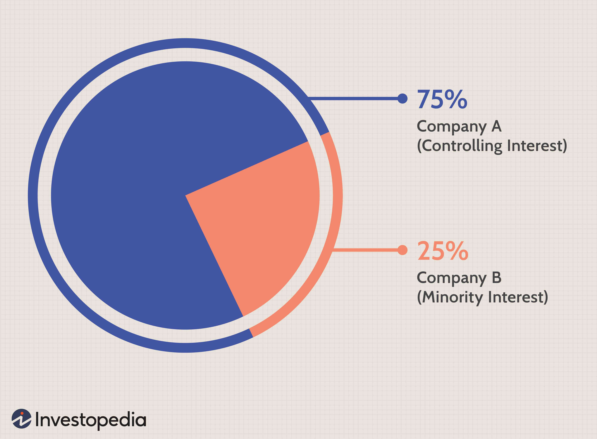

LVMH Moet Hennessy Louis Vuitton SE stands as an influential entity in the global luxury goods market, boasting a diverse collection of prestigious brands across various sectors. The strength of the conglomerate is evident, as it has consistently prospered, even amid challenging economic climates, presenting it as an attractive option for investors seeking stability and growth. This article examines LVMH's strategic investment approaches, emphasizing the integration of algorithmic trading within the luxury goods market. We aim to explore how LVMH's extensive market presence and diversified portfolio contribute to its robust investment strategies. A significant aspect of LVMH's continued success is the synergy created between traditional investment methodologies and cutting-edge trading technologies. This blend not only enhances operational efficiency but also allows the company to capitalize on market opportunities swiftly. Understanding these strategies provides valuable insights into how LVMH maintains its stature in the competitive and ever-evolving luxury market.

## Table of Contents



## LVMH's Diverse Portfolio in Luxury Goods

LVMH Moët Hennessy Louis Vuitton SE, often abbreviated as LVMH, is a prominent entity in the luxury goods market, distinguished by its extensive and diverse brand portfolio. The conglomerate's operations are segmented across five primary sectors: wines and spirits, fashion and leather goods, perfumes and cosmetics, watches and jewelry, and selective retailing. This diversification strategy serves as a fundamental component of LVMH's business model, offering a robust hedge against potential economic downturns. Each sector responds uniquely to market conditions, diminishing the overall risk to the conglomerate.

The recent acquisition of Tiffany & Co. significantly strengthens LVMH’s position in the watches and jewelry market, reiterating its strategy to enhance leadership in various luxury segments. Such strategic expansions augment LVMH’s market influence and reinforce its competitive edge in the luxury goods sector.

LVMH's portfolio boasts several marquee brands, including Louis Vuitton, known for its iconic leather goods; Moët & Chandon, a leading champagne brand; and Hennessey, renowned for its premium cognac. These brands are not only emblematic of luxury but also contribute significantly to LVMH's reputation and revenue. The presence of such high-profile brands underscores the conglomerate's status as a predominant luxury conglomerate globally.

Utilizing the strength of its diverse portfolio, LVMH is able to streamline its operations and optimize investments across its sectors. The synergy between these varied brands allows for shared innovation, efficient resource allocation, and cohesive brand management. This strategic integration enhances operational efficiency and ensures sustained growth and resilience in varied market conditions. Through these measures, LVMH maintains its stature as an industry leader, continually adapting and thriving in the competitive landscape of luxury goods.

## Investment Strategies: OTC Markets and ADRs

Investing in LVMH can be achieved through over-the-counter (OTC) markets, making the luxury conglomerate's shares accessible to a wider audience. The OTC market offers a decentralized network where LVMH shares can be traded without the need for a centralized exchange. This provides an opportunity for investors to engage with LVMH’s financial performance without directly participating in European markets.

For U.S. investors, American Depository Receipts (ADRs) serve as a convenient mechanism to invest in LVMH. ADRs, such as LVMUY, represent foreign shares and allow these to be traded in U.S. dollar denominations on domestic exchanges. By means of ADRs, investors can participate in LVMH's growth without the complexities and regulations involved with handling foreign stocks directly. ADRs constitute a bridge between foreign companies like LVMH and American investors, streamlining the investment process.

The dynamics of the OTC markets suggest a necessity for strategic management due to differences in [liquidity](/wiki/liquidity-risk-premium) and regulatory environments. Unlike traditional exchanges, OTC transactions can exhibit varied liquidity levels, which necessitates careful risk assessment and strategy formulation by investors. Moreover, OTC markets are generally characterized by less stringent regulatory oversight, potentially increasing the risk factors involved.

However, LVMH's strong market presence and reputation contribute to substantial trading volumes that can mitigate some of the concerns inherent to OTC investments. The company's consistent performance and robust financial health bolster investor confidence, which is reflected in the active trading of LVMH ADRs.

Overall, potential investors must be aware of the unique risks associated with OTC markets, including potential slippage in prices and varyingly stringent regulations. Nevertheless, LVMH's substantial market engagement and the availability of ADRs provide viable pathways for diversifying portfolios within the luxury sector.

## Algorithmic Trading in Luxury Goods

Algorithmic trading has become an integral part of managing investment portfolios within the luxury goods sector due to its unparalleled efficiency and precision. This automated trading process enables firms like LVMH to optimize the timing and execution of trades, effectively minimizing transaction costs. Unlike manual trading, algorithms can process vast amounts of market data at an astonishing speed, identifying opportunities and executing trades faster than is humanly possible. This speed provides a significant competitive advantage, particularly within fast-moving luxury markets where timing can be critical.

**Optimization of Trade Execution and Cost Reduction**

Algorithmic trading systems deploy complex mathematical models and statistical techniques to determine the optimal timing for trades. By utilizing high-frequency trading ([HFT](/wiki/high-frequency-trading-strategies)) strategies, LVMH can manage multiple trades within mere fractions of a second, significantly reducing the market impact and slippage associated with larger trades. This efficiency leads directly to cost savings and enhanced execution quality. 

For instance, consider a scenario where LVMH wants to buy or sell a large [volume](/wiki/volume-trading-strategy) of shares. An algorithm can break down the order into smaller, strategically timed segments, minimizing the visibility of the transaction in the marketplace and preventing adverse price movements. This is often achieved using time-weighted average price (TWAP) or volume-weighted average price (VWAP) algorithms.

**Market Signal Interpretation**

Algorithms also excel in parsing complex market signals that might be overlooked by human traders. They incorporate various [machine learning](/wiki/machine-learning) models to predict future price movements based on historical data trends, [volatility](/wiki/volatility-trading-strategies) indices, and even sentiment analysis derived from news reports. These predictive models continuously adapt, learning from new market data, allowing for more informed decision-making that can capture short-term gains effectively.

Python is frequently used in developing these algorithms due to its versatility and robust libraries such as NumPy for numerical computation, Pandas for data manipulation, and SciPy and scikit-learn for advanced data analysis and machine learning tasks. Below is a simplified example of a moving average crossover strategy coded in Python:

```python
import pandas as pd

def moving_average_crossover(prices, short_window=40, long_window=100):
    signals = pd.DataFrame(index=prices.index)
    signals['signal'] = 0.0

    # Create short simple moving average
    signals['short_mavg'] = prices['Close'].rolling(window=short_window, min_periods=1, center=False).mean()

    # Create long simple moving average
    signals['long_mavg'] = prices['Close'].rolling(window=long_window, min_periods=1, center=False).mean()

    # Generate signals
    signals['signal'][short_window:] = np.where(signals['short_mavg'][short_window:] 
                                                > signals['long_mavg'][short_window:], 1.0, 0.0)   
    signals['positions'] = signals['signal'].diff()

    return signals

# Example usage with a DataFrame `prices` that includes a 'Close' column of historical price data
trading_signals = moving_average_crossover(prices)
print(trading_signals.head())
```

**Risk Management**

Given the inherent volatility of markets, risk management through algorithms is crucial. Algorithms are calibrated to adapt to market trends and volatility, providing a buffer against potential losses. They achieve this by setting automatic triggers for stop-loss orders, portfolio rebalancing, and capital allocation adjustments, all in real-time. This ensures that LVMH can maintain its competitive edge while preserving capital in unpredictable market conditions.

In summary, LVMH’s engagement with [algorithmic trading](/wiki/algorithmic-trading) exemplifies its strategic foresight, blending tried-and-true investment philosophies with cutting-edge technological advancements. This approach not only serves to fortify LVMH's market presence but also signals its commitment to innovation and adaptability in the dynamic luxury sector.

## The Role of ETFs and Sector Funds

Exchange-traded funds (ETFs) offer investors a practical means of achieving diversified exposure to the luxury goods sector, including renowned brands like LVMH. These investment vehicles pool a collection of securities into a single fund, allowing investors to own a broader segment of the market without needing to pick individual stocks. This approach reduces individual stock risk and tends to offer cost efficiencies, as ETFs generally have lower expense ratios compared to traditional mutual funds.

A prominent example in this category is the GLUX-Amundi S&P Global Luxury UCITS [ETF](/wiki/etf-trading-strategies). This fund includes a range of high-performing luxury brands, thereby providing investors with targeted exposure to the luxury market. Such sector-specific ETFs enable investors to capitalize on the growth potential of luxury goods companies while maintaining a balanced risk profile.

One of the significant advantages of ETFs is the built-in diversification they offer. By spreading investments across multiple assets, ETFs lessen the impact of poor performance by any single company. This diversification is especially appealing for long-term investors who seek equity growth but wish to avoid volatility.

However, evaluating ETF components is crucial for investors to align their investments with their risk and return objectives. Careful analysis should be conducted to ensure that the ETF's holdings and strategy align with the investor’s financial goals. Important factors to consider include the ETF's past performance, management strategy, and its expense ratio.

Python, a powerful tool for financial analysis, can assist in evaluating ETFs. For instance, using libraries such as `pandas` and `numpy`, investors can create detailed comparisons of different ETF options, analyzing historical data trends and performance metrics. An example code snippet to analyze ETF returns might look like this:

```python
import pandas as pd
import numpy as np

# Load historical ETF data
data = pd.read_csv('etf_data.csv')

# Calculate daily returns
data['Daily Return'] = data['Close'].pct_change()

# Annualized volatility
volatility = np.std(data['Daily Return']) * np.sqrt(252)  # Assuming 252 trading days per year

# Mean annual return
annual_return = data['Daily Return'].mean() * 252

print(f"Annual Return: {annual_return:.2%}")
print(f"Annual Volatility: {volatility:.2%}")
```

In summary, ETFs integrating brands like LVMH offer investors a streamlined approach to participate in the luxury goods sector. They harmonize the need for diversification with the desire for targeted market exposure, making them an attractive option for informed investors who understand the components of the funds in which they invest.

## Closed-End Funds and LVMH Investments

Closed-end funds represent a distinctive opportunity for investors seeking exposure to LVMH and the broader luxury market. These investment vehicles pool capital into a singular fund that operates similarly to mutual funds but with a significant difference: they trade on stock exchanges. This exchange-based trading provides liquidity advantages, allowing investors to buy or sell shares readily during market hours, unlike mutual funds that transact only once per day at the net asset value (NAV).

One prominent example of a closed-end fund that includes LVMH is the European Equity Fund. This fund offers investors access to European luxury segments, including LVMH's diverse offerings in fashion, cosmetics, and spirits, among others. By holding shares in LVMH, these funds enable investors to indirectly participate in the company's growth and the luxury sector's expansion.

However, investors must consider that closed-end funds have a finite number of shares, which can result in trading at a premium or discount relative to their NAV. This discrepancy arises because the share price is determined by existing demand and supply dynamics on the exchange, rather than solely by the fund's underlying assets. Understanding this aspect can be crucial for investment decisions. For instance, a fund trading at a discount might provide a strategic buying opportunity, while a persistent premium might suggest heightened risk.

Efficient assessment of closed-end funds that invest in LVMH involves multiple considerations. Investors should examine the fund's investment thesis to determine its alignment with market trends and its objectives regarding the luxury sector. Additionally, evaluating the fund's management team and their historical performance can offer insights into potential future outcomes. Knowing how the management navigates market cycles and allocates investments is instrumental in predicting the fund's resilience and growth prospects.

Ultimately, integrating closed-end funds into an investment strategy can allow for diversified exposure to LVMH and similar high-performing luxury brands. Their unique structure and trading mechanics present both opportunities and risks, which require thorough analysis and strategic planning to maximize investment returns.

## Conclusion

LVMH remains a strong contender for investors aiming for stable returns within the luxury goods sector, derived from its comprehensive investment strategies. The company's strategic integration of algorithmic trading across diverse sector investments is a testament to its adaptability in the ever-evolving financial landscape. Algorithmic trading, by design, enhances the precision and efficiency of investment operations, enabling LVMH to minimize transaction costs and swiftly react to market fluctuations, thereby maintaining a competitive edge.

Investors can participate in LVMH’s growth trajectory through various financial instruments, such as American Depository Receipts (ADRs), Exchange-Traded Funds (ETFs), and closed-end funds. These options offer distinct advantages and flexibility, catering to diverse investor preferences. ADRs provide a streamlined approach for U.S. investors interested in foreign stocks, granting access without needing to directly interact with international exchanges. ETFs, in contrast, offer built-in diversification and lower expense ratios, making them an attractive option for long-term investment strategies. Closed-end funds allow investors to benefit from pooled capital exposure, with focus on liquidity and stability.

In a continuously shifting market environment, LVMH embodies a strategic fusion of tradition and contemporary innovation, serving as a critical pillar for sustaining its long-term growth and dominance in the luxury market. By understanding and aligning with LVMH’s investment strategies, investors are better positioned to make informed decisions, thus empowering their engagement within the lucrative realm of luxury goods investments.

## References & Further Reading

[1]: Bergstra, J., Bardenet, R., Bengio, Y., & Kégl, B. (2011). ["Algorithms for Hyper-Parameter Optimization."](https://papers.nips.cc/paper/4443-algorithms-for-hyper-parameter-optimization) Advances in Neural Information Processing Systems 24.

[2]: ["Advances in Financial Machine Learning"](https://www.amazon.com/Advances-Financial-Machine-Learning-Marcos/dp/1119482089) by Marcos Lopez de Prado

[3]: ["Evidence-Based Technical Analysis: Applying the Scientific Method and Statistical Inference to Trading Signals"](https://www.amazon.com/Evidence-Based-Technical-Analysis-Scientific-Statistical/dp/0470008741) by David Aronson

[4]: ["Machine Learning for Algorithmic Trading"](https://github.com/stefan-jansen/machine-learning-for-trading) by Stefan Jansen

[5]: ["Quantitative Trading: How to Build Your Own Algorithmic Trading Business"](https://www.amazon.com/Quantitative-Trading-Build-Algorithmic-Business/dp/1119800064) by Ernest P. Chan