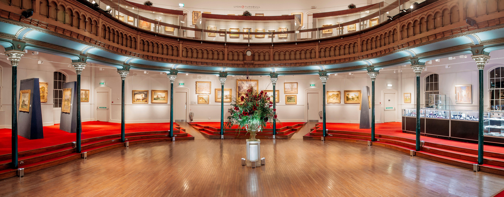

## Table of Contents

## What is Lyon & Turnbull Auctioneers?

Lyon & Turnbull is a well-known auction house that started in Edinburgh, Scotland, back in 1826. They sell many different things like art, antiques, jewelry, and more. People from all over the world come to their auctions to buy special items. The company is proud of knowing a lot about the things they sell and making sure their customers are happy.

Over the years, Lyon & Turnbull has grown and now has offices in other places like Glasgow and London. They work hard to find the best items to sell at their auctions. They also help people who want to sell their own things by giving them advice on how much their items might be worth. This makes Lyon & Turnbull a trusted place for buying and selling valuable items.

## When was Lyon & Turnbull founded?

Lyon & Turnbull was founded in 1826. It started in Edinburgh, Scotland. The company began as an auction house, selling different kinds of items like art, antiques, and jewelry.

Over time, Lyon & Turnbull grew bigger. They opened more offices in places like Glasgow and London. They became known for knowing a lot about the items they sell and for helping their customers. This made them a trusted place for people to buy and sell valuable things.

## Who are the founders of Lyon & Turnbull?

Lyon & Turnbull was started by two men named William Lyon and George Turnbull. They began their business in Edinburgh, Scotland, in the year 1826. William Lyon and George Turnbull wanted to create a place where people could buy and sell special items like art, antiques, and jewelry.

From the beginning, Lyon and Turnbull worked hard to learn about the things they sold. They wanted to make sure their customers were happy and trusted them. Over time, their business grew bigger, and they opened more offices in places like Glasgow and London. Today, Lyon & Turnbull is still known for being a trusted place where people can buy and sell valuable items.

## What types of items does Lyon & Turnbull auction?

Lyon & Turnbull auctions many different types of items. They sell art, which includes paintings and sculptures. They also sell antiques, like old furniture and decorative objects. Jewelry is another big part of what they auction, including rings, necklaces, and watches. They even sell things like coins, stamps, and [books](/wiki/algo-trading-books).

Besides these, Lyon & Turnbull also auctions items related to fashion and textiles. This can include vintage clothes and fabrics. They also sell items from different cultures, like Asian art and artifacts. Sometimes, they have special auctions for things like whisky and wine, which are popular with collectors.

## Where are the Lyon & Turnbull auction houses located?

Lyon & Turnbull has auction houses in a few different places. They started in Edinburgh, Scotland, which is where their main office is. Edinburgh is a historic city, and it's a good place for an auction house because a lot of people there like art and antiques.

Besides Edinburgh, Lyon & Turnbull also has offices in Glasgow and London. Glasgow is another city in Scotland, and it's not too far from Edinburgh. London is in England, and it's a big city where many people come to buy and sell special items. Having offices in these places helps Lyon & Turnbull reach more customers and sell more things at their auctions.

## How can someone participate in a Lyon & Turnbull auction?

To participate in a Lyon & Turnbull auction, you can go to one of their auction houses in Edinburgh, Glasgow, or London. When you get there, you can register to bid on the items you like. You will need to show some ID and give your contact details. Once you are registered, you can start bidding on the items during the auction. It's a fun way to try and buy special things like art, antiques, or jewelry.

If you can't go to the auction in person, you can still take part online. Lyon & Turnbull has a website where you can see all the items that will be sold at the next auction. You can register on their website, just like at the auction house, and then you can bid on items from your computer or phone. This is a good option if you live far away or just can't make it to the auction house. Either way, participating in a Lyon & Turnbull auction can be exciting and rewarding.

## What is the process for consigning items to Lyon & Turnbull?

To consign items to Lyon & Turnbull, you first need to get in touch with them. You can do this by calling their office, sending an email, or filling out a form on their website. When you contact them, you should tell them about the items you want to consign. They might ask for photos or more details so they can understand what you have. Once they have all the information, they will give you an estimate of how much your items might sell for at auction.

After you agree on the estimate, Lyon & Turnbull will arrange to collect your items or you can bring them to one of their offices. They will then take care of your items, making sure they are safe and ready for the auction. Before the auction, they will create a catalog with photos and descriptions of your items so that people know what they are bidding on. When the auction happens, Lyon & Turnbull will handle all the bidding and make sure the highest bidder pays for your items. After the auction, they will send you the money from the sale, minus any fees they charge for their services.

## Can you highlight some notable auctions conducted by Lyon & Turnbull?

Lyon & Turnbull has had many notable auctions over the years. One famous auction was the sale of the Robert Burns collection in 2017. Robert Burns is a very famous Scottish poet, and the auction included many special items like his letters and manuscripts. The auction was exciting because these items are rare and important to Scottish history. Another notable auction was in 2019 when Lyon & Turnbull sold a painting by the artist John Duncan Fergusson for a very high price. This painting was important because Fergusson was a key figure in Scottish art, and the sale showed how much people value his work.

Another auction that got a lot of attention was the sale of the Mar Lodge Estate in 2018. This estate is a big piece of land in Scotland with beautiful nature and old buildings. People were interested in this auction because it's not every day that such a large and historic property comes up for sale. Lyon & Turnbull also had a successful auction of whisky in 2020, where they sold very old and rare bottles. Whisky collectors from around the world came to bid on these special bottles, and the auction showed how Lyon & Turnbull can handle different types of items well.

## What are the fees associated with buying and selling at Lyon & Turnbull?

When you buy something at a Lyon & Turnbull auction, you have to pay a fee called a buyer's premium. This fee is added to the price you bid for the item. The buyer's premium is usually around 25% of the hammer price, which is the final price the item sells for at the auction. This means if you win an item for $100, you will pay $125 in total. There might also be other fees like taxes or shipping costs, depending on where you live and how you want the item delivered.

If you are selling items through Lyon & Turnbull, they will charge you a commission fee. This fee is a percentage of the money your item sells for at the auction. The commission fee can be around 15% to 20% of the hammer price. So, if your item sells for $100, you might get between $80 and $85 after the commission is taken out. There could also be other costs, like insurance or photography fees, to make sure your item looks good in the auction catalog. These fees help Lyon & Turnbull cover their costs and make sure the auction runs smoothly.

## How does Lyon & Turnbull ensure the authenticity and quality of auction items?

Lyon & Turnbull works hard to make sure the items they sell at auctions are real and good quality. They have experts who know a lot about art, antiques, jewelry, and other things. These experts look at each item very carefully before it goes into an auction. They check to see if the item is what it says it is and if it's in good condition. If they find anything that doesn't seem right, they do more research or might even not sell the item at all. This helps make sure that buyers can trust what they are buying.

Besides checking the items, Lyon & Turnbull also gives a lot of information about each item in their auction catalogs. They write detailed descriptions and include clear photos so people can see exactly what they are bidding on. If someone has questions about an item, they can ask Lyon & Turnbull's experts, who are always ready to help. This way, buyers feel confident that they know what they are getting, and sellers feel good knowing their items are being shown in the best way possible.

## What role does Lyon & Turnbull play in the global art and antiques market?

Lyon & Turnbull is an important part of the global art and antiques market. They have been around since 1826 and have grown to have offices in Edinburgh, Glasgow, and London. This helps them reach people all over the world who want to buy and sell special items. They sell many different things like art, antiques, jewelry, and even whisky. Because they know so much about these items, people from all around the world trust Lyon & Turnbull to help them find what they are looking for.

Lyon & Turnbull also helps make the global market more connected. They work with other auction houses and experts to make sure they have the best items to sell. They also use the internet to let people from anywhere in the world bid on items at their auctions. This means someone in Japan can buy a piece of Scottish art without leaving home. By doing this, Lyon & Turnbull helps bring buyers and sellers together from all over the world, making the art and antiques market more exciting and accessible for everyone.

## What future plans or expansions does Lyon & Turnbull have?

Lyon & Turnbull wants to keep growing and reaching more people around the world. They plan to open more offices in new places. This will help them sell more items and make it easier for people from different countries to join their auctions. They also want to use more technology to make buying and selling easier. For example, they might make their website better so more people can bid online.

Another big plan for Lyon & Turnbull is to focus on new types of items. They want to sell more things like modern art and design. This will attract younger buyers and keep their auctions interesting. They also want to help more people learn about art and antiques. They might do this by holding special events or working with schools and museums. By doing these things, Lyon & Turnbull hopes to stay a leader in the auction world for many years to come.

## References & Further Reading

[1]: Cunningham, G. (2017). ["The Art of Trading: Combining the Science of Technical Analysis with the Art of Reality"](https://www.amazon.com/ART-Trading-Combining-Technical-Reality-Based/dp/0470187727). Rankin Press.

[2]: Tim Adams (2020). ["Can Algorithms Create Art?"](https://calendar.fau.edu/event/can_algorithms_create_art). The Guardian.

[3]: McAndrew, C. (2019). ["The Art Market 2019"](https://www.artbasel.com/news/art-market-report). Art Basel & UBS Report.

[4]: Pardo, R. (2008). ["The Evaluation and Optimization of Trading Strategies"](https://onlinelibrary.wiley.com/doi/book/10.1002/9781119196969). Wiley Trading.

[5]: Velthuis, O. (2005). ["Talking Prices: Symbolic Meanings of Prices on the Market for Contemporary Art"](https://www.jstor.org/stable/j.ctt4cgd14). Princeton University Press.