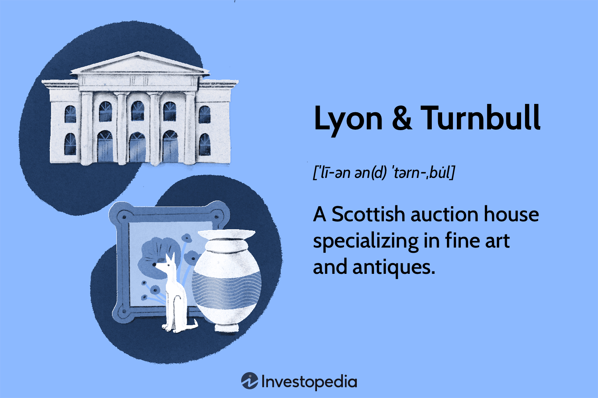

Auction houses are pivotal in blending the traditions of art with modern investment strategies. Among them, Lyon & Turnbull stands out as one of Scotland's oldest and most esteemed establishments, having been at the forefront of art auctions since 1826. This article examines the intersection of traditional art auctions with contemporary algorithmic trading strategies, highlighting how these dual forces redefine the art market landscape.

In recent years, the allure of art auctions has grown considerably among global investors, primarily as a response to the rise of alternative investment opportunities. Art, historically perceived as an asset of passion and cultural significance, is now gaining recognition as a financially viable investment. This transformation is largely driven by technological advancements and the integration of algorithmic trading, which introduces a level of precision and data-driven insight previously absent in the art world.



By focusing on the operations of Lyon & Turnbull, we aim to uncover how their time-honored practices have adapted in the face of technological evolution. Additionally, we will explore the influence of algorithmic trading on the art market, offering insights into how these strategies can enhance investment portfolios. Through this exploration, we aim to provide a comprehensive understanding of the synergy between technology and art auctions, inviting readers to navigate the dynamic interplay of these sectors.

In this ever-evolving environment, the convergence of art appreciation and financial innovation presents new avenues for investors and collectors. As algorithms become increasingly integrated into art auction processes, they offer the potential to refine art valuations and assist in crafting effective bidding strategies. We invite you to explore the exciting possibilities that arise at the juncture of art auctions and financial technology, and to discover the potential outcomes for both traditional art lovers and forward-thinking investors.

## Table of Contents

## Understanding Lyon & Turnbull

Established in 1826, Lyon & Turnbull is recognized as Scotland's largest and oldest auction house. This renowned institution has been an integral part of the art world for nearly two centuries, specializing in the curation and sale of fine arts from various regions, including Scotland, Europe, and Asia. Conducting approximately 45 auctions annually, Lyon & Turnbull presents a diverse array of artworks and collectibles to a global audience, maintaining a robust calendar of events that attract both collectors and investors.

The auction house's strategic partnership with Freeman's, an esteemed U.S.-based auction company, enhances its international reach. With offices in London complementing its Edinburgh headquarters, Lyon & Turnbull can effectively serve a worldwide clientele. This collaboration with Freeman's allows both companies to conduct significant cross-continental auction events, leveraging their combined expertise to host sales that appeal to a broad spectrum of art enthusiasts.

Lyon & Turnbull's specialist departments focus on various categories, offering comprehensive expertise in select areas such as Scottish art, whisky, furniture, and jewelry. The dedicated focus on Scottish art and whisky reflects the auction house's commitment to preserving and promoting local heritage, while also expanding its appeal to international collectors who value unique and culturally significant items.

Art has emerged as a viable alternative investment vehicle, and Lyon & Turnbull has been pivotal in this development. The auction house's ability to navigate the art market's complexities ensures that it remains at the forefront of this trend, offering investors opportunities to diversify their portfolios with tangible assets that possess both aesthetic and financial value. As the demand for alternative investments grows, Lyon & Turnbull continues to adapt, integrating both traditional auction practices and modern technological advancements to reach a wider audience and provide transparent, reliable services.

## The Role of Algorithmic Trading in Art Auctions

Algorithmic trading, an innovative approach previously confined to financial markets, is now extending its influence into the domain of art auctions. This technological advancement leverages computational algorithms to predict art market trends, assess the value of art pieces, and optimize bidding strategies. By analyzing vast datasets that include historical auction results and current market trends, these automated systems provide investors with a comprehensive and data-driven understanding of the art market.

One of the key advantages of employing [algorithmic trading](/wiki/algorithmic-trading) in art auctions is the precision it brings to art valuation—a process traditionally dominated by subjective assessments. Automated models can utilize [machine learning](/wiki/machine-learning) algorithms to process historical data and determine patterns that influence art prices. For instance, Python's powerful data analysis libraries such as Pandas and Scikit-learn can be employed to build predictive models. A simple predictive model can be designed using historical prices and characteristics of artworks (e.g., artist, period, style).

```python
import pandas as pd
from sklearn.model_selection import train_test_split
from sklearn.linear_model import LinearRegression

# Sample dataset containing historical auction prices and artwork characteristics
data = pd.read_csv('auction_data.csv')

# Feature selection: Characteristics such as artist, year, style are inputs
features = data[['artist', 'year', 'style']]
prices = data['price']

# Splitting data into training and testing sets
X_train, X_test, y_train, y_test = train_test_split(features, prices, test_size=0.2, random_state=42)

# Fitting a simple linear regression model
model = LinearRegression()
model.fit(X_train, y_train)

# Making predictions on the test set
price_predictions = model.predict(X_test)
```

By predicting the hammer prices, investors can make more informed bids, reducing the risks associated with art investments and enhancing portfolio diversification. The transparency and efficiency introduced by algorithmic trading contribute to a more structured understanding of the art market, enabling investors to move beyond relying solely on expert opinions or anecdotal evidence.

Furthermore, these automated systems can optimize bidding strategies to maximize returns. For example, algorithms can simulate various bidding scenarios to identify optimal strategies that can incrementally adjust bids based on real-time auction dynamics.

Algorithmic trading is revolutionizing art auctions by merging the subjective world of art with the rigor and precision of data analytics. This technological integration offers exciting opportunities for investors looking to explore the art market as a viable alternative investment, ushering in a new era of innovation in art transactions.

## Lyon & Turnbull’s Auction Highlights

Lyon & Turnbull's auction history is characterized by remarkable sales that underscore its prominence and influence in the art world. Among its most significant achievements is the $4.42 million sale of a rare copy of the Declaration of Independence, highlighting the auction house's ability to unearth and market critical historical artifacts successfully. This sale exemplifies the high-profile auctions for which Lyon & Turnbull has gained international acclaim across various art categories.

The strategic alliance with Freeman's, an esteemed American auction house, enhances Lyon & Turnbull's international reach, fostering significant cross-continental auction events. This partnership allows both entities to leverage their expertise and client bases, thereby enabling the sale and acquisition of diverse art collections on a global scale.

The incorporation of online and in-person bidding options further underscores Lyon & Turnbull's commitment to accessibility and global participation. By facilitating both digital and physical auction experiences, the auction house attracts a broad spectrum of participants, from seasoned collectors to new investors eager to explore art investments.

A key [factor](/wiki/factor-investing) in Lyon & Turnbull's continued success is their commitment to increasing digital engagement and transparency within the auction process. Enhanced digital platforms allow for greater transparency in transaction histories and bidding procedures, instilling confidence in participants and thereby broadening the market for potential buyers and sellers. This transparency, coupled with a robust digital presence, positions Lyon & Turnbull as a leader in modern auction practices, drawing interest from a growing demographic of tech-savvy investors keen on integrating art acquisitions into their alternative investment portfolios.

## Opportunities and Challenges

The integration of algorithmic trading in art auctions presents numerous opportunities for creating more transparent and efficient markets. By leveraging algorithms, auction houses and investors can analyze large datasets that include historical auction results, current market trends, and even social media sentiment to predict future art values and optimize bidding strategies. This technological advancement aims to reduce the traditional opacity associated with the art market, providing more accessible information and potentially increasing investor confidence.

However, investors face the inherent challenge of reconciling the art market's subjective nature with these data-driven strategies. Art valuation is not solely based on historical data and trends; it is also influenced by personal taste, artist reputation, cultural significance, and even geopolitical factors. As a result, understanding the nuanced value determinants in art is crucial. While algorithms can process quantitative data efficiently, they often struggle to incorporate the qualitative aspects that significantly impact an artwork's valuation.

Lyon & Turnbull exemplifies how traditional auction practices can adapt and thrive through technological innovation. By embracing digital tools, they enhance the bidding process's transparency and reach, allowing for broader participation and engagement from a global audience. This blend of traditional expertise with advanced analytics helps maintain the integrity of the art while pushing the boundaries of what is possible in the auction market.

Looking forward, the fusion of personal taste and advanced analytics will likely shape future art markets. Investors who can effectively integrate these elements—balancing the objective insights offered by algorithms with the subjective nature of art—are poised to capitalize on new opportunities. As these technologies further develop, the potential for innovation and growth in art auctions continues to expand, promising a dynamic landscape for both collectors and investors.

## Conclusion

The converging worlds of art and algorithmic trading offer immense possibilities for both investors and collectors. This synergy allows for a more data-driven approach to acquiring and managing art portfolios, providing a fresh perspective on art valuation traditionally governed by subjective judgment and market perceptions. 

Lyon & Turnbull epitomizes the balance between technological advancement and historical preservation. As one of the oldest and most respected auction houses, it effectively integrates digital tools that enhance both the buyer's and seller's experience without diminishing the historical essence of art auctions. This blend ensures a dynamic environment where seasoned auction practices coexist with innovative technologies.

Given the increasing role of art auctions as a platform for alternative investments, a thorough understanding of their dynamics becomes critical. Investors can leverage algorithmic trading tools to detect patterns and predict trends, making well-informed decisions in auction settings. Such tools utilize extensive datasets, potentially transforming the way art is bought and sold on a global scale.

Both seasoned investors and novices have the opportunity to explore the fascinating intersection of art and technology. For experienced investors, this means refining their strategies and diversifying their portfolios with assets that have both aesthetic and financial value. For newcomers, it presents a welcoming gateway into the investment world through an innovative medium that resonates with personal taste.

The horizon is bright for the future of art auctions and algorithmic trading. As these industries continue to evolve, they hold the promise of not only preserving cultural heritage but also driving financial ingenuity. This evolution fosters an investment landscape ripe with opportunities for growth and discovery, where technological prowess complements the timeless allure of art.

## References & Further Reading

[1]: Cunningham, G. (2017). ["The Art of Trading: Combining the Science of Technical Analysis with the Art of Reality"](https://www.amazon.com/ART-Trading-Combining-Technical-Reality-Based/dp/0470187727). Rankin Press.

[2]: Tim Adams (2020). ["Can Algorithms Create Art?"](https://calendar.fau.edu/event/can_algorithms_create_art). The Guardian.

[3]: McAndrew, C. (2019). ["The Art Market 2019"](https://www.artbasel.com/news/art-market-report). Art Basel & UBS Report.

[4]: Pardo, R. (2008). ["The Evaluation and Optimization of Trading Strategies"](https://onlinelibrary.wiley.com/doi/book/10.1002/9781119196969). Wiley Trading.

[5]: Velthuis, O. (2005). ["Talking Prices: Symbolic Meanings of Prices on the Market for Contemporary Art"](https://www.jstor.org/stable/j.ctt4cgd14). Princeton University Press.