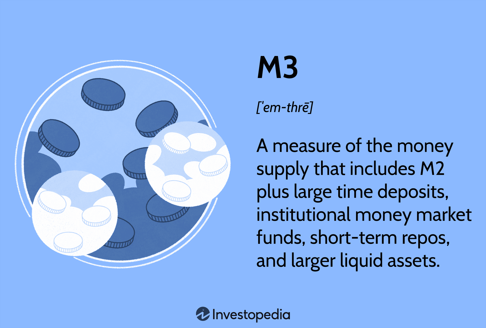

## Table of Contents

## What is M3 monetary supply?

M3 monetary supply is a measure of the total amount of money in an economy. It includes all the money in M2, which is cash, coins, and easily accessible accounts like checking and savings, plus some larger and less liquid assets. These additional assets can include things like time deposits, institutional money market funds, and larger savings accounts. M3 gives a broader picture of the money available in an economy compared to M1 and M2.

Economists and policymakers use M3 to understand and predict economic trends. Because M3 includes a wider range of money types, it can help show how money is moving through different parts of the economy. For example, if M3 is growing quickly, it might mean that people and businesses are saving more in larger accounts, which could affect how much money is available for spending and investing. Tracking M3 helps in making decisions about interest rates and other economic policies.

## How is M3 different from M1 and M2?

M3 is a bigger measure of money in an economy compared to M1 and M2. M1 is the smallest and includes just the money you can use right away, like cash in your pocket and money in your checking account. M2 adds to M1 by including things like savings accounts and money market accounts, which are a bit harder to spend but still pretty easy to get to.

M3 goes even further by including everything in M2 plus some bigger and less easy-to-use money types. This can be things like time deposits, which are savings you can't touch for a certain time, and large money market funds that businesses and big organizations use. So, M3 gives a fuller picture of all the money out there, including the money that's not as quick to spend.

## What types of assets are included in M3?

M3 includes all the money that's in M2, plus some bigger and less easy-to-use money types. M2 has cash, coins, checking accounts, and savings accounts that you can use pretty quickly. M3 adds to that by including things like time deposits, which are savings you can't touch for a set time, like a year or more. These are often called certificates of deposit or CDs.

M3 also includes large money market funds, which are like big savings accounts that businesses and other organizations use. These funds invest in safe, short-term things like government bonds and can be harder to turn into cash quickly. So, M3 gives a bigger picture of all the money in an economy, including the money that's not as easy to spend right away.

## Why is M3 important for understanding an economy's liquidity?

M3 is important for understanding an economy's [liquidity](/wiki/liquidity-risk-premium) because it shows all the money that's out there, even the money that's not easy to spend right away. Liquidity means how quickly you can use your money to buy things or pay bills. M3 includes everything in M2, like cash and savings accounts, but it also adds bigger savings and investments that take longer to turn into cash. By looking at M3, economists can see how much money is locked up in these bigger savings and how much is ready to be spent.

This helps economists predict how the economy might grow or shrink. If M3 is growing fast, it might mean people and businesses are putting more money into bigger savings and investments. This could mean less money is available for spending right now, which might slow down the economy. But if M3 is growing slowly, it might mean more money is ready to be spent, which could help the economy grow. So, M3 gives a fuller picture of the money moving around in the economy, helping to make better decisions about things like interest rates and other economic policies.

## How do central banks use M3 data in monetary policy?

Central banks use M3 data to help make decisions about monetary policy. M3 tells them about all the money in the economy, including money in big savings and investments. By looking at M3, central banks can see if people and businesses are saving more money in accounts that are hard to spend right away. If M3 is growing fast, it might mean there's less money available for spending, which could slow down the economy. So, the central bank might decide to lower interest rates to encourage more spending and help the economy grow.

On the other hand, if M3 is growing slowly, it might mean more money is ready to be spent. This could make the economy grow too fast and cause inflation, where prices go up. To stop this, the central bank might raise interest rates to make borrowing more expensive, which would slow down spending and help keep prices stable. By watching M3, central banks can make better choices about interest rates and other policies to keep the economy healthy.

## What are the limitations of using M3 as an economic indicator?

M3 can be a helpful way to look at the economy, but it has some limits. One big problem is that M3 includes a lot of different kinds of money, like big savings and investments that are hard to spend quickly. This makes it tricky to use M3 to predict exactly how people will spend money right away. Also, M3 doesn't tell us why people are saving more or less. They might be saving more because they're worried about the future, or they might be saving less because they want to buy things now. So, M3 gives us a big picture, but it's not always clear what that picture means for the economy.

Another limit of M3 is that it can be hard to measure accurately. Different countries might count different things in their M3, so it's hard to compare M3 from one country to another. Also, M3 can change a lot from month to month, which can make it hard to see the bigger trends. If M3 goes up one month and down the next, it's tough to know if that means the economy is changing or if it's just a normal up-and-down. So, while M3 can be a useful tool, it's important to use it along with other economic indicators to get a full understanding of what's going on in the economy.

## How has the classification of M3 changed over time?

The classification of M3 has changed over time as economists and central banks have tried to better understand and measure the money in an economy. In the past, M3 was a key measure used by many countries, including the United States. It included all the money in M2, like cash and savings accounts, plus bigger savings and investments like time deposits and large money market funds. But in 2006, the U.S. Federal Reserve stopped publishing M3 data because they thought it wasn't as useful anymore for understanding the economy. They felt that other measures, like M2, gave a better picture of the money that people could spend right away.

Since then, different countries have used M3 in different ways. Some countries, like those in the European Union, still use M3 as an important measure of money supply. They include things like repurchase agreements and money market fund shares in their M3. Other countries might have their own ways of measuring M3, or they might not use it at all. Over time, the way M3 is defined and used can change as the economy changes and as new types of money and savings come along. So, M3 is not a fixed measure and can be different from one place to another and from one time to another.

## Can you explain the concept of 'disuse' in relation to M3?

The concept of 'disuse' in relation to M3 means that some countries have stopped using M3 as an important way to measure the money in their economy. For example, the United States stopped publishing M3 data in 2006. The reason they did this is because they thought M3 was not as helpful anymore for understanding how much money people could spend right away. They found that other measures, like M2, gave a better picture of the money that people could use quickly.

Even though the U.S. stopped using M3, other countries still find it useful. In the European Union, for example, they continue to use M3 to help understand their economy. The way M3 is defined can change over time and can be different in different places. So, while some countries have moved away from using M3, others still think it's an important tool for measuring the total amount of money in their economy.

## How does M3 relate to inflation and economic growth?

M3 can help us understand inflation and economic growth. Inflation is when prices go up, and it can happen when there's too much money chasing too few goods. If M3 is growing fast, it might mean there's more money in the economy, which could lead to inflation. Central banks watch M3 to see if they need to raise interest rates to slow down the economy and keep prices from going up too fast.

M3 also tells us about economic growth. When M3 grows, it means there's more money available, which can help businesses grow and create more jobs. But if M3 grows too slowly, it might mean there's not enough money for spending and investing, which could slow down the economy. So, central banks use M3 to help make decisions about interest rates and other policies to keep the economy growing at a healthy pace.

## What are the international differences in M3 definitions and calculations?

Different countries have different ways of defining and calculating M3, which makes it hard to compare M3 across countries. For example, in the United States, the Federal Reserve used to include things like time deposits and large money market funds in M3, but they stopped publishing M3 data in 2006. They thought other measures like M2 were more useful for understanding the money that people could spend quickly. In contrast, countries in the European Union still use M3 and include things like repurchase agreements and money market fund shares in their definition. This shows that what counts as M3 can be different from one place to another.

These differences in how M3 is calculated can affect how economists and policymakers use it to understand their economies. For example, if one country includes more types of savings and investments in its M3, it might look like they have more money in their economy compared to another country that uses a narrower definition. This can make it tricky to compare economic conditions between countries just by looking at M3. So, while M3 can be a helpful tool for understanding the money supply within a country, it's important to know how each country defines and calculates it to get a clear picture.

## How do financial innovations impact the measurement of M3?

Financial innovations can change how we measure M3 because they create new types of money and savings that might not fit into the old ways of counting M3. For example, new kinds of savings accounts or investment funds can be hard to put into the M3 category because they might be a mix of easy-to-spend money and money that's harder to use right away. When new financial products come out, central banks and economists have to decide if they should be part of M3 or not. This can make M3 measurements less accurate if the new products are not included correctly.

Over time, as financial innovations keep happening, the way M3 is measured might need to change. For instance, if people start using a new type of money market fund a lot, but it's not counted in M3, then M3 won't show the full picture of the money in the economy. Central banks have to keep updating their definitions and methods to make sure M3 stays a useful tool. If they don't, M3 might not reflect the real amount of money available, which can make it harder to understand and predict economic trends.

## What advanced statistical methods are used to analyze trends in M3?

To analyze trends in M3, economists often use advanced statistical methods like time series analysis. This method helps them look at how M3 changes over time and find patterns or cycles. For example, they might use something called ARIMA models, which stands for AutoRegressive Integrated Moving Average. These models can predict future values of M3 by looking at past data and figuring out how M3 has moved in the past. This helps economists see if M3 is growing or shrinking in a way that might affect the economy.

Another method is regression analysis, which helps economists understand how different factors might be affecting M3. They might look at things like interest rates, inflation, or economic growth and see how these things relate to changes in M3. By doing this, they can figure out what might be causing M3 to go up or down. These advanced statistical methods help central banks and policymakers make better decisions about the economy by giving them a clearer picture of what's happening with the money supply.

## References & Further Reading

[1]: Mishkin, F. S. (2007). "The Economics of Money, Banking, and Financial Markets." Pearson Education, Inc. 

[2]: ["Algorithmic Trading and DMA: An introduction to direct access trading strategies"](https://archive.org/details/algorithmictradi0000john) by Barry Johnson

[3]: ["Monetary Policy Strategy"](https://www.federalreserve.gov/monetarypolicy.htm?form=MG0AV3) by Frederic S. Mishkin

[4]: ["The Handbook of Trading: Strategies for Navigating and Profiting from Currency, Bond, and Stock Markets"](https://www.amazon.com/Handbook-Trading-Strategies-Navigating-McGraw-Hill/dp/0071743537) by Greg N. Gregoriou

[5]: Friedman, M., & Schwartz, A. J. (1963). "A Monetary History of the United States, 1867–1960." Princeton University Press. 

[6]: ["The Handbook of Trading: Strategies for Navigating and Profiting from Currency, Bond, and Stock Markets"](https://www.amazon.com/Handbook-Trading-Strategies-Navigating-McGraw-Hill/dp/0071743537) by Greg N. Gregoriou