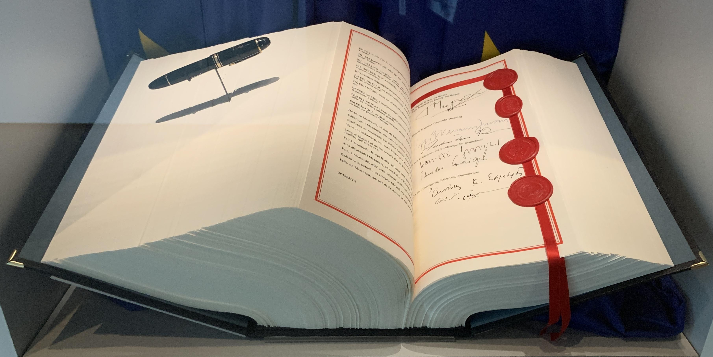

## Table of Contents

## What is the Maastricht Treaty?

The Maastricht Treaty is an important agreement signed in 1992 by the countries in the European Union. It is also called the Treaty on European Union. This treaty helped create the European Union as we know it today. It made the European Union more than just a group of countries working together on trade. It turned the European Union into a bigger organization with more powers and goals.

One big thing the Maastricht Treaty did was to start the process of making a single currency for Europe, which became the euro. This meant that many European countries would use the same money. The treaty also made the European Union work together more on things like defense and foreign policy. This helped the countries in the European Union to work together more closely and to have a bigger say in the world.

## When and where was the Maastricht Treaty signed?

The Maastricht Treaty was signed on February 7, 1992. It was signed in the city of Maastricht, which is in the Netherlands.

This treaty was a big step for the European countries. It helped them to work together more closely and to create the European Union.

## Who were the key figures involved in negotiating the Maastricht Treaty?

The Maastricht Treaty was negotiated by many important people from different European countries. One key figure was Jacques Delors, who was the President of the European Commission at the time. He played a big role in pushing for more cooperation among European countries. Another important person was Helmut Kohl, who was the Chancellor of Germany. He was very supportive of the idea of a united Europe and worked hard to make the treaty happen.

François Mitterrand, the President of France, was also very involved in the negotiations. He worked closely with Helmut Kohl to make sure that both France and Germany could agree on the treaty. From the Netherlands, Ruud Lubbers, who was the Prime Minister, was important in hosting the signing of the treaty in Maastricht. These leaders, along with many others, helped to shape the treaty and bring it to life.

## What were the main objectives of the Maastricht Treaty?

The main objectives of the Maastricht Treaty were to make the European countries work together more closely and to create the European Union. Before the treaty, European countries were already working together on things like trade, but the Maastricht Treaty took this cooperation to a new level. It aimed to make the European Union more than just a group of countries that trade with each other. Instead, it wanted to make the European Union a bigger organization that could work together on many different issues.

One big goal of the Maastricht Treaty was to create a single currency for Europe, which became the euro. This meant that many European countries would use the same money, making it easier for them to trade and do business with each other. The treaty also wanted the European Union to work together more on things like defense and foreign policy. This would help the European countries to have a stronger voice in the world and to be able to work together to solve big problems.

## How did the Maastricht Treaty lead to the creation of the European Union?

The Maastricht Treaty was really important because it helped create the European Union. Before the treaty, European countries were already working together on things like trade. But the Maastricht Treaty made their cooperation much bigger. It turned the group of countries into the European Union, which is a much larger organization. The treaty made the European Union more powerful and gave it more goals to work on.

One big thing the Maastricht Treaty did was to start the process of making a single currency for Europe, which became the euro. This meant that many European countries would use the same money, making it easier for them to trade and do business with each other. The treaty also made the European Union work together more on things like defense and foreign policy. This helped the countries in the European Union to have a stronger voice in the world and to be able to work together to solve big problems. By doing all these things, the Maastricht Treaty helped create the European Union as we know it today.

## What are the three pillars of the Maastricht Treaty?

The Maastricht Treaty is built on three main parts, called pillars. The first pillar is about making the European Community stronger. This part deals with things like the single market, where countries can trade freely without barriers, and the creation of the euro, which is the common currency used by many European countries. This pillar helps the countries work together on economic issues and make it easier for them to do business with each other.

The second pillar is about a common foreign and security policy. This part is about how the European countries can work together to have a stronger voice in the world. It helps them to make decisions together on things like defense and international relations, so they can act as a united group when dealing with other countries.

The third pillar focuses on cooperation in justice and home affairs. This part is about working together on things like crime, immigration, and asylum policies. It helps the countries to share information and work together to keep their citizens safe and to manage issues that cross borders. Together, these three pillars helped create the European Union and make it a strong organization that can work together on many different issues.

## How did the Maastricht Treaty affect the economic policies of member countries?

The Maastricht Treaty had a big impact on the economic policies of the countries in the European Union. One of the main things it did was start the process of making the euro, which is a single currency that many European countries use now. This meant that these countries had to follow certain rules to make sure their economies were strong enough to use the euro. They had to keep their inflation low, their government debt under control, and their budgets balanced. This helped make their economies more stable and made it easier for them to trade and do business with each other.

Another way the Maastricht Treaty affected economic policies was by making the single market stronger. The single market means that countries can trade with each other without any barriers, like tariffs or quotas. This helped businesses in different countries to grow and sell their products more easily across Europe. The treaty also encouraged countries to work together on economic issues, like setting common rules for things like competition and financial services. This helped create a more unified economic space in Europe, where countries could work together to solve economic problems and make their economies stronger.

## What were the major debates and controversies surrounding the ratification of the Maastricht Treaty?

The Maastricht Treaty faced a lot of debates and controversies when it was being ratified. One big issue was about national sovereignty. Some people were worried that the treaty would make European countries lose control over their own decisions. They thought that the European Union would become too powerful and that individual countries would have less say in their own affairs. This was a big concern in countries like the United Kingdom, where many people were worried about losing their independence.

Another major controversy was about the economic criteria needed to join the euro. Some countries felt that the rules for joining the single currency were too strict. They worried that these rules would be hard to meet and could hurt their economies. There were also debates about how the treaty would affect social policies, like workers' rights and welfare systems. Some people thought that the treaty focused too much on economic issues and not enough on protecting people's rights and well-being. These debates made the ratification process long and difficult, but eventually, the treaty was approved by all member countries.

## How has the Maastricht Treaty evolved since its initial signing?

Since it was signed in 1992, the Maastricht Treaty has changed and grown a lot. One big change happened in 1997 with the Treaty of Amsterdam. This treaty made some parts of the Maastricht Treaty clearer and stronger, especially about how the European Union works together on things like foreign policy and security. It also made it easier for the European Union to make decisions and to work together more effectively. Another important change came with the Treaty of Nice in 2001, which helped prepare the European Union for more countries to join. It changed how votes were counted and made some rules more flexible to handle a bigger European Union.

More changes came with the Treaty of Lisbon in 2007, which was a big update to the Maastricht Treaty. The Treaty of Lisbon made the European Union even more like a single organization by giving it a president and a foreign minister. It also made the European Parliament more powerful, so that the people of Europe had more say in what the European Union does. These changes have helped the European Union to keep working together and to face new challenges as the world changes. The Maastricht Treaty has been the foundation for all these updates, showing how important it was in creating the European Union we know today.

## What impact has the Maastricht Treaty had on the political integration of Europe?

The Maastricht Treaty has had a big impact on how European countries work together politically. Before the treaty, European countries were working together mainly on trade and economic issues. But the Maastricht Treaty changed that by creating the European Union, which is a much bigger organization. It made the European Union more than just a group of countries that trade with each other. Instead, it became a place where countries could work together on many different issues, like defense, foreign policy, and even things like crime and immigration. This helped the European Union to become more united and to have a stronger voice in the world.

One important way the Maastricht Treaty helped with political integration was by making the European Union more like a single organization. It set up new ways for the countries to make decisions together, like the European Parliament and the European Council. These new parts of the European Union helped the countries to work together more closely and to make decisions that affect all of them. Over time, other treaties have built on the Maastricht Treaty to make the European Union even stronger. For example, the Treaty of Lisbon added a president and a foreign minister for the European Union, making it even more like a single country in some ways. All these changes have helped the European Union to keep growing and to face new challenges together.

## How does the Maastricht Treaty influence current EU policies and future directions?

The Maastricht Treaty still has a big influence on the policies of the European Union today. It helped create the European Union and set up many of the rules and goals that the EU follows. For example, the treaty started the process of making the euro, which is still a very important part of the EU's economic policy. The EU works hard to keep the economies of its member countries strong and stable, just like the Maastricht Treaty said they should. The treaty also made the EU work together on things like defense and foreign policy, which are still important parts of what the EU does today.

Looking to the future, the Maastricht Treaty continues to guide the direction of the European Union. It set the foundation for the EU to become more united and to work together on more issues. As new challenges come up, like climate change and digital technology, the EU is still using the ideas from the Maastricht Treaty to find solutions. The EU is always trying to make its countries work together more closely, just like the treaty wanted. Even though the world has changed a lot since 1992, the Maastricht Treaty remains a key part of the EU's plan for the future.

## What are some expert critiques and analyses of the Maastricht Treaty's long-term effects on European unity and sovereignty?

Experts have different opinions about how the Maastricht Treaty has affected European unity and sovereignty over the long term. Some experts think the treaty has helped bring European countries closer together. They say it created the European Union, which has made it easier for countries to work together on big issues like trade, defense, and climate change. These experts believe that the treaty has helped Europe become more united and stronger in the world. They also think that the euro, which the treaty started, has made it easier for European countries to do business with each other and has made their economies more stable.

On the other hand, some experts worry that the Maastricht Treaty has made individual countries lose some of their power and control. They argue that the European Union has become too powerful and that countries can't make as many of their own decisions anymore. These experts are concerned about national sovereignty, which means a country's right to govern itself. They think that the rules set by the Maastricht Treaty, like the ones for joining the euro, can be too strict and might not be good for all countries. They believe that the treaty has caused some tension between the need for European unity and the desire for national independence.

## References & Further Reading

[1]: European Union. (1997). ["Treaty of Amsterdam."](https://en.wikipedia.org/wiki/Treaty_of_Amsterdam) Official Journal C 340, 10 November 1997.

[2]: European Union. (2007). ["Treaty of Lisbon."](https://www.europarl.europa.eu/factsheets/en/sheet/5/the-treaty-of-lisbon) Official Journal C 306, 17 December 2007.

[3]: Smits, R. (1997). ["The European Central Bank: Institutional Aspects."](https://openlibrary.org/books/OL661382M/The_European_Central_Bank) Kluwer Law International.

[4]: Biais, B., & Woolley, P. (2011). ["High Frequency Trading."](https://www.tse-fr.eu/publications/high-frequency-trading) Review of Financial Studies, 24(6), 1734–1742.

[5]: Maas, W. (2007). ["Creating European Citizens."](https://archive.org/details/creatingeuropean0000maas) Rowman & Littlefield.

[6]: Lopez de Prado, M. (2018). ["Advances in Financial Machine Learning."](https://www.amazon.com/Advances-Financial-Machine-Learning-Marcos/dp/1119482089) John Wiley & Sons.

[7]: European Central Bank. (2010). ["The Impact of the Euro on Financial Markets."](https://papers.ssrn.com/sol3/papers.cfm?abstract_id=887087) European Central Bank Occasional Paper Series No. 100.