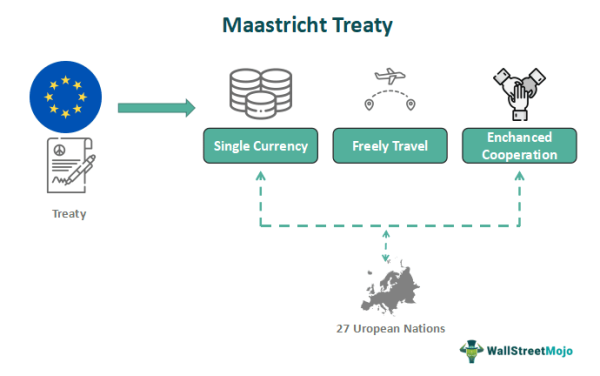

The Maastricht Treaty, often referred to as the Treaty on European Union, serves as a foundational element in the establishment of the European Union (EU). Signed in 1992 in Maastricht, Netherlands, the treaty played a pivotal role in shaping Europe's political and economic landscape by providing the structural framework necessary for greater integration among European nations.

One of the most notable achievements of the Maastricht Treaty was laying the foundation for a unified monetary system, ultimately leading to the creation of the euro as the EU's single currency. This monetary integration aimed to facilitate economic stability and growth across member states by establishing a common currency and coordinating economic policies. The introduction of the euro has had profound effects on trade, investment, and economic cooperation among EU countries, transforming the region into one of the largest unified markets globally.

In the context of financial markets, the treaty's impact extends to the development and expansion of algorithmic trading in Europe. By fostering economic stability and consistency across the EU, the treaty created an environment conducive to advanced trading techniques such as algorithmic trading. This type of trading relies on computational algorithms to execute high-speed transactions, exploiting the stable and predictable market conditions that the EU aims to sustain.

This article aims to examine the historical importance of the Maastricht Treaty, its transformative effect on the EU's political and economic spheres, and its connection to contemporary algorithmic trading practices in Europe. The investigation will illustrate how the integration efforts initiated by the treaty continue to influence financial innovations and market dynamics to this day.

## Table of Contents

## The Maastricht Treaty: A Brief Overview

The Maastricht Treaty, formally known as the Treaty on European Union, was signed on February 7, 1992, and came into effect on November 1, 1993. It marked a significant milestone in European integration by establishing the European Union (EU). Initially signed by 12 member states, the treaty set out to create a unified economic and monetary union, a forward-looking vision that culminated in the introduction of the euro as the common currency. 

The treaty had several overarching objectives. One of the primary goals was to enhance political and social cooperation among member states. This was a pivotal step in laying the groundwork for EU citizenship, which afforded new rights and mobility to individuals across member countries. The treaty established a common framework for foreign and security policies, aiming to increase cooperation and cohesion in these critical areas.

Moreover, the Maastricht Treaty was foundational in allocating increased powers to the European Parliament, thereby boosting democratic processes and accountability within the EU. By strengthening legislative powers, it sought to balance the influences within the EU's institutional framework and enhance the political voice of European citizens.

Subsequent to its enactment, the Maastricht Treaty was built upon by later amendments and treaties, such as the Treaty of Amsterdam (1997) and the Treaty of Lisbon (2007). These treaties further expanded the EU’s capabilities and refined its governance structure, responding to both internal dynamics and external challenges. Collectively, these changes have continued to shape the EU into a complex political entity with a broad array of competencies spanning economic, social, and political domains.

## Impact on Economic and Monetary Union

The Maastricht Treaty catalyzed the formation of the Economic and Monetary Union (EMU), fundamentally transforming the economic landscape of Europe. One of its hallmark achievements was the introduction of a single currency, the euro, which officially came into use on January 1, 1999. This transformation brought about significant changes in the financial architecture of member states, streamlining economic operations and providing a consistent monetary framework across national borders.

The euro's introduction created a more cohesive economic environment, eliminating the need for exchange rate adjustments and reducing transaction costs for cross-border trade and investment within the Eurozone. This currency unification facilitated price transparency and comparability, enhancing competitive market conditions. Enhanced financial stability and predictability became a driving force for investment and economic growth throughout the region.

Central to the management and oversight of monetary policy in the Eurozone, the European Central Bank (ECB) emerged as a pivotal institution post-Maastricht. It was empowered to maintain price stability by setting interest rates and controlling money supply within the Eurozone. The ECB’s role was instrumental in ensuring the uniform application of monetary policies, which previously varied significantly among individual nations. The ECB successfully bridged sovereign economic policies by implementing a singular monetary policy framework designed to accommodate the economic objectives of all member states.

Adopting the euro also demanded rigorous adherence to convergence criteria known as the Maastricht Criteria, which countries had to meet to join the monetary union. These criteria encompassed aspects such as price stability (inflation rates not exceeding a reference value), sound fiscal positions (government deficits not exceeding 3% of GDP and public debt not exceeding 60% of GDP), exchange rate stability, and long-term [interest rate](/wiki/interest-rate-trading-strategies) convergence. Compliance with these criteria was aimed at ensuring economic discipline and convergence among the participating countries, which would in turn help sustain the euro's stability.

In conclusion, the creation of the EMU and the adoption of the euro under the Maastricht Treaty have played instrumental roles in shaping a more integrated and stable economic platform within Europe. This unification has not only simplified monetary exchanges but has also established a much-needed consistency in fiscal and economic policies among member states, helping to propel the region toward sustained economic growth.

## Political and Social Integration

The Maastricht Treaty, signed in 1992, significantly advanced political and social integration within the European Union by introducing the concept of European citizenship. This new status granted EU nationals the right to live and work freely across member states, fostering greater mobility and cross-border ties among citizens. This development was pivotal in creating a sense of shared identity and belonging among the diverse populations of the EU.

Further enhancing the union's democratic framework, the Maastricht Treaty expanded the legislative powers of the European Parliament. This bolstered democratic accountability by providing the Parliament with a more substantial role in the legislative process, ensuring that EU citizens had a direct influence on decision-making at the European level. These enhanced legislative powers allowed for more robust oversight and contribution to shaping the Union's policies.

On the international stage, the Maastricht Treaty laid the groundwork for a unified EU foreign and security policy. This allowed member states to present a united front on global issues, thereby increasing the EU’s ability to act as a cohesive entity in international relations. A coordinated approach to foreign policy enhanced the EU’s influence and facilitated more strategic engagement with non-member countries.

In addition to these initiatives, the treaty placed substantial emphasis on Justice and Home Affairs, areas that had traditionally been the domain of individual national governments. By promoting collaboration in criminal justice and immigration policies, the treaty enabled member states to address these cross-border challenges more effectively. This cooperation was crucial in ensuring security and justice across the EU, facilitating more efficient legal processes, and streamlining immigration procedures.

Overall, the Maastricht Treaty was instrumental in advancing the EU’s political and social integration, laying a foundation for an interconnected Europe with shared citizenship rights, enhanced democratic processes, a common foreign policy approach, and cooperative justice and home affairs.

## Algorithmic Trading and the EU Economy

Algorithmic trading, also known as algo trading, has seen significant growth in Europe, largely driven by the European Union's economic stability and regulatory consistency provided by the euro area. The European Union (EU) creates a unified market of diverse yet synchronized economic policies, offering an optimal environment for implementing high-frequency and [algorithmic trading](/wiki/algorithmic-trading) strategies.

The introduction of the euro as a single currency has eliminated currency exchange risks within the eurozone, creating an efficient trading atmosphere that algorithmic systems can exploit. With consistent regulations and a broad market reach across member states, the EU presents a cohesive framework that supports algorithmic operations. The stability brought by the Economic and Monetary Union (EMU) promotes investor confidence and encourages the widespread adoption of sophisticated trading technologies.

Algorithmic trading utilizes complex mathematical models and computational power to analyze market data and execute trades at lightning speed. It allows traders to take advantage of market microstructures and small price movements, which are often imperceptible to human traders. The EU's regulatory landscape, marked by uniformity and rigor, ensures that algorithmic trading operations are conducted within well-defined parameters, reducing the risk of market manipulation and enhancing transparency.

Looking towards the future, the trajectory of algorithmic trading in the EU is aligned with advancements in technology and the increased integration of digital innovations in financial markets. The growing adoption of [artificial intelligence](/wiki/ai-artificial-intelligence) and [machine learning](/wiki/machine-learning) technologies in trading algorithms is expected to further refine trading strategies, increase efficiency, and enhance decision-making processes. These technologies enable algorithms to adapt quickly to changing market conditions and optimize trading performance.

Moreover, as the EU continues to harmonize regulations and promote digital finance initiatives, the conditions remain favorable for the expansion of algorithmic trading. The European Securities and Markets Authority (ESMA) often updates its guidelines and directives to accommodate technological advancements in trading practices, ensuring that the EU remains at the forefront of financial innovation.

In conclusion, the EU's stable economic environment, supported by the euro and coherent regulatory standards, has been instrumental in nurturing the growth of algorithmic trading. As technology continues to evolve, the synergy between algorithmic trading and the EU economy is poised to strengthen, promising further innovations and efficiencies in the financial markets within the region.

## Challenges and Opportunities

The Maastricht Treaty, while instrumental in shaping the European Union's structure and guiding the economic and political integration of member states, has also presented several challenges that continue to be addressed. One of the primary challenges has been economic disparities among EU member countries. Despite the treaty's objectives to harmonize economic policies and facilitate financial stability, significant differences in economic performance and fiscal policies persist among nations. The euro crisis, which peaked around 2009, underscored these disparities, revealing the necessity for improved fiscal cohesion and more flexible policy frameworks capable of addressing asymmetric economic shocks. This crisis highlighted the importance of establishing mechanisms that could ensure economic sustainability across the EU, such as the European Stability Mechanism, which was designed as a financial support system for countries facing severe financial instability. 

In the area of algorithmic trading, the stability provided by the EU's unified monetary policy offers both opportunities and regulatory challenges. Algorithmic trading, characterized by the use of complex algorithms and high-speed data networks to automate trading decisions, benefits from the structured and predictable economic environment fostered by the euro. However, it also presents risks that need effective management. The rapidity and [volume](/wiki/volume-trading-strategy) of transactions typical in algorithmic trading can exacerbate market [volatility](/wiki/volatility-trading-strategies), making it imperative for regulators to adapt current frameworks to mitigate such risks effectively. 

Despite these challenges, the growth of algorithmic trading also represents an opportunity for the EU to leverage technological innovation to enhance market transparency and efficiency. Integrating advanced data analytics and machine learning into financial systems can foster a more resilient economic environment, facilitating not just risk management but also optimizing trading strategies and market operations. By refining regulatory frameworks to accommodate technological advancements while ensuring market integrity, the EU can maintain a balance between fostering economic innovation and protecting financial stability.

Ultimately, while the Maastricht Treaty laid a strong foundation for European economic integration, ongoing and emerging challenges highlight the need for continuous policy evolution. Addressing economic disparities, enhancing fiscal unity, and managing the complexities introduced by algorithmic trading are critical in ensuring the EU's economic resilience and sustainable growth.

## Conclusion

The Maastricht Treaty remains a crucial element of the European Union's structure, influencing its political, economic, and social landscapes. Its foundational role in establishing the euro has been instrumental in promoting economic cooperation across member states. This economic cohesion has paved the way for innovations such as algorithmic trading, which benefits from the stability and regulatory uniformity provided by the eurozone.

As the European Union continues to evolve, it faces the ongoing challenge of balancing deeper integration with the diverse needs and priorities of individual member states. This dynamic requires a nuanced approach to policy-making, accommodating varying levels of economic development and political sovereignty while striving for unity.

Moreover, ongoing advancements in finance and technology suggest a promising trajectory for the EU. The development of digital finance, coupled with robust regulatory frameworks, positions the EU to capitalize on these innovations. The groundwork laid by the Maastricht Treaty supports this progressive future, offering a stable platform for growth and integration. Its enduring impact is seen not only in the economic sphere but also in fostering a collective European identity and shared political objectives. As such, the Maastricht Treaty is both a historical milestone and a guiding framework for the EU's future development.

## References & Further Reading

[1]: European Union. (1997). ["Treaty of Amsterdam."](https://en.wikipedia.org/wiki/Treaty_of_Amsterdam) Official Journal C 340, 10 November 1997.

[2]: European Union. (2007). ["Treaty of Lisbon."](https://www.europarl.europa.eu/factsheets/en/sheet/5/the-treaty-of-lisbon) Official Journal C 306, 17 December 2007.

[3]: Smits, R. (1997). ["The European Central Bank: Institutional Aspects."](https://openlibrary.org/books/OL661382M/The_European_Central_Bank) Kluwer Law International.

[4]: Biais, B., & Woolley, P. (2011). ["High Frequency Trading."](https://www.tse-fr.eu/publications/high-frequency-trading) Review of Financial Studies, 24(6), 1734–1742.

[5]: Maas, W. (2007). ["Creating European Citizens."](https://archive.org/details/creatingeuropean0000maas) Rowman & Littlefield.

[6]: Lopez de Prado, M. (2018). ["Advances in Financial Machine Learning."](https://www.amazon.com/Advances-Financial-Machine-Learning-Marcos/dp/1119482089) John Wiley & Sons.

[7]: European Central Bank. (2010). ["The Impact of the Euro on Financial Markets."](https://papers.ssrn.com/sol3/papers.cfm?abstract_id=887087) European Central Bank Occasional Paper Series No. 100.