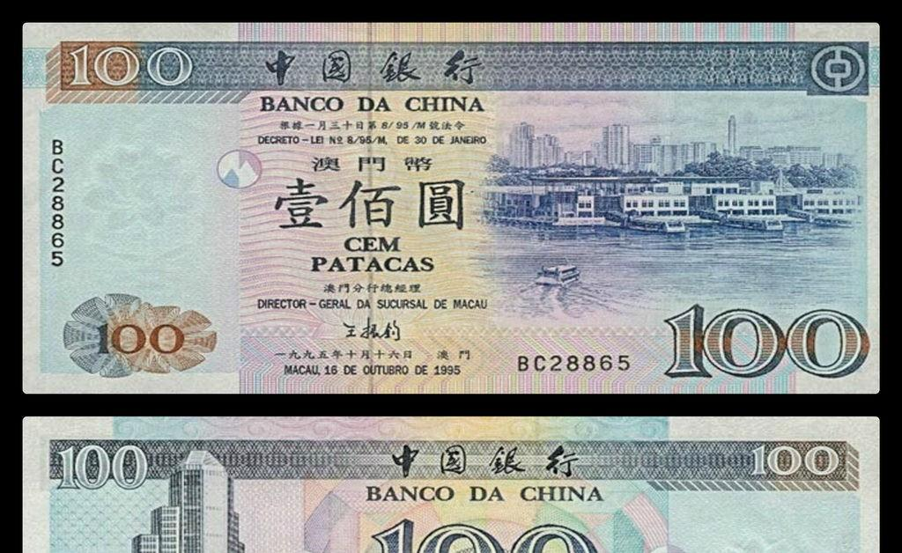

## Table of Contents

## What is the Macanese Pataca?

The Macanese Pataca is the official currency of Macau, a special administrative region of China. It is abbreviated as MOP and is used for everyday transactions within Macau. The currency is managed by the Monetary Authority of Macau, which ensures its stability and regulates its circulation.

The Pataca is pegged to the Hong Kong Dollar at a fixed exchange rate, which helps maintain its value. This link to the Hong Kong Dollar makes it easy for people to exchange money between the two regions. Banknotes and coins of the Pataca come in various denominations, making it convenient for different types of purchases.

## What is the history of the Macanese Pataca?

The Macanese Pataca has a long history that started in the 19th century. It was first introduced in 1894 when Macau was still a Portuguese colony. Before that, different currencies like the Chinese cash and the Mexican dollar were used in Macau. The word "Pataca" comes from the Portuguese word for a coin used in Asia. At first, the Pataca was made of silver, but later it changed to paper money.

Over the years, the Pataca went through many changes. In 1901, the government started to control the currency more strictly. After World War II, the Pataca was linked to the Hong Kong Dollar to keep its value stable. When Macau became a special administrative region of China in 1999, the Pataca stayed as the official currency. Today, the Monetary Authority of Macau manages the Pataca and makes sure it works well for the people of Macau.

## How is the Macanese Pataca abbreviated and symbolized?

The Macanese Pataca is abbreviated as MOP. This abbreviation stands for "Macau Official Pataca." You will see MOP used in many places like stores, banks, and on price tags in Macau.

The symbol for the Macanese Pataca is "P" or "MOP$". The "P" comes from the first letter of "Pataca." Sometimes, you might see "MOP$" used, which combines the abbreviation and the dollar sign to show it's a currency. Both symbols help people recognize the Macanese Pataca easily.

## What are the denominations of the Macanese Pataca in circulation?

The Macanese Pataca comes in different amounts for both coins and paper money. For coins, you can find 10, 20, and 50 avos, and 1, 2, 5, and 10 Patacas. The avo is a smaller unit of the Pataca, where 100 avos make 1 Pataca. These coins are handy for small purchases and everyday use.

For paper money, the denominations are 10, 20, 50, 100, 500, and 1000 Patacas. These banknotes are used for bigger amounts and are common in shops, restaurants, and other places where people spend more money. Having different amounts of Patacas helps people in Macau use the right amount of money for different things they need to buy.

## How does the exchange rate of the Macanese Pataca work?

The Macanese Pataca is connected to the Hong Kong Dollar. This means that the value of the Pataca stays the same compared to the Hong Kong Dollar. The exchange rate is set at about 1 Hong Kong Dollar to 1.03 Macanese Patacas. This fixed rate helps keep the Pataca stable and makes it easy for people to change money between Macau and Hong Kong.

The Monetary Authority of Macau controls the exchange rate to make sure it stays at this level. They do this by watching how much money is coming in and going out of Macau. If the Pataca starts to change too much, they can step in to fix it. This way, people in Macau can trust that their money will keep its value and they can use it easily in everyday life.

## What is the relationship between the Macanese Pataca and the Hong Kong Dollar?

The Macanese Pataca and the Hong Kong Dollar are closely connected. The Pataca is pegged to the Hong Kong Dollar at a fixed rate of about 1.03 Patacas for every Hong Kong Dollar. This means that the value of the Pataca stays the same compared to the Hong Kong Dollar, which helps keep the Pataca stable.

The Monetary Authority of Macau makes sure this fixed rate stays in place. They watch the money coming in and out of Macau and can step in if the Pataca starts to change too much. This connection makes it easy for people to use money between Macau and Hong Kong, and it helps people in Macau trust that their money will keep its value.

## How is the Macanese Pataca regulated and managed?

The Macanese Pataca is managed by the Monetary Authority of Macau. This group makes sure the Pataca works well for people in Macau. They control how much money is in the country and keep the value of the Pataca stable. They do this by watching the money coming in and going out of Macau. If they see the Pataca starting to change too much, they can step in to fix it.

The Monetary Authority of Macau also sets rules for banks and other places that use the Pataca. They make sure these places follow the rules and use the Pataca the right way. This helps keep the money safe and trusted by everyone in Macau. By doing all these things, the Monetary Authority makes sure the Macanese Pataca stays strong and useful for everyday life.

## What role does the Macanese Pataca play in Macau's economy?

The Macanese Pataca is very important for Macau's economy. It is the money people use every day to buy things, pay for services, and do business. Because the Pataca is stable and linked to the Hong Kong Dollar, people trust it and feel safe using it. This helps the economy grow because people can spend and invest without worrying about big changes in the value of their money.

The Monetary Authority of Macau makes sure the Pataca works well. They watch how much money is in the country and can change things if needed to keep the Pataca strong. This helps businesses and people plan for the future. A stable Pataca also makes it easy for tourists to visit and spend money in Macau, which is good for the economy.

## Can the Macanese Pataca be used outside of Macau?

The Macanese Pataca is mainly used in Macau. It is the money people use every day there to buy things and pay for services. Outside of Macau, the Pataca is not used much. You can't use it in other countries like you would use dollars or euros.

However, because the Pataca is linked to the Hong Kong Dollar, you can easily change it into Hong Kong Dollars. This makes it simple to use the money in Hong Kong. Some places near Macau might accept the Pataca, but it's not common. If you travel outside of Macau and Hong Kong, you will need to change your Patacas into another currency that people use in those places.

## What are the security features on Macanese Pataca banknotes and coins?

Macanese Pataca banknotes have many security features to stop people from making fake money. They have special ink that changes color when you tilt the note. There are also hidden pictures that you can see with a special light. The notes have tiny writing that is hard to copy, and they feel different because of raised print. If you hold the note up to the light, you can see a clear part with a picture or number. All these things make it hard for someone to make a fake Pataca note.

Coins also have security features to make sure they are real. They are made from special metals that are hard to copy. The coins have a special edge that feels different if you touch it. There are also tiny details on the coins that are hard to make if you are not using the right tools. These features help people know that the coins they use are real Macanese Patacas.

## How has the digitalization affected the use of the Macanese Pataca?

Digitalization has changed how people in Macau use the Macanese Pataca. More people are using their phones and computers to pay for things. They can use apps to send money to friends or pay for things in stores without using cash. This makes it easier and faster to use the Pataca. Banks also let people do their banking online, so they don't need to go to the bank to move their money around.

Even though digital payments are becoming more common, the Macanese Pataca is still used a lot in everyday life. People still use cash for small purchases and in places that don't take digital payments. The Monetary Authority of Macau makes sure that both cash and digital money work well together. They watch how people use money and make rules to keep everything safe and easy to use.

## What are the future prospects and challenges for the Macanese Pataca?

The future of the Macanese Pataca looks good because it is stable and linked to the Hong Kong Dollar. This makes people trust the Pataca and feel safe using it. As more people use digital payments, the Pataca can also be used in apps and online. This could help more people use the Pataca easily and make it part of a modern economy. The Monetary Authority of Macau will keep watching the money and making rules to keep the Pataca strong.

There are also some challenges for the Macanese Pataca. One big challenge is making sure it stays stable if the Hong Kong Dollar changes a lot. The Monetary Authority needs to keep a close eye on this. Another challenge is making sure digital payments are safe and easy to use. As more people use their phones to pay, there could be problems with keeping their money safe. The Monetary Authority will need to work hard to solve these problems and keep the Pataca working well for everyone in Macau.

## References & Further Reading

[1]: Bergstra, J., Bardenet, R., Bengio, Y., & Kégl, B. (2011). ["Algorithms for Hyper-Parameter Optimization."](https://dl.acm.org/doi/10.5555/2986459.2986743) Advances in Neural Information Processing Systems 24.

[2]: ["Advances in Financial Machine Learning"](https://www.amazon.com/Advances-Financial-Machine-Learning-Marcos/dp/1119482089) by Marcos Lopez de Prado

[3]: ["Evidence-Based Technical Analysis: Applying the Scientific Method and Statistical Inference to Trading Signals"](https://www.amazon.com/Evidence-Based-Technical-Analysis-Scientific-Statistical/dp/0470008741) by David Aronson

[4]: ["Machine Learning for Algorithmic Trading"](https://github.com/stefan-jansen/machine-learning-for-trading) by Stefan Jansen

[5]: ["Quantitative Trading: How to Build Your Own Algorithmic Trading Business"](https://www.amazon.com/Quantitative-Trading-Build-Algorithmic-Business/dp/1119800064) by Ernest P. Chan