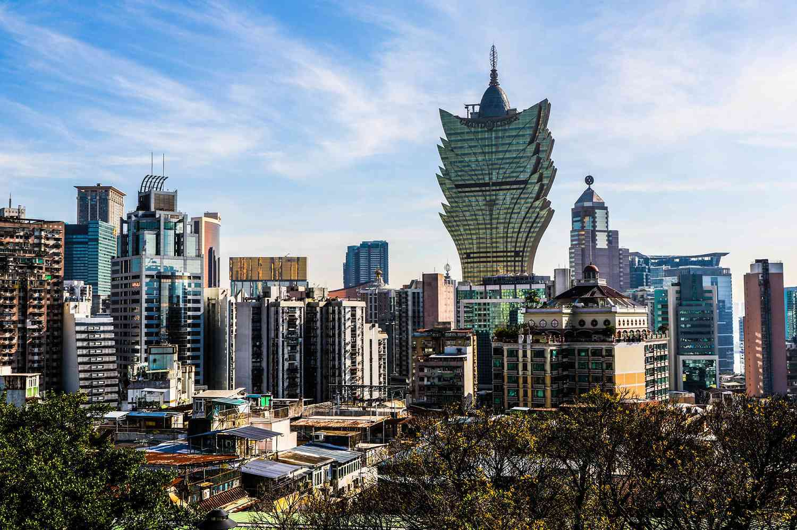

## Table of Contents

## What is Macau SAR, China?

Macau SAR, China, is a special administrative region located on the southeastern coast of China. It is a small peninsula and islands next to the Pearl River Delta. Macau was once a Portuguese colony but was handed back to China in 1999. Since then, it has been governed under the "one country, two systems" policy, which means it has a high degree of autonomy and its own legal, economic, and political systems different from mainland China.

Macau is famous for its casinos and is often called the "Las Vegas of Asia." It is a popular place for tourists who want to gamble and enjoy entertainment. Besides gambling, Macau has a rich history and culture, with many old buildings and festivals. The official languages are Chinese and Portuguese, and the currency used is the Macanese pataca. Despite its small size, Macau has a bustling economy driven mainly by tourism and gaming.

## Where is Macau located geographically?

Macau is on the southeastern coast of China. It is near the Pearl River Delta. Macau is made up of a small peninsula and some islands. It is close to the city of Zhuhai in Guangdong Province and just a short distance from Hong Kong.

Macau is surrounded by water. To the east is the South China Sea. To the north and west, it is connected to the mainland by a narrow piece of land. This location makes Macau an important place for trade and tourism.

## What is the historical background of Macau before it became a Portuguese colony?

Before the Portuguese came, Macau was part of China's Guangdong Province. It was a small fishing village called Haojing. The area was important because it was close to the sea and had good places for ships to stop. Many different people, like fishermen and traders, lived there. They spoke different languages and followed different customs. The village was under the control of the Chinese government, which collected taxes and made rules.

In the 16th century, European explorers started to come to Asia. In 1557, the Portuguese got permission from China to use Macau as a place to trade and store goods. They paid rent to the Chinese government and slowly started to build more houses and businesses. Over time, the Portuguese took more control of the area, even though it was still officially part of China. This set the stage for Macau to become a Portuguese colony in the years that followed.

## When and how did Portugal establish control over Macau?

Portugal started to control Macau in 1557. They asked the Chinese government if they could use the area to trade and store goods. The Chinese agreed, but the Portuguese had to pay rent. At first, they only used the land for trading, but slowly they built more houses and businesses. Over time, they took more control of the area, even though it was still officially part of China.

By the 19th century, Portugal had full control of Macau. They made their own laws and had their own government there. The Chinese government did not stop them because they were busy with other problems. Portugal used Macau as a base for trading with other parts of Asia. They stayed in control until 1999 when they handed Macau back to China.

## How did Macau evolve under Portuguese rule?

Under Portuguese rule, Macau changed a lot. At first, it was just a small place for trading. The Portuguese built more houses and businesses there. They made their own laws and had their own government. Macau became a busy place where people from different countries came to trade. The Portuguese also brought their culture, like their language and religion. This mix of Chinese and Portuguese cultures made Macau unique.

As time went on, Macau grew even more. It became a big center for trade in Asia. The Portuguese used Macau to trade with places like Japan and India. They also started to build big buildings and churches. Macau became known for its mix of old Chinese and new Portuguese styles. By the 20th century, Macau was a busy city with many people and businesses. It stayed under Portuguese control until 1999 when it was handed back to China.

## What were the key economic activities in Macau during the colonial period?

During the colonial period, the main economic activity in Macau was trade. The Portuguese used Macau as a base to trade with other countries in Asia, like Japan and India. They brought goods from Europe to sell in Asia and took goods from Asia back to Europe. This made Macau a busy place where many different people came to buy and sell things. The city grew because of this trade, and many businesses opened to support it.

Besides trade, gambling also became important in Macau. In the 19th century, the Portuguese government allowed gambling houses to open. This attracted more people to visit Macau, not just for trade but also to try their luck at gambling. Over time, gambling became a big part of Macau's economy. It helped the city grow even more and brought in a lot of money. By the time Macau was handed back to China in 1999, gambling was one of the main economic activities in the city.

## When and under what circumstances was Macau handed back to China?

Macau was handed back to China on December 20, 1999. Before this, Macau was a Portuguese colony for a long time. In the 1980s, China and Portugal started talking about giving Macau back to China. They agreed that Macau would become a special part of China called a Special Administrative Region (SAR). This meant that Macau would have its own rules and government but still be part of China.

The handover happened peacefully. On the day of the handover, there was a big ceremony where the Portuguese flag was taken down and the Chinese flag was raised. People from both countries watched and celebrated. After the handover, Macau kept its own laws and ways of doing things, which was different from the rest of China. This was called the "one country, two systems" policy. It helped Macau keep its special culture and economy.

## What is the current political status of Macau under the 'One Country, Two Systems' policy?

Macau is now a Special Administrative Region (SAR) of China under the "One Country, Two Systems" policy. This means that while Macau is part of China, it has its own government and laws that are different from the rest of the country. The people in Macau have more freedoms than people in mainland China. For example, they can have their own newspapers and speak freely. The leader of Macau is called the Chief Executive, and they are chosen by a group of people, not by everyone voting.

The "One Country, Two Systems" policy lets Macau keep its special way of life. This includes using different languages, like Chinese and Portuguese, and having its own money, called the Macanese pataca. Macau can also make its own rules about things like business and education. This helps Macau stay a busy place for tourists and gambling, which is a big part of its economy. Even though Macau is part of China, it can do many things on its own.

## How has Macau's economy transformed since its return to China?

Since Macau returned to China in 1999, its economy has changed a lot. Before, Macau was known for trade and gambling, but now gambling is the biggest part of its economy. Many big casinos have been built, and people come from all over the world to visit them. This has made Macau a very popular place for tourists. The government has made rules to help the gambling business grow, and it brings in a lot of money for the city.

Besides gambling, other parts of the economy have also grown. More hotels, restaurants, and shops have opened to serve the tourists who come to gamble. The government has also worked to bring in other kinds of businesses, like finance and technology. This helps make the economy stronger and not just depend on gambling. Even though gambling is still the biggest part, Macau is trying to have a more balanced economy.

## What are the major cultural influences in Macau, and how do they manifest today?

Macau's culture is a mix of Chinese and Portuguese influences. This blend started when the Portuguese came to Macau in the 16th century. They brought their language, food, and religion. Today, you can still see and feel these influences all over Macau. Many people speak Portuguese, and you can find Portuguese-style buildings and churches. The food in Macau is also special because it mixes Chinese and Portuguese flavors. For example, a popular dish is "Macanese-style" food, which combines ingredients and cooking methods from both cultures.

This mix of cultures is seen in everyday life in Macau. Festivals and holidays from both Chinese and Portuguese traditions are celebrated. During Chinese New Year, you can see traditional Chinese decorations and celebrations. At the same time, there are also events like the Feast of Our Lady of Fatima, which comes from Portuguese culture. This blend of cultures makes Macau unique. It's not just about the big things like buildings and food, but also in the small things, like the way people talk and the stories they tell. This mix of Chinese and Portuguese culture is what makes Macau special today.

## What are the significant challenges facing Macau in terms of governance and societal development?

One big challenge for Macau is keeping a balance between its special way of life and being part of China. Under the "One Country, Two Systems" policy, Macau has its own rules and government. But sometimes, there are disagreements about how much control China should have. This can make people worried about their freedoms and rights. The government needs to find ways to keep everyone happy and make sure that Macau stays a good place to live and visit.

Another challenge is making the economy stronger and not just depending on gambling. Right now, most of Macau's money comes from casinos. But if something happens to the gambling business, it could hurt the whole economy. So, the government is trying to bring in other kinds of businesses, like technology and finance. They also need to make sure that everyone can find good jobs and that the city keeps growing in a healthy way. This means building better schools, hospitals, and other services for people.

## How does Macau position itself in the global context, particularly in relation to its role in tourism and gaming industries?

Macau has become a big name in the world because of its tourism and gaming industries. It is known as the "Las Vegas of Asia" because it has so many casinos. People from all over the world come to Macau to gamble and have fun. The city has built big hotels and entertainment places to make sure tourists have a good time. This has made Macau's economy grow a lot, and it brings in a lot of money every year.

Even though gambling is the biggest part of Macau's economy, the city is trying to show the world more than just that. Macau wants to be known for its history and culture too. It has old buildings and festivals that mix Chinese and Portuguese traditions. By showing off these special things, Macau hopes to attract more kinds of tourists and not just people who want to gamble. This way, Macau can keep growing and be an important place in the world for both fun and culture.

## References & Further Reading

[1]: ["Macau: A Cultural Janus"](https://www.jstor.org/stable/j.ctt2jc1mc) by Frederic P. Choi

[2]: Breslin, S. (2007). ["China and the Global Political Economy."](https://link.springer.com/book/10.1007/978-1-349-67537-1) Palgrave Macmillan.

[3]: Cabestan, J.-P., & Cheng, J. Y. S. (Eds.). (2010). ["Political Development in the Hong Kong Special Administrative Region."](https://www.researchgate.net/profile/Jean-Pierre-Cabestan-2/publication/347816666_China's_foreign_and_security_policy_institutions_and_decision-making_under_Xi_Jinping/links/61af43dbd3c8ae3fe3ed40f7/Chinas-foreign-and-security-policy-institutions-and-decision-making-under-Xi-Jinping.pdf) City University of Hong Kong Press.

[4]: de Oliveira, J. M. F. (2017). ["The political economy of Macau since 1999: Institutional and economic changes."](https://www.countyoffice.org/death-records/) In Routledge Handbook of the Chinese Economy.

[5]: ["Algorithmic Trading: Winning Strategies and Their Rationale"](https://www.wiley.com/en-us/Algorithmic+Trading%3A+Winning+Strategies+and+Their+Rationale-p-9781118460146) by Ernest P. Chan.

[6]: Cutler, T., & Waine, B. (2000). ["Market Rule and Market Logic: London and Sydney’s Casino Capitalism."](https://capitalism.columbia.edu/content/theory-capitalism) Journal of Industrial Relations.

[7]: Xiang, B. (2016). ["The Long Shadow of Macau’s Liberalisation of the Gaming Industry."](https://www.nber.org/system/files/working_papers/w22801/w22801.pdf) Gaming Law Review and Economics.

[8]: Stuart, M. (2012). ["Macau and China: Gambling on a Dream."](https://www.jstor.org/stable/10.5749/j.ctv2z862bp) Palgrave Macmillan.