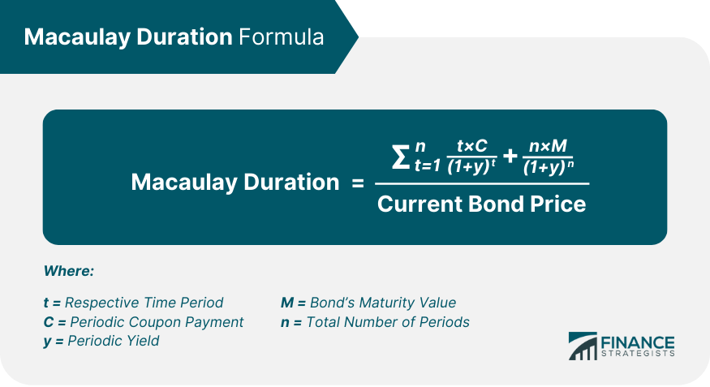

## Table of Contents

## What is Macaulay Duration?

Macaulay Duration is a way to measure how long it takes for the price of a bond to be repaid by its cash flows. It's named after Frederick Macaulay, who came up with the idea. Imagine you buy a bond. The bond will pay you back over time through interest payments and the final payment when it matures. Macaulay Duration tells you the average time you have to wait to get all your money back, considering the time value of money.

To calculate Macaulay Duration, you take each of the bond's cash flows, figure out how long you have to wait for each one, and then weigh them by their present value. The present value is what those future payments are worth today. You add up all these weighted times and divide by the bond's current price. This gives you a single number that represents the bond's duration. It's useful for comparing different bonds and understanding how sensitive a bond's price is to changes in interest rates.

## Who developed the concept of Macaulay Duration?

Frederick Macaulay developed the concept of Macaulay Duration. He was an economist who wanted a better way to understand how long it takes to get your money back from a bond. He thought about all the payments a bond makes, like interest and the final payment when it matures, and how long you wait for each one.

Macaulay figured out that you could calculate an average time by considering the present value of each payment. This means you take into account what those future payments are worth today. By doing this, he created a way to measure the average time it takes for a bond to pay you back, which he called Macaulay Duration.

## How is Macaulay Duration different from other duration measures?

Macaulay Duration is different from other duration measures because it tells you the average time it takes to get your money back from a bond, considering the time value of money. It's like figuring out when you'll get all your payments back, but it weighs each payment by how much it's worth today. This makes it useful for understanding how long you have to wait for your investment to pay off.

Other duration measures, like Modified Duration, focus more on how sensitive a bond's price is to changes in interest rates. Modified Duration is actually based on Macaulay Duration but adjusts it to directly show the percentage change in a bond's price for a 1% change in interest rates. So while Macaulay Duration gives you a time measure, Modified Duration gives you a measure of price sensitivity, which is more about risk than timing.

Effective Duration is another measure that's different because it's used for bonds with features that make their cash flows change when interest rates change, like callable or putable bonds. Effective Duration also measures price sensitivity but does so by looking at how the bond's price would change with small shifts in the yield curve. This makes it more suitable for complex bonds where Macaulay Duration might not be as accurate.

## What is the formula for calculating Macaulay Duration?

To calculate Macaulay Duration, you need to know the bond's cash flows, the time until each cash flow, and the present value of each cash flow. The formula for Macaulay Duration is the sum of each cash flow's present value multiplied by the time until that cash flow, all divided by the bond's current price. So, for each cash flow, you multiply how much it's worth today by how many periods you have to wait for it. You do this for every cash flow the bond will give you, then add all those numbers up. Finally, you divide by what the bond is worth right now.

For example, if a bond pays you $100 in one year and $100 in two years, and its current price is $190, you would calculate the present value of each payment using the bond's yield. If the yield is 5%, the present value of the first payment is about $95.24, and the second payment is about $90.70. You then multiply the first payment's present value by 1 (the time until it's paid) and the second payment's present value by 2. Adding these together gives you $95.24 + $181.40 = $276.64. Dividing this by the bond's current price of $190 gives you a Macaulay Duration of about 1.46 years.

## What are the key components needed to calculate Macaulay Duration?

To calculate Macaulay Duration, you need to know the bond's cash flows, which are the payments the bond will make over time, like interest payments and the final payment when it matures. You also need to know how long you have to wait for each of these cash flows. This is usually measured in years or periods. Finally, you need to know the present value of each cash flow, which is what those future payments are worth today. You figure this out using the bond's yield, which is like the interest rate the bond is paying.

Once you have all these pieces of information, you can calculate Macaulay Duration. For each cash flow, you multiply its present value by the time until you get it. You do this for every cash flow the bond will give you, then add all those numbers up. After that, you divide the total by the bond's current price. This gives you the Macaulay Duration, which tells you the average time it takes to get your money back from the bond, considering the time value of money.

## How does Macaulay Duration help in assessing interest rate risk?

Macaulay Duration helps in assessing interest rate risk by giving you an idea of how long it takes to get your money back from a bond. If a bond has a longer Macaulay Duration, it means you have to wait longer for your payments. This makes the bond more sensitive to changes in interest rates. When interest rates go up, the price of the bond goes down more for bonds with longer durations. This is because the bond's fixed payments become less valuable compared to new bonds that might offer higher interest rates.

On the other hand, if a bond has a shorter Macaulay Duration, it means you get your money back faster. This makes the bond less sensitive to interest rate changes. When interest rates rise, the price of a bond with a shorter duration won't drop as much as one with a longer duration. So, by knowing a bond's Macaulay Duration, you can better understand how much risk you're taking with changes in interest rates. It helps you decide if a bond fits your investment goals and how it might react to changes in the market.

## Can you explain Macaulay Duration with a simple example?

Imagine you buy a bond that pays you $100 every year for three years, and then you get your $1,000 back at the end. The bond's yield, or interest rate, is 5%. To find the Macaulay Duration, you need to figure out how long it takes to get all your money back, considering what those future payments are worth today. You start by calculating the present value of each payment. The first $100 payment in one year is worth about $95.24 today, the second $100 payment in two years is worth about $90.70, and the third $100 payment in three years is worth about $86.38. The final $1,000 payment in three years is worth about $863.84 today.

Next, you multiply each payment's present value by the time until you get it. So, the first payment's value of $95.24 times 1 year is $95.24, the second payment's value of $90.70 times 2 years is $181.40, the third payment's value of $86.38 times 3 years is $259.14, and the final payment's value of $863.84 times 3 years is $2,591.52. You add all these numbers up to get $3,127.30. Then, you divide this total by the bond's current price, which is the sum of all the present values, or $1,226.16. This gives you a Macaulay Duration of about 2.55 years. This means, on average, it takes about 2.55 years to get your money back from this bond, considering the time value of money.

## What are the limitations of using Macaulay Duration?

Macaulay Duration is a helpful way to figure out how long it takes to get your money back from a bond, but it has some limits. One big limit is that it doesn't tell you how the bond's price will change when interest rates go up or down. It just gives you an average time, not how sensitive the bond is to interest rate changes. For that, you need to look at other measures like Modified Duration.

Another limit is that Macaulay Duration assumes the bond's cash flows stay the same, no matter what happens with interest rates. But some bonds, like those you can call back early or those that let you sell them back, can change their cash flows if interest rates move. For these kinds of bonds, Macaulay Duration might not be very accurate. You'd need to use a different measure, like Effective Duration, to get a better idea of the bond's risk.

## How is Macaulay Duration applied in bond portfolio management?

In bond portfolio management, Macaulay Duration helps managers understand how long it will take to get their money back from the bonds they own. By figuring out the Macaulay Duration for each bond, managers can see if the portfolio matches their investment goals. If they want their money back quickly, they might choose bonds with shorter durations. If they're okay waiting longer, they might go for bonds with longer durations. This helps them balance the portfolio to meet their needs and expectations.

Macaulay Duration also helps managers assess how sensitive their bond portfolio is to changes in interest rates. If the portfolio has a longer average Macaulay Duration, it means the bonds are more sensitive to interest rate changes. When interest rates go up, the value of these bonds might drop more than bonds with shorter durations. By knowing the Macaulay Duration of their portfolio, managers can make smart decisions about which bonds to buy or sell to manage risk and keep the portfolio in line with their investment strategy.

## What is the relationship between Macaulay Duration and bond convexity?

Macaulay Duration and bond convexity are both important for understanding how bonds react to changes in interest rates, but they measure different things. Macaulay Duration tells you the average time it takes to get your money back from a bond, considering what those future payments are worth today. It's like figuring out when you'll get all your payments back, but it weighs each payment by how much it's worth now. This helps you understand how sensitive a bond's price is to changes in interest rates. If a bond has a longer Macaulay Duration, its price will change more when interest rates move.

Bond convexity, on the other hand, adds another layer of detail to this picture. It measures how the bond's duration changes as interest rates change. Think of it like a curve: Macaulay Duration gives you a straight line, but convexity shows you how that line bends. When interest rates change, the price of a bond doesn't move in a straight line; it curves. Convexity helps you see how much the bond's price will curve when interest rates go up or down. So, while Macaulay Duration gives you a basic idea of interest rate risk, convexity gives you a more complete picture by showing how that risk changes with bigger moves in interest rates.

## How can Macaulay Duration be used to immunize a bond portfolio?

Immunizing a bond portfolio means setting it up so that changes in interest rates don't hurt its value too much. You can use Macaulay Duration to do this by matching the portfolio's Macaulay Duration to the time when you need the money. If you know you'll need your money back in five years, you can choose bonds that have a Macaulay Duration of about five years. This way, the average time it takes to get your money back from the bonds matches when you need it, reducing the risk from interest rate changes.

When you immunize a portfolio using Macaulay Duration, you're trying to balance the effects of interest rate changes. If interest rates go up, the price of your bonds might go down, but the shorter time until you get your money back can help offset this. If interest rates go down, the price of your bonds might go up, but you'll have to wait longer for your money. By matching the Macaulay Duration to your investment horizon, you can protect your portfolio from big swings in value due to interest rate changes.

## What advanced techniques involve Macaulay Duration in financial modeling?

In financial modeling, Macaulay Duration is used in advanced techniques like cash flow matching and asset-liability management. Cash flow matching means making sure the money coming in from bonds matches when you need to pay out money. By using Macaulay Duration, you can choose bonds that line up with your payment schedule. For example, if you need to pay a big bill in five years, you might pick bonds with a Macaulay Duration of around five years. This helps make sure you have the money when you need it, even if interest rates change.

Asset-liability management is another way Macaulay Duration is used. This is about balancing what you own (assets) with what you owe (liabilities). If you run a pension fund, you need to make sure you can pay out pensions when they're due. By matching the Macaulay Duration of your bond investments to when you'll need to pay pensions, you can protect the fund from interest rate changes. This helps make sure you have enough money to meet your obligations, no matter what happens with interest rates.

## What is Macaulay Duration and how is it understood?

Macaulay Duration, named after economist Frederick Macaulay, is a fundamental metric in bond valuation and a critical tool for assessing interest rate risk. Developed in the early 20th century, this measure provides valuable insights into the timing and magnitude of cash flows associated with bonds. It is particularly useful for investors and financial analysts seeking to understand the sensitivity of bond prices to interest rate changes.

The Macaulay Duration is defined as the weighted average time until a bondholder receives the bond's cash flows. These cash flows include both periodic coupon payments and the repayment of the bond's face value at maturity. By calculating the time-weighted present value of these cash flows, Macaulay Duration quantifies the time needed to recoup the bond's price through its internal cash flows.

The mathematical formula for Macaulay Duration (D) is expressed as follows:

$$
D = \frac{\sum_{t=1}^{n} \left( \frac{t \cdot C_t}{(1+y)^t} \right)}{\sum_{t=1}^{n} \left( \frac{C_t}{(1+y)^t} \right)}
$$

In this equation:
- $t$ represents the time period (usually in years) at which each cash flow is received.
- $C_t$ denotes the cash flow at time $t$, including both coupon payments and the face value at maturity.
- $y$ is the bond's yield to maturity, which reflects the internal rate of return if the bond is held to maturity.
- $n$ is the total number of cash flows, which extends until the bond's maturity date.

Through these components, Macaulay Duration essentially computes the weighted average time to receive the cash flows from a bond. The formula takes into account the present value of each cash flow, discounting them based on the bond's yield to maturity. Consequently, Macaulay Duration provides investors with the average period required to recover the bond's price, making it a pivotal measure for managing [interest rate](/wiki/interest-rate-trading-strategies) risks. Higher duration indicates greater sensitivity to interest rate changes, whereas lower duration suggests reduced sensitivity.

## How do you calculate Macaulay Duration: A Step-by-Step Guide?

Calculating Macaulay Duration involves determining the weighted average time until a bond's cash flows are received, which is crucial for assessing interest rate risk. Here's a comprehensive guide on calculating Macaulay Duration with practical examples and explanations.

### Practical Example of Macaulay Duration Calculation

Consider a bond with the following characteristics:
- **Face Value**: $1,000
- **Coupon Rate**: 5%
- **Maturity**: 3 years
- **Yield to Maturity (YTM)**: 4%

The cash flows for this bond over three years will be $50 each year (5% of $1,000) and $1,000 at maturity. To calculate the Macaulay Duration, we need to compute the present value of each cash flow, determine its weight, and compute the weighted average time.

### Detailed Calculation Steps Using Present Value of Cash Flows

1. **Calculate Present Value of Cash Flows**:
   The present value of a future cash flow is given by:
$$
   PV = \frac{CF}{(1 + YTM)^t}

$$
   where $CF$ is the cash flow, $YTM$ is the yield to maturity, and $t$ is the time period.

2. **Compute Present Value for Each Year**:
   - Year 1: $PV_1 = \frac{50}{(1 + 0.04)^1} = 48.08$
   - Year 2: $PV_2 = \frac{50}{(1 + 0.04)^2} = 46.23$
   - Year 3: $PV_3 = \frac{50}{(1 + 0.04)^3} = 44.45$
   - Year 3 (Face Value): $PV_{FV} = \frac{1000}{(1 + 0.04)^3} = 888.49$

3. **Calculate Weights for Each Cash Flow**:
   The weight for each cash flow is its present value divided by the total present value of all cash flows:
$$
   \text{Weight}_t = \frac{PV_t}{\text{Total PV}}

$$
   The Total PV is the sum of all present values: $PV_{Total} = 48.08 + 46.23 + 44.45 + 888.49 = 1027.25$.

4. **Compute Weighted Average Time**:
   The Macaulay Duration $D$ is calculated as:
$$
   D = \sum_{t=1}^{n} \left( \text{Weight}_t \times t \right)

$$
   Plugging in the values:
   - Year 1: $\frac{48.08}{1027.25} \times 1 = 0.0468$
   - Year 2: $\frac{46.23}{1027.25} \times 2 = 0.0901$
   - Year 3: $\frac{44.45 + 888.49}{1027.25} \times 3 = 2.7131$

   Summing these gives the Macaulay Duration: $D = 2.85$ years.

### Using Excel for Macaulay Duration Calculation

To streamline the calculation, Excel can be used effectively by setting up a spreadsheet with these steps:
1. **Input bond parameters** (face value, coupon rate, maturity, YTM).
2. **Calculate annual cash flows** and their present value using Excel formulas (e.g., `=FV/(1+YTM)^t`).
3. **Sum the present values** to get `PV Total`.
4. Compute weights and multiply each by its respective time period.
5. **Sum the products** to get Macaulay Duration.

Excel functions like `PV()` can simplify the computation of present values directly. This practical approach ensures accuracy and efficiency in bond portfolio management, particularly when evaluating interest rate risks in trading strategies.

## What are the advanced applications and considerations?

Macaulay Duration and Modified Duration are two closely related metrics that play a crucial role in the analysis of interest rate risk. While Macaulay Duration provides the weighted average time until a bond's cash flows are received, Modified Duration adjusts this calculation to gauge the bond's price sensitivity to interest rate changes. The relationship between these two measures is critical for traders and investors who need to understand both the timing of cash flows and their vulnerability to interest rate movements. Modified Duration is often derived from Macaulay Duration using the formula:

$$
\text{Modified Duration} = \frac{\text{Macaulay Duration}}{1 + \frac{y}{n}}
$$

where $y$ represents the bond's yield to maturity, and $n$ is the number of coupon periods per year.

The use of Excel in trading analysis has revolutionized how investors process these metrics. Excel's ability to automate calculations allows traders to efficiently analyze large datasets and streamline complex financial models. For example, when calculating durations, Excel functions such as `PV()` and `IRR()` can be utilized to automate the derivation of cash flow present values and yields. Excel's Data Table features, combined with Macros, can further automate scenario analysis by adjusting variables systematically and recording the outcomes, which helps traders make informed decisions quickly.

In the context of trading, scenario analysis and stress testing are essential for portfolio optimization. These techniques involve evaluating the performance of investment portfolios under various hypothetical conditions, including shifts in interest rates, economic downturns, or other market stressors. By applying Macaulay and Modified Duration in these scenarios, traders can assess potential risks and make strategic adjustments to their holdings. Automation using tools like Python can further enhance these analyses by running extensive simulations that calculate potential impacts across different scenarios. Below is an example of how a Python script might automate such an analysis:

```python
import numpy as np
import pandas as pd

# Sample bond data
bonds = pd.DataFrame({
    'Bond': ['Bond A', 'Bond B'],
    'CashFlows': [[100, 100, 1100], [100, 100, 100, 1100]],
    'Times': [np.array([1, 2, 3]), np.array([1, 2, 3, 4])],
    'Yield': [0.05, 0.04]
})

# Function to calculate Macaulay Duration
def macaulay_duration(cashflows, times, yield_rate):
    present_values = cashflows / (1 + yield_rate) ** times
    weighted_times = times * present_values
    return np.sum(weighted_times) / np.sum(present_values)

# Calculate the durations
bonds['MacaulayDuration'] = bonds.apply(
    lambda row: macaulay_duration(np.array(row['CashFlows']), row['Times'], row['Yield']),
    axis=1
)

# Function to calculate Modified Duration
def modified_duration(macaulay_duration, yield_rate, freq=1):
    return macaulay_duration / (1 + yield_rate / freq)

# Calculate Modified Duration
bonds['ModifiedDuration'] = bonds.apply(
    lambda row: modified_duration(row['MacaulayDuration'], row['Yield']),
    axis=1
)

print(bonds)
```

This approach highlights the adaptability of duration metrics in developing robust trading strategies that are resilient to market volatility. As trading algorithms continually evolve, the integration of Macaulay Duration and its derivatives into these frameworks enables a more comprehensive risk assessment and enhanced decision-making process.

## References & Further Reading

[1]: Macaulay, F. R. (1938). "Some Theoretical Problems Suggested by the Movements of Interest Rates, Bond Yields and Stock Prices in the United States Since 1856." National Bureau of Economic Research.

[2]: Fabozzi, F. J. (Ed.). (2004). "The Handbook of Fixed Income Securities." McGraw-Hill Education.

[3]: Tuckman, B., & Serrat, A. (2011). "Fixed Income Securities: Tools for Today's Markets." Wiley Finance.

[4]: ["Advances in Financial Machine Learning"](https://www.amazon.com/Advances-Financial-Machine-Learning-Marcos/dp/1119482089) by Marcos Lopez de Prado

[5]: ["Quantitative Trading: How to Build Your Own Algorithmic Trading Business"](https://www.amazon.com/Quantitative-Trading-Build-Algorithmic-Business/dp/1119800064) by Ernest P. Chan

[6]: ["Fixed Income Analysis"](https://en.wikipedia.org/wiki/Fixed_income_analysis) by Frank J. Fabozzi

[7]: ["Algorithmic Trading: Winning Strategies and Their Rationale"](https://onlinelibrary.wiley.com/doi/pdf/10.1002/9781118676998.fmatter) by Ernie Chan