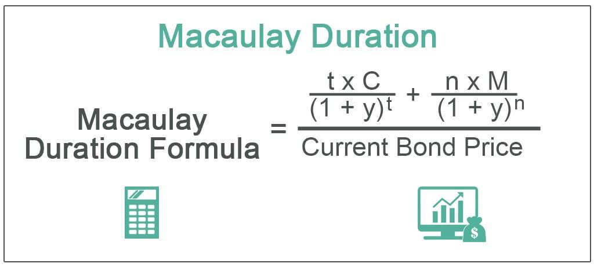

Bond trading, a vital component of the global financial markets, leverages a set of financial metrics pivotal for assessing bond performance and value. These metrics are instrumental in guiding investment strategies and managing portfolios. Among these, bond duration stands out as a critical measure, providing insights into the sensitivity of bond prices to interest rate fluctuations. The Macaulay Duration, named after economist Frederick Macaulay, is one of the key metrics used to calculate the weighted average time before a bondholder receives the bond's cash flows. 

Bond duration's primary role is in managing interest rate risk—an essential aspect, considering that interest rate changes directly affect bond valuations. When interest rates rise, the price of existing bonds typically falls and vice versa. Duration quantifies this effect, where a higher duration indicates greater sensitivity to interest rate shifts. This insight allows investors and traders to anticipate how bond prices might change with varying interest rates, offering a basis for hedging risks and adjusting portfolios opportunely.



The integration of these metrics, particularly Macaulay Duration, is crucial in the context of algorithmic trading. Algorithmic trading, characterized by executing orders using automated pre-programmed trading instructions, relies heavily on precise and timely data. Metrics such as bond duration are embedded within these algorithms to refine trading strategies, assess risk exposures, and enhance the decision-making process. By incorporating Macaulay Duration into algorithms, traders can better predict market conditions, optimize trade execution, and improve overall trading efficiency.

In summary, understanding and utilizing bond duration, with a focus on the Macaulay Duration, is essential for effectively managing interest rate risk and formulating robust trading strategies. As bond trading continues to evolve with technology, the relevance of these metrics only grows, underscoring their importance in both traditional investment approaches and modern algorithmic trading systems.

## Table of Contents

## Understanding Macaulay Duration

Macaulay Duration, named after economist Frederick Macaulay, is a fundamental metric in bond valuation and a critical tool for assessing interest rate risk. Developed in the early 20th century, this measure provides valuable insights into the timing and magnitude of cash flows associated with bonds. It is particularly useful for investors and financial analysts seeking to understand the sensitivity of bond prices to interest rate changes.

The Macaulay Duration is defined as the weighted average time until a bondholder receives the bond's cash flows. These cash flows include both periodic coupon payments and the repayment of the bond's face value at maturity. By calculating the time-weighted present value of these cash flows, Macaulay Duration quantifies the time needed to recoup the bond's price through its internal cash flows.

The mathematical formula for Macaulay Duration (D) is expressed as follows:

$$
D = \frac{\sum_{t=1}^{n} \left( \frac{t \cdot C_t}{(1+y)^t} \right)}{\sum_{t=1}^{n} \left( \frac{C_t}{(1+y)^t} \right)}
$$

In this equation:
- $t$ represents the time period (usually in years) at which each cash flow is received.
- $C_t$ denotes the cash flow at time $t$, including both coupon payments and the face value at maturity.
- $y$ is the bond's yield to maturity, which reflects the internal rate of return if the bond is held to maturity.
- $n$ is the total number of cash flows, which extends until the bond's maturity date.

Through these components, Macaulay Duration essentially computes the weighted average time to receive the cash flows from a bond. The formula takes into account the present value of each cash flow, discounting them based on the bond's yield to maturity. Consequently, Macaulay Duration provides investors with the average period required to recover the bond's price, making it a pivotal measure for managing [interest rate](/wiki/interest-rate-trading-strategies) risks. Higher duration indicates greater sensitivity to interest rate changes, whereas lower duration suggests reduced sensitivity.

## Factors Affecting Macaulay Duration

Macaulay Duration is an essential metric in bond trading that provides insights into the sensitivity of a bond's price to changes in interest rates. Several factors significantly influence Macaulay Duration, impacting its effectiveness as a predictive financial measure.

### Bond Price, Maturity, Coupon Rates, and Yield

**Bond Price and Yield**: The price and yield of a bond are inversely related, and both directly affect its duration. As bond prices rise, yields fall, extending the duration since bondholders are likely to hold these bonds longer for better returns. Conversely, an increase in yield shortens the duration as the present value of future cash flows decreases, accelerating the return of investment.

**Maturity**: The duration is highly sensitive to a bond's maturity. Longer maturity means the bond has cash flows occurring further in the future, increasing the duration. A bond with a longer maturity will generally exhibit higher interest rate sensitivity as compared to a short-term bond. This is because the time-weighted cash flows extend over a more extended period.

**Coupon Rate**: Bonds with higher coupon rates generally have shorter durations compared to similar bonds with lower coupon rates. This occurs because higher coupon payments are received earlier, effectively speeding up the cash flow return. For example, zero-coupon bonds, which make no periodic interest payments, have a duration equal to their maturity since the entire cash flow is paid at the end of the term.

### Interest Rate Fluctuations

Interest rates have a significant impact on bond duration. When interest rates fluctuate, they affect the yield required by investors, thus altering the duration. A rising interest rate environment leads to a decrease in bond prices, subsequently shortening the duration. Conversely, falling interest rates cause an extension in duration due to increased bond prices. Macaulay Duration, therefore, helps assess the rate at which bond prices are expected to change with interest rate variations, providing a hedge against interest rate risk.

### Special Bond Features: Sinking Funds and Call Provisions

**Sinking Funds**: Bonds with sinking fund provisions require that the issuer repays part of the bond before maturity, reducing duration. This feature means the issuer essentially buys back a portion of the bond, returning cash to investors sooner than the bond’s maturity date. The enforced early repayment due to a sinking fund lowers the time-weighted cash flows, hence reducing the duration.

**Call Provisions**: Call provisions give the issuer the right to repay the bond before maturity if it becomes advantageous, often when interest rates drop. This option to call the bond reduces the duration, as there is a possibility of receiving the face value before the maturity date. The uncertainty introduced by the callability feature generally leads to a shorter expected duration since investors need to consider the likelihood of the bond being redeemed early, especially in a declining interest rate scenario. 

In summary, understanding the factors influencing Macaulay Duration is crucial for investors managing portfolios in environments subject to interest rate changes. Adjusting strategies based on bond price, maturity, coupon rates, yield, and special bond features ensures better risk management and optimized financial performance.

## Calculating Macaulay Duration: A Step-by-Step Guide

Calculating Macaulay Duration involves determining the weighted average time until a bond's cash flows are received, which is crucial for assessing interest rate risk. Here's a comprehensive guide on calculating Macaulay Duration with practical examples and explanations.

### Practical Example of Macaulay Duration Calculation

Consider a bond with the following characteristics:
- **Face Value**: $1,000
- **Coupon Rate**: 5%
- **Maturity**: 3 years
- **Yield to Maturity (YTM)**: 4%

The cash flows for this bond over three years will be $50 each year (5% of $1,000) and $1,000 at maturity. To calculate the Macaulay Duration, we need to compute the present value of each cash flow, determine its weight, and compute the weighted average time.

### Detailed Calculation Steps Using Present Value of Cash Flows

1. **Calculate Present Value of Cash Flows**:
   The present value of a future cash flow is given by:
$$
   PV = \frac{CF}{(1 + YTM)^t}

$$
   where $CF$ is the cash flow, $YTM$ is the yield to maturity, and $t$ is the time period.

2. **Compute Present Value for Each Year**:
   - Year 1: $PV_1 = \frac{50}{(1 + 0.04)^1} = 48.08$
   - Year 2: $PV_2 = \frac{50}{(1 + 0.04)^2} = 46.23$
   - Year 3: $PV_3 = \frac{50}{(1 + 0.04)^3} = 44.45$
   - Year 3 (Face Value): $PV_{FV} = \frac{1000}{(1 + 0.04)^3} = 888.49$

3. **Calculate Weights for Each Cash Flow**:
   The weight for each cash flow is its present value divided by the total present value of all cash flows:
$$
   \text{Weight}_t = \frac{PV_t}{\text{Total PV}}

$$
   The Total PV is the sum of all present values: $PV_{Total} = 48.08 + 46.23 + 44.45 + 888.49 = 1027.25$.

4. **Compute Weighted Average Time**:
   The Macaulay Duration $D$ is calculated as:
$$
   D = \sum_{t=1}^{n} \left( \text{Weight}_t \times t \right)

$$
   Plugging in the values:
   - Year 1: $\frac{48.08}{1027.25} \times 1 = 0.0468$
   - Year 2: $\frac{46.23}{1027.25} \times 2 = 0.0901$
   - Year 3: $\frac{44.45 + 888.49}{1027.25} \times 3 = 2.7131$

   Summing these gives the Macaulay Duration: $D = 2.85$ years.

### Using Excel for Macaulay Duration Calculation

To streamline the calculation, Excel can be used effectively by setting up a spreadsheet with these steps:
1. **Input bond parameters** (face value, coupon rate, maturity, YTM).
2. **Calculate annual cash flows** and their present value using Excel formulas (e.g., `=FV/(1+YTM)^t`).
3. **Sum the present values** to get `PV Total`.
4. Compute weights and multiply each by its respective time period.
5. **Sum the products** to get Macaulay Duration.

Excel functions like `PV()` can simplify the computation of present values directly. This practical approach ensures accuracy and efficiency in bond portfolio management, particularly when evaluating interest rate risks in trading strategies.

## The Importance of Macaulay Duration in Algorithmic Trading

Macaulay Duration is a vital metric in the context of [algorithmic trading](/wiki/algorithmic-trading), primarily due to its capability for quantifying bond price sensitivity to interest rate changes. Algo trading strategies leverage Macaulay Duration to integrate and manage interest rate risks effectively. Duration metrics are particularly useful in adapting trading models that need to reflect interest rate fluctuations, ensuring that the trading decisions are aligned with current market conditions.

Algorithmic trading models incorporate Macaulay Duration to provide a systematic way to manage the risk associated with interest rate variability. This is achieved by integrating the duration metric in strategies such as bond immunization or duration matching, which help in maintaining the portfolio's value by offsetting the impact of interest rate changes. For example, traders can use Macaulay Duration to determine the optimal mix of bonds that minimizes potential losses, thereby stabilizing the portfolio's value regardless of rate movements.

Moreover, the benefits of using Macaulay Duration extend to fostering robust trading strategies. By incorporating duration measures into algorithmic models, traders can achieve better-informed decisions, reducing the adverse impacts of market [volatility](/wiki/volatility-trading-strategies). This enhances the strategy's resilience, allowing it to perform consistently across varying economic cycles. Additionally, the precision in calculating duration-related metrics aids in devising strategies that are not only reactive to market conditions but also proactive in exploiting potential interest rate shifts.

In practical terms, algorithmic trading platforms can leverage Macaulay Duration to develop algorithms that automatically adjust the trading positions in response to interest rate changes. This real-time adaptability is crucial in high-frequency trading environments, where even minor discrepancies in interest rate forecasts can significantly impact profitability. Furthermore, the use of programming languages like Python facilitates the integration of Macaulay Duration calculations within algo trading systems, offering flexibility and speed. A simple Python script can be employed to calculate Macaulay Duration:

```python
def macaulay_duration(cash_flows, market_rate):
    duration = 0
    total_present_value = 0
    for t, cash_flow in enumerate(cash_flows, start=1):
        present_value = cash_flow / ((1 + market_rate) ** t)
        duration += t * present_value
        total_present_value += present_value
    macaulay_duration = duration / total_present_value
    return macaulay_duration

# Example usage:
cash_flows = [30, 30, 30, 30, 1030]  # Annual cash flows for a 4-year bond
market_rate = 0.05  # 5% market interest rate
print(macaulay_duration(cash_flows, market_rate))
```

This script showcases how Macaulay Duration can be efficiently computed, providing a foundational tool used by algorithmic trading systems to maintain a precise, strategic edge in interest rate risk management.

## Advanced Applications and Considerations

Macaulay Duration and Modified Duration are two closely related metrics that play a crucial role in the analysis of interest rate risk. While Macaulay Duration provides the weighted average time until a bond's cash flows are received, Modified Duration adjusts this calculation to gauge the bond's price sensitivity to interest rate changes. The relationship between these two measures is critical for traders and investors who need to understand both the timing of cash flows and their vulnerability to interest rate movements. Modified Duration is often derived from Macaulay Duration using the formula:

$$
\text{Modified Duration} = \frac{\text{Macaulay Duration}}{1 + \frac{y}{n}}
$$

where $y$ represents the bond's yield to maturity, and $n$ is the number of coupon periods per year.

The use of Excel in trading analysis has revolutionized how investors process these metrics. Excel's ability to automate calculations allows traders to efficiently analyze large datasets and streamline complex financial models. For example, when calculating durations, Excel functions such as `PV()` and `IRR()` can be utilized to automate the derivation of cash flow present values and yields. Excel's Data Table features, combined with Macros, can further automate scenario analysis by adjusting variables systematically and recording the outcomes, which helps traders make informed decisions quickly.

In the context of trading, scenario analysis and stress testing are essential for portfolio optimization. These techniques involve evaluating the performance of investment portfolios under various hypothetical conditions, including shifts in interest rates, economic downturns, or other market stressors. By applying Macaulay and Modified Duration in these scenarios, traders can assess potential risks and make strategic adjustments to their holdings. Automation using tools like Python can further enhance these analyses by running extensive simulations that calculate potential impacts across different scenarios. Below is an example of how a Python script might automate such an analysis:

```python
import numpy as np
import pandas as pd

# Sample bond data
bonds = pd.DataFrame({
    'Bond': ['Bond A', 'Bond B'],
    'CashFlows': [[100, 100, 1100], [100, 100, 100, 1100]],
    'Times': [np.array([1, 2, 3]), np.array([1, 2, 3, 4])],
    'Yield': [0.05, 0.04]
})

# Function to calculate Macaulay Duration
def macaulay_duration(cashflows, times, yield_rate):
    present_values = cashflows / (1 + yield_rate) ** times
    weighted_times = times * present_values
    return np.sum(weighted_times) / np.sum(present_values)

# Calculate the durations
bonds['MacaulayDuration'] = bonds.apply(
    lambda row: macaulay_duration(np.array(row['CashFlows']), row['Times'], row['Yield']),
    axis=1
)

# Function to calculate Modified Duration
def modified_duration(macaulay_duration, yield_rate, freq=1):
    return macaulay_duration / (1 + yield_rate / freq)

# Calculate Modified Duration
bonds['ModifiedDuration'] = bonds.apply(
    lambda row: modified_duration(row['MacaulayDuration'], row['Yield']),
    axis=1
)

print(bonds)
```

This approach highlights the adaptability of duration metrics in developing robust trading strategies that are resilient to market volatility. As trading algorithms continually evolve, the integration of Macaulay Duration and its derivatives into these frameworks enables a more comprehensive risk assessment and enhanced decision-making process.

## Conclusion

Macaulay Duration stands as a pivotal financial metric in bond trading, providing investors with a measure of the weighted average time until a bond's cash flows are received. This insight into the time sensitivity of bond investments is crucial for managing interest rate risk. As interest rates fluctuate, the sensitivity of a bond's price to these changes can be effectively gauged using Macaulay Duration, enabling traders and investors to make informed decisions regarding their portfolios.

For algorithmic trading, integrating Macaulay Duration into trading strategies poses significant advantages. It allows algorithms to account for interest rate risks, adjusting models dynamically to accommodate market movements. This not only enhances the robustness of trading strategies but also improves the capacity to optimize portfolio returns amidst varying economic conditions.

In advancing trading and investment strategies, it becomes essential to continually adapt to existing metrics like Macaulay Duration, complementing them with other tools such as scenario analysis, stress testing, and automation through software like Excel. By doing so, investors can simulate various market scenarios, identifying potential risks and opportunities for maximizing returns.

As financial landscapes continue to evolve, further learning and exploration of financial metrics are encouraged. A deeper understanding of concepts such as Macaulay Duration can greatly enhance one's ability to navigate complex financial markets and develop sophisticated, data-driven investment strategies. Prospective investors and traders should seek out resources, engage in continuous education, and apply these insights to adapt successfully to the dynamic world of finance.

## References & Further Reading

[1]: Macaulay, F. R. (1938). "Some Theoretical Problems Suggested by the Movements of Interest Rates, Bond Yields and Stock Prices in the United States Since 1856." National Bureau of Economic Research.

[2]: Fabozzi, F. J. (Ed.). (2004). "The Handbook of Fixed Income Securities." McGraw-Hill Education.

[3]: Tuckman, B., & Serrat, A. (2011). "Fixed Income Securities: Tools for Today's Markets." Wiley Finance.

[4]: ["Advances in Financial Machine Learning"](https://www.amazon.com/Advances-Financial-Machine-Learning-Marcos/dp/1119482089) by Marcos Lopez de Prado

[5]: ["Quantitative Trading: How to Build Your Own Algorithmic Trading Business"](https://www.amazon.com/Quantitative-Trading-Build-Algorithmic-Business/dp/1119800064) by Ernest P. Chan

[6]: ["Fixed Income Analysis"](https://en.wikipedia.org/wiki/Fixed_income_analysis) by Frank J. Fabozzi

[7]: ["Algorithmic Trading: Winning Strategies and Their Rationale"](https://onlinelibrary.wiley.com/doi/pdf/10.1002/9781118676998.fmatter) by Ernie Chan