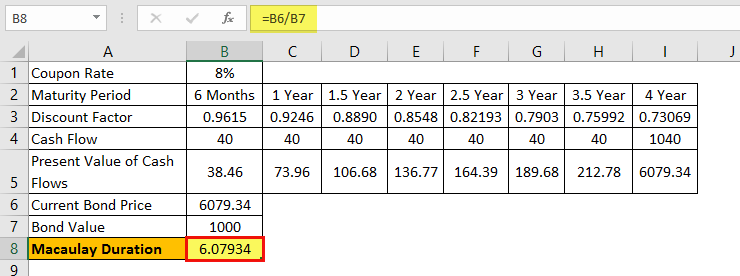

In the world of bond investment, understanding duration is essential for assessing bond sensitivity to interest rate changes. Duration measures the risk associated with interest rate fluctuations and helps investors make informed decisions. Macaulay Duration, named after economist Frederick Macaulay, is a fundamental measure for this task. It represents the weighted average time to receive a bond's cash flows, providing a crucial indicator of how a bond's price might shift when interest rates change.

This article will guide you through using Excel to calculate Macaulay Duration for zero-coupon bonds, which simplifies the process due to the absence of interim cash flows. A zero-coupon bond pays all its interest and principal at maturity, making its Macaulay Duration straightforwardly equal to the time until its maturity. By focusing on this bond type, the calculation process becomes less complex and a valuable starting point for more advanced bond analysis.



Algorithmic trading applications can significantly benefit from mastering Macaulay Duration. In algorithm-driven environments, being able to quickly adapt and react to interest rate movements is critical. By understanding how interest rate fluctuations affect bond prices through Macaulay Duration, traders can better predict and strategize for market changes. Whether you're a novice or a seasoned investor, mastering this technique in Excel can enhance your investment strategies. Excel provides the flexibility and computational efficiency necessary to perform these calculations accurately and promptly, offering traders and investors an edge in the fast-paced financial market.

Overall, proficiency in calculating and interpreting Macaulay Duration within Excel is invaluable for anyone looking to refine their bond investment approach and align their strategies with the changing tides of interest rates. Through structured practice and application of these techniques, investors can better manage their portfolios and optimize their returns.

## Table of Contents

## Understanding Macaulay Duration

Macaulay Duration is a fundamental financial metric that measures the weighted average time until a bondholder receives the bond's cash flows. It provides crucial insights into how a bond's price is likely to react to changes in interest rates. This sensitivity to interest rate fluctuations is vital for investors who seek to assess and manage the interest rate risk associated with bond portfolios.

For zero-coupon bonds, the calculation of Macaulay Duration is particularly straightforward. Since a zero-coupon bond does not provide any interim cash flows before maturity, its Macaulay Duration equals the bond's time to maturity. This is because the bondholder receives a single, lump-sum cash flow at the end of the bond's life. Therefore, the formula for Macaulay Duration $D_M$ of a zero-coupon bond simplifies to:

$$
D_M = T
$$

where $T$ represents the time to maturity. 

Macaulay Duration differs from modified duration, which incorporates yield changes in its assessment. While both durations offer insights into a bond's [interest rate](/wiki/interest-rate-trading-strategies) risk, modified duration adjusts Macaulay Duration by taking into account changes in yield to maturity. In contrast, Macaulay Duration focuses purely on the time-weighted cash flows, providing a measure of the bond's average lifespan from a cash flow perspective.

In a broader context, understanding Macaulay Duration enables investors to quantify and compare the interest rate sensitivity of different bonds. Investors can make informed decisions and construct portfolios that align with their risk tolerance and market outlook by assessing the impact of interest rate changes on bond prices. This understanding is crucial for both individual and institutional investors aiming to optimize their bond investment strategies.

## Setting Up Excel for Duration Calculation

Proper data arrangement in Excel is crucial for calculating Macaulay Duration effectively. This process is streamlined by clearly organizing the essential inputs, which include the coupon rate, yield, time to maturity, and face value. Each of these data points should be placed in separate columns to facilitate accuracy and ease of reference during calculations.

Once the data is organized, Excel's financial functions can be utilized to compute the present value of cash flows, an essential step in the duration calculation. For a zero-coupon bond, the present value is primarily dependent on the face value, yield, and time to maturity. The formula for the present value (PV) of a zero-coupon bond in Excel can be expressed as:

$$
PV = \frac{\text{Face Value}}{(1 + \text{Yield})^\text{Time to Maturity}}
$$

In an Excel spreadsheet, assuming the face value is in cell A2, the yield in B2, and the time to maturity in C2, the formula entered would be:

```
= A2 / (1 + B2)^C2
```

This calculation must be performed for each cash flow component when dealing with bonds that have periodic coupon payments. However, for zero-coupon bonds, this step is simplified as the bond does not provide periodic payments.

The setup as described ensures clarity and precision in bond analysis by allowing the investor to directly and accurately calculate the required components. It is beneficial to label each column clearly, ensuring that calculations are straightforward and verifiable. The structure supports rapid adjustments and updates, essential for dynamic market environments where yield rates can change. 

By setting up Excel in this manner, investors are prepared not only to calculate the Macaulay Duration but also to incorporate these calculations into broader bond pricing strategies, improving their ability to assess interest rate risk efficiently.

## Step-by-Step Calculation of Macaulay Duration in Excel

To calculate the Macaulay Duration for zero-coupon bonds in Excel, it's essential to follow a structured approach that leverages Excel's financial functions for precision and efficiency.

1. **Calculate the Present Value of Each Cash Flow**:
   - Use Excel's `PV` function to determine the present value of each cash flow. For zero-coupon bonds, there is only one cash flow at maturity, which is the face value of the bond. The formula for present value is:
$$
     \text{PV} = \frac{\text{FV}}{(1 + r)^n}

$$

     Here, $\text{FV}$ is the face value, $r$ is the yield (expressed as a decimal), and $n$ is the time to maturity in years. In Excel, this can be implemented as:

     ```
     =PV(yield, maturity, 0, -face_value)
     ```

2. **Determine the Weight of Each Cash Flow**:
   - Since there is a single cash flow at maturity for zero-coupon bonds, its present value is also the total present value of all cash flows. Thus, the weight of this cash flow is 1.
$$
     \text{Weight} = \frac{\text{PV}}{\text{Total PV of all cash flows}} = 1

$$

3. **Multiply Each Weight by the Respective Time Period**:
   - Multiply the weight by the time period to obtain the weighted time. For zero-coupon bonds, this simplifies to:
$$
     \text{Weighted Time} = \text{Weight} \times \text{Time to Maturity}

$$

     Since the weight is 1 and the time to maturity is $n$:
$$
     \text{Weighted Time} = n

$$

4. **Sum the Weighted Periods to Calculate Macaulay Duration**:
   - For zero-coupon bonds, since there is only one weighted time period, the Macaulay Duration equals the time to maturity, $n$. In Excel, this can be directly represented by the maturity input for zero-coupon bonds.

By meticulously adhering to these steps, one can utilize Excel to calculate the Macaulay Duration effectively, enabling an understanding of the bond's sensitivity to interest rate changes in a straightforward and computationally efficient manner.

## Importance of Macaulay Duration in Algorithmic Trading

Macaulay Duration is a key metric for bond investors and algorithmic traders that helps in assessing the sensitivity of bond prices to changes in interest rates. This measure, by estimating the weighted average time to receive the bond's cash flows, offers crucial insights for strategies targeting interest rate movements. As interest rates fluctuate, the Macaulay Duration provides a guide to how much a bond's price might change in response, thereby aiding in the development of interest rate-focused trading strategies. 

In [algorithmic trading](/wiki/algorithmic-trading), the quick adaptability of models to new data is essential. Excel's robust computational capabilities make it a preferred tool for traders looking to integrate Macaulay Duration into their strategies. Excel can swiftly update calculations, allowing traders to respond to interest rate shifts promptly. By recalculating the Macaulay Duration with changing yields or other market inputs, traders can continuously refine their strategies to maintain an edge in fast-paced markets.

A comprehensive approach that includes both Macaulay and modified durations is advantageous for algorithmic trading models. While Macaulay Duration focuses solely on the time aspect of cash flows, modified duration incorporates changes in yield, providing a more nuanced picture of interest rate risk. This dual understanding helps traders develop strategies that are both reactive to immediate interest rate changes and predictive of longer-term trends. 

Understanding Macaulay Duration in conjunction with modified duration allows algorithmic models to [factor](/wiki/factor-investing) in the expected price [volatility](/wiki/volatility-trading-strategies) due to interest rate changes, refining the accuracy of predictive models. This dual focus supports more robust trading strategies that can better manage the complexities of interest rate risks, ultimately enhancing trading performance in a dynamic financial environment.

## Advanced Applications and Considerations

Combining Macaulay duration with modified duration provides investors with a deeper understanding of bond market risks. While Macaulay duration assesses the time-weighted average to receive bond cash flows, modified duration measures the sensitivity of a bond's price to changes in interest rates. By analyzing both, investors gain insight into both the timing of cash flows and how those cash flows might be affected by interest rate fluctuations.

Excel's Visual Basic for Applications (VBA) can significantly enhance automation in bond duration calculations, allowing for efficient trading strategies. With VBA, users can automate repetitive tasks, which is crucial for quickly updating financial models as market conditions shift. For instance, a VBA script can be devised to automatically recalculate Macaulay and modified durations across a portfolio whenever input values, such as interest rates or bond maturities, change. Here is a simple example of how one might set up a VBA macro for automatically recalculating a bond's Macaulay duration:

```vba
Sub CalculateMacaulayDuration()
    Dim FaceValue As Double
    Dim YieldRate As Double
    Dim Maturity As Double
    Dim PresentValue As Double

    FaceValue = Range("B1").Value
    YieldRate = Range("B2").Value
    Maturity = Range("B3").Value

    ' Calculate Present Value of Bond
    PresentValue = FaceValue / (1 + YieldRate) ^ Maturity

    ' Calculate and Display Macaulay Duration
    Range("B4").Value = Maturity * (PresentValue / FaceValue)
End Sub
```

Regular updates and scenario analysis are essential to ensure trading strategies remain robust in dynamic markets. Market conditions can change rapidly, affecting bond prices and their associated durations. To mitigate such risks, scenario analysis should be part of any investment strategy. This involves assessing how different scenarios, like interest rate shifts or changes in economic outlook, might impact bond prices and durations. By using spreadsheet-based simulations, investors can model these conditions and adjust their strategies accordingly.

In conclusion, leveraging both Macaulay and modified durations alongside Excel's VBA capabilities and proactive scenario analysis empowers investors to construct resilient trading strategies. This approach accommodates the complexity of modern financial markets, delivering insights into both the timing of cash flows and interest rate sensitivities to strategically manage bond portfolios.

## Conclusion

Mastering the calculation of Macaulay Duration in Excel is essential for investors seeking to comprehend how bond prices react to interest rate fluctuations. Excel serves as a powerful tool that improves both the accuracy and efficiency of these calculations. By automating processes and handling large datasets, Excel enables investors to perform quick and sophisticated analyses essential for developing robust investment strategies.

As financial markets continue to evolve and grow more complex, staying informed about interest rate risks becomes increasingly vital. Proficiency in using Excel for tasks such as calculating Macaulay Duration provides investors with a strategic edge. This edge lies in the ability to quickly adapt to changing market conditions and make informed decisions based on precise bond sensitivity analyses. By integrating these advanced Excel techniques, investors can enhance the consistency and reliability of their investment strategies, ultimately contributing to improved financial outcomes.

## References & Further Reading

[1]: Macaulay, F.R. (1938). "Some theoretical problems suggested by the movements of interest rates, bond yields, and stock prices in the United States since 1856." National Bureau of Economic Research. Available at: [NBER](https://archive.org/details/sometheoreticalp0000maca)

[2]: Fabozzi, F.J. (2007). "Bond Markets, Analysis, and Strategies" (7th Edition). Pearson Education.

[3]: ["Fixed Income Analysis"](https://en.wikipedia.org/wiki/Fixed_income_analysis) (CFA Institute Investment Series), by Barbara S. Petitt and Jerald E. Pinto

[4]: Hull, J.C. (2018). "Options, Futures, and Other Derivatives" (10th Edition). Pearson Education.

[5]: ["Principles of Financial Engineering"](https://www.sciencedirect.com/book/9780123735744/principles-of-financial-engineering) by Robert L. Nezar Aly

[6]: ["Excel Modeling in Investments"](https://www.pearson.com/en-us/subject-catalog/p/excel-modeling-in-investments/P200000005923/9780205987245) (5th Edition) by Craig W. Holden

[7]: Dalquist, J.R., & Harris, R.S. (1994). “Duration and Convexity: A Tutorial." Financial Analysts Journal, 50(3), pages 46-52. Available via JSTOR: [JSTOR Link](https://www.cfainstitute.org/sites/default/files/-/media/documents/book/rf-publication/2003/rf-v2003-n3-3924-pdf.pdf)