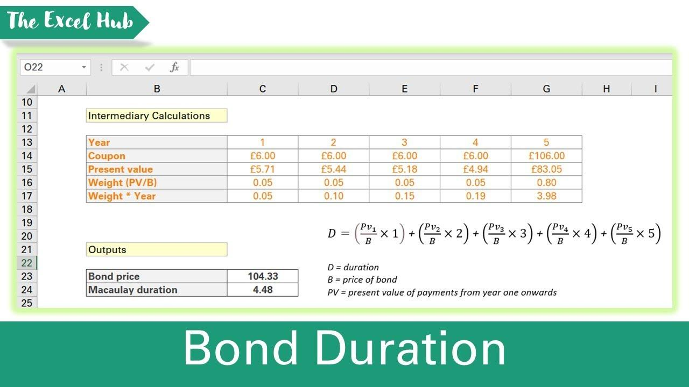

## Table of Contents

## What is a zero-coupon bond?

A zero-coupon bond is a type of bond that doesn't pay interest during its term. Instead, it is sold at a discount and then redeemed for its full face value when it matures. For example, you might buy a zero-coupon bond for $800, but when it matures, you get $1,000. The difference between what you paid and what you get at the end is your earnings.

These bonds are popular because they are simple and predictable. Since there are no interest payments along the way, you know exactly how much money you will get at the end. They are often used for long-term savings goals, like saving for a child's college education. However, because you don't get any money until the bond matures, they can be riskier if you need money sooner.

## What is Macaulay Duration?

Macaulay Duration is a way to measure how long it takes for the price of a bond to be repaid by its cash flows. It's named after Frederick Macaulay, who came up with the idea. Think of it like this: if you buy a bond, you get money back over time through interest payments and the final payment when the bond matures. Macaulay Duration tells you the average time you have to wait to get all that money back.

This measure is useful for investors because it helps them understand how sensitive a bond's price is to changes in interest rates. If interest rates go up, bond prices usually go down, and the longer the Macaulay Duration, the more the bond's price will change. So, if you're trying to decide which bonds to buy, knowing the Macaulay Duration can help you pick ones that fit your plans and how much risk you're willing to take.

## Why is Macaulay Duration important for zero-coupon bonds?

Macaulay Duration is especially important for zero-coupon bonds because these bonds don't pay any interest until they mature. For a zero-coupon bond, the Macaulay Duration is simply the time until the bond matures. This is because the only cash flow you get from a zero-coupon bond is the face value at the end, so the average time you wait to get your money back is the full term of the bond.

Understanding the Macaulay Duration helps investors know how sensitive the price of a zero-coupon bond is to changes in interest rates. Since zero-coupon bonds have a longer duration compared to bonds that pay interest regularly, their prices can change a lot if interest rates go up or down. This makes Macaulay Duration a key tool for anyone investing in zero-coupon bonds, as it helps them manage the risk of their investment.

## How do you calculate the Macaulay Duration of a zero-coupon bond?

Calculating the Macaulay Duration for a zero-coupon bond is pretty straightforward. Since zero-coupon bonds don't pay any interest until they mature, the only cash flow you get is the face value of the bond at the end. Because of this, the Macaulay Duration for a zero-coupon bond is simply the time until the bond matures. If you buy a zero-coupon bond that matures in 10 years, the Macaulay Duration is 10 years.

This simplicity makes Macaulay Duration a useful tool for zero-coupon bond investors. It tells you how long you have to wait to get your money back, which is the same as the bond's term. Knowing this helps you understand how much the bond's price might change if interest rates go up or down. The longer the duration, the more sensitive the bond's price is to interest rate changes.

## What are the basic steps to use Excel for financial calculations?

Using Excel for financial calculations is easy once you know the basics. Start by opening Excel and entering your data into cells. For example, if you're calculating the future value of an investment, you might put the initial amount in one cell, the interest rate in another, and the number of periods in a third. Then, you can use Excel's built-in functions to do the math. For instance, the FV function can calculate the future value of an investment. Just type "=FV(rate, nper, pmt, [pv], [type])" into a cell, replacing the terms with the cell references or numbers you entered.

After setting up your formula, Excel will show you the result right away. You can change the numbers in your cells to see how different values affect the outcome. This is great for trying out different scenarios, like seeing how changing the interest rate might change your investment's future value. If you need to do more complex calculations, you can use other functions like PMT for loan payments or NPV for net present value. Excel also lets you create charts and graphs to help you see your financial data more clearly.

## How do you set up an Excel spreadsheet to calculate the Macaulay Duration of a zero-coupon bond?

To set up an Excel spreadsheet to calculate the Macaulay Duration of a zero-coupon bond, start by opening a new Excel workbook. In one cell, enter the time to maturity of the bond in years. For example, if the bond matures in 10 years, you might put "10" in cell A1. Since the Macaulay Duration of a zero-coupon bond is simply the time until it matures, you don't need any other data. In another cell, say B1, you can type a simple formula to display the Macaulay Duration. Just type "=A1" in cell B1, and Excel will show the number 10, which is the Macaulay Duration of your zero-coupon bond.

This setup is straightforward because zero-coupon bonds only have one cash flow at maturity, so the Macaulay Duration is the same as the bond's term. By using this method, you can quickly see how long you have to wait to get your money back from the bond. If you want to try different scenarios, you can change the number in cell A1 to see how the Macaulay Duration changes. This can help you understand how sensitive the bond's price might be to changes in interest rates.

## What Excel functions are necessary for calculating Macaulay Duration?

To calculate the Macaulay Duration for a zero-coupon bond in Excel, you only need to use a simple cell reference. Since the Macaulay Duration of a zero-coupon bond is the same as the time until it matures, you can just enter the bond's term in one cell, say A1. Then, in another cell, like B1, you can type "=A1" to show the Macaulay Duration. This is all you need because zero-coupon bonds don't have any interest payments, so the only cash flow is at the end of the bond's term.

For bonds that do pay interest, calculating Macaulay Duration in Excel is a bit more complicated. You'll need to use a combination of functions like NPV (Net Present Value) to find the present value of each cash flow, and then use those values to calculate the weighted average time to each cash flow. You can use a formula like "=SUMPRODUCT(times * cash_flows / NPV(yield, cash_flows))" where "times" is an array of the times to each cash flow, "cash_flows" is an array of the cash flows, and "yield" is the bond's yield. This formula helps you find the average time it takes to get all the money back from the bond, which is the Macaulay Duration.

## How does the time to maturity affect the Macaulay Duration of a zero-coupon bond?

The time to maturity directly determines the Macaulay Duration of a zero-coupon bond. Since zero-coupon bonds don't pay any interest until they mature, the only cash flow you get is the face value at the end. This means the Macaulay Duration is simply the same as the time until the bond matures. So, if you buy a zero-coupon bond that matures in 10 years, the Macaulay Duration is 10 years. If it matures in 5 years, the Macaulay Duration is 5 years.

Understanding how the time to maturity affects the Macaulay Duration is important because it helps you see how sensitive the bond's price is to changes in interest rates. The longer the time to maturity, the longer the Macaulay Duration, and the more the bond's price will change if interest rates go up or down. This makes zero-coupon bonds with longer maturities riskier if interest rates are expected to change a lot. So, when you're thinking about buying a zero-coupon bond, knowing the time to maturity can help you understand how much risk you're taking on.

## Can you explain the formula used in Excel to calculate Macaulay Duration for zero-coupon bonds?

Calculating the Macaulay Duration for a zero-coupon bond in Excel is really easy. You just need to know the time until the bond matures. Let's say you have a zero-coupon bond that matures in 10 years. You would enter "10" in a cell, like A1. Then, in another cell, like B1, you type "=A1". This simple formula tells Excel to show the number in cell A1, which is the time until the bond matures. That number is the Macaulay Duration because zero-coupon bonds don't pay any interest until they mature, so the only cash flow you get is at the end.

This setup is helpful because it shows you how long you have to wait to get your money back from the bond. The Macaulay Duration is important because it helps you understand how much the bond's price might change if interest rates go up or down. The longer the time to maturity, the longer the Macaulay Duration, and the more sensitive the bond's price is to interest rate changes. So, by using Excel to calculate the Macaulay Duration, you can make better decisions about which zero-coupon bonds to buy based on how long you're willing to wait and how much risk you want to take.

## What are common mistakes to avoid when calculating Macaulay Duration in Excel?

When calculating Macaulay Duration in Excel, one common mistake is forgetting that for zero-coupon bonds, the Macaulay Duration is simply the time until the bond matures. Some people might try to use complex formulas that are meant for bonds with regular interest payments, which isn't necessary for zero-coupon bonds. Just entering the bond's term in a cell and referencing it in another cell is all you need.

Another mistake is not understanding how Excel handles dates and periods. If you're calculating Macaulay Duration for bonds with interest payments, you need to make sure you're using the right time periods in your calculations. Mixing up years, months, or days can lead to wrong results. Always double-check your time units to make sure they match the bond's terms.

## How can you verify the accuracy of your Macaulay Duration calculation in Excel?

To check if your Macaulay Duration calculation in Excel is right, start by making sure you understand what Macaulay Duration means. For a zero-coupon bond, it's just the time until the bond matures. So, if you entered the bond's term correctly in a cell and used a simple formula like "=A1" to show it in another cell, your calculation should be accurate. Just compare the number in your result cell to the bond's actual term to make sure they match.

If you're working with bonds that pay interest, verifying the Macaulay Duration can be trickier. You'll need to use a more complex formula that involves the bond's cash flows and yield. To check your work, try changing the bond's yield or cash flows slightly and see if the Macaulay Duration changes in a way that makes sense. You can also use online calculators or financial software to compare your results. If your numbers are close to what these tools show, you're probably on the right track.

## What advanced Excel techniques can enhance the calculation of Macaulay Duration for zero-coupon bonds?

To make calculating Macaulay Duration for zero-coupon bonds easier in Excel, you can use named ranges. Instead of just putting the bond's term in a cell like A1, you can give that cell a name like "Maturity." Then, when you type "=Maturity" in another cell, Excel knows to show the number in the cell you named "Maturity." This makes your spreadsheet clearer and easier to understand, especially if you're working with a lot of data.

Another useful technique is to use Excel's data validation feature. You can set up the cell where you enter the bond's term to only accept numbers that make sense for your situation. For example, if you're only dealing with bonds that mature in 1 to 30 years, you can set the cell to only allow numbers in that range. This helps prevent mistakes and keeps your calculations accurate.

## What is Macaulay Duration and how is it understood?

Macaulay Duration is a fundamental financial metric that measures the weighted average time until a bondholder receives the bond's cash flows. It provides crucial insights into how a bond's price is likely to react to changes in interest rates. This sensitivity to interest rate fluctuations is vital for investors who seek to assess and manage the interest rate risk associated with bond portfolios.

For zero-coupon bonds, the calculation of Macaulay Duration is particularly straightforward. Since a zero-coupon bond does not provide any interim cash flows before maturity, its Macaulay Duration equals the bond's time to maturity. This is because the bondholder receives a single, lump-sum cash flow at the end of the bond's life. Therefore, the formula for Macaulay Duration $D_M$ of a zero-coupon bond simplifies to:

$$
D_M = T
$$

where $T$ represents the time to maturity. 

Macaulay Duration differs from modified duration, which incorporates yield changes in its assessment. While both durations offer insights into a bond's [interest rate](/wiki/interest-rate-trading-strategies) risk, modified duration adjusts Macaulay Duration by taking into account changes in yield to maturity. In contrast, Macaulay Duration focuses purely on the time-weighted cash flows, providing a measure of the bond's average lifespan from a cash flow perspective.

In a broader context, understanding Macaulay Duration enables investors to quantify and compare the interest rate sensitivity of different bonds. Investors can make informed decisions and construct portfolios that align with their risk tolerance and market outlook by assessing the impact of interest rate changes on bond prices. This understanding is crucial for both individual and institutional investors aiming to optimize their bond investment strategies.

## How do you set up Excel for duration calculation?

Proper data arrangement in Excel is crucial for calculating Macaulay Duration effectively. This process is streamlined by clearly organizing the essential inputs, which include the coupon rate, yield, time to maturity, and face value. Each of these data points should be placed in separate columns to facilitate accuracy and ease of reference during calculations.

Once the data is organized, Excel's financial functions can be utilized to compute the present value of cash flows, an essential step in the duration calculation. For a zero-coupon bond, the present value is primarily dependent on the face value, yield, and time to maturity. The formula for the present value (PV) of a zero-coupon bond in Excel can be expressed as:

$$
PV = \frac{\text{Face Value}}{(1 + \text{Yield})^\text{Time to Maturity}}
$$

In an Excel spreadsheet, assuming the face value is in cell A2, the yield in B2, and the time to maturity in C2, the formula entered would be:

```
= A2 / (1 + B2)^C2
```

This calculation must be performed for each cash flow component when dealing with bonds that have periodic coupon payments. However, for zero-coupon bonds, this step is simplified as the bond does not provide periodic payments.

The setup as described ensures clarity and precision in bond analysis by allowing the investor to directly and accurately calculate the required components. It is beneficial to label each column clearly, ensuring that calculations are straightforward and verifiable. The structure supports rapid adjustments and updates, essential for dynamic market environments where yield rates can change. 

By setting up Excel in this manner, investors are prepared not only to calculate the Macaulay Duration but also to incorporate these calculations into broader bond pricing strategies, improving their ability to assess interest rate risk efficiently.

## How do you perform a step-by-step calculation of Macaulay Duration in Excel?

To calculate the Macaulay Duration for zero-coupon bonds in Excel, it's essential to follow a structured approach that leverages Excel's financial functions for precision and efficiency.

1. **Calculate the Present Value of Each Cash Flow**:
   - Use Excel's `PV` function to determine the present value of each cash flow. For zero-coupon bonds, there is only one cash flow at maturity, which is the face value of the bond. The formula for present value is:
$$
     \text{PV} = \frac{\text{FV}}{(1 + r)^n}

$$

     Here, $\text{FV}$ is the face value, $r$ is the yield (expressed as a decimal), and $n$ is the time to maturity in years. In Excel, this can be implemented as:

     ```
     =PV(yield, maturity, 0, -face_value)
     ```

2. **Determine the Weight of Each Cash Flow**:
   - Since there is a single cash flow at maturity for zero-coupon bonds, its present value is also the total present value of all cash flows. Thus, the weight of this cash flow is 1.
$$
     \text{Weight} = \frac{\text{PV}}{\text{Total PV of all cash flows}} = 1

$$

3. **Multiply Each Weight by the Respective Time Period**:
   - Multiply the weight by the time period to obtain the weighted time. For zero-coupon bonds, this simplifies to:
$$
     \text{Weighted Time} = \text{Weight} \times \text{Time to Maturity}

$$

     Since the weight is 1 and the time to maturity is $n$:
$$
     \text{Weighted Time} = n

$$

4. **Sum the Weighted Periods to Calculate Macaulay Duration**:
   - For zero-coupon bonds, since there is only one weighted time period, the Macaulay Duration equals the time to maturity, $n$. In Excel, this can be directly represented by the maturity input for zero-coupon bonds.

By meticulously adhering to these steps, one can utilize Excel to calculate the Macaulay Duration effectively, enabling an understanding of the bond's sensitivity to interest rate changes in a straightforward and computationally efficient manner.

## References & Further Reading

[1]: Macaulay, F.R. (1938). "Some theoretical problems suggested by the movements of interest rates, bond yields, and stock prices in the United States since 1856." National Bureau of Economic Research. Available at: [NBER](https://archive.org/details/sometheoreticalp0000maca)

[2]: Fabozzi, F.J. (2007). "Bond Markets, Analysis, and Strategies" (7th Edition). Pearson Education.

[3]: ["Fixed Income Analysis"](https://en.wikipedia.org/wiki/Fixed_income_analysis) (CFA Institute Investment Series), by Barbara S. Petitt and Jerald E. Pinto

[4]: Hull, J.C. (2018). "Options, Futures, and Other Derivatives" (10th Edition). Pearson Education.

[5]: ["Principles of Financial Engineering"](https://www.sciencedirect.com/book/9780123735744/principles-of-financial-engineering) by Robert L. Nezar Aly

[6]: ["Excel Modeling in Investments"](https://www.pearson.com/en-us/subject-catalog/p/excel-modeling-in-investments/P200000005923/9780205987245) (5th Edition) by Craig W. Holden

[7]: Dalquist, J.R., & Harris, R.S. (1994). “Duration and Convexity: A Tutorial." Financial Analysts Journal, 50(3), pages 46-52. Available via JSTOR: [JSTOR Link](https://www.cfainstitute.org/sites/default/files/-/media/documents/book/rf-publication/2003/rf-v2003-n3-3924-pdf.pdf)