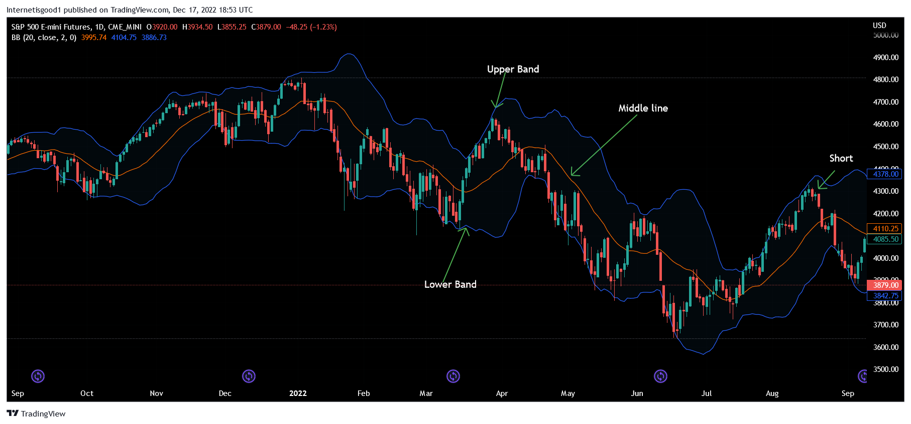

In the rapidly evolving landscape of algorithmic trading, the integration of technical indicators has become crucial in enhancing predictive capabilities and improving trading decisions. Among the myriad of indicators available, Bollinger Bands and the Moving Average Convergence Divergence (MACD) have gained popularity due to their complementary characteristics and effectiveness in various market conditions.

Bollinger Bands, developed by John Bollinger, serve as a volatility indicator that consists of a simple moving average (SMA) flanked by two standard deviation lines. These bands adjust dynamically to market volatility, providing traders with insights into potential overbought or oversold conditions. The primary utility of Bollinger Bands lies in their ability to signal potential breakout or mean-reversion opportunities, integral for decision-making processes in trading strategies.



The MACD, a momentum oscillator, offers a nuanced perspective by analyzing trend strength and direction. It is derived from the difference between two exponential moving averages (EMAs) and is accompanied by a signal line, which is itself an EMA of the MACD line. This configuration helps identify trends through crossovers, divergences, and histogram patterns, enabling traders to pinpoint potential buying or selling opportunities within the market.

When combined, Bollinger Bands and MACD deliver a comprehensive view of market trends, balancing volatility measures with momentum insights. This synergy enhances the capability to develop robust trading strategies, facilitating both trend-following and mean-reversion approaches. The combination empowers traders to capitalize on confirmed signals, reducing noise and increasing the likelihood of successful trades.

Moreover, the systematic backtesting of these combined strategies is imperative to validate their effectiveness. By simulating historical market scenarios, traders can assess key performance metrics and refine their strategies before implementation in live markets, thus mitigating risk and enhancing profitability.

This article will explore the calculation methodologies for Bollinger Bands and MACD, their application in trading strategies, and the significant benefits derived from their combination. Additionally, a focus on backtesting these strategies will highlight their efficacy and guide traders in the optimization process for improved trading outcomes.

## Table of Contents

## Understanding Bollinger Bands

Bollinger Bands, developed by John Bollinger in the 1980s, are a type of [volatility](/wiki/volatility-trading-strategies) indicator that traders use to assess market conditions and potential price movements. These bands consist of three lines: a middle line, which is typically a simple moving average (SMA), and two outer bands that are standard deviations above and below the SMA. The essential formula for Bollinger Bands is:

1. **Middle Band**: $\text{SMA}(n)$  
   Where $n$ is the number of periods.

2. **Upper Band**: $\text{SMA}(n) + k \times \text{Standard Deviation}(n)$  

3. **Lower Band**: $\text{SMA}(n) - k \times \text{Standard Deviation}(n)$  

In these formulas, $k$ is a parameter that traders typically set to value of 2, which is a standard setting that accounts for approximately 95% of price action if prices are normally distributed.

Bollinger Bands dynamically adjust themselves based on market volatility. When the market is quiet, the bands contract, and when it is volatile, the bands expand. This behavior provides traders with valuable insights into the market's overbought or oversold conditions, helping identify potential [breakout](/wiki/breakout-trading) (when prices move beyond the bands) or mean-reversion opportunities (when prices revert to the mean or middle band).

### Calculating Bollinger Bands

To calculate Bollinger Bands using Python, one can utilize libraries like Pandas and NumPy to handle time series data and perform statistical calculations. Here’s a basic example of how you might implement Bollinger Bands:

```python
import pandas as pd
import numpy as np

# Assuming df is a DataFrame containing 'Close' prices
def bollinger_bands(df, n=20, k=2):
    # Calculate the Simple Moving Average (SMA)
    df['SMA'] = df['Close'].rolling(window=n).mean()

    # Calculate standard deviation
    df['std_dev'] = df['Close'].rolling(window=n).std()

    # Calculate upper and lower bands
    df['Upper Band'] = df['SMA'] + (k * df['std_dev'])
    df['Lower Band'] = df['SMA'] - (k * df['std_dev'])

    return df

# Example usage:
# df = pd.read_csv('market_data.csv')  # Assuming your data is in this CSV
# bollinger_bands_df = bollinger_bands(df)
```

### Interpreting Bollinger Band Signals

Traders use Bollinger Bands to observe the relationship between price and the bands. Significant breakthroughs or tightening of the bands can signal upcoming price action:

- **Breakouts**: When the price moves outside the Bollinger Bands, traders often view this as a continuation of the current trend. For instance, a price breaking above the upper band might suggest that the market is overbought, and a reversal could be imminent after continued upward momentum.

- **Mean Reversion**: When prices touch the outer bands, they often tend to return towards the middle SMA, which can indicate a potential reversal or correction to the mean.

### Example in Trading Strategies

One common strategy employs Bollinger Bands to detect mean reversion points. For example, a trader might decide to enter a short position when the price hits the upper band and confirm the signal through other indicators or market observation. Conversely, a long position might be taken when the price reaches the lower band under the assumption that it will revert to the mean.

These strategies illustrate the effectiveness of Bollinger Bands in providing signals for both mean reversion and breakout opportunities. By utilizing Bollinger Bands, traders can gain clearer insights into market volatility and potential price actions.

## Decoding MACD

The Moving Average Convergence Divergence (MACD) is a widely used [momentum](/wiki/momentum) oscillator that helps traders identify the direction and strength of a trend. Originally developed by Gerald Appel in the 1970s, it remains popular due to its simplicity and effectiveness in diverse market conditions.

### Calculation of MACD

The MACD is calculated by subtracting the 26-period Exponential Moving Average (EMA) from the 12-period EMA:

$$

\text{MACD Line} = \text{EMA}_{12} - \text{EMA}_{26} 
$$

This difference is plotted alongside a signal line, which is typically a 9-period EMA of the MACD Line, to create the MACD Indicator:

$$

\text{Signal Line} = \text{EMA}_{9}(\text{MACD Line}) 
$$

A histogram is also often used to represent the difference between the MACD Line and the Signal Line:

$$

\text{MACD Histogram} = \text{MACD Line} - \text{Signal Line} 
$$

### Interpretation of MACD Signals

**Crossovers**: One of the primary signals derived from the MACD is the crossover. A bullish crossover occurs when the MACD Line crosses above the Signal Line, suggesting potential upward momentum. Conversely, a bearish crossover happens when the MACD Line crosses below the Signal Line, indicating potential downward momentum.

**Divergences**: Divergences between the MACD and price movements can also provide insight. A bullish divergence occurs when the price hits a new low while the MACD forms a higher low, potentially signaling weakening bearish momentum. A bearish divergence, on the other hand, occurs when the price reaches a new high while the MACD reaches a lower high, suggesting possible weakening bullish momentum.

**Histogram Analysis**: The MACD histogram further visualizes the convergence or divergence of the MACD Line and Signal Line. A growing histogram indicates increasing momentum in the direction of the MACD Line crossover, whereas a shrinking histogram suggests decreasing momentum.

### Application in Trading

Consider an example using this Python code snippet, which illustrates how to compute the MACD and identify potential trade signals:

```python
import pandas as pd
import numpy as np

def calculate_ema(prices, days):
    return prices.ewm(span=days, adjust=False).mean()

def calculate_macd(prices):
    ema12 = calculate_ema(prices, 12)
    ema26 = calculate_ema(prices, 26)
    macd_line = ema12 - ema26
    signal_line = calculate_ema(macd_line, 9)
    histogram = macd_line - signal_line
    return macd_line, signal_line, histogram

# Sample data
prices = pd.Series([...])  # Replace with actual price data
macd_line, signal_line, histogram = calculate_macd(prices)

# Example of determining trade signals
buy_signals = []
sell_signals = []

for i in range(1, len(prices)):
    if macd_line[i] > signal_line[i] and macd_line[i-1] <= signal_line[i-1]:
        buy_signals.append(i)
    elif macd_line[i] < signal_line[i] and macd_line[i-1] >= signal_line[i-1]:
        sell_signals.append(i)

print("Buy signals at:", buy_signals)
print("Sell signals at:", sell_signals)
```

By analyzing MACD signals such as crossovers and divergences, traders can identify potential entry and [exit](/wiki/exit-strategy) points, harnessing MACD's momentum-tracking capabilities to optimize their trading strategies in various market conditions.

## Bollinger Bands and MACD: A Strategy Synthesis

The combination of Bollinger Bands and the Moving Average Convergence Divergence (MACD) holds significant potential in developing effective trend-following and mean-reversion strategies for [algorithmic trading](/wiki/algorithmic-trading). These strategies rely on the complementary nature of both indicators, providing a robust framework for making informed trading decisions.

In trend-following strategies, traders might consider taking positions when the price breaks above or below the Bollinger Bands, contingent on confirmation from MACD signals. When the price closes above the upper band, it may indicate strong bullish momentum, suggesting a potential buying opportunity if the MACD line is above the signal line. Conversely, if the price falls below the lower band with the MACD line positioned below the signal line, it may signify a bearish trend, prompting a potential selling position. These combined signals help in capturing significant price movements in alignment with the overall market trend.

For mean-reversion strategies, the focus shifts towards entering trades when prices reach extreme levels, as indicated by the outer bands of the Bollinger Bands. These levels suggest potential overbought or oversold conditions. If the price touches or pierces the upper band, and the MACD shows a divergence, indicating a weakening momentum, it may suggest the possibility of a price reversal to the downside, presenting a short-selling opportunity. Conversely, when prices hit the lower band and MACD divergence suggests weakening downward momentum, it could signal a possible reversal upward, offering a buying opportunity.

To illustrate these strategies programmatically, consider the following Python code that uses the `pandas` and `ta-lib` libraries to implement a simple algorithmic strategy employing both indicators:

```python
import pandas as pd
import talib

# Assuming 'data' is a DataFrame containing historical price data with 'close' as the closing price
def bollinger_bands_strategy(data):
    # Calculate Bollinger Bands
    data['upper_band'], data['middle_band'], data['lower_band'] = talib.BBANDS(data['close'], timeperiod=20)

    # Calculate MACD
    data['macd'], data['macd_signal'], _ = talib.MACD(data['close'], fastperiod=12, slowperiod=26, signalperiod=9)

    # Define signal conditions
    buy_condition = (data['close'] > data['upper_band']) & (data['macd'] > data['macd_signal'])
    sell_condition = (data['close'] < data['lower_band']) & (data['macd'] < data['macd_signal'])

    # Generate signals
    data['signal'] = 0
    data.loc[buy_condition, 'signal'] = 1  # Buy signal
    data.loc[sell_condition, 'signal'] = -1  # Sell signal

    return data

# Example usage
# historical_data should have datetime index and 'close' column
# It could be fetched using libraries such as pandas-datareader or yfinance

# enriched_data = bollinger_bands_strategy(historical_data)
```

This snippet outlines a basic framework for executing trades based on trend-following signals derived from Bollinger Bands and MACD. Traders can further refine these signals by testing different parameters or incorporating additional filters to enhance performance. To evaluate these strategies, traders should backtest using historical data, examining key performance metrics to confirm their viability in live trading environments.

## Implementing the Strategy in Algorithmic Trading

To create an algorithmic trading bot that integrates Bollinger Bands and MACD, Python is an efficient and widely-used programming language. This section outlines the essential steps for implementing this strategy, from calculating the indicators to executing trades, and optimizing the algorithm for live trading performance.

### 1. Calculating Bollinger Bands and MACD

#### Bollinger Bands Calculation
Bollinger Bands consist of a simple moving average (SMA) and two standard deviation lines. The standard formulas are:

- Middle Band: $\text{SMA}(N)$
- Upper Band: $\text{SMA}(N) + (K \times \text{Standard Deviation}(N))$
- Lower Band: $\text{SMA}(N) - (K \times \text{Standard Deviation}(N))$

Here, $N$ is the period, usually 20 days, and $K$ is typically set at 2.

```python
import pandas as pd

def calculate_bollinger_bands(data, n=20, k=2):
    data['SMA'] = data['Close'].rolling(window=n).mean()
    data['STD'] = data['Close'].rolling(window=n).std()
    data['Upper Band'] = data['SMA'] + (data['STD'] * k)
    data['Lower Band'] = data['SMA'] - (data['STD'] * k)
    return data
```

#### MACD Calculation
The MACD is calculated using exponential moving averages (EMAs) as follows:

- MACD Line: $\text{EMA}_{12} - \text{EMA}_{26}$
- Signal Line: $\text{EMA}_{9} \text{ of MACD Line}$
- MACD Histogram: $\text{MACD Line} - \text{Signal Line}$

```python
def calculate_macd(data, short_window=12, long_window=26, signal_window=9):
    data['EMA_short'] = data['Close'].ewm(span=short_window, adjust=False).mean()
    data['EMA_long'] = data['Close'].ewm(span=long_window, adjust=False).mean()
    data['MACD'] = data['EMA_short'] - data['EMA_long']
    data['Signal Line'] = data['MACD'].ewm(span=signal_window, adjust=False).mean()
    data['MACD Histogram'] = data['MACD'] - data['Signal Line']
    return data
```

### 2. Setting Up a Data Feed

Python libraries such as `pandas` for data manipulation and APIs like `yfinance` or brokerage APIs can be used to fetch historical and real-time market data. For example, using `yfinance`:

```python
import yfinance as yf

data = yf.download('AAPL', start='2022-01-01', end='2022-12-31')
```

### 3. Executing Trades

Leverage the calculated indicators to define trading conditions. For instance, you might buy when the price crosses below the lower Bollinger Band and the MACD Histogram suggests upward momentum, or sell under opposite conditions.

### 4. Backtesting the Strategy

Apply historical data to test the strategy's performance using libraries like `[backtrader](/wiki/backtrader)` or custom backtest scripts to simulate trades:

```python
import backtrader as bt

# Define the strategy class inheriting from backtrader's Strategy
class BollingerMACDStrategy(bt.Strategy):
    def __init__(self):
        self.macd = bt.indicators.MACD(self.data)
        self.boll = bt.indicators.BollingerBands(self.data)

    def next(self):
        if self.data.close < self.boll.lines.bot and self.macd.macd > self.macd.signal:
            self.buy()  # Signal to buy
        elif self.data.close > self.boll.lines.top and self.macd.macd < self.macd.signal:
            self.sell()  # Signal to sell

# Setting up the backtest sequence
cerebro = bt.Cerebro()
datafeed = bt.feeds.PandasData(dataname=data)
cerebro.adddata(datafeed)
cerebro.addstrategy(BollingerMACDStrategy)
cerebro.run()
```

### 5. Optimizing the Algorithm

Optimization might involve tuning parameters such as the period lengths and deviation multipliers. Use walk-forward optimization methods or libraries like `bt` for efficient strategy optimization.

### Conclusion

Developing an algorithmic trading bot integrating Bollinger Bands and MACD involves several steps, from calculating indicators and setting up data feeds to executing and [backtesting](/wiki/backtesting) trade strategies. The combination of these tools and methods in Python can lead to robust trading strategies validated by historical data, which, when properly optimized, can perform well in live trading.

## Backtesting and Performance Analysis

Backtesting is an essential technique used to evaluate the viability of a trading strategy by simulating it on historical data before it is applied to live markets. It helps traders affirm whether their strategies could have been profitable in the past, allowing for better prediction of future performance.

When backtesting the combined strategy of Bollinger Bands and MACD, traders initially need access to historical market data, which includes price, [volume](/wiki/volume-trading-strategy), and time-stamped information. The key is to ensure that the data set covers a sufficiently long timeframe to account for various market conditions, including trend and consolidation phases.

The first step in backtesting the Bollinger Bands and MACD strategy is to define entry and exit rules. For instance, a trend-following strategy might be coded to enter a long position when the price commits to a breakout above the upper Bollinger Band, confirmed by a MACD crossover indicating upward momentum. Conversely, a mean-reversion strategy would entail entering a trade when the price touches the lower band with MACD divergence suggesting a potential price reversal.

A Python code snippet to implement such backtesting might look like this:

```python
import pandas as pd
import numpy as np
from talib import BBANDS, MACD

# Load historical data
data = pd.read_csv('historical_data.csv')
close = data['Close'].values

# Calculate Bollinger Bands
upper, middle, lower = BBANDS(close, timeperiod=20, nbdevup=2, nbdevdn=2, matype=0)

# Calculate MACD
macd, signal, _ = MACD(close, fastperiod=12, slowperiod=26, signalperiod=9)

# Backtesting logic
positions = []
for i in range(1, len(close)):
    if close[i] > upper[i] and macd[i] > signal[i]:  # Trend-following long entry
        positions.append('Buy')
    elif close[i] < lower[i] and macd[i] < signal[i]:  # Mean-reversion buy entry
        positions.append('Buy')
    else:
        positions.append('Hold')

data['Position'] = positions
```

Once the strategy is coded, assess its performance by analyzing several key metrics:

1. **Trade Frequency**: This indicates how often trades are executed within a given period. A high trade frequency might lead to increased transaction costs, which should be taken into account.

2. **Win Ratio**: Calculated as the percentage of profitable trades out of the total number of trades. It is a fundamental statistic in determining the success rate of the strategy.

3. **Maximum Drawdown**: The largest peak-to-trough decline during the backtesting period. This measures the downside risk and is critical for understanding potential losses.

4. **Profitability**: Overall gains achieved, often measured through metrics such as net profit or return on investment.

After calculating these indicators, the insights gained can initiate changes and improvements. For instance, adjustments might be made to the parameter settings of the indicators (e.g., changing the number of periods in the moving average) based on insights gathered from trading volume or specific market conditions experienced during the backtest period.

This systematic approach ensures that trading strategies are robust and well-tailored to withstand various market anomalies before they are used in live trading environments.

## FAQs and Conclusion

### FAQs and Conclusion

#### FAQs

**1. How do Bollinger Bands and MACD work in different market conditions?**

Bollinger Bands and MACD are versatile tools that can be effective across various market conditions, though their effectiveness may vary based on volatility and trend strength. Bollinger Bands help identify overbought or oversold conditions by analyzing the distance between the bands, which widens during high volatility and contracts in calmer markets. MACD excels in trending markets by revealing momentum shifts through its crossover signals and divergence from price action. It is important to note, however, that both indicators may produce false signals in choppy or sideways markets, necessitating further confirmation or the use of additional indicators.

**2. What are the primary advantages of combining Bollinger Bands and MACD?**

The combination of Bollinger Bands and MACD enhances trading strategies by providing both volatility and momentum insights. While Bollinger Bands focus on price relative to historical volatility, MACD measures momentum. When aligned, these indicators offer a more comprehensive view of market dynamics, improving the reliability of trend-following and mean-reversion strategies. For instance, a MACD crossover confirmed by a price breakout from Bollinger Bands can indicate a strong trend signal, minimizing the risks associated with using a single indicator.

**3. Are there any significant limitations to using Bollinger Bands and MACD?**

While powerful, these indicators are not without limitations. Bollinger Bands may produce numerous false breakout signals in markets lacking clear direction, while MACD might lag in rapidly changing price environments, leading to delayed entries or exits. They are also less effective in non-trending or highly chaotic markets. Traders should employ risk management techniques, such as stop-loss orders, and consider using other tools and indicators to corroborate signals from Bollinger Bands and MACD for more robust decision-making.

#### Conclusion

The synergy between Bollinger Bands and MACD offers traders valuable insights into market conditions and potential price movements, enhancing the efficacy of both trend-following and mean-reversion strategies. While each indicator provides unique benefits, their combined application delivers a more holistic view of market dynamics, potentially leading to improved trading outcomes. However, traders should remain aware of their respective limitations and incorporate additional tools and techniques to validate signals. By exploring and experimenting with these indicators, traders can refine their strategies and adapt to evolving market conditions, ultimately fostering better-informed trading decisions.

For further learning and enhancement of trading strategies, resources such as "Technical Analysis of the Financial Markets" by John J. Murphy and "Bollinger on Bollinger Bands" by John Bollinger can prove invaluable. Additionally, online platforms like Investopedia and TradingView offer extensive educational materials and real-time applications of these indicators in various market scenarios.

## References & Further Reading

[1]: Bollinger, J. (2001). ["Bollinger on Bollinger Bands."](https://www.amazon.com/Bollinger-Bands-John/dp/0071373683) McGraw-Hill.

[2]: Appel, G. (2005). ["Technical Analysis: Power Tools for Active Investors."](https://www.amazon.com/Technical-Analysis-Power-Active-Investors/dp/0132930048) FT Press.

[3]: Murphy, J. J. (1999). ["Technical Analysis of the Financial Markets: A Comprehensive Guide to Trading Methods and Applications."](https://www.amazon.com/Technical-Analysis-Financial-Markets-Comprehensive/dp/0735200661) New York Institute of Finance.

[4]: Pring, M. J. (2002). ["Technical Analysis Explained: The Successful Investor's Guide to Spotting Investment Trends and Turning Points."](https://www.amazon.com/Technical-Analysis-Explained-Fifth-Successful/dp/0071825177) McGraw-Hill.

[5]: Aronson, D. R. (2006). ["Evidence-Based Technical Analysis: Applying the Scientific Method and Statistical Inference to Trading Signals."](https://www.amazon.com/Evidence-Based-Technical-Analysis-Scientific-Statistical/dp/0470008741) Wiley.

[6]: Lopez de Prado, M. (2018). ["Advances in Financial Machine Learning."](https://www.amazon.com/Advances-Financial-Machine-Learning-Marcos/dp/1119482089) Wiley.

[7]: Jansen, S. (2020). ["Machine Learning for Algorithmic Trading: Predictive models to extract signals from market and alternative data for systematic trading strategies with Python."](https://www.amazon.com/Machine-Learning-Algorithmic-Trading-alternative/dp/1839217715) Packt Publishing.

[8]: Chan, E. P. (2009). ["Quantitative Trading: How to Build Your Own Algorithmic Trading Business."](https://github.com/ftvision/quant_trading_echan_book) Wiley.