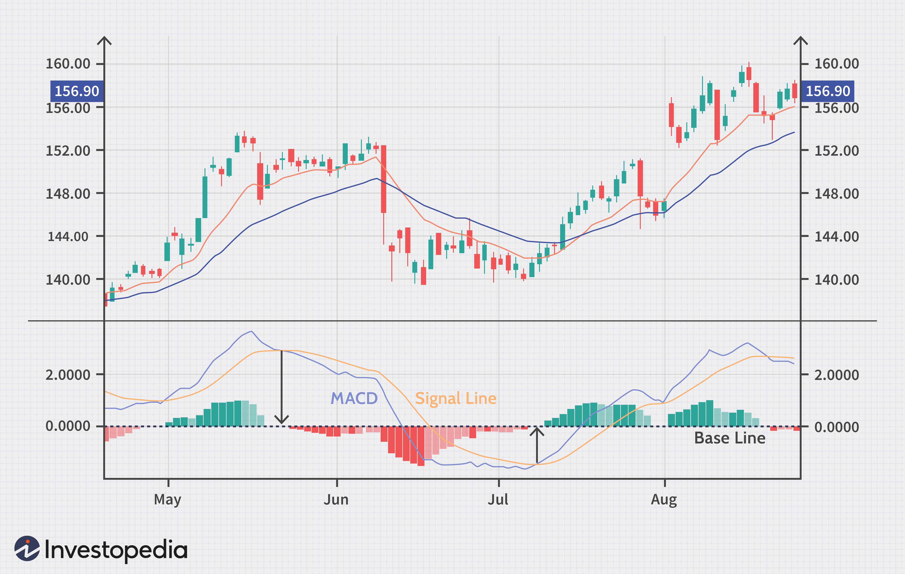

The MACD and RSI strategy is a well-regarded trading method that integrates two pivotal technical indicators: Moving Average Convergence Divergence (MACD) and Relative Strength Index (RSI). These indicators are renowned for their momentum-based analysis capabilities, providing traders with insights into market trends and identifying potential buy and sell signals. The MACD is utilized to analyze the differences between two exponential moving averages (EMAs), typically a 12-day EMA and a 26-day EMA. It is characterized by three components: the MACD line, the signal line, and the histogram, all of which aid in detecting convergence and divergence in market trends.

Conversely, the RSI measures the speed and change of price movements, oscillating on a scale from 0 to 100. It is employed to identify overbought or oversold conditions. An RSI above 70 may suggest an overbought situation, while an RSI below 30 hints at an oversold condition. The harmonious integration of MACD and RSI reinforces the reliability of trading signals, aiding in market momentum comprehension and anticipating potential reversals.



Understanding and leveraging the MACD and RSI strategy enables traders to make informed decisions, possibly enhancing trading success. This strategy, when methodically implemented, can improve the precision of entries and exits. This article examines the details of the MACD and RSI strategy, including its deployment in algorithmic trading, its substantial benefits, and any inherent limitations.

## Table of Contents

## Understanding MACD and RSI Indicators

The Moving Average Convergence Divergence (MACD) indicator is a widely used momentum oscillator designed to analyze the relationship between two moving averages of a security's price. Typically, the MACD uses a 12-day Exponential Moving Average (EMA) and a 26-day EMA to generate the MACD line by subtracting the 26-day EMA from the 12-day EMA. Additionally, a Signal Line, usually a 9-day EMA of the MACD line, is plotted to serve as a trigger for buy or sell signals. The MACD Histogram, which represents the difference between the MACD Line and the Signal Line, visually helps traders assess momentum shifts, convergence, and divergence in the market.

The Relative Strength Index (RSI) is another momentum oscillator that evaluates the speed and change of price movements. Oscillating between a range of 0 to 100, it was developed to identify overbought or oversold conditions in the asset being analyzed. Typically, RSI readings above 70 suggest an overbought market, while readings below 30 indicate an oversold market. This information assists traders in determining potential entry and exit points.

While each indicator provides valuable insights independently, they are often used in tandem to confirm trends and enhance the reliability of trading signals. By utilizing both MACD's convergence and divergence measures alongside RSI's overbought and oversold signals, traders aim to reduce false signals and improve trade accuracy.

## Implementing the MACD and RSI Strategy in Algo Trading

Algorithmic trading, or algo trading, permits the use of automated trading strategies that are based on predefined criteria. It is ideally suited for strategies like the MACD and RSI, which rely on clear, rule-based signals. By programming specific conditions under which trades should be executed, traders can create systematic approaches that mitigate the impact of human emotions and enhance efficiency.

To implement a MACD and RSI strategy in algo trading, you begin by establishing rules that signal when to enter or [exit](/wiki/exit-strategy) a trade. For instance, a basic rule might be to initiate a trade when the MACD line crosses above the signal line, indicating upward [momentum](/wiki/momentum), and the RSI is below 30, suggesting the asset is oversold. Here is a sample Python implementation using the `pandas` library, a popular tool for data manipulation in [algorithmic trading](/wiki/algorithmic-trading):

```python
import pandas as pd

def macd_rsi_strategy(prices, ema_short=12, ema_long=26, signal_period=9, rsi_period=14):
    # Calculate MACD components
    ema_short_series = prices.ewm(span=ema_short, adjust=False).mean()
    ema_long_series = prices.ewm(span=ema_long, adjust=False).mean()
    macd_line = ema_short_series - ema_long_series
    signal_line = macd_line.ewm(span=signal_period, adjust=False).mean()

    # Calculate RSI
    delta = prices.diff()
    gain = (delta.where(delta > 0, 0)).rolling(window=rsi_period).mean()
    loss = (-delta.where(delta < 0, 0)).rolling(window=rsi_period).mean()
    rs = gain / loss
    rsi = 100 - (100 / (1 + rs))

    # Generate trading signals
    buy_signal = (macd_line > signal_line) & (rsi < 30)
    sell_signal = (macd_line < signal_line) & (rsi > 70)

    return buy_signal, sell_signal

# Example usage with a DataFrame 'data' containing price information
# buy_signals, sell_signals = macd_rsi_strategy(data['Close'])
```

Software platforms allow traders to backtest these strategies against historical data, a critical step in refining and improving their effectiveness. Backtesting involves simulating the trading strategy on past market data to evaluate how it would have performed, enabling the adjustment of parameters such as thresholds and time frames.

In this MACD and RSI strategy, the MACD is primarily used to determine the strength and direction of the trend, serving as a momentum indicator. In contrast, the RSI is utilized to time the market with precision, indicating overbought or oversold conditions.

It is crucial to calibrate the parameters according to the specific market conditions and asset classes. For example, the default RSI threshold of 30 for oversold might be adjusted depending on the historical [volatility](/wiki/volatility-trading-strategies) of the given asset. Similarly, the time frames of moving averages (e.g., 12-day EMA, 26-day EMA) might be tailored based on the asset's trading characteristics to optimize the strategy's performance.

These calibrations and the strategy's adaptability are crucial for its successful deployment across varying market conditions, enhancing the ability to capitalize on market trends effectively.

## Backtesting and Performance of the Strategy

Backtesting is an integral part of evaluating the effectiveness and robustness of the MACD and RSI trading strategy. By analyzing historical data, traders can ascertain how the strategy might perform under different market conditions, which is crucial for making informed decisions about its implementation in live trading scenarios.

To conduct a backtest, traders first define their entry and exit criteria based on the interactions between the MACD and RSI indicators. For example, one might establish a buy signal when the MACD line crosses above the signal line, coupled with the RSI moving out of an oversold condition (below 30) into a more neutral territory. Conversely, a sell signal might be triggered when the MACD line crosses below the signal line, and the RSI exits an overbought zone (above 70).

During the [backtesting](/wiki/backtesting) process, several performance metrics are scrutinized to evaluate strategy viability. These include:

1. **Win Rate**: The percentage of trades that result in a profit over the total number of trades executed. A high win rate indicates a well-performing strategy, though it should be balanced with other metrics.

2. **Average Gain and Loss**: Calculating the mean profit or loss across trades gives insight into the potential profitability and risk exposure of the strategy.

$$
\text{Average Gain} = \frac{\sum \text{Profitable Trades}}{\text{Number of Profitable Trades}}
$$

$$
\text{Average Loss} = \frac{\sum \text{Losing Trades}}{\text{Number of Losing Trades}}
$$

3. **Drawdown**: This measures the peak-to-trough decline in equity for the strategy and is essential for understanding the risk involved. A smaller drawdown is typically preferred, as it suggests less risk to the strategy's capital base.

4. **Sharpe Ratio**: Besides raw metrics, the Sharpe Ratio can be employed to assess risk-adjusted returns. Higher values indicate more attractive risk-adjusted performance.

Backtesting also leverages visual tools such as equity curves and profitability graphs to help traders discern patterns in price movements. These visualizations assist in refining entry and exit timing, potentially enhancing the strategy's effectiveness.

Successful backtesting is a pivotal step towards implementing the MACD and RSI strategy in live trading. Confidence in the strategy is bolstered by robust backtesting results, enabling traders to deploy their strategies with greater assurance. However, it is imperative to understand that past performance does not guarantee future results. Thus, continual assessment and adjustment of the strategy are recommended to maintain optimal performance amidst evolving market dynamics.

## Are MACD and RSI a Good Combination?

The combination of the Moving Average Convergence Divergence (MACD) and Relative Strength Index (RSI) indicators is often regarded as a powerful tool in trading, primarily due to the complementary nature of these two momentum-based indicators. Employing both MACD and RSI can provide traders with a more robust confirmation of signals, enhancing the reliability of interpretation when predicting market movements.

The fundamental strength of employing MACD and RSI together lies in their capacity to minimize the likelihood of false signals. While MACD is adept at identifying potential trend changes by analyzing the correlation between two moving averages, RSI evaluates the speed and change of price movements. When both indicators align, they present a more compelling case for potential market behavior. For example, when the MACD indicates a bullish crossover and the RSI moves from an oversold region, the combined signals provide a more convincing argument for a potential upward price movement.

Despite their combined effectiveness, some critics highlight the potential redundancy of using two momentum indicators, suggesting they might offer overlapping insights rather than distinct perspectives. However, when implemented correctly, these indicators can complement each other. The MACD's ability to unveil shifts in trend strength pairs well with RSI's sensitivity to overbought and oversold conditions, offering a broader perspective on the market's momentum and potential reversals.

Moreover, using MACD and RSI together can prevent traders from making hasty decisions based on premature signals. The validation of signals across both indicators allows for more prudent entry and exit points, reducing the probability of reacting to transient market noise. This added layer of confirmation empowers traders to make informed decisions, bolstering their confidence in the trades executed.

In practical terms, confirming signals through both MACD and RSI facilitates a strategic allocation of resources. By ensuring that trades are supported by multiple indicators, traders can optimize their strategies towards creating consistent and sustainable trading outcomes. This harmonious use of MACD and RSI thus serves to improve overall trading efficiency and effectiveness.

## Creating a Trading Strategy Using MACD and RSI

Developing a trading strategy using the combination of Moving Average Convergence Divergence (MACD) and Relative Strength Index (RSI) involves establishing a systematic approach to buying and selling financial instruments. This dual-indicator method harnesses the strengths of both MACD, which identifies changes in trend direction, and RSI, which signals overbought or oversold conditions. Here are the components of a trading strategy using these indicators:

### Strategy Rules for Entry and Exit

1. **Buying Criteria**:
   - Initiate a buy order when the MACD line crosses above the signal line, indicating upward momentum.
   - Concurrently, ensure that the RSI value has recently exited the oversold region (typically below 30), signaling a potential upward reversal in price.

2. **Selling Criteria**:
   - Initiate a sell order when the MACD line crosses below the signal line, suggesting downward momentum.
   - Ensure that the RSI value has recently exited the overbought region (typically above 70), indicating a potential downward reversal in price.

This dual confirmation approach reduces the risk of acting on false signals, as both indicators must align to trigger trades.

### Consideration of Market Conditions

While the MACD and RSI provide valuable insights, they may not always be reliable in certain market conditions, such as during periods of ranging or consolidating markets. It is vital for traders to incorporate additional filters or employ a broader market analysis to avoid false signals during such conditions. For instance, a trader might incorporate moving averages as a trend filter to help validate signals.

### Backtesting and Optimization

Backtesting is paramount in refining this strategy. By running the strategy against historical data, traders can evaluate performance across various market conditions. The following performance metrics can be assessed:

- **Win Rate**: The percentage of successful trades over the total number of trades.
- **Average Gain and Loss**: The average profit from winning trades versus the average loss from losing trades.
- **Maximum Drawdown**: The greatest loss from a peak to a trough during the backtest period.

Python's `pandas` library can facilitate such a backtest:

```python
import pandas as pd

def calculate_macd(data, short_window=12, long_window=26, signal_window=9):
    data['short_ema'] = data['Close'].ewm(span=short_window, min_periods=short_window).mean()
    data['long_ema'] = data['Close'].ewm(span=long_window, min_periods=long_window).mean()
    data['MACD'] = data['short_ema'] - data['long_ema']
    data['Signal'] = data['MACD'].ewm(span=signal_window, min_periods=signal_window).mean()
    return data

def calculate_rsi(data, window=14):
    delta = data['Close'].diff()
    gain = (delta.where(delta > 0, 0.0)).ewm(com=window-1, min_periods=window).mean()
    loss = (-delta.where(delta < 0, 0.0)).ewm(com=window-1, min_periods=window).mean()
    rs = gain / loss
    data['RSI'] = 100 - (100 / (1 + rs))
    return data

# Load market data into a DataFrame named `market_data`
market_data = calculate_macd(calculate_rsi(market_data))

# Generate buy/sell signals based on MACD and RSI
market_data['Buy_Signal'] = ((market_data['MACD'] > market_data['Signal']) & 
                             (market_data['RSI'] < 30)).astype(int)
market_data['Sell_Signal'] = ((market_data['MACD'] < market_data['Signal']) & 
                              (market_data['RSI'] > 70)).astype(int)
```

### Customization for Profitability

This strategy can be adapted to different trading environments and asset classes by tweaking parameters—such as the periods of EMA and RSI thresholds—based on historical data analysis. Traders can also couple these indicators with other technical analysis tools to further enhance decision-making.

Ultimately, a well-customized MACD and RSI strategy presents a structured approach for capitalizing on market trends and reversals, potentially leading to consistent trading profits when carefully deployed and regularly updated.

## Conclusion

The MACD and RSI strategy effectively aids traders in capturing market momentum and potential reversals by combining two complementary technical indicators. Strategic utilization of these indicators enables traders to discern market conditions and make informed decisions. The integration of MACD, which identifies trend and momentum, with RSI, which excels at pinpointing entry and exit points, allows for a comprehensive analysis of price movements. 

Despite its potential, the strategy should not be considered foolproof. It is essential to employ rigorous backtesting to evaluate its historical performance, thereby identifying and mitigating potential shortcomings. This process involves refining parameters and adapting the strategy to different market scenarios. Risk management also plays a critical role, ensuring that adverse market movements do not result in significant losses.

Continual monitoring and adaptability are key components of employing the MACD and RSI strategy successfully. Traders must remain vigilant, adjusting their strategy in response to ever-changing market dynamics. By doing so, the MACD and RSI strategy becomes a valuable tool in a trader's arsenal, facilitating sustained trading success.

## References & Further Reading

[1]: Appel, G. (2005). ["Technical Analysis: Power Tools for Active Investors"](https://www.amazon.com/Technical-Analysis-Power-Active-Investors/dp/0132930048) by Gerald Appel

[2]: Wilder, J. W. (1978). ["New Concepts in Technical Trading Systems"](https://www.amazon.com/New-Concepts-Technical-Trading-Systems/dp/0894590278) by J. Welles Wilder Jr.

[3]: Murphy, J. J. (1999). ["Technical Analysis of the Financial Markets: A Comprehensive Guide to Trading Methods and Applications"](https://www.amazon.com/Technical-Analysis-Financial-Markets-Comprehensive/dp/0735200661) by John J. Murphy

[4]: Pring, M. J. (2002). ["Technical Analysis Explained: The Successful Investor's Guide to Spotting Investment Trends and Turning Points"](https://www.amazon.com/Technical-Analysis-Explained-Fifth-Successful/dp/0071825177) by Martin J. Pring

[5]: Achelis, S. B. (2000). ["Technical Analysis from A to Z"](https://books.google.com/books/about/Technical_Analysis_from_A_to_Z_2nd_Editi.html?id=XuiF-2eWHYUC) by Steven B. Achelis