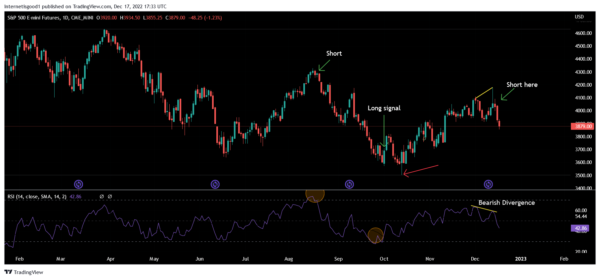

## Table of Contents

## What are MACD and RSI indicators?

The MACD, or Moving Average Convergence Divergence, is a popular tool used in trading to understand the momentum and possible trend changes in a stock or other financial asset. It works by taking the difference between two moving averages, usually a 12-day and a 26-day, and then plots this difference on a chart. A signal line, often a 9-day moving average of the MACD, is added to help traders spot potential buy or sell signals. When the MACD line crosses above the signal line, it's often seen as a bullish sign, suggesting it might be a good time to buy. Conversely, if the MACD line crosses below the signal line, it's viewed as bearish, hinting that it might be time to sell.

The RSI, or Relative Strength Index, is another widely used indicator that helps traders figure out if a stock is overbought or oversold. It measures the speed and change of price movements on a scale from 0 to 100. Typically, an RSI value above 70 indicates that a stock might be overbought and could soon see a price drop, while an RSI below 30 suggests the stock might be oversold and could be due for a price increase. Traders often use these levels to decide when to enter or exit a trade. The RSI can also show divergence, where the price of a stock moves in the opposite direction of the RSI, which can be a sign of a potential trend reversal.

## How do MACD and RSI work in technical analysis?

In technical analysis, the MACD helps traders see the momentum and possible changes in a stock's price trend. It does this by showing the difference between two moving averages, usually a 12-day and a 26-day one. This difference is plotted on a chart, and a signal line, which is often a 9-day moving average of the MACD, is added. When the MACD line crosses above the signal line, it's a sign that the stock might be starting to go up, which could be a good time to buy. If the MACD line crosses below the signal line, it might mean the stock is starting to go down, suggesting it could be time to sell. Traders use these signals to help decide when to make their moves.

The RSI is another tool that helps traders figure out if a stock is overbought or oversold. It looks at how fast the price is changing and puts that on a scale from 0 to 100. If the RSI goes above 70, it means the stock might be overbought and could soon drop in price. If it goes below 30, the stock might be oversold and could be ready for a price increase. Traders use these levels to decide when to buy or sell. The RSI can also show something called divergence, where the stock price moves one way but the RSI moves the other way. This can be a sign that the current trend might be about to change, helping traders make better decisions.

## What are the basic components of the MACD indicator?

The MACD indicator has three main parts that help traders see how a stock is moving. The first part is the MACD line itself, which is made by taking the difference between two moving averages, usually a 12-day and a 26-day one. This line shows the difference between these two averages and helps traders see if the stock's [momentum](/wiki/momentum) is changing.

The second part is the signal line, which is a moving average of the MACD line, often using a 9-day period. This line helps traders spot good times to buy or sell. When the MACD line crosses above the signal line, it might be a good time to buy because it suggests the stock's price could go up. When the MACD line crosses below the signal line, it might be a good time to sell because it suggests the stock's price could go down.

The third part is the histogram, which is not always shown but can be very useful. It's a bar chart that shows the difference between the MACD line and the signal line. When the histogram bars get bigger, it means the difference between the MACD and signal lines is growing, which can show strong momentum in the stock's price movement. When the bars get smaller, it means the difference is shrinking, which can show the momentum is weakening.

## How is the RSI calculated and what does it indicate?

The RSI, or Relative Strength Index, is calculated by looking at how much a stock's price has gone up or down over a certain number of days, usually 14. You start by finding the average gain and the average loss over those days. Then, you divide the average gain by the average loss to get the relative strength. After that, you use a special formula to turn this relative strength into a number between 0 and 100. The formula is: RSI = 100 - (100 / (1 + Relative Strength)). This number tells you if the stock might be overbought or oversold.

The RSI helps traders see if a stock's price might be too high or too low. If the RSI goes above 70, it means the stock might be overbought, and the price could soon go down. If the RSI goes below 30, it means the stock might be oversold, and the price could soon go up. Traders use these levels to decide when to buy or sell. The RSI can also show something called divergence, where the stock price moves one way but the RSI moves the other way. This can be a sign that the current trend might be about to change, helping traders make better decisions.

## Can you explain the MACD crossover strategy?

The MACD crossover strategy is a simple way to use the MACD indicator to decide when to buy or sell a stock. It looks at the MACD line and the signal line. When the MACD line crosses above the signal line, it's called a bullish crossover. This means the stock's price might start going up, so it could be a good time to buy. On the other hand, when the MACD line crosses below the signal line, it's called a bearish crossover. This means the stock's price might start going down, so it could be a good time to sell.

Traders use these crossovers to help them make decisions. For example, if they see a bullish crossover, they might buy the stock hoping its price will go up. If they see a bearish crossover, they might sell the stock to avoid losing money if the price goes down. It's important to remember that no strategy works perfectly all the time, so traders often use the MACD crossover along with other tools to make better choices.

## What are common RSI overbought and oversold levels?

The RSI is a tool that helps traders see if a stock's price might be too high or too low. The common level for when a stock is thought to be overbought is when the RSI goes above 70. This means the stock's price has gone up a lot, and it might be ready to go down soon. Traders watch for this level to decide if it's a good time to sell the stock.

On the other hand, the common level for when a stock is thought to be oversold is when the RSI goes below 30. This means the stock's price has gone down a lot, and it might be ready to go up soon. Traders look for this level to decide if it's a good time to buy the stock. These levels help traders make choices, but they don't always work perfectly, so it's good to use them with other tools.

## How can MACD and RSI be used together to confirm trading signals?

Using MACD and RSI together can help traders make better decisions by confirming signals from each indicator. For example, if you see a bullish crossover on the MACD, where the MACD line goes above the signal line, it might suggest that it's a good time to buy. But to be more sure, you can check the RSI. If the RSI is also below 30, showing that the stock is oversold, it adds more confidence to the buy signal from the MACD. This means both indicators are saying the same thing, making the signal stronger.

On the other hand, if you see a bearish crossover on the MACD, where the MACD line goes below the signal line, it might suggest that it's a good time to sell. To confirm this, you can look at the RSI. If the RSI is above 70, showing that the stock is overbought, it adds more weight to the sell signal from the MACD. By using both indicators together, traders can get a clearer picture of whether it's really a good time to buy or sell, helping them make smarter trades.

## What are the potential pitfalls of using MACD and RSI in isolation?

Using MACD by itself can lead to wrong signals because it might show a buy or sell signal too soon or too late. For example, the MACD might cross above the signal line, suggesting it's time to buy, but the stock's price might not go up right away. This can make traders buy too early and lose money if the price goes down instead. Also, the MACD can give false signals in a sideways market, where the stock's price doesn't go up or down much. Traders might see a lot of crossovers but the stock's price stays the same, leading to many trades that don't make money.

Using RSI by itself can also be tricky. The RSI might show that a stock is overbought or oversold, but the stock's price might keep going up or down for a while. For example, if the RSI goes above 70, suggesting the stock is overbought, traders might sell, but the price could keep going up. This can cause traders to sell too soon and miss out on more gains. Also, the RSI can give false signals in a strong trend. If the stock's price is going up a lot, the RSI might stay above 70 for a long time, making traders think it's overbought when it's not.

## How can divergence between price and MACD or RSI be used to predict trend reversals?

Divergence happens when the stock's price moves in one direction but the MACD or RSI moves in the opposite direction. This can be a sign that the current trend might be about to change. For example, if the stock's price keeps going up but the MACD starts going down, it's called bearish divergence. This means the upward trend might be losing strength and could soon turn into a downward trend. Traders watch for this to decide if it's a good time to sell the stock before the price goes down.

The same idea works with the RSI. If the stock's price keeps going down but the RSI starts going up, it's called bullish divergence. This means the downward trend might be losing strength and could soon turn into an upward trend. Traders look for this to decide if it's a good time to buy the stock before the price goes up. By watching for divergence, traders can get early warnings about possible trend reversals and make smarter trading choices.

## What are advanced techniques for optimizing MACD and RSI settings for different markets?

To optimize the MACD and RSI settings for different markets, traders need to look at how fast the market moves and how much the prices change. For a fast-moving market, like a stock that changes a lot in a short time, traders might use shorter periods for the MACD and RSI. For example, they might use a 5-day and 10-day moving average for the MACD instead of the usual 12-day and 26-day ones. They might also use a shorter period for the RSI, like 9 days instead of 14 days. This helps them catch signals faster and trade more quickly. On the other hand, for a slower-moving market, like a stock that doesn't change much over time, traders might use longer periods. They might use a 20-day and 40-day moving average for the MACD and a 21-day period for the RSI. This helps them avoid false signals and wait for stronger trends.

Another technique is to test different settings using past data, which is called backtesting. Traders can try different combinations of MACD and RSI settings on old price data to see which ones work best for the market they're trading in. For example, they might find that a 10-day and 20-day moving average for the MACD and a 12-day RSI work well for a certain stock. By doing this, traders can fine-tune their settings to fit the market they're watching. It's important to keep testing and adjusting these settings because markets can change over time. What works well today might not work as well tomorrow, so staying flexible and ready to change is key to using these tools effectively.

## How can traders backtest a combined MACD and RSI strategy?

To backtest a combined MACD and RSI strategy, traders need to use a computer program or trading software that can look at past data. They start by choosing the settings they want to use for the MACD and RSI, like the periods for the moving averages in the MACD and the period for the RSI. Then, they run the software to see how well the strategy would have worked in the past. The software will show them how many times the strategy would have told them to buy or sell, and how much money they would have made or lost if they had followed those signals. By trying different settings and looking at the results, traders can find the best way to use the MACD and RSI together for their market.

It's important for traders to keep testing and changing their strategy because markets can change over time. What worked well last year might not work as well this year. By backtesting often, traders can stay ahead of the market and make smarter trades. They can also use different time periods for their backtesting to see if the strategy works well in different market conditions, like when the market is going up or down a lot. This helps them be ready for anything the market might do.

## What are some real-world examples of successful trades using a MACD and RSI strategy?

One real-world example of a successful trade using a MACD and RSI strategy happened with a trader named Sarah who was watching a tech stock. She noticed that the stock's price was going up, but the RSI was starting to go down, showing bearish divergence. At the same time, the MACD line crossed below the signal line, giving a bearish crossover signal. Sarah decided to sell her shares based on these signals, and soon after, the stock's price dropped. By using both the MACD and RSI together, Sarah was able to spot the trend reversal early and make a profit.

Another example involves a trader named John who was trading in the [forex](/wiki/forex-system) market. He was looking at the EUR/USD pair and saw that the price was going down, but the RSI was starting to go up, showing bullish divergence. At the same time, the MACD line crossed above the signal line, giving a bullish crossover signal. John decided to buy the currency pair based on these signals, and the price soon started to go up. By using the MACD and RSI together, John was able to catch the trend reversal and make a successful trade.

## What is the backtesting and performance of the strategy?

Backtesting is an integral part of evaluating the effectiveness and robustness of the MACD and RSI trading strategy. By analyzing historical data, traders can ascertain how the strategy might perform under different market conditions, which is crucial for making informed decisions about its implementation in live trading scenarios.

To conduct a backtest, traders first define their entry and [exit](/wiki/exit-strategy) criteria based on the interactions between the MACD and RSI indicators. For example, one might establish a buy signal when the MACD line crosses above the signal line, coupled with the RSI moving out of an oversold condition (below 30) into a more neutral territory. Conversely, a sell signal might be triggered when the MACD line crosses below the signal line, and the RSI exits an overbought zone (above 70).

During the [backtesting](/wiki/backtesting) process, several performance metrics are scrutinized to evaluate strategy viability. These include:

1. **Win Rate**: The percentage of trades that result in a profit over the total number of trades executed. A high win rate indicates a well-performing strategy, though it should be balanced with other metrics.

2. **Average Gain and Loss**: Calculating the mean profit or loss across trades gives insight into the potential profitability and risk exposure of the strategy.

$$
\text{Average Gain} = \frac{\sum \text{Profitable Trades}}{\text{Number of Profitable Trades}}
$$

$$
\text{Average Loss} = \frac{\sum \text{Losing Trades}}{\text{Number of Losing Trades}}
$$

3. **Drawdown**: This measures the peak-to-trough decline in equity for the strategy and is essential for understanding the risk involved. A smaller drawdown is typically preferred, as it suggests less risk to the strategy's capital base.

4. **Sharpe Ratio**: Besides raw metrics, the Sharpe Ratio can be employed to assess risk-adjusted returns. Higher values indicate more attractive risk-adjusted performance.

Backtesting also leverages visual tools such as equity curves and profitability graphs to help traders discern patterns in price movements. These visualizations assist in refining entry and exit timing, potentially enhancing the strategy's effectiveness.

Successful backtesting is a pivotal step towards implementing the MACD and RSI strategy in live trading. Confidence in the strategy is bolstered by robust backtesting results, enabling traders to deploy their strategies with greater assurance. However, it is imperative to understand that past performance does not guarantee future results. Thus, continual assessment and adjustment of the strategy are recommended to maintain optimal performance amidst evolving market dynamics.

## References & Further Reading

[1]: Appel, G. (2005). ["Technical Analysis: Power Tools for Active Investors"](https://www.amazon.com/Technical-Analysis-Power-Active-Investors/dp/0132930048) by Gerald Appel

[2]: Wilder, J. W. (1978). ["New Concepts in Technical Trading Systems"](https://www.amazon.com/New-Concepts-Technical-Trading-Systems/dp/0894590278) by J. Welles Wilder Jr.

[3]: Murphy, J. J. (1999). ["Technical Analysis of the Financial Markets: A Comprehensive Guide to Trading Methods and Applications"](https://www.amazon.com/Technical-Analysis-Financial-Markets-Comprehensive/dp/0735200661) by John J. Murphy

[4]: Pring, M. J. (2002). ["Technical Analysis Explained: The Successful Investor's Guide to Spotting Investment Trends and Turning Points"](https://www.amazon.com/Technical-Analysis-Explained-Fifth-Successful/dp/0071825177) by Martin J. Pring

[5]: Achelis, S. B. (2000). ["Technical Analysis from A to Z"](https://books.google.com/books/about/Technical_Analysis_from_A_to_Z_2nd_Editi.html?id=XuiF-2eWHYUC) by Steven B. Achelis