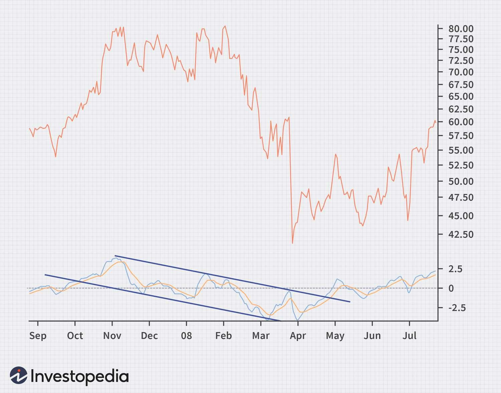

The Moving Average Convergence Divergence (MACD) is a widely utilized technical analysis tool among traders aiming to identify potential trend reversals within financial markets. This indicator's popularity is rooted in its ability to provide insight into momentum shifts and trend changes, which are critical in making informed trading decisions. This article aims to provide a comprehensive examination of how the MACD can effectively be employed in market analysis and algorithmic trading to detect trend reversals.

Understanding the fundamental components and functionalities of MACD is essential for traders seeking to enhance their trading strategies. It is constructed from two key moving averages, differing by the length of time they cover, which help reveal changes in the strength, direction, momentum, and duration of a trend in a stock's price. The MACD offers a versatile approach to identifying shifts in market sentiment, a critical aspect for those involved in financial trading.



Algorithmic trading, which relies on automated systems to execute trades based on pre-defined criteria, often integrates MACD signals to capitalize on market movements. The implementation of MACD in these systems involves the use of sophisticated code that allows traders to automate the process of identifying and acting on buy or sell signals based upon MACD patterns. Guidelines and techniques for effectively using MACD in automated trading systems will be discussed to enhance strategy development.

Furthermore, while the MACD is undoubtedly a powerful tool, it is not without limitations. As with any technical indicator, it can produce false signals, particularly in markets that are range-bound or experiencing low volatility. An examination of both the strengths and limitations of MACD as a trading tool will be addressed, highlighting the importance for traders to complement MACD analysis with other technical indicators and market insights to form a more holistic view.

By understanding its core principles, functionalities, and practical applications in algorithmic trading, traders can better leverage the MACD to their advantage. This article endeavors to provide the necessary insights and methodologies to utilize MACD effectively, aiming for increased success in trading activities.

## Table of Contents

## Understanding the MACD Indicator

The Moving Average Convergence Divergence (MACD) indicator is a widely utilized tool in technical analysis, particularly favored for its ability to discern momentum changes and potential trend reversals in financial markets. The MACD is computed by using two exponential moving averages (EMAs), which smooth price data to highlight trends over a period. The primary components of the MACD are the MACD line, the signal line, and the histogram.

### MACD Line

The MACD line is calculated by subtracting the 26-period EMA from the 12-period EMA. Formally, it is represented as:

$$
\text{MACD Line} = \text{EMA}_{12} - \text{EMA}_{26}
$$

Here, $\text{EMA}_{12}$ refers to the 12-period exponential moving average, while $\text{EMA}_{26}$ is the 26-period EMA. The MACD line itself acts as an oscillator, fluctuating above and below zero. When the MACD line is positive, it indicates upward [momentum](/wiki/momentum), whereas a negative value suggests downward momentum.

### Signal Line

The signal line is a 9-day EMA of the MACD line, providing a smoothed version that helps traders identify potential buy or sell signals. The formula for the signal line is:

$$
\text{Signal Line} = \text{EMA}(\text{MACD Line}, 9)
$$

Traders often look for the points where the MACD line crosses the signal line to make trading decisions. A crossover of the MACD line above the signal line may suggest a buying opportunity, while a crossover below may signal a selling opportunity.

### Histogram

The histogram is a graphical representation that visualizes the difference between the MACD line and the signal line. It is calculated as:

$$
\text{Histogram} = \text{MACD Line} - \text{Signal Line}
$$

The histogram provides insights into market momentum. When the histogram is above zero, it indicates that the MACD line is above the signal line, suggesting bullish momentum. Conversely, a histogram below zero indicates bearish momentum as the MACD line lies under the signal line. Additionally, the expansion or contraction of the histogram can indicate the strength of the momentum change—widening bars suggest increasing momentum, while narrowing bars suggest momentum is waning.

By analyzing these components, traders can capture subtle shifts in market momentum, allowing for the identification of opportunities that might not be evident through price charts alone. Understanding and properly applying the MACD indicator's components can significantly enhance a trader's ability to make informed decisions in various market conditions.

## Spotting Trend Reversals with MACD

Trend reversals can often be anticipated by observing divergences between the MACD line and the security's price. This concept is fundamental in using the MACD to identify potential changes in market direction. 

A bullish divergence occurs when the price of a security makes new lows, but the MACD does not follow suit. This suggests that the downward momentum is waning, potentially signaling an upward reversal. For example, if a stock's price hits a new low but the MACD line forms a higher low than before, this discrepancy between the two indicators can be an early warning of a possible price increase.

Conversely, a bearish divergence takes place when the security's price makes new highs while the MACD fails to reach a new high. Such a scenario indicates a weakening upward momentum and might prefigure a price decline. In practice, this means that if a stock price rises to a new peak but the MACD line peaks lower than its previous high, it may be a sign of an impending downward trend.

MACD crossovers are another important aspect to consider when spotting trend reversals. These occur when the MACD line crosses above or below the signal line. A crossover where the MACD line moves above the signal line is typically interpreted as a bullish signal, suggesting it might be a good time to enter a long position. Conversely, when the MACD line crosses below the signal line, it is seen as a bearish signal, potentially indicating a sell situation.

The practical application of these crossover points can be illustrated with a simple Python code snippet:

```python
import pandas as pd
import numpy as np

# Calculate MACD and Signal Line
def calculate_macd(data, short_window=12, long_window=26, signal_window=9):
    # Calculate Short Term Exponential Moving Average
    short_ema = data.ewm(span=short_window, adjust=False).mean()
    # Calculate Long Term Exponential Moving Average
    long_ema = data.ewm(span=long_window, adjust=False).mean()
    # Calculate MACD
    macd = short_ema - long_ema
    # Calculate Signal Line
    signal = macd.ewm(span=signal_window, adjust=False).mean()
    return macd, signal

# Example usage with closing prices
closing_prices = pd.Series([...])  # Replace with actual closing price data
macd, signal = calculate_macd(closing_prices)

# Determining Crossover Points
buy_signals = (macd > signal) & (macd.shift(1) <= signal.shift(1))
sell_signals = (macd < signal) & (macd.shift(1) >= signal.shift(1))
```

Traders utilize these crossover points as entry and [exit](/wiki/exit-strategy) signals within their trading strategies to exploit potential trend reversals identified by MACD. By understanding and applying these principles, one can effectively leverage MACD to improve trading outcomes and maximize returns.

## Implementing MACD in Algorithmic Trading

Algorithmic trading employs automated systems to execute trades based on predefined strategies, incorporating signals generated by technical indicators such as the Moving Average Convergence Divergence (MACD). By translating these signals into algorithmic code, traders can automate the decision-making process to buy or sell assets.

### Automating Decisions with MACD

Traders can code algorithms to monitor specific events such as MACD crossovers and divergences. A common strategy involves buying when the MACD line crosses above the signal line and selling when it crosses below. Moreover, detecting divergences—situations where the price movement of an asset and the MACD direction differ—can help identify potential reversals. For instance, a bullish divergence could indicate a buying opportunity.

Here's a simplified Python code snippet that demonstrates monitoring MACD crossovers:

```python
import pandas as pd

def calculate_macd(prices, short_window=12, long_window=26, signal_window=9):
    short_ema = prices.ewm(span=short_window, adjust=False).mean()
    long_ema = prices.ewm(span=long_window, adjust=False).mean()
    macd_line = short_ema - long_ema
    signal_line = macd_line.ewm(span=signal_window, adjust=False).mean()
    return macd_line, signal_line

def generate_signals(prices):
    macd_line, signal_line = calculate_macd(prices)
    signals = pd.DataFrame(index=prices.index)
    signals['buy_signal'] = (macd_line > signal_line) & (macd_line.shift(1) <= signal_line.shift(1))
    signals['sell_signal'] = (macd_line < signal_line) & (macd_line.shift(1) >= signal_line.shift(1))
    return signals

# Example usage:
# prices = pd.Series([...])  # Replace with actual price data
# signals = generate_signals(prices)
```

### Backtesting Strategies

Before deploying trading algorithms, [backtesting](/wiki/backtesting) is crucial to assess strategy effectiveness across various market conditions. By simulating how a strategy would have performed in the past, traders can estimate potential profitability and optimize parameters. This involves using historical data to evaluate trading rules systematically.

### Enhancing Trading Outcomes with Indicator Combinations

While MACD is a powerful tool, combining it with other indicators can improve performance by filtering false signals. For example, incorporating Relative Strength Index (RSI) or Bollinger Bands can provide additional confirmation, enhancing the robustness of trading decisions.

### Importance of Risk Management

Risk management is fundamental in [algorithmic trading](/wiki/algorithmic-trading) to minimize potential losses and manage capital exposure. Automated strategies should integrate stop-loss orders to limit downside risk, and position sizing rules to balance the capital allocated per trade relative to portfolio size.

Implementing a well-rounded algorithmic trading system with MACD involves thoughtful strategy development, comprehensive backtesting, effective signal filtration, and robust risk management. By adhering to these principles, traders can leverage MACD to make disciplined and informed trading decisions.

## Pros and Cons of Using MACD

The Moving Average Convergence Divergence (MACD) is valued for its simplicity and effectiveness as a technical analysis tool. It is versatile, operating across various markets and time frames, which makes it a popular choice among traders. The MACD combines both trend and momentum indicators, enabling traders to identify potential market shifts with relative ease. This dual capability allows for a more comprehensive understanding of price movement, facilitating timely entry and exit points in trading strategies.

Despite its strengths, the MACD has notable limitations. It can generate false signals, particularly in markets experiencing sideways movement or low [volatility](/wiki/volatility-trading-strategies). During these conditions, the difference between the moving averages may narrow, leading to frequent but insignificant crossovers that can mislead traders. Furthermore, because MACD is a lagging indicator, based on historical price data, it might delay in signaling trend reversals in rapidly changing market environments.

To mitigate these challenges, traders should avoid relying solely on the MACD for decision-making. Integrating other technical indicators, such as the Relative Strength Index (RSI) or Bollinger Bands, can provide additional confirmation and filter out false signals. For instance, by using the RSI, traders can assess whether a market is overbought or oversold in conjunction with MACD's trend indications. Additionally, Bollinger Bands can help verify price volatility and potential breakouts, thus offering a multi-faceted approach to market analysis.

In practice, MACD can be implemented in Python to automate signal generation. A simple example would involve tracking crossovers between the MACD line and the signal line:

```python
import pandas as pd

def macd_strategy(prices, short_window=12, long_window=26, signal_window=9):
    # Calculate the short term exponential moving average
    short_ema = prices.ewm(span=short_window, adjust=False).mean()
    # Calculate the long term exponential moving average
    long_ema = prices.ewm(span=long_window, adjust=False).mean()
    # Calculate the MACD line
    macd = short_ema - long_ema
    # Calculate the signal line
    signal_line = macd.ewm(span=signal_window, adjust=False).mean()

    # Generate buy/sell signals
    buy_signal = macd > signal_line
    sell_signal = macd < signal_line

    return buy_signal, sell_signal

prices = pd.Series([...])  # Example price data
buy, sell = macd_strategy(prices)

# buy and sell are boolean arrays indicating trading signals.
```

This code demonstrates a basic algorithmic trading strategy based on MACD crossovers. It highlights the importance of combining technical indicators and automated strategies in trading. Ensuring that trading decisions are backed by a robust analytical framework is crucial for navigating the complexities of financial markets effectively.

## Conclusion

The Moving Average Convergence Divergence (MACD) is widely recognized as a powerful tool for identifying trend reversals, making it a valuable addition to a trader's analytical toolkit. This technical indicator, through its ability to track momentum changes, offers traders insights into potential market shifts. Nevertheless, while the MACD can be highly beneficial, traders must recognize its limitations. Specifically, its potential to generate false signals in low-volatility or sideways markets emphasizes the necessity of integrating it with broader market analysis techniques.

Success in trading requires ongoing education and consistent practice. Traders looking to optimize their strategies with MACD should continuously update their skills and adapt their approaches based on evolving market conditions. This continuous learning process ensures that traders remain responsive to new market trends and data, maximizing the MACD's effectiveness.

Incorporating MACD into algorithmic trading systems can further facilitate disciplined and systematic trading. By automating the execution of trades based on MACD signals, traders can remove emotional biases and enhance the consistency of their strategies. The development of these automated systems requires precise programming and constant monitoring to ensure they function correctly under different market scenarios.

Ultimately, careful strategy development, comprehensive backtesting, and ongoing refinement are critical to leveraging MACD effectively for market success. Through diligent planning and evaluation, traders can better position themselves to capitalize on market opportunities while managing risks. Integrating MACD with other indicators and using it within a broader technological and analytical framework can amplify its benefits, helping traders achieve their financial goals.

## References & Further Reading

[1]: Appel, G. (2005). ["Technical Analysis: Power Tools for Active Investors."](https://dl.acm.org/doi/book/10.5555/1408581) Financial Times Press.

[2]: Murphy, J. J. (1999). ["Technical Analysis of the Financial Markets: A Comprehensive Guide to Trading Methods and Applications."](https://archive.org/details/technicalanalysi0000murp) New York Institute of Finance.

[3]: Pring, M. J. (2002). ["Technical Analysis Explained: The Successful Investor's Guide to Spotting Investment Trends and Turning Points."](https://www.amazon.com/Technical-Analysis-Explained-Fifth-Successful/dp/0071825177) McGraw-Hill Education.

[4]: "Moving Average Convergence Divergence (MACD)." Investopedia. Retrieved from [https://www.investopedia.com/terms/m/macd.asp](https://www.investopedia.com/terms/m/macd.asp) 

[5]: "MACD - Technical Indicators." TradingView. Retrieved from [https://www.tradingview.com/support/solutions/43000501902-macd/](https://www.tradingview.com/support/solutions/43000502344-macd-moving-average-convergence-divergence/)